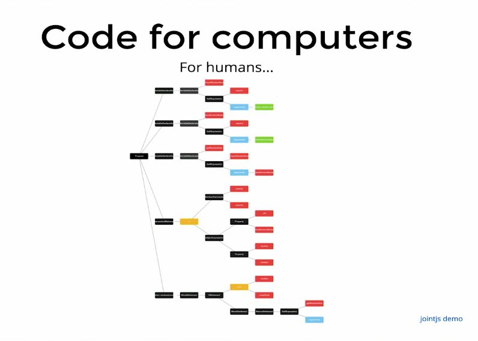
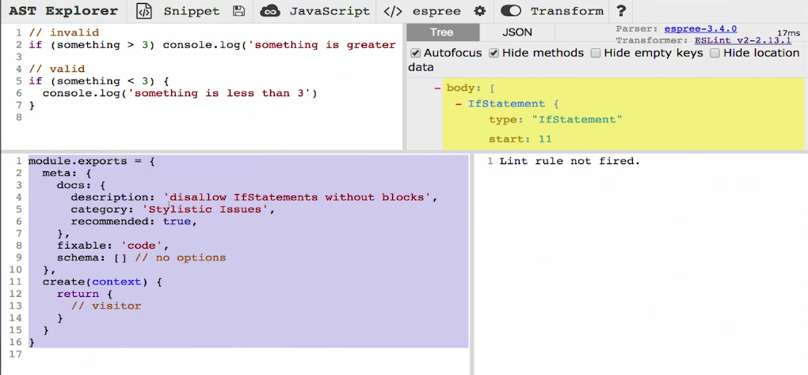

## Examples of Abstract Syntax Trees
This is going to be a elementary intro to ASTs...

### Why we should care about ASTs
- Babel lets us use the latest features of JS and compiles down into browser compatibile ES.
- Babel uses ASTs to accomplish this 

- Babel is a tool that that can take some code, turn it into an AST and traverse that AST to make manpipulations to it and it has plugins to do that.
- The ones we are familiar with are the ones that transpilie ESNext --> ESNow 

### Examples
- Bable plugin's like lodash.
    - you wouldn't want to send all of lodash down to client
    - babel let's you selectively import or cherry-pick methods you use
    - not fun to cherry pick though, so instead you can import the lib and destructure from that lib

- One of the key things about babel and plugins, they try to make the developer experience better without reducing the user experience. 

### babel-plugin-module alias
- helps with using relative paths in your project, you'll instead be able to use an alias instead of relative paths...
```js 
// instead of this ...
import myUtilFn from '../../../../utils/MyUtilFn';

// Use this...
import MyUtilFn from '<utils>/MyUtilFn';
```
- with this plugin youll be able to map files or directories to the path you want.

### Removing props types from React
- Don't know if this is still releveant as the React shift away from flow

### ESLint

### eslint-plugin-import
- ESLint will tell you a problem/syntax/style issue with your code
- ESLint can tell you statically of errors before you even run your code 
- All of the ESLint plugins are using ASTs under the hood.

## Codemods
**Better than find/replace**
- no matter how good your regex skills are...

Helps with migration
- react-codemod
- ava-codemods
- jest-codemods 

## Introducing Abstract Syntax Trees

### What is an AST?
Code for humans
- We write code that is human readable with variable names that humans understand, but computers dont care about that
- we are writing code that makes sense for us, but a computer takes that code and makes it something it can read easier...
    - Looks like a huge javascript object.

    

Source: https://resources.jointjs.com/demos/rappid/apps/Ast/index.html

Graphical representation of an AST of this code:
```js
var a = 42;
var b = 5;
function addA(d) {
    return a + d;
}
var c = addA(2) + b;
```

The AST starts out with the **program**: the program has a body and all of what's inside of our program is in that body. And then as part of that body we have 4 things...

The first thing is that variable declaration: `var a = 42`...

- this variable declaration has a single **declarator**., which is `a = 42`, that variable declarator has a left side and a right side  
    - the left side is : `a`
    - the right side is a literal, `42`
- if we changed the line of `var a = 42` to `var a = 42, q = 23;`, then this line would have two variable declarators.
    - we could go even deeper and say: `var a = 42, q = a + 23;`. 
        - now this `q` variable declarator has a left side of the identifier q and then the right side is a **binary expression**
        - this addition operator, can be given a name, it's what we would call a **binary expression**, a binary expression also has a left side and a right side.
        - the left side of a binary expression can be another expression
    - Visualizing this helps you with understanding **precedence** in how JS is evaluating things.
    - It provides a deeper understanding of how JS works.
- Each block is called a **node** in an AST 
- each node can have a **branch**, and you can end up with **lead nodes** which end up being identifiers.

#### Function declarations
A function declaration, (as a node), has a **Block Statement** and that block statement has a body which can have one or more elements inside of it, our example only has one which is a return statement.
- if we add something like ...
```js
function addA(d) {
    d += 1;
    return a + d;
}
```
We will now have two elements inside of it; an **ExpressionStatement** and a **ReturnStatement**.

### AST Explorer 
Link: https://astexplorer.net/

- Can select language and various parsers
- with JS there are several parsers, there is an effort to standardize the ASTs they create, they currently all create slightly different representations of the code. 

- We are going to be starting out with ESLint's parser which is Espree.
- You can do this really need thing and transform your plugins right in the browswer.

Most things that we are clicking on are identifiers, bits of text that identify a node.
The identifiers actually have specifics names, things like: range, test, consequent, alternate, etc. So you can be more specific about identifying your code.

## Exploring ASTs
So how do we actually use these things? 

We will be addressing 3 different use cases:

1. Babel Plugin
2. ESLint Plugin
3. Codemode

## Babel Plugin
- ESLint is really good at identifying patterns you don't want in your codebase and its also good at recognizing actual logical problems or domain specific things.  

Note on bugs: your lines of defense against bugs are ...

1. Typed langs like Flow or TS. and if you can't do that...
2. Make ESLint plugins that guard against the common things in your domain
3. Then testing. 

But if you're writing tests for everything, you are going to miss something and have to write the same style of tests everywhere. It's often much better t just write something that works statically.

> Important to mention: ASTs don't run your code, it just analyzes it and generates this JavaScript object for us.  

That means you can have an ESLint program that checks your code without even running it, and you find out much quicker that you have a serious problem.

Example: if you're using an `if` statement without a block, this can create errors if you add another statement, you can write a guard against this using an AST.

So what you do with an ESLint Plugin when you're developing it in the AST Explorer is you generally should put a few examples of the kinds of things that you want to lint so that you can lint against the things that work without them breaking and the things that don't.
- Then you can pull it down from the AST explorer and write actual tests using these test cases.

On the bottom (in AST Explorer), if you select Transform > ESLint, you will see our ESLint plugin definition.



And what we are doing in here is exporting a module.

There are two objects:  
> 1. `meta` : has some documentation information, has `fixable` and `schema`
>[^  ]2. `create` : a create method, and this is where you're creating what's called a **visitor** and both ESLint and Babel use what's called the **visitor pattern**.

> [^ **What is the visitor pattern?**] [**Visitor pattern**](): The visitor pattern makes it much easier for you to traverse your AST, writing your own AST traverser is hard.

So for example, let's traverse this code, say we want to find all of the if statements....
```js
function fn() {
    // invalid
    if (something > 3) console.log('something is greater than 3')

    // valid 
    if (something < 3 ) {
        console.log('something is less than 3');
    }
}
```
- Our body has a **FunctionDeclaration**. Every time we come across a function declaration we have to know that a function declaration has a body and that body can be a **BlockStatement**, so then we have to know that block statements also have a body, so as we are traversing things we have to know how deep we need to go into things. Like what if inside another `if` statement there is another, we would need to know there is a `consequent`, with another **BlockStatement** which might have another `if` within its body.

Within a program you have to know every single node type and where you can find more node types inside of that node, so its not easy.

Tools like ASTExplorer, really help us and make it easy to traverse the ASTs for us.

The visitor pattern allows you to say, "I only care about nodes of this particular type", it's almost like a jQuery selector. So you say you have this huge DOM tree, just like an AST, it's the DOM, and you want to find nodes that have this class. With the **visitor pattern** you don't have quite the granularity you do with css selectors, but you can select for node types.

> With the visitor pattern the only mechanism you have is for selecting specific nodes is the *node type*.

And so if we want to get all of the `if` statements, then we are going to, click on the `if` statement find out what kind of node type it is (`"IfStatement"`)called and put a function on our visitor object that is of that name....
```js:title=eslint-module-create
//...
create(context) {
    return {
        IfStatement(node) {
            console.log(node);
        }
    }
}
```
And this function is going to accept a node, and node we can console log that node and in our browswer ,we can see two nodes were logged to the console.

Now we don't have to handle traversing ourselves, and it's important to know that this is happening as ESLint is traversing the tree. 

Now we can compare between some of the difference betweens our two `if` statements. 
- One has a a BlockStatement the other an ExpressionStatement, and thats the thing we want to lint against...

So for most of our visitors, we will filter out the things that are fine....

Another helpful tool is to `console.log()` the things we will be testing.
```js:title=our-rule {4-6}
//...
create(context) {
    return {
        IfStatement(node) {
            if (node.consequent.type === "BlockStatement") {
                return 
            }
            console.log(node);
        }
    }
}
```
With this rule we need to tell ESLint, hey this thing broke the rules so do something about that..

ESLint has an API around reporting a problem on a node and then it takes care of actually telling the user that there's a problem.

The way that we do this is with this `context` parameter that we get in the `create` function. So the context actually gives us a lot of things and one of those is the `report` function...
```js:title=our-rule {4-6}
//...
create(context) {
    return {
        IfStatement(node) {
            if (node.consequent.type === "BlockStatement") {
                return 
            }
            context.report({
                node: node,
                message: 'y u no block?'
            })
        }
    }
}
```
- The `report` function takes an object, and its takes a node property and message property...

Note, I'm using Transform > ESLint4, so the syntax is slightly different...
```js
export default function(context) {
  return {
       IfStatement(node) {
            if (node.consequent.type === "BlockStatement") {
                return 
            }
            context.report({
                node: node,
                message: 'y u no block?'
            })
        }
  }
};
```
- So we are filtering out the things that are good/passing, and we are reporting on things that are not good, and ESLint will tell us there is a problem.

### Takeways
> - ⭐ ASTs are just JavaScript objects. They are complex, there is a lot to them, but tools like ESLint and Babel wil shield you from a lot of that complexity; provides you a visitor pattern for you to just care about the things you care about.
- And then because you dont have a whole lot of granulatiryt at the top of my visitors, we usually eject eraly if its not the type of or not the thing I'm looking for.
- `context` is the ESLint API : https://eslint.org/docs/developer-guide/working-with-rules-deprecated#the-context-object

### Handling missing `else` block
One step further, it's not just the consequent that can be missing a block we can also have an if /else....
```js:title=no-block-on-alternate 
function fn() {
    // invalid
    if (something > 3) console.log('something is greater than 3')

    if (thing) {
        console.log("here");
    } else console.log('there')

    // valid 
    if (something < 3 ) {
        console.log('something is less than 3');
    }
}
```
- the one line `else` is valid code but its not what we want to allow. So we want want both the **consequent** and the ***alternate** to be a block statement. 
- basically what we want to say is that the consequent and the alternate, if they exist, that they are block statements. So we can make a utility function.

> ⭐ Writing utility functions can be super helpful when developing plugins

```js:title=linting-rules
export default function(context) {
  return {
       IfStatement(node) {
            if (node.consequent.type === "BlockStatement") {
                return 
            }
            context.report({
                node: node,
                message: 'y u no block?'
            })
        }
  }
}

function isBlock(node) {
    return !node || node.type === 'BlockStatement';
}
```

- if there is not a node, than thats fine, maybe we should name this function, is block or doesn't exist but thats kind of long. 
- otherwise if the node does exists, it needs to be a block statement. 
- So now we can swap this with `isBlock`...

```js {4}
export default function(context) {
  return {
       IfStatement(node) {
            if (isBlock(node.consequent) && isBlock(node.alternate)) {
                return 
            }
            context.report({
                node: node,
                message: 'y u no block?'
            })
        }
  }
}

function isBlock(node) {
    return !node || node.type === 'BlockStatement';
}
```
> - ⭐Another tip: where the warning appears is on this `if` statement, but the consequent has a block, so that's fine, so it's a little misleading, so instead what we can do is, instead of reporting on this node we can actually report on the node that actually is the problem case...if it's the consequent then report on the consequent.

```js {7-17}
export default function(context) {
  return {
       IfStatement(node) {
            if (isBlock(node.consequent) && isBlock(node.alternate)) {
                return 
            }
            if (!isBlock(node.consequent)) {
                context.report({
                    node: node.consequent,
                    message: 'y u no block?'
                }) 
            } else if (!isBlock(node.alternate))  {
                context.report({
                    node: node.alternate,
                    message: 'y u no block?'
                })
            }
        }
  }
}

function isBlock(node) {
    return !node || node.type === 'BlockStatement';
}
```
- You'd also likely want better error messaging. 
 
### Exercises 
This would technically be in the next section, but I did the first exercise anyways, here is what I came up with...
```js
// eslint exercise 0 (no-console)
// When you're finished with this exercise, run
//   "npm start exercise.eslint.1"
//   to move on to the next exercise

module.exports = {
  // you're going to need context :)
  // eslint-disable-next-line no-unused-vars
  create(context) {
    return {
      ExpressionStatement(node) {
        if (node.expression.callee.object !== undefined) {
          if (getIdentifier(node) == "console") {
            context.report({
              node: node,
              message: "Using console is not allowed"
            });
          }
        } else {
          return;
        }
      }
    };
  }
};

function getIdentifier(node) {
  return node.expression.callee.object.name;
}
``` 

## Key Insights
- ASTs can help you understand your JS better by thinking/seeing code as these incremental additive blocks.
- ASTs are just JavaScript objects.
- ASTExplorer is super useful way to get a handle on visualizing that AST as a JS object.
- The AST isn't executing code, it just analyzes it and generates this JavaScript object for us.  

Aside: I think for now, there's a few things I would like to work on prior to returning to this, I think for now this really eased you into not needing to be afraid of ASTs. While they are complex, they are just built up of simple things, increasing in complexity as the yare compounded.

## Links 
- [MAIN](/code-transformation-and-linting-with-ASTs-intro)
- [PREV | Introduction](/code-transformation-and-linting-with-ASTs-intro)
- [NEXT → | ESLint Plugin and AST ]()