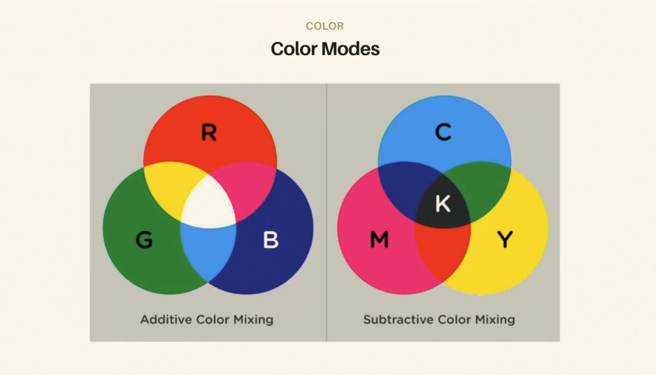
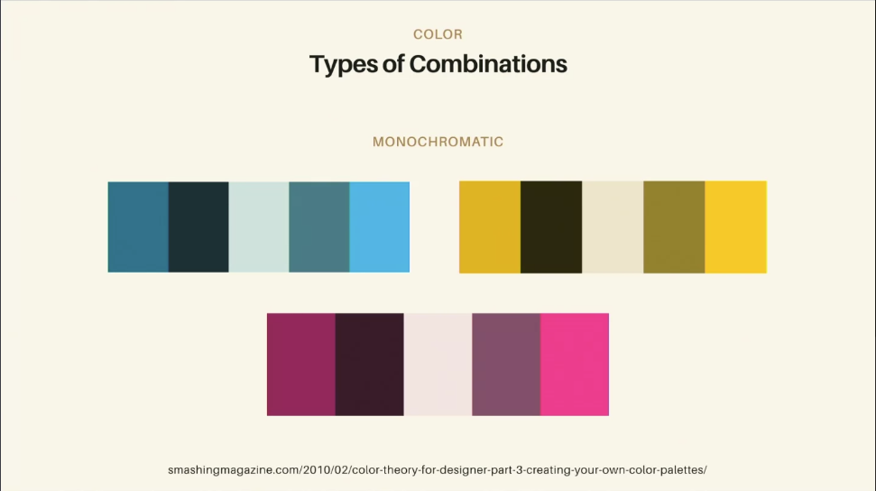
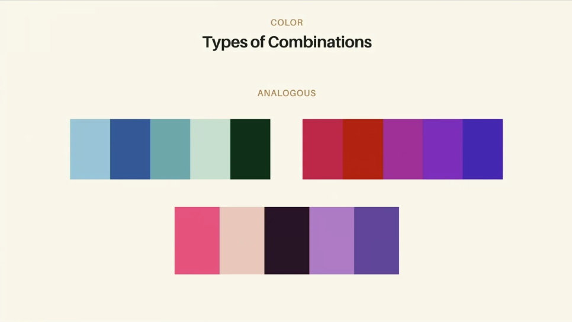
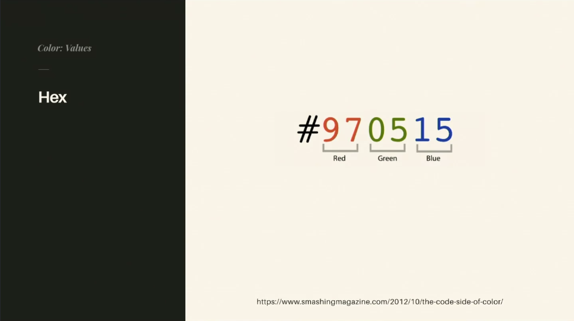
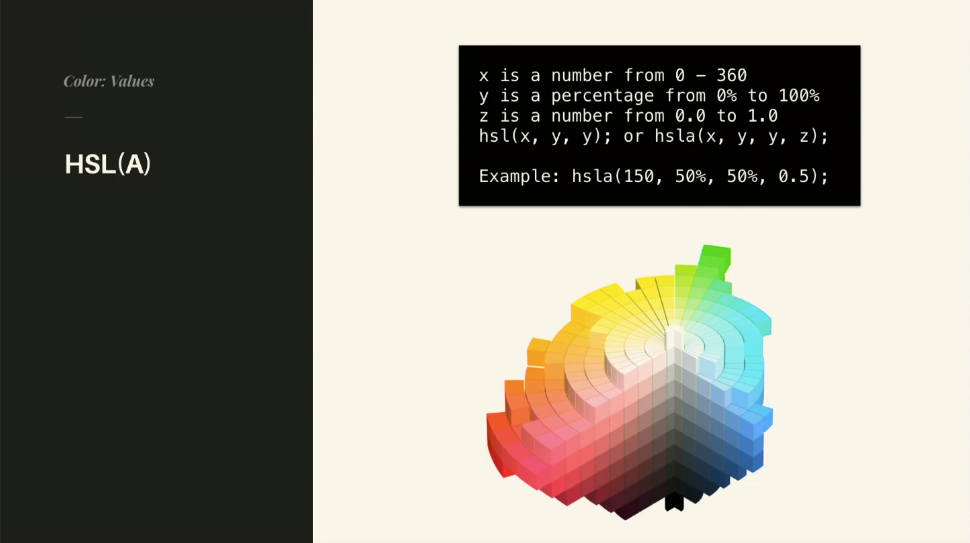
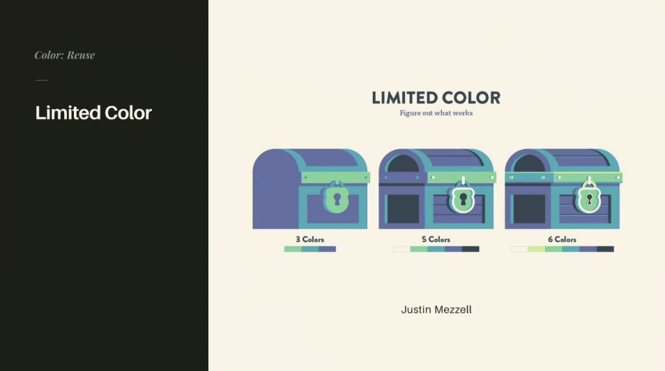

## Color Modes
### Color Mixing 
What really matters in color mixing is the type of color mixing being used.
Two types of color mixing:...
1. **additive**: Actually RGB to make all of the colors
2. **subtractive**: Red,Green,Yellow actually CYM + K (black), the reason its subtractive is because you are basically substracting light. 


- When you are working on a computer you are working with RGB. All colors lead to white. Lightbased. RGB for screen.
- Subtractive would be more in the realm of print, or how we might actually conceptualize color. CMYK for printing.

## Color Mixing 
Special cases, where you have cross-over events, Seurat paintings for example, using paint (subtractive), but since its pointilized it kind of creates an effect in your eye that is additive.

- A color is only a color in relation to another color (its all relational)

A great tool to check for color accessibility: https://colorable.jxnblk.com/

- Monochromatic, just one color, with range:


- Analogous, changing the keys that are complements and ones that add contrast:


There is also split, triad, etc.

> Great tool for checking out colors (Kuler),
- https://color.adobe.com/create
 
Complementary is the easiest place to start. 

Color Theory for Designers: https://www.smashingmagazine.com/2010/02/color-theory-for-designer-part-3-creating-your-own-color-palettes/

## Color Modes and Properties 
- Monotone: one single tone
- DUotone: spotify adds, two tones and matching 

In real life, whatever the opposite of the light color the shadow is the opposite. 

- Things very away will be blurrier
- Things that are closer will be cripser/clearer.

## Color in Code 
### RBG(A)
- RBG(A), A is for opacity 0-1 with stops inbetwen.
```
x is a number from 0-255
y is a number from 0.0 to 1.0
rgb(x,x,x); or rgba(x,x,x,y);

Example: rbga(150,150,150, 0.5);
```
- Drasner doesn't love RGB. She prefers HSL(A)

### Hex
- Super easy, copy and pasteable, not very human readable.
- Not greater for communicating color
- This is the most common but not the most readable. 
- Code side of color: https://www.smashingmagazine.com/2012/10/the-code-side-of-color/


### HSL(A)

- Drasner's fav, its human readable. Basically for HSLA you have Hue, Saturation, and Lightness.
- Hue is that color wheel. 1% is the same as 361%. It keep keeps going around in a circle unlike rgb where youre locked between 0-255. H is much easier for genrative color creation, without boundaries. 
- Saturation, if you know something is too saturated you know you can just bring this middle value down

### Named Color 
Fun for demos, but not very consistent.

## Color Variables
Great for keeping colors consitent across app/design.
- Defining brand colors in one place will save you a lot of time in the future.


### Why CSS Variables if we have Sass? 
Well, the nice thing about css variables is that they are living. You can actually work with them in JS, and JS will understand what it is even if you define it somewhere else. In Sass you're really just compiling down and JS doesn't have a concept of it.
- Sass shines where you want to modify colors programmatically.

## Limited Color
When youre first starting out its advisable to limit your color: 


Will make it easier to keep consistent, and you can get a better feel for composition.

## Color Tools
- Dribble, you can steal palettes, and download those colors.
- Great if you have a company/brand color you can search up those exact colors and how peopel are using it.

> - Coolors: https://coolors.co/ 
- Great tool for finding palettes.

Build palette built on proportion. Proportion of color.
Paletton: http://paletton.com/#uid=1000u0kllllaFw0g0qFqFg0w0aF

Kuler/Color CC 

Adobe Capture: https://www.adobe.com/products/capture.html

Useful for generating gradients:
https://www.colorzilla.com/gradient-editor/

Finding UI gradients:
https://uigradients.com/#Copper

## Animated Gradients 
If you animate a gradient it causes a lot of perforance issues, it causes a lot of repaints.  
Use this instead: https://codepen.io/sdras/pen/akAWPR/, doesn't cause layout triggers.
- changing background colors trigger repaints.

## How to Create a Palette
- Anchoring to one color , Start with one color
- The desaturate the color to get your greys
- Colors are only relation to other colors, so you can use the greys of your color to make it seem more "grey"
- Then gather accents to find a nice color to play off of.

## Creating a Palette Demo 
If you start with an image, say something you know is going on your homepage, you can build out your color from there.
https://unsplash.com/

Use the eyedropper tool, pull a color and create a new document to start generating a quick color palette.

## Creating a Palette Exercise
Build out primaries, then greys.

## Links 
- [MAIN](/drasner-design-for-developers-main)
- [PREV ← | CSS Layout](/drasner-design-for-developers-css-layout)
- [NEXT → | Typography ](/drasner-design-for-developers-typography)