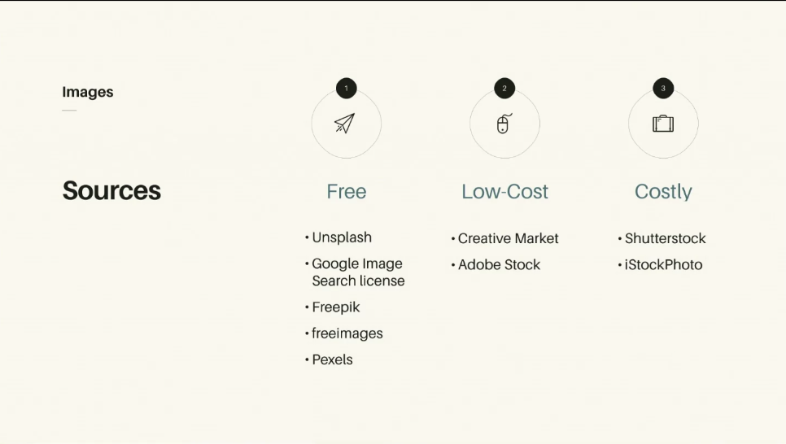
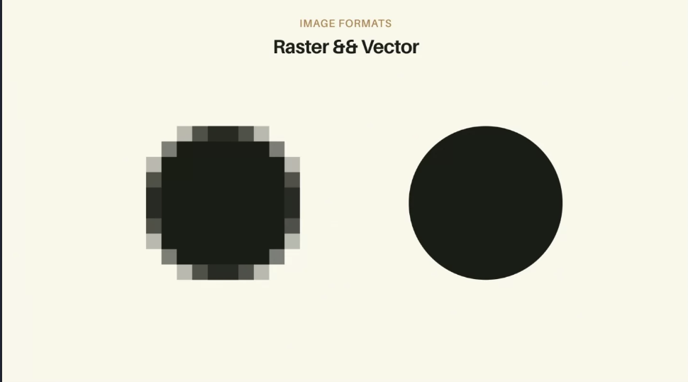
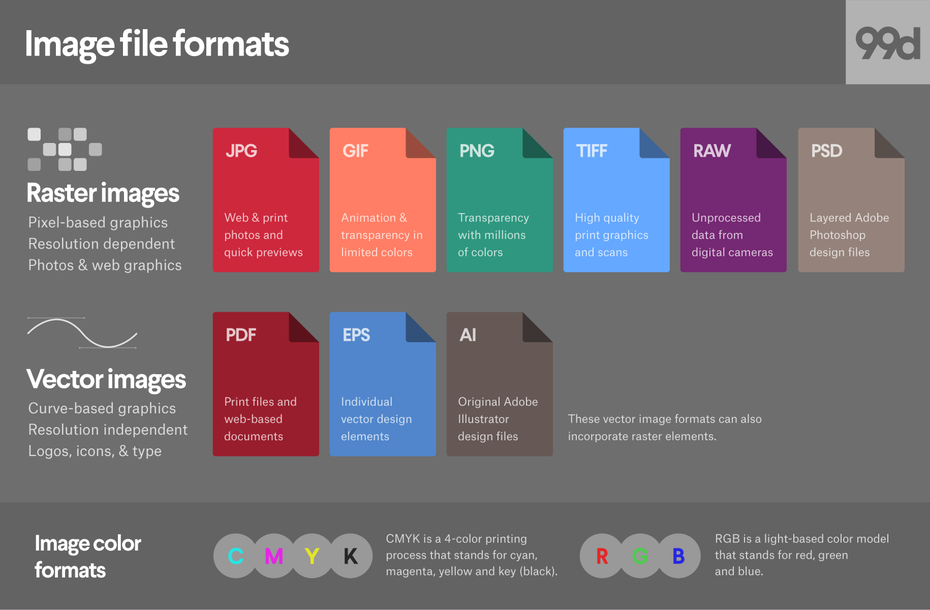
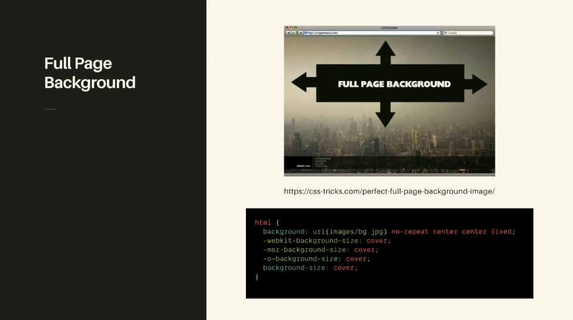

## Image Formats & Resources 
- Images is a huge part of optimization. 



In google images: You can actually image search then under Tools , You can go to usage rights and search by Labeled for Reuse. 

### rastor & vector 



Rastor:Image a piece of graph paper, a bunch of squares. How we build up jpegs
Vector: giving mathematical commands and allows things to be drawn for us, more declarative and it never loses resolution.

### Image Formats 


JPEG: is lossy
GIF: Color restricted, but have the amazing ability to animate, Animated gifs are heavy, web-wise
PNG: Ability to make transparent.

## Exporting Tips
- Double the size, low compression
- TinyJPG/TinyPNG. 
> - Webpack Plugins, highly recommend making them part of your build process.
- SVGOMG (svg for optimizing) https://jakearchibald.github.io/svgomg/

## SVG Handling and Full Page Background 

## SVG 
- path points, draws things for you, things can be their own layers, dom manipulate specific parts.
- performance: https://css-tricks.com/high-performance-svgs/

### Image Size 
SVG can make other images smaller: https://codepen.io/shshaw/full/LVKEdv

SVG can also be part of your layout. Creating interesting shapes in your browser. 
  
### Clipping and Masking 
https://css-tricks.com/masking-vs-clipping-use/

### Different Uses 
- img tag
- background source 
- inline for SVG
- sprites using spritesheets (different if using HTTP/2)

### Full Page Background 

https://css-tricks.com/perfect-full-page-background-image/

## Images Demo: Image Overlay Effects  
- Level adjust really good way to modify the histogram, you can adjust levels of images.
- Color Overlay

## Layout Demo: Coding Compositions 
https://codepen.io/sdras/pen/LXgmvq

- SVGs, have stroke properties, if its set to `currentColor` it will pull the color context from surrounding text/body color.  
- Adding spots of color helps thing pop.

## Positioning
> Remember that to absolutely position something within a controlled area, it needs to have a container, or parent container that has a position of relative, with the child we want to absolutely position, to have a 

For an SVG, using Sass, you can change the fill color of it with CSS by saying...
```
.svg-logo {
    path {
        fill: red;
    }
}
``` 

## Images & Layout Exercise 
Take your last composition and fill in the image area with an image try to make a mask/clip or a background shape.

## Links 
- [MAIN](/drasner-design-for-developers-main)
- [PREV ← | Inspiration ](/drasner-design-for-developers-inspiration)
- [NEXT → | Prototyping ](/drasner-design-for-developers-prototyping)

