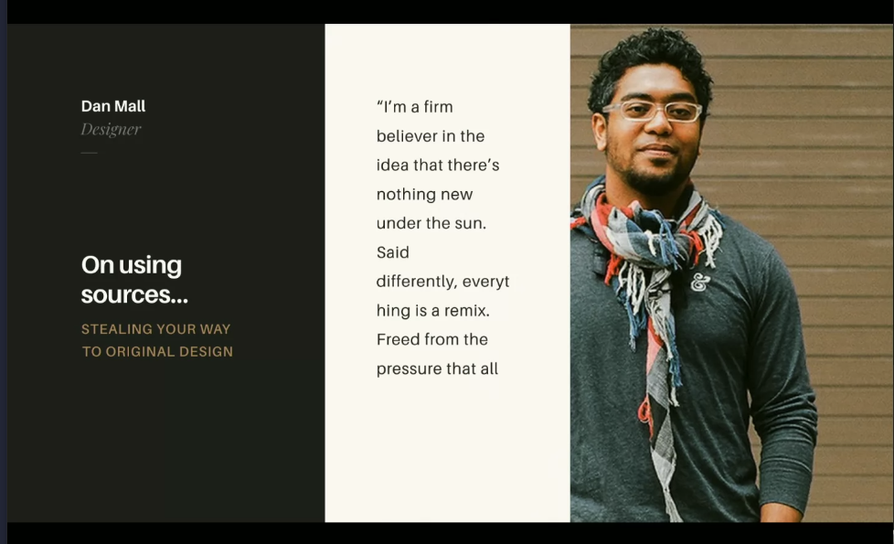

## Remixing 
Keep remixing: 

Look around find your heros:
- Dribble
- Behance 
- Codepen
- Glitch
- CodeSandbox

You can enrich your visual toolbox.

- Get inspired by multiple sources 
- Wait...
- Work from memory, not directly (sleep on it)
- Revisit: if its too close, change it or toss it

Look at other disicplines for inspirations:
- Books
- Music 
- Theater
- Design / Architecture 
- Animation / Anime 

### Master Copies
- Just like reverse engineering, copying existing work can help you learn, but you can't claim it as your own.

## Sources of Inspiration 
Give n Go: a gallery of dribble shots reword as codepens.
https://give-n-go.co/

Learn Through Play!

UI Kits from Shutterstock, out there for purchase, sometimes a good place to start. 

Automation, photoshop actions, creates animations/effects for your 
https://creativemarket.com/add-ons/photoshop/actions

Codepen patterns: https://codepen.io/topics/ui-pattern

## UI Kit Demo 
The noun project: https://thenounproject.com/
For symbols/icons.

## Links 
- [🏠 MAIN](/drasner-design-for-developers-main)
- [PREV ← | Typography ](/drasner-design-for-developers-typography)
- [NEXT → | Images and Performance ](/drasner-design-for-developers-image-performance)