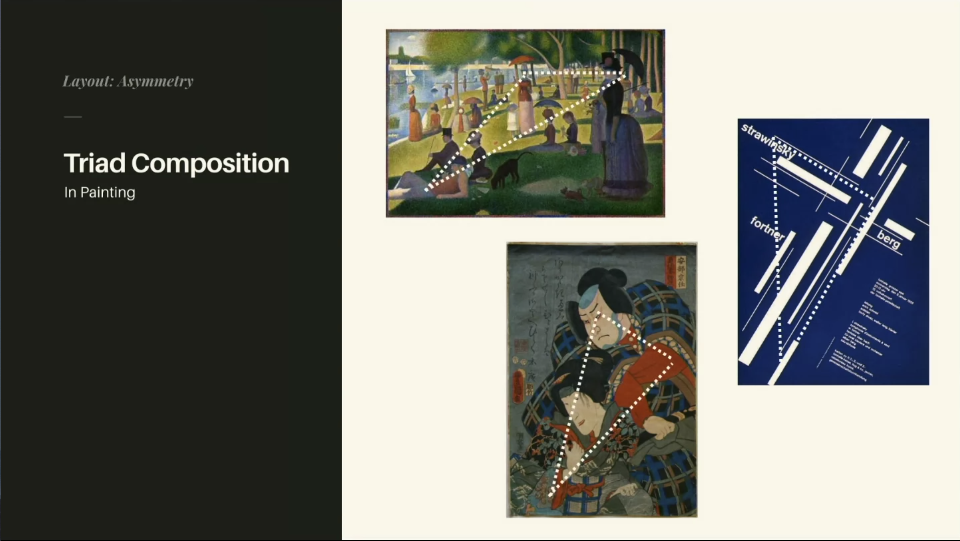
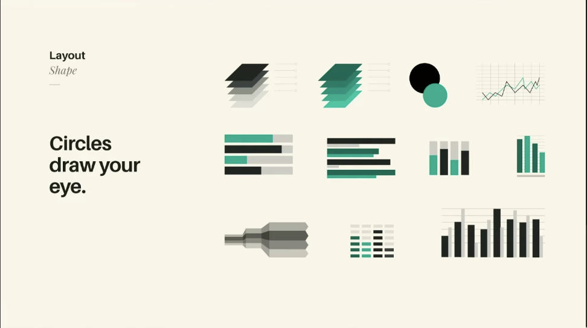
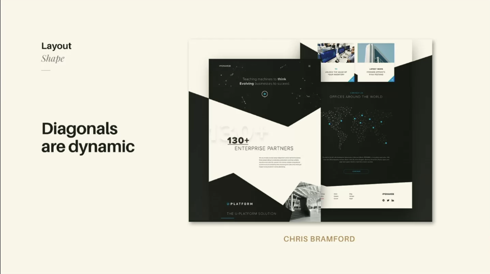
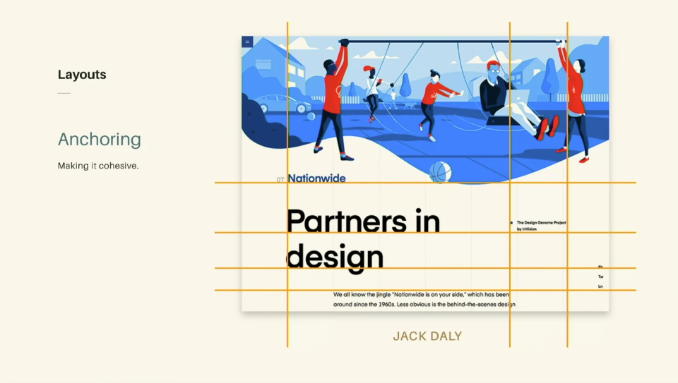
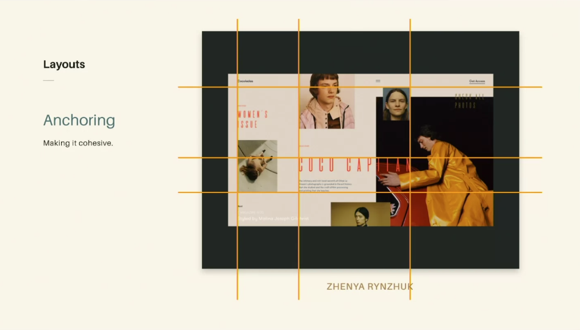
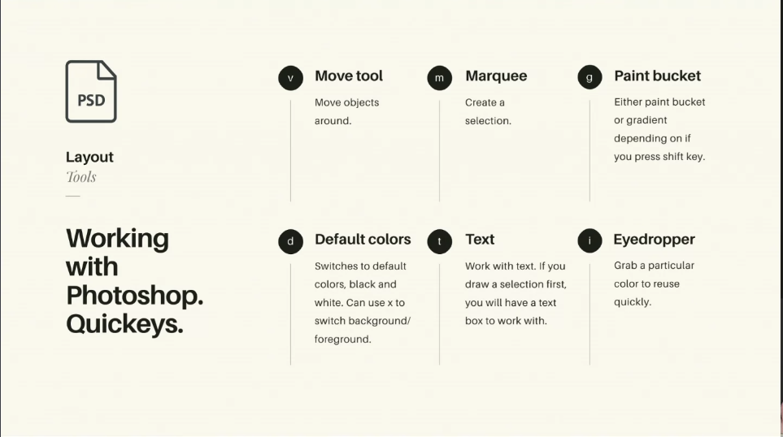
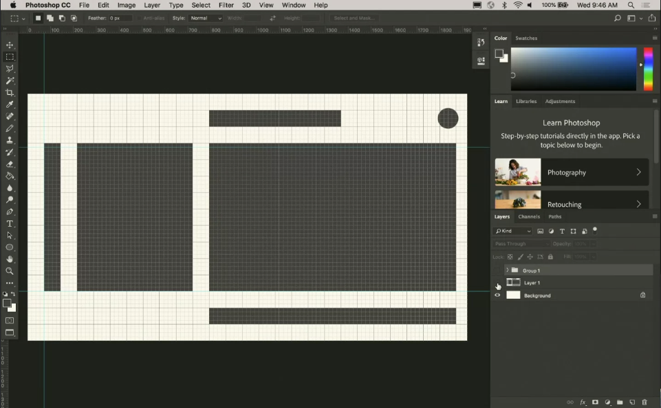
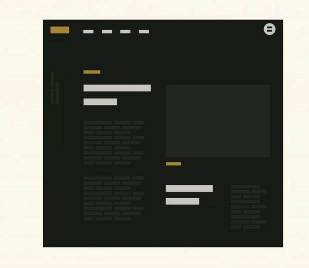

## Introduction to Layout & Grids
- Grids bring order to chaos and helps you connect disparate things
- an example: ancient city planning, addresses,
- great for organizational layout
> - helps us comparatmentalize and problem-solve if we think of addressing things one at a time, first layout, then color, then fonts, etc.

## Balance: Symmetry
Having something mirrored and balanced on both sides

Architecture is a great example, investment in symmetry, actually building out products.

Can break symmetry to draw attention to something.

A possible downside of symmetry is that things can get a little boring, nothing to write home about. Sometimes it kind of starts to look really basic.
## Balance: Asymmetry
Not used as much as symmetry because its harder 

- Creating balance in an asmmetrical canvas can be a little bit more tricky, but can be incredibly rewarding if pulled off. More scenes in the natural world are asmmetrical over symmetrical. Great compositions are often asmmetrical...
- Starry Night, The Great Wave, sydney opera hour

- Orizon Design on dribble, has some great examples of using asymmetry to call your attention to specic things.

## Exploring Asymmetry: Learning from Art History
- [**Rule of thirds**]() : Break image into thirds and one key part of the composition goes into one of those thirds.
- [**Triad composition**](): Intentional within compositions, keeps your eye from leaving the canvas, it has your own constantly kind of circling the canvas, tons of examples of this, especially post-Caravaggio. 

### Swiss Design     
- large flat geometric Shapes
- Using and making and break Grids very cleanly and obviously
- If you ever want to study or make Mastewr copies of things, Swiss design is a really great place to start.

## Shape
Lots of different, shpaes but let's start with circles. 

- Circles draw your eyes 
- [**saccade**](), the scanning of your eye, even if youre looking at one image, your eyes are constantly scanning around in an event referred to as saccade. Your eye is scanning around to create a mental map of what it's seeing. This scanning event is important because its where we pick up on things that stand out. Movement; bright colors; 

- Saccade scanning of faces, draw us into faces and eyes as a possible evolutionary necessity. Why humans see faces in things.

### Circles live outside of lines
- You might find yourself adjusting the margins on circles to push it out a little to make it look more proportional, and balanced.

### Diagnols are Dynamic
Some of the greatest examples of architecture, include diagnols, angles, pyramid.

- Swiss design makes lots of use of diagnols. They used grid systems all the time and broke through those grids with diagnols too.

## Scale and Cropping
So simple but very important.

> - ⭐ Most of these images would be boring based on description alone, but by scaling it and cropping it uniquely highlights the importance of scale/cropping to create beautiful compositions.

A whole image isn't always important, sometimes you want to make something the focal point the bare-essential of what youre trying to capture.

## Grids
Making and breaking the grid

If you want to learn about composition/grid, this is the go to reference. 

Really important to understand grids, even if you don't use them. Design version of best-practices.

What do we mean by using a grid? Doesn't have to just be one solid grid. its more of the idea of anchoring things.

The idea of anchoring things to one another brings visual structure, cohesive.

Anchoring is everywhere:

### Grid:
- **grids** provides a systematic order to layout, "The architecture of space" - Timothy Samara.

> Its good to think of design and development as wearing two separate hats. You want to think/approach both disciplines separately, don't design around the constraints of development and vice-versa. Don't limit yourself by a constraint of one mindset. Likley better to just not think of of yourself as the developer, until you put that hat on.

The grid is like a lion in a cage, and the designer is the lion tamer. It's fun to play with the lion, but the design has to know when to get out before the lion eats them. - Massimo Vignelli.

## Layout Tools
- Photoshop (Affinity Photo): great for jpegs/bitmaps and masks, effects, filters things like that.
- Illustrator (Affinity Designer): Vectors, SVGS, graph points. Shapes. 
- Sketch: really great at having all different "stages" of views at once. Great for symbols. Not great for exporting symbols; not greatly optimized, Illustrator better for exporting symbols

## Photoshop Keyboard 

## Layout and Composition Demo
- SD uses default grid background/ rulers. View > Show Grid.
- Exercise draw a rectangle

- Maybe try creating this in code.

Introducing diagnols, you can start breaking up the grid a bit more in a more interesting way. 
Presenting these sketches is a good launching point for discussing needs of the project with the rest of the team.

Adding color

Easier to break things down into simple shapes and experiement with them before commiting to coding up something and commiting to something.

## Links 
- [🏠 MAIN](/drasner-design-for-developers-main)
- [PREV ← | Introduction ](/drasner-design-for-developers-main)
- [NEXT → | CSS Layout](/drasner-design-for-developers-css-layout)