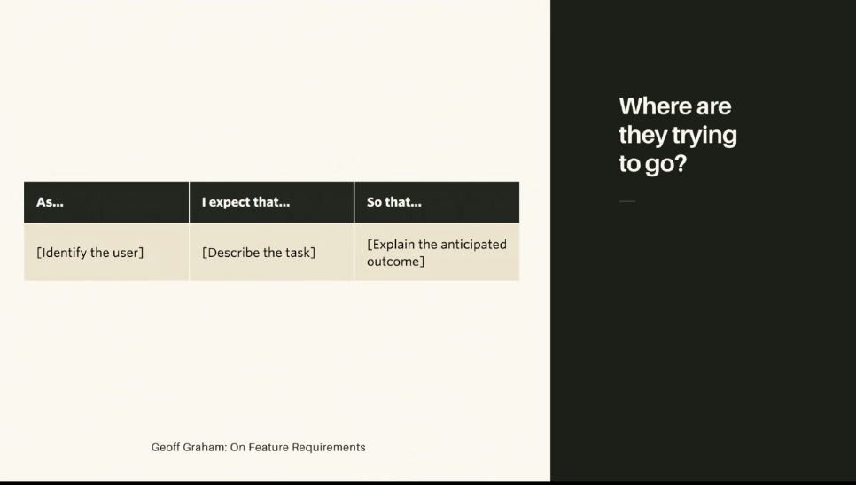
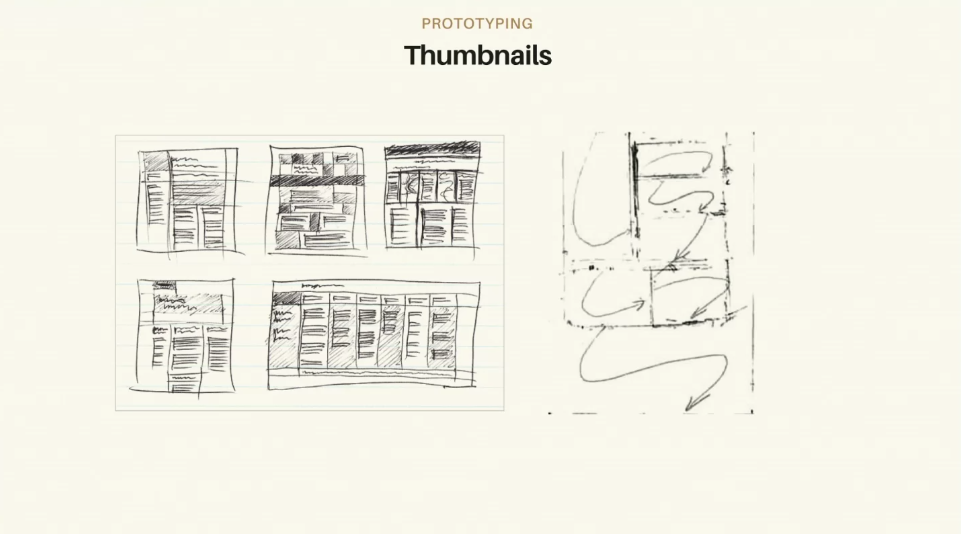
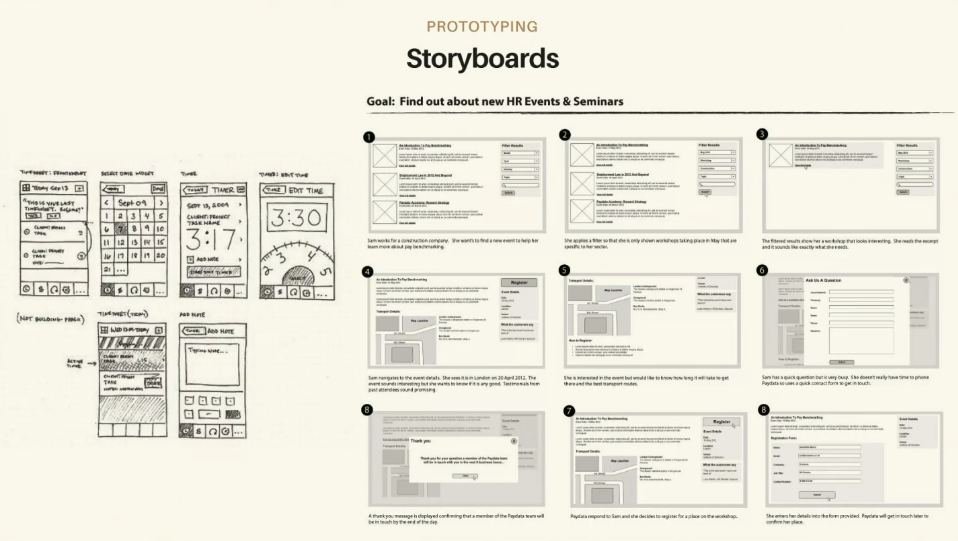
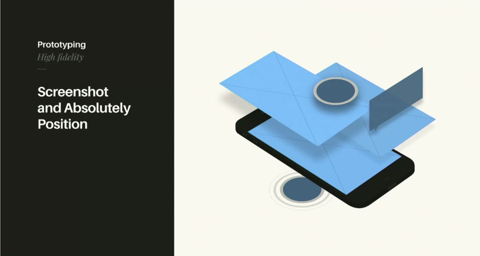
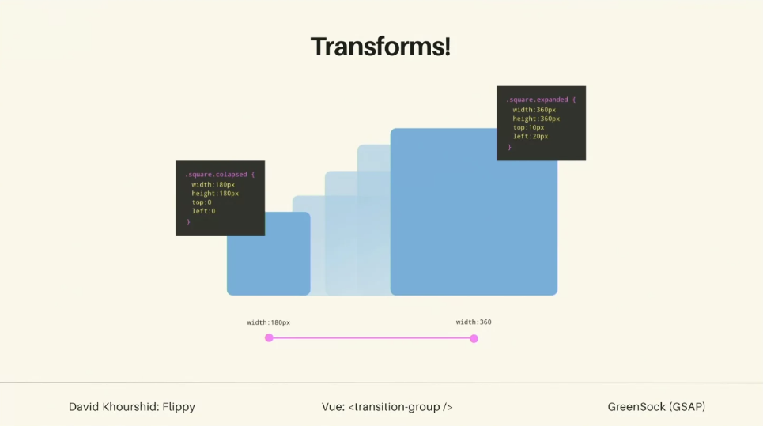

## Loaders 
- Loaders and perceived performance. Humans overestimate passive wait times by 36%.
- Perceived wait times-people are willing to wait twice as long for a custom experience. 
- Uncertain wait times are longer than knonw, finite waits-Disney world/airports - while waiting 
- Anxiety makes waits seem longer, doctors visits

## User Experience & Tools 

### Feature Requirements
On feature requirements: https://css-tricks.com/writing-feature-requirements/

Figuring out the end goals of your users. 

Identify the user and think about outcomes. Experience/test the end to end, be a user for your own site.

### Story Maps
https://medium.com/design-story/story-map-3cc64033128e

- Basically showing how you can plan out wireframes and drawing at each step in the user process 

### End to end website flows 
- You can also use premade website flows to mockup the user flows
- UI Stencils, sometimes its about getting yourself excited about completing the tasks, might want to use stencils to get excited about the materials themselves to create something.

## Motion Design Lanugage 
Drasner mockup: https://codepen.io/sdras/pen/JbaGwg

## Types of Prototypes

### Thumbnails
- Messy, essentially messages to yourself

- Staying consistent with your design rules can help you build your animation brand identity
- Just for you
- Low commitment, very disposable

### Storyboards
One step up from thumbnails

- a bit more time, but still disposable

### Low-fi Prototype 
https://codepen.io/sdras/pen/594d891abedf804e87bffe48ee30aace
- Effective way of communicating
- get added benefit of maybe reusing code 

### Hi-Fi Prototype
https://codepen.io/sdras/pen/2ae1eadb3a80e26daf3aae54cd148c61

### Screenshot and Absolute 
You can even screenshot and absolute position things for just the feature to really mock it up

## Page Transitions 
- Might be helpful to keep some elements consistent, to help blend into the next state
- Lee Long, does work in After Effects
- Rally: https://rallyinteractive.com/
- Codrops! https://tympanus.net/codrops/

### Transforms

https://github.com/davidkpiano/flipping

## Interaction Exercise
Make two thumbnails and one storyboard of a possible interaction on your new site. Bonus: Implement it!

## Links 
- [🏠 MAIN](/drasner-design-for-developers-main)
- [PREV ← | Images & Perforamnce ](/drasner-design-for-developers-inspiration)

