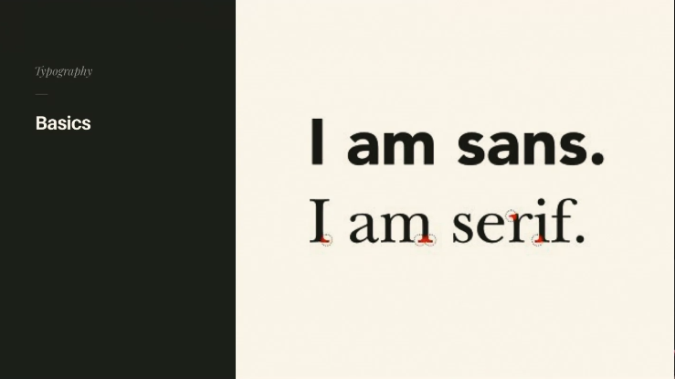
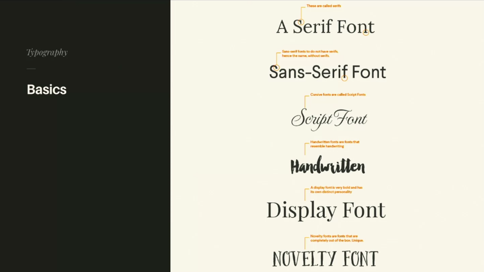
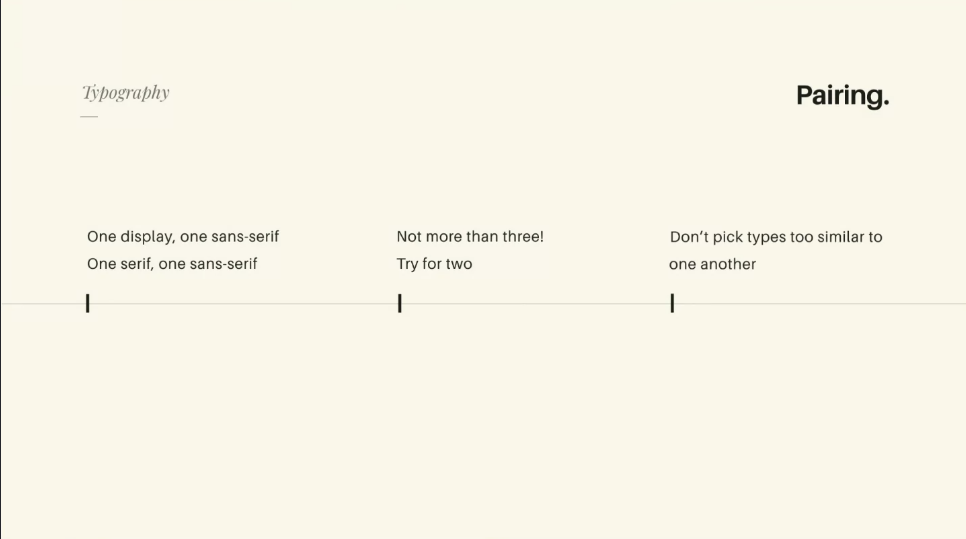
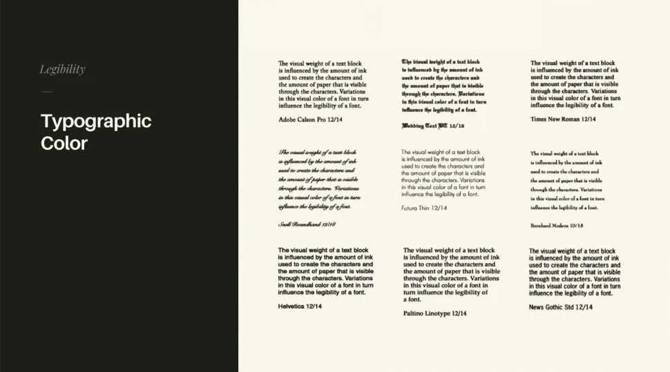
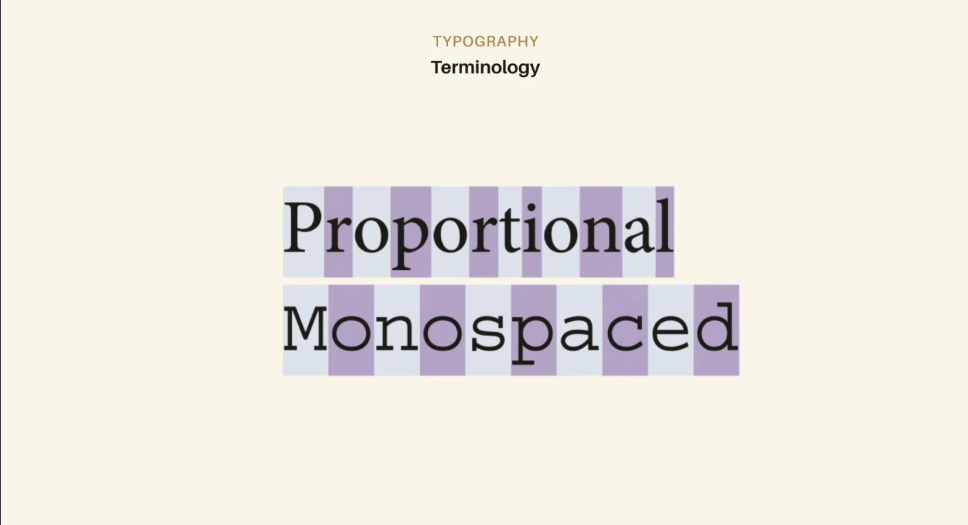
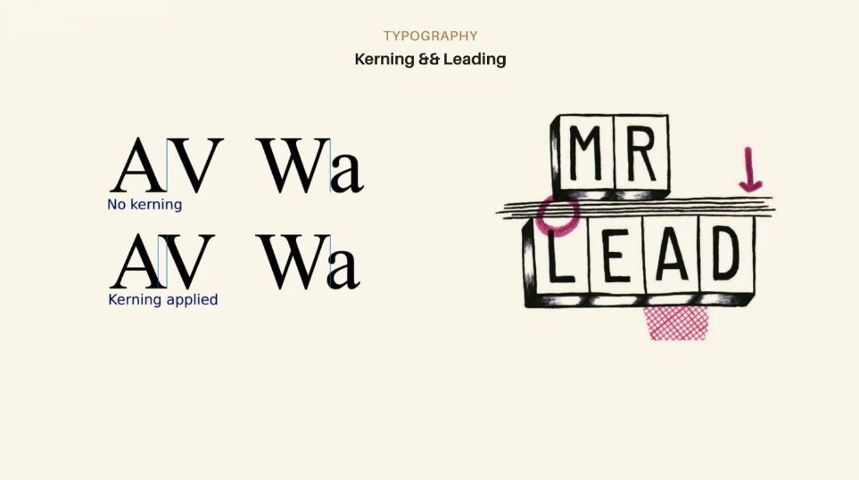
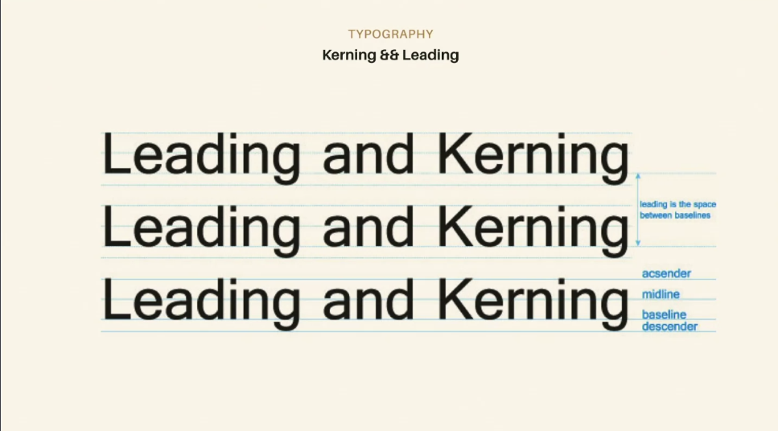
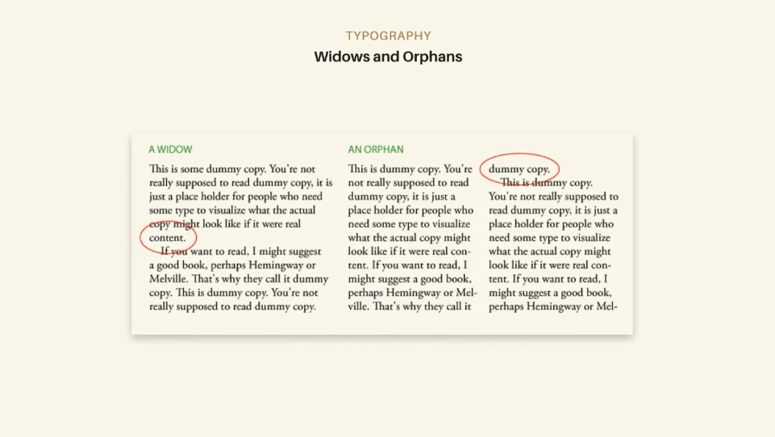
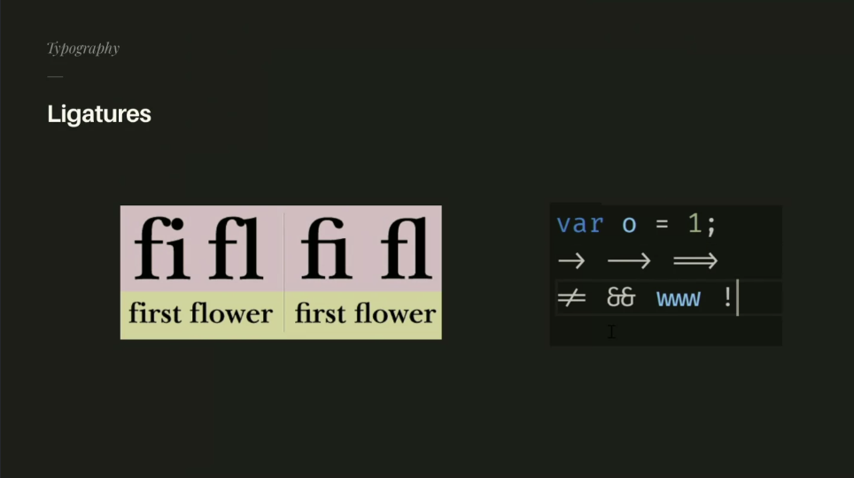

## Typography
Important for meaning, hierarchy, conveying messages/content.

### Difference between serif and sans serif
- sans serif doens't have all the curlicues
- Serif fonts have edges.  

- Slab Serif, would be like a chunkier serif.

### Common Styles

- Display tends to be fonts that look great when big, but bad when small (like for copy)

## Typography Resources
- Google Fonts: https://fonts.google.com/ (free)
- font squirrel: https://www.fontsquirrel.com/ (free-spendy)
- fonts.com: https://www.fonts.com/ (moderately spendy)
> - What the font: https://www.myfonts.com/WhatTheFont/ (can analyze image of a font to tell you what it might be or close to.)
- Hoefler: https://www.typography.com/ (spendy)

## Pairing Fonts
Some rules to follow: You pair typography.

- When youre pairing you might use one display and one sans serif 
- finding things that are a little opposite of one another with typography is common.
- Don't use more than three fonts, fonts are costly performance-wise.
- Don't pick fonts that are too close to one another.

Google fonts has a nice pairing mode.

> Fontjoy: https://fontjoy.com/ helps you find pairings if you're not great at it yourself.

## Typography for Lawyers
A great resource/book : Typography for Lawyers, 

- Line length past 45-90 character can be fatiguing. Constrain your line length, which is why we use columns, which is why newspaper use them.

## Typographic Color 
Not talking about color/color theory. **Typographic** color is really liek the rhytm and cadence of typography and it matters for things like body text. 

If you want to check if something has a good typographic color for body text, you can kind of squint your eyes and see if it has an even cadence.

### Responsive Typography
> A pen that allows you to take text that looks good on desktop and have it responsively scale: https://codepen.io/MadeByMike/pen/YPJJYv.

You don't have to write it from scratch, just use the codepen above.

### Text Lockup  
You can do interesting placement of texts and still have it remain accessible.
https://css-tricks.com/snippets/svg/text-lock-up/

## Terminology 

### Proportional versus Monospaced:

###  Kerning && Leading
Called leading because in typesetting, use little bars of lead to separate heights.

### Widows and orphans
- Widows are one word handing out
- Orphans are when you got to the next paragraph with a few words. Orphans really bother people, widows are less a big of a deal to people. If you have content generated from an API you can't do much about it but good to keep an eye on this stuff.

- Easier on your eyes to read without widows and orphans.

### Ligantures

For some people its more legible/more. 

### More Typographic Terminology
https://creativemarket.com/blog/typography-terms-cheatsheet?utm_source=Link&utm_medium=CM+Social+Share&utm_campaign=Blog+Post+Social+Share&utm_content=Free+Typography+Basics+Cheatsheet%3A+Anatomy%2C+Classification+%26+Special+Terms+%7E+Creative+Market+Blog&ts=201811 

### Falling down 
Text in a book is never centered in the middle of the page. There is always slightly more room in the bottom part of the page, because if it wasn't there it would look like the text is falling down. It's like circles, the edge has to be slightly out of of line to make it look visually conistent.

### Font performance
- Fonts and font loading can be hugely impactful for web p[erfroamnce. ]
- subfont: https://github.com/Munter/subfont, can help optimize font optimization
- Good resource for typography: https://www.robinrendle.com/adventures/

## Typography Demo

### Variable Fonts
Variable fonts are adaptive in their sizing, one font for the whole range 0-1000.
Mandy Michael amazing, codepen: https://codepen.io/mandymichael

## Links 
- [🏠 MAIN](/drasner-design-for-developers-main)
- [PREV ← | Color Theory ](/drasner-design-for-developers-color-theory)
- [NEXT → | Inspiration ](/drasner-design-for-developers-inspiration)