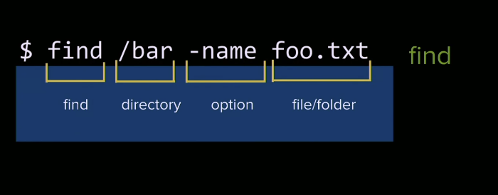
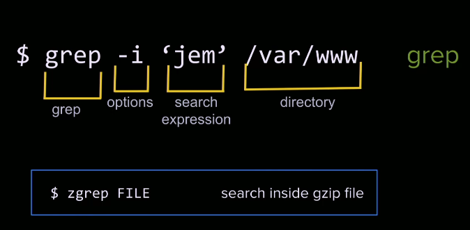

## Standard Streams & Redirection
- **standard ouput**: `stdout`
- **standard input**: `stdin`
- **standard error**: `stderr`
 
This the standard for all Unix systems. This is the standardized way for inputs in/out/error. Great that this is an agreed upon standard, remember internet all about trust.

That means any sort of Unix program that we're running we can pipe imput/output/errors to the same place because they all share a common API.

What we do with these inputs/outputs/errors is we use something called **redirection**...

### Redirection 
>- `|` : read from stdout 
- `>` : write stdout to file 
- `>>` : append stdout to file
- `<` : read from stdin
- `2>` : read from stderr 

So say we run something we can pipe all the ouput somewhere to someplace else... let's see an example of this...

- `ps`: just shows number of processes running on our server 
- `ps | grep bash`: so what this would do is run `ps` then pipe all that over to grep which is going to run a regular expression on searching for bash, and returns the line that matches the regex. That's a **redirection operator**.

We can read/write to files, we can do lots of things..

Let's create a fake log file...
```bash
touch test.log 
ps > test.log 
cat test.log 
```
- the output is being goggled up by writing to this log file, so if we cat this log file we can see that it wrote all the output into the log file itself.

- A lot of the time you're going to take the output and going to write it log files, and whats great about that is you pipe log files to the same common place /var/log/.

So generally if you're doing any sort of logging you always want to put in here /var/log , here will be logs for all your processes. 

Having a common pattern for stdni/o lets you chain and do some really cool things. Shows the power of an agreed upon API.

The problem with writing to standard out file is its just goign to blow away what you have before, so if you want to append it you use the `>>`.

If you want to read we pipe it the other way.

- `2>` is for reading error, looks weird, but whatever. 0,1,2 are corresponding numbers for stdin, stout, stderr, so if you see these (won't be too frequently) you'll know.

### What does this do?
- `foo > bar`
- takes foo and writes it to bar

## Finding Files & Directories
We are often going to be grepping more using `find`, find you'll be looking up often because its long and unintuitive.


- **`find`**  : search file names   
    - useful options: 
        - -name 
        - -type 
        - -empty
        - -executawble
        - -writable 

- **Find all log files in /var/log**: `find /var/log/nginx -type f -name "*.log"`
This will be the output...
``` noLineNumbers
/var/log/nginx/access.log
/var/log/nginx/error.log
```
- **find all directories with the name 'log'**: `find / -type -d name log`
- **`grep`**: search file contents 

## Bash History Tips
- ctrl + r to serach your bash history.

## Searching File Contents with `grep` & `zgrep`
What if you want some sort introspection on a file, we use grep.
- People aren't the biggest fan of `grep` because it uses regular expressions, protip: if you're using a regex in your code, write a comment for what it is doing.



`$zgrep FILE` : will let you search inside a gzipped file, which is really cool because eventually our log files will get gzipped to save space, zgrep will let you search over those gzipped files without unpacking it.

> ⭐ Keep this in mind, grep is going to be the fastest way to find something in a file.

## Links 
- [🏠 MAIN](/fsfe-intro)
- [PREV ← | Server Setup](/fsfe-server-setup)
- [NEXT → | Nginx Config Basics ](/fsfe-nginx-config)
