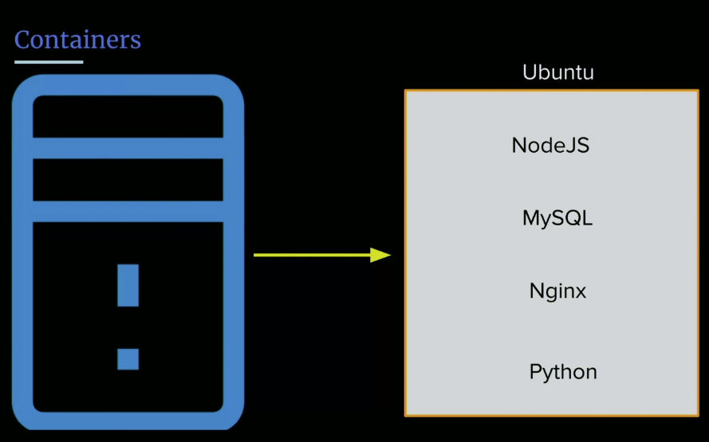
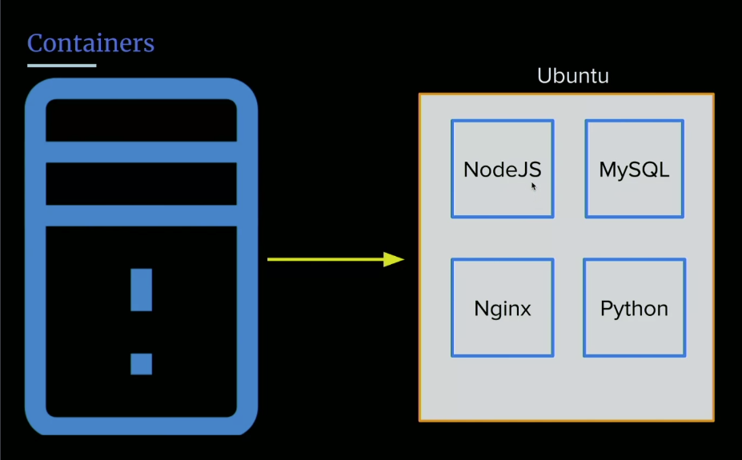
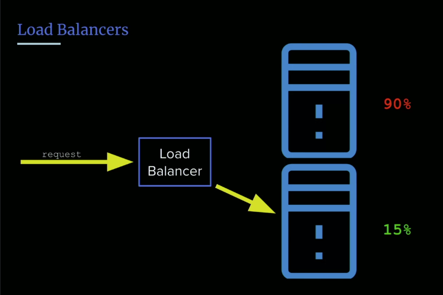
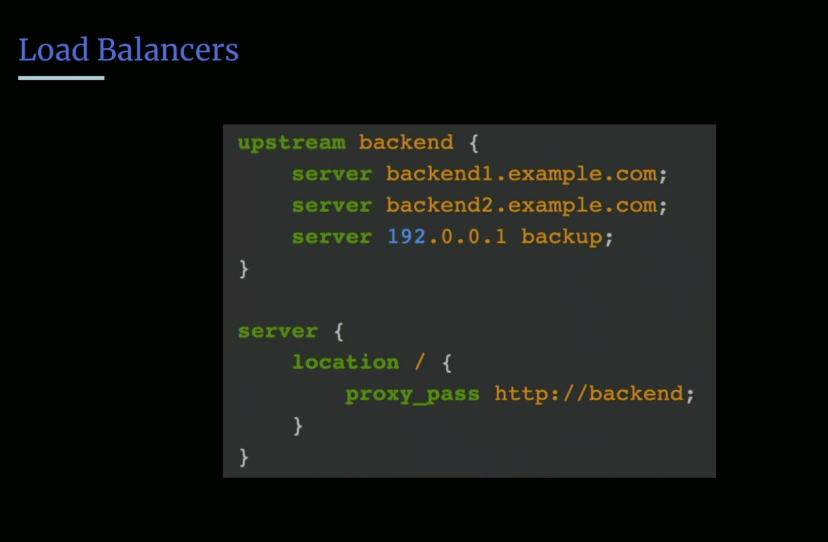

- Microservices
- Containers
- Orchestration
- Load Balancers
- Deployments 

## Containers & Microservices
We talked about our our code/project was structured, a bit ago. Well as fullstack engineers, we also need to think about our applications are structured in how they live on the server.

### Microservices
- [**Microservices**](): Architecture of loosely connected services 
    - kind of a misnomer because the name implies its small and lightweight which won't always be the case. 
    - It tries to only do one thing
    - the opposite of this would be a **monolith**.

There are tradeoffs to each. The good thing about monoliths is that in a Monolith...

- all share the same language, its all one application. 
- Security Upates, migrating from Py2 to Py3, do it all at one time
- Make maintenance a little bit easier, not a lot of disparate services

The downsides of a Monolith: Non decoupled functionality, can be unruly, not as modular. 

Microservices are largely built on this concept now called **containers**. 

Interesting with Microservices is that everyone can interopt if they share that same common API. it lives up to that freedom of responsibility, you maintian your own stack and your own acrchitecture. The downside is, it also gets crazy complex, it's a ton of different apps that need to maintain connections to each other.

### Containers
- **containers**: are a way of partitioning your code in an environment that it can run in with only the necesary components included.

### What is the difference between A VM and a container?
- A virtual machine is a whole OS simulating machine 
- A container can be ligher weight than that. 

In the old days of the microservice architecture, we would have to run a version of Ubuntu(any OS), like we're running now, and then Node and then if we wanted to run another microservice for our database we'd run Fedora/Ubuntu/whatever with another version of Node and that was the old days. This definitelly worked, there was still isolation of things and communicating only occured over known APIs, containers take this idea and shrink it down even more.

Instead of running on an operating sytem, we just run a set of libraries that the application needs, and only that, nothing else.

Containers are only possible today via cloud computing and the advances we've made in the [**hypervisor**]() thew that is the process that controls other processes, how they talk to each other. 

It's kind of how we're working right now, because of **process isolation**. The hypervisor is really good at segmenting our resources to one another on our slivers of the same server.

The old days would look like this on a virtual machine:



This is pretty close to our server. This is the old way of doing it. 


But now this is kind of how its down with microservices , every single thing is running on its own micro-server, where they only have the libraries that they need.

What is powerful about this? We can more quickly and efficiently allocate server resources depending on the process requirements. Part of that power is you can roll these out much much faster, we aren't starting up an entire OS, we can just run the library. The other benefit is we can't make updates to our Node application without the other services knowing about it. 

### Container benefits
> [^ **What are the benefits of usign containers?**]- lightweight
- portable 
- easier for development
- easier to manage
- faster startup 
- decouple application from infrastructure 

## Docker & Orchestration
The most famous containerization platform you've probably heard of is Docker. But amazon has their own...
- Amazon ECS (Elastic Container Service)
- Apache Mesos
- CoreOS rkt

- [**Containerization platform**](): Is just any layer inbetween that talks to the application layer and the operating system for us so we don't have to. 

### Orchestration
How do you roll out thousands of containers? We need a way of conducting the rollout of our containers, because we need to make sure things are installed correctly, its a lot like a symphony.


So if we need 10,000 more containers, how many servers is that? We don't know, we don't know, we'd need to find out how much resources each container needs and we need to know how many resources the server itself has. So we have this orchestration layer that says, hey, I have a node appliation, and it needs, say 200mb of ram and 10MB of hard drive space, we know how much the server needs and we can roll these out evenly aross the servers so no one server is taking all of the traffic. And that's what the [**orchestration**]() does.

- [**Kubernetes "K8s"**](): is the big name in the space, it's just an orchestration layer. So unlike Docker, which is containerizer, Kubernetes/K8 is what controls the rolling out of alese containers you're deploying.
- Others: Docker Swarm  
    - Amazon EKS
    - Apache Mesos
    - AKS 

When you're at this level of engineering, you're more in DevOps land, less full stack. You need to know precisely what you're doing as you're dealing with thousands of dollar worth of servers.

The power of really good orchestation layers, you can shift and move millions of connections over to different server locations east -> west in instances out outagages without dropping any connections.

## Load Balancers
So far we've talked about [**elastic cloud computing**]() (computing or server availability that expands and contracts based on your needs, useful for things like holidays, or non-peak hours, can scale according to need). So 

Elastic computing is done with the concept of knowing the load of the servers and measuring that. 

A [**load balancer**]() is what routes traffic to approriate cluster and its something you don't think about until you're at scale. 



Load balancers work with a concept called a **scheduling algorithm**. 

> - [**scheduling algorithm**](): How the load balancer determines which server it send a request to.
    - Round Robin* (default strategy for most servers, just moves on to the next server)
    - IP Hashing (Hashes IP, will get sent to same server based on IP)
    - Random Choice (works decently enough)
    - Least Connections (needs to know load on each server)
    - Least Load 

### Checking our server load 
Gives us a real-time look over what our service is doing 
- **Displaying running processes**: `$ top` 
- **Installing htop**: `$ sudo apt install htop`
- **Display running processes**: `$ htop`

Don't want to be running top all the time because top itself requires resources to run. 

Pm2 actually helps with clustering and will spin up multiple instances of your Node appliation for you.

If your system is running slow, htop is a good thing to run to find out what is using all your CPU cycles, think of it like activity monitor for your server.

Important to know the load, because when we are talking about load balancers, understanding the CPU load, the connection load, the memory load 

### Nginx as a load balancer
You know how we said nginx is a jack of all trades, well we can actually use it as a load balancer too.



We aren't going to implement one today, because we only have one servewr, but this is the gist of how we would set it up.

That means, out of the box we could probably run about 1,000 servers with on nginx load balancer and its just going to handle that traffic perfectly.

```
upstream backend {
    least_conn;
    server backend1.example.com;
    server backend2.example.com;
}
```
https://docs.nginx.com/nginx/admin-guide/load-balancer/http-load-balancer/

Really awesome software, nginx. 

### What about session data?
What if we log into a server, we are authorized on this one server, how do we know we aren't going to get routed to a different server where I'm not logged in? This is a real problem, if the load balancer sends us to a different server each time.

- One way to correct for this is with **sticky sessions** that stick you to a particular server. 
- Another way is with IP Hashing, so we're always going to the same server
- Another would be adding an auth layer before we even hit nginx, make sure we are authorized completely before getting to the server.

## Deployment 
We talked about orchestration as a way of deploying containers, but if we weren't using micro-services and containers, what is a faster way of deploying 20 servers?

[^ **If we weren't using containers how would we spin up say 20 additional servers? What are some common tools for this?**]We don't want to have to do what we did so far 20x times for each server. Fortunately there are tools out there that you set up with a configuration script and you give it some resources and server IPs and you can set up hundreds/thousands of servers at once.

Some popular tools for deployment:   
- Ansible 
- Puppet
- Vagrant
- Chef 

## Links 
- [🏠 MAIN](/fsfe-intro)
- [PREV ← | HTTP ](/fsfe-http)
- [NEXT → | Saving Data](/fsfe-saving-data)