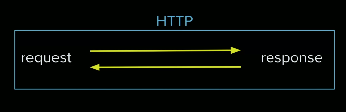
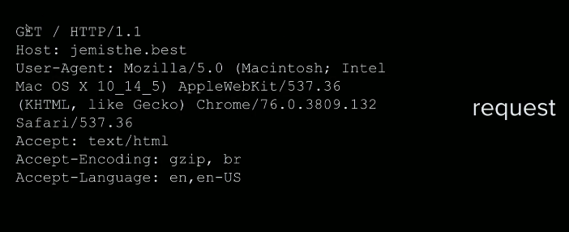

- HTTP
- Headers
- Status Codes
- HTTPS
- Certbot
- HTTP/2
- HTTP/3

## Defining HTTP
As devs we sometimes don't really think about how or why HTTP is working, but we're writing markup frequently. In Jem's mind to be a good full stack engineer, you need to know what this protocol is really doing. 

### What is HTTP?
> - **HTTP**: Hypertext transport protocol    
    - it's a standard, a thing that defines how code moves from the server to the client and how to decrypt that.
    - HTTP runs over TCP.

HTTP is the one we care most about. TCP is there, you know it, but HTTP is really what the data is comprised of. 
> So a **packet** wraps HTTP data, and then we decode that.

The entire model for HTTP is request and response, much like TCP, unlike UDP which is like broadcasting, HTTP cares about request and reponse like TCP.

This is what a HTTP request diagram looks like:

We see the GET method, then we see a bunch of headers and then somewhere in there is going to be the data payload

## HTTP Headers & Cookies
- **headers**: give some metadata on request and response, remember when we said packets are made up of data, and then metadata, part of that metadata is the header. It  can tell a lot about where this request is coming from, what kind of encoding it has, what kind of content, it has a ton of information. We can add/substract info to the headers along the way, passing it to express/nginx.

- Using an envelop metaphor, the envelop and address details are like the header, we don't see the contents but we get an idea of information about the packet.

## Custom Header & Status Code Exercise
## Custom Header & Status Code Solution
## HTTPS
## Adding HTTPS to NGINX
## HTTP/2
## HTTP/3

## Links 
- [🏠 MAIN](/fsfe-intro)
- [PREV ← | Security ](/fsfe-security)
- [NEXT → | Container Basics ](/fsfe-containers-basics)