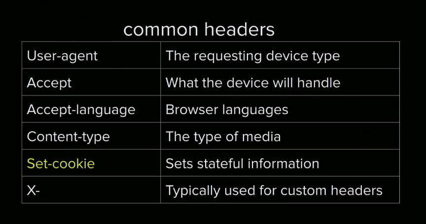
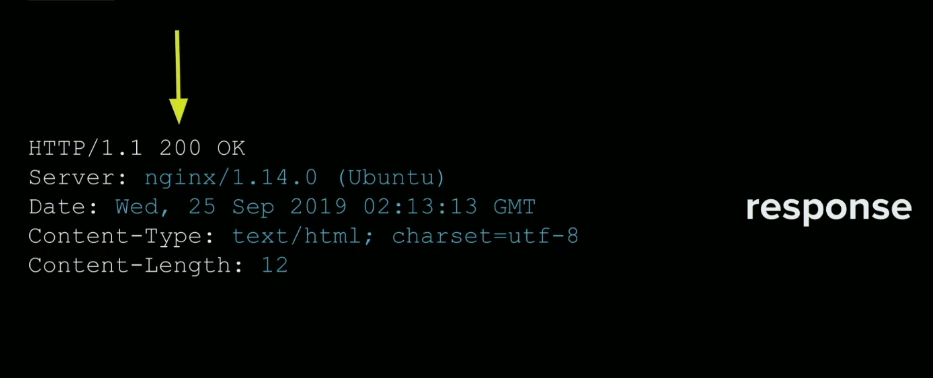
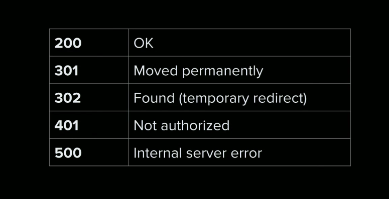
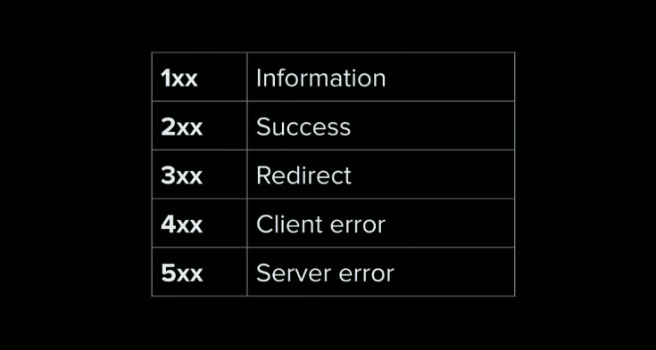
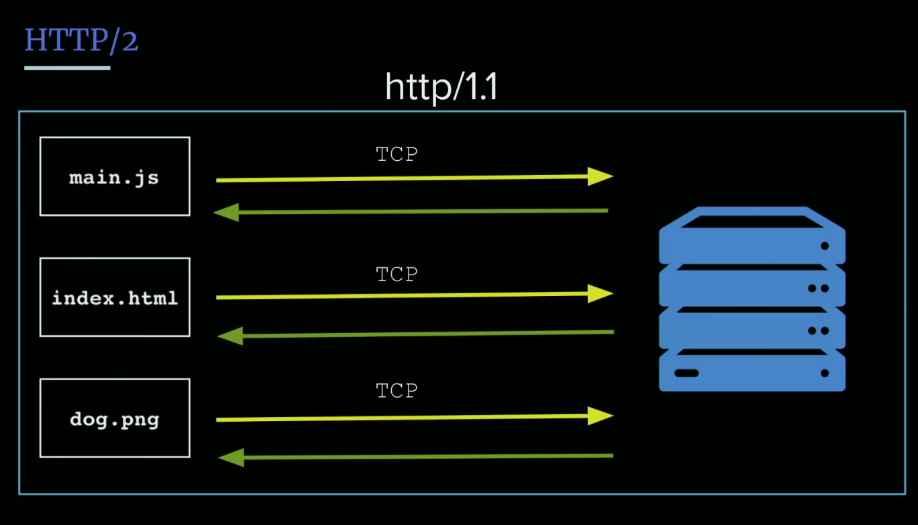
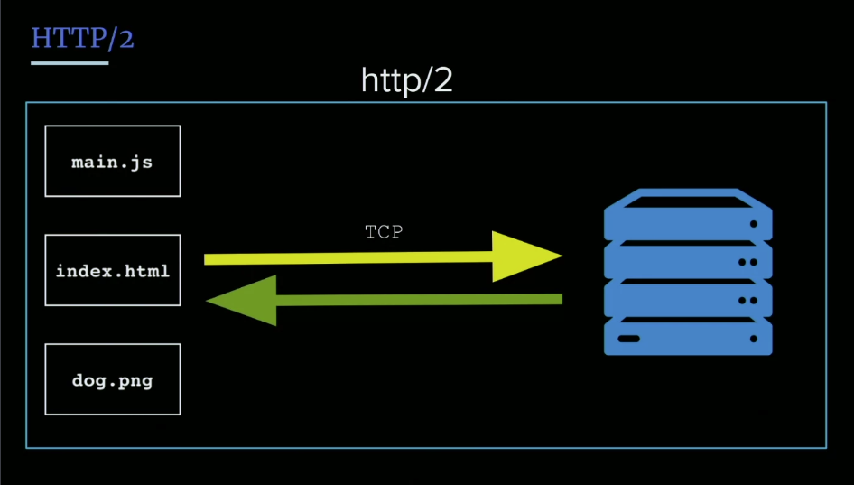

- HTTP
- Headers
- Status Codes
- HTTPS
- Certbot
- HTTP/2
- HTTP/3

## Defining HTTP
As devs we sometimes don't really think about how or why HTTP is working, but we're writing markup frequently. In Jem's mind to be a good full stack engineer, you need to know what this protocol is really doing. 

### What is HTTP?
> - **HTTP**: Hypertext transport protocol    
    - it's a standard, a thing that defines how code moves from the server to the client and how to decrypt that.
    - HTTP runs over TCP.


HTTP is the one we care most about. TCP is there, you know it, but HTTP is really what the data is comprised of. 
> So a **packet** wraps HTTP data, and then we decode that.

The entire model for HTTP is request and response, much like TCP, unlike UDP which is like broadcasting, HTTP cares about request and reponse like TCP.

This is what a HTTP request diagram looks like:


We see the GET method, then we see a bunch of headers and then somewhere in there is going to be the data payload

## HTTP Headers & Cookies
>- **headers**: give some metadata on request and response, remember when we said packets are made up of data, and then metadata, part of that metadata is the header. It  can tell a lot about where this request is coming from, what kind of encoding it has, what kind of content, it has a ton of information. We can add/substract info to the headers along the way, passing it to express/nginx, there are headers just for nginx or just for express. 
    - Using an envelop metaphor, the envelop and address details are like the header, we don't see the contents but we get an idea of information about the packet.

>- [**Host header**]():  tells requests where its going and the destination. 
    - interesting b/c its what route request reads to the correct server 
    - remember how we talked about virtual servers, part of how nginx determines where its trying to go is by reading the header
    - clients can't modify or fake host headers, browswer dont allow it
    - a **web worker** is a persistent web worker that runs in a separate thread and when the tab is closed, it can still run in the background, a way of intercepting network requests essentially.
    - You can't use a web worker to proxy things by modifying the host header. You can't modify where that package is supposed to go once that package is in flight.
- **User agent**: Browswer information, what kind of computer you're on. The reason its like an alphabet soup of khtml, and chrome and safari is that the web is backwards compatible so browsers can kind of fake/add user agents to reach backwards compatibility. It's supposed to be looked at for what features are supported. You're typically going to use some library user agent, because these are generally undreadable. 
- **Accept** what sort of things can I receive *back* from the server?
- **Accept-Encoding**: This just means that the browser accepts these gzip encodings, so nginx will say hey, we can gzip this on the way out because we know that this browswer can handle it. 
    - br is brotli which is just a different encoding format for compression, so gzip and br and the common ones. 

Again, all this metadata is just contained in the header. 



There are many more headers than this.  
Set-Cookie is an interesting one we didn't talk about above so let's...

### Cookies
### So what are cookies?
**Cookies**: It's a persistent bit of text data that persists on the browser, if it's a session cookie that could tell you things like, how many minutes it took to close a tab or the browser and go away when session is closed. Or regular cookie which persist over time, and will expire only when you wset th expire time on the cookie.

### Why are cookies important?
The internet is stateless, and every request and response the server dones't remember that you've been here or not. We need cookies to persist this data over time so that we know a request, say the person has logged in, or logged out, or accepted agreements. Cookies persist over every single request unless you expire them, because of this you can overload request with cookies, so be careful of the amount of cookies you send, don't add to much data in there, b/c it will be on every single request, and just adds overhead, making your connection slower.

- **X-**: X headers are a custom header, there are guidelines for doing so. Useful for sending one-time information that you don't want to include in your payload directly. Custom one time data, e.g. `X-powered by: Express` if we're usign an Express app.

### Response headers



**Reponse headers** are what the server is sending you. Let's say the content is gzipped, the browser wouldn't know that unless there was some header to tell it to unpack it. 

## Custom Header & Status Code Exercise

The 200 being pointed to in the diagram above is a status code. 418: I am a teapot, actual one.

- **HTTP Status Code**: Indicates teh status of an HTTP request
    - b/c if you make a request and response, you won't know what to do with the response without the status code. 
    - status codes let the browser know what to do with the response.

    
    

It's good to know the prefixes above so you have a general idea of whats going on.

500's you should never get. Servers should know how to handle errors and manage their server, so you shouldn't be sending back 500 errors to the client. You can handle 500 errors on the client side as well.

### What is the proper status code of a successful POST request?
- 200 or 201 (successfully created).

Exercise: in your app, create a path that returns 418 and a custom header.
Hint: `res.status(), res.set()`

## Custom Header & Status Code Solution
```js 
app.get('/demo', (req,res) => {
    res.set('X-full-stack', '4life');
    res.status(418);
    res.send('I prefer coffee');
});
```
> So, again, **custom headers** are a really powerful way of just sending down one-time data for this request, because the internet is stateless, because requests are stateless, we can set a temporary state by sending a custom header. 

Another instance is a 401 status, you can check the cookie, check against a database of valid cookies or valid login credentials and if they're not logged in for every single request, you'd write some sort of middleware that just returns a 401 which means not authorized, hey you're not logged in, or prompt with message to do so.

You can name the customer header whatever (aside from protected/existing header names), the X- is just standard for saying this is a custom header.

## HTTPS
The internet used to work, simply over HTTP, which was the equivalent of shouting across a room and anyone in earshot could hear what you were saying, things like CC info in plaintext. 

### Why do we need HTTPS? 
Because HTTP was wildly insecure. What HTTPS does is it encrypts all the data in transit. Another downside of HTTP is that there was no guarantee of who you were talking to, a domain could expire. HTTPS guarantees we are talking to the right server, who guarantees things? Certificate authorities. 

Now with HTTP data is encrypted on the client and decrypted on the server. It's a public/private key authentication, not ssh, but its that same concept. 

So remember, HTTP all depends on those **certificate authorities**, there can be more trustworthy ones and less trustworthy ones. Also you can differ in the type of hashing algorithms used, there are certain algorithms that you can only use for HTTPS, you can't just create your own crypto and pass that out, you have to stick to a standard. 

Tradeoff for hashing algorithms, more complex = more secure, however it takes longer, and that adds up to CPU compute time, and added server costs. It needs to encrypt and decrypt back and forth on every request.

## Adding HTTPS to NGINX
Certbot is a service that makes it really easy to set up SSL. Also you should know, its going to automatically modify your nginx config, so it will look different.

Certbot has really great instructions:


https://certbot.eff.org/

Certbot is a wraped on Let's Encrypt.

Note: `apt-get` is a bit depricated, same thing as `apt` at this point.

Following the steps you may see: 
No names were found in your configuration files. Please enter in your domain
name(s) (comma and/or space separated)  (Enter 'c' to cancel):

That's because we forgot to add our server name. So let's kill this for now. 
We didn't add it because if we only have one server it goes there by default. But if we're gonna run Certbot, we need to have the actual server name.

- `sudo vi /etc/nginx/site-available/default`
```
server_name SERVERNAME.com www.SERVERNAME.com

location / { [...] }
```
- replace SERVERNAME with your domain name

- We need a domain name for this, can't just use an IP, because HTTPS is all about validating  who you are, an IP address is not good enough, IP addresses change ownership, domain names, don't for their set period, e.g. port this from DO to AWS, or IP will change but domain stays the same.

We can also add a **wildcard certificate** so that any domain or subdomain will work, but we don't cover it here.

Then rerun `sudo certbot --nginx`...
Please choose whether or not to redirect HTTP traffic to HTTPS, removing HTTP access.
- - - - - - - - - - - - - - - - - - - - - - - - - - - - - - - - - - - - - - - -
1: No redirect - Make no further changes to the webserver configuration.
2: Redirect - Make all requests redirect to secure HTTPS access. Choose this for
new sites, or if you're confident your site works on HTTPS. You can undo this
change by editing your web server's configuration.

We let them auto-redirect so we say `2` to the above. 

### Opening firewall to port 443
We need to open our firewall to port 443 where our ssl traffic comes in.

- `sudo ufw allow https`
- `sudo ufw status`

The challenges that a certificate authority does is, what Certbot does to verify you are who you say you are is, it temporarily creates a file and a temp path of some hash, it sends that hash to let's encrypt, to very the hash, then once its done it cleans all this up. This also happens with cert renewal.

## HTTP/2
Everything we discussed was using HTTP 1.1, this protocol is just what everyone agreed upon.

HTTP/2 came along because 1.2 wasn't doing it for some people.

HTTP/2 relies on HTTPS better setup. Once you have it in place, its an extension of Googles SPDY protocol, allows **multiplexing**. 



> Remember, this is all happening over TCP, which has that long handshake where it sends SYN packets, and ACK (acknowledgement packets), SYN/ACK together is the handshake. This is really cumbersome because every file/request I want needs its own special handshake, which makes it slower by default.



> With HTTP2, we can request everything just over a larger pipe, but this is what's known as [**multiplexing**](), using one connection and doing multiple things over a single connection.

With all that said, there is a limit to the number of connections we make, thats dependent on your computer, most browsers limit 6. Not a silver bullet, but something to consider. Just getting rid of that handshake every single time just make the internet faster, and its a decent idea to turn it on.

### Adding HTTP/2
Go into your nginx conf and just add ....

- **Edit nginx config**: `sudo vi /etc/nginx/site-available/default`
```
listen 443 http2 ssl;
```
Just add `http2` after 443 wherever we are listening on. That's it!

Then remember to reload nginx config with... 

- **reload nginx config**: `sudo service nginx reload`

> The second benefit to http/2 besides that multiplexing, is something called [**HPACK**]() it's a compression algorithm again, but what it does is it takes our non-changing headers are copmresses them into a hash and compares them over time. That comparison gives us about a 30-40% speed increase. 

Remember, cookies can't be compressed (they can, but probably won't), because cookies change, they aren't going to be compressed so keep cookies minimal.

## HTTP/3
HTTP 3 is "out", but not like fully adopted. Even HTTP/2 isn't fully adopted with about 40% of companies using it, its costly and not as easy as we did it.

### The difference between HTTP/2 and 3 is...
- HTTP/2 and all previous generations all run over TCP. Remember it's still that handskake, while HTTP/2 made it faster with multiplexing, so we aren't doing that handshake every time, there is still a cost of doing that. And they are still doing that **error corrction**.

> [^ What makes TCP reliable?]When we think about to TCP, TCP **error corrects**, meaning if any packets are missing, it says, hey, wait up, we have to go and request missing packets. This is what makes TCP reliable. Error correcting was necessary especially in the early days of the internet, like think of dial-up, when connections would drop. 

We needed a bunch of error correction because connections were unreliable. Now the internet is much more reliable and more stable. So what Google did was they made this thing called **Quick UDP Connections**.

- **`QUIC`**: Quick UDP Internet Connections 

So instead of HTTP over TCP, we now have HTTP over UDP. Remember, UDP is more of a blast just sending out data and assuming you got it, there is some error correction, but for the most part its much faster since there isn't that handshake. 

So you might see it `http/2+quic/46` on some Google products, since it isn't quite finalized. Google/Cloudfare does currently support it. With it you see a 20-30% speed increase over HTTP/2, which is kind of cool. 

## Key Insights
- Getting a much better handle on the reason/need/importance of headers. Why in Node/Express we have to be explicit about what we are sending back, because browsers need the information as part of the pact, the signal of trust that the internet is based on.

## Links 
- [🏠 MAIN](/fsfe-intro)
- [PREV ← | Security ](/fsfe-security)
- [NEXT → | Containers Basics ](/fsfe-containers-basics)