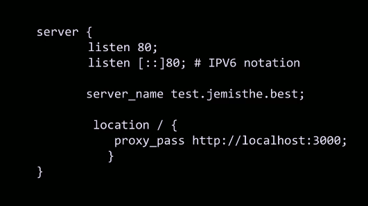

## Nginx Redirect
Common things to do in nginx, we aren't going to be doing too much tweaking... but useful to know

> The redirect is very powerful, you should probably know this. So instead of or prior to even hitting express server, we can set a route redirect with nginx.
```
location /help {
    return 301 https://developer.mozilla.org/en-US/;
}
```
- The difference between a 301 (permenant redirect) and a 302(temp redirect), important not to perm redirect if something is just temporarily down otherwise site-crawlers are going to mark the redirect as permenant .


## Nginx Subdomain
So far we created a server block for our servers.
- What's great with nginx is we can have as many domains as we want, and we can have as many servers as we want.
- because in terms of your mental model, this is a server on its own, 

This would be how to add a subdomain...


If you're wondering what the `::` is , is just ipv6 notation.
  
## Nginx File Compression 
Two basics types of compression we do on servers, nginx by default has gzip on. 

**Compression**: taking information and putting it into a smaller container: loseless (neatly packing), lossy(making cuts hopefully people don't notice). A good example to consider is mp3 which is a lossy compression algorithm, wav files are unmodified lossless audio files. Wav files can be huge, so what changed the game on sharing was MP3 

Trivia:   
- MPEG: Motion Picture Expert Group  
- MP3: MPEG Layer 3   

MP3s got file sizes down and thus allowed easier sharing over dialup.

Part of the art of compression is knowing what you can take out. In terms of server compression, what we are doing is saying, "hey this 'Jem' is repeated twenty times" instead of saying that we can create a sort of psedo-programming lang that says, instead of repeating this we can say lets just create a Jemx20 kind of procedure.

Server can compress things and have the client unpack them. There are things called zip bombs or gzip bombs. That can just recursively unpack things and take down whole servers/machines. Lesson: don't open/dl random zips.

In terms of game changers for making the internet a little bit faster, nginx will automatically compress everything in a standard format known as **gzip**. That's GNU zip. It compresses all data going out in that format of 1s and 0s. What's great is all that browswers know how to unpack a gzip file; this is what makes our connection so much faster.

That means, nginx will autocompress things with gzip, and when they hit the client the get unpacked. 

To look at your gzip settings you can go here....


Don't mess with compression levels to be too high, because its a tradeoff, too high requries more CPU power, and it may not save you as many bytes as you would think. 6 is a pretty good level for compression and should be kept as the default.

## Links 
- [🏠 MAIN](/fsfe-intro)
- [PREV ← | Bash Basics](/fsfe-bash-basics)
- [NEXT → | Security ](/fsfe-security)
