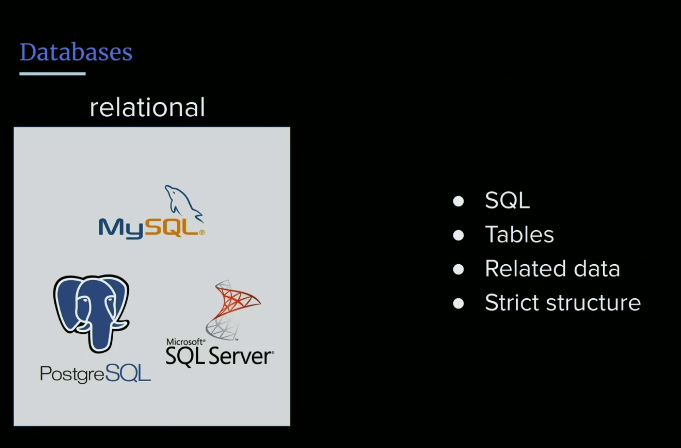
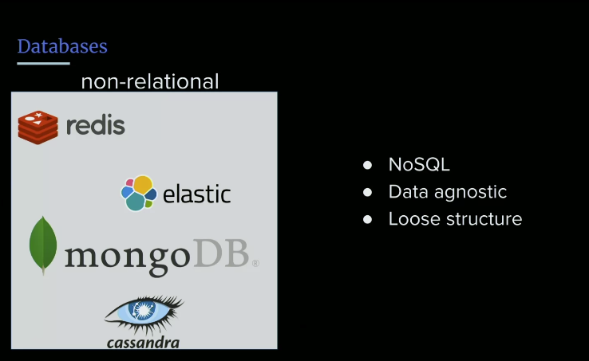
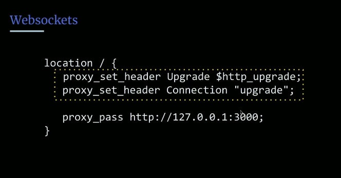

- Files 
- Databases 

## Files & Database Overview
90% of what you do as a software engineer is reading to a database or writing to a database.

When you think about mostly what your job is, it's mostly reading/writing to a db.

What is the easiest way to save something?

### Files
> - [^ **Why not save everything to a file? Or why aren't files just used all over the place to store data.**]Files are not optimized to be read for specific data, but bigger than this is the lack of portability. It can only live on one server, and if we have 10 servers, do we all write to one file at the same time?
- We have to write to a hard disk and a hard disk ois the slowest level of caching. Anf if you think of writing data as some sort of caching as persisting data, CPU cache is fastest, then memory cache, and other layers of caching. And the slowest is writing to a hard disk.
- Also, persisting a file across thousands of servers its just not scalable.

So we need some sort of data platform built specifically for saving data and information. This is why database were invented.

### Databases
- [**databases**](): give us a structured way of saving data in such a way that it is is readable/writeable by all parties and it just makes sense. When we are talking about data/big data we have to structure it in some way that its queriable. 

## Database Types

### Relational Databases
The first type of DB is a relational DB. 
- SQL (structured query language)
- describes how things relate to one another, usually using tables
- very strict structure on reading/writing

Depending on your lang the syntax slightly differs between them. The thing people get tripped up on is that you can't just write to a databse and say like, I'll figure it out. You have to have a structure ahead of time, and you have to have a very strict what is known as a **schema**.

And when you have a **schema**, you're just saying, these as strict rules so this column does this that column does that, with specific types, and its all about maintaining this structure over time.

### Non-relational Databases

- Nonrelational or NoSQL databases 
- more along the lines of what you might think of as document storage
- typically data agnostic 

They all have thier own unique place in the world, Redis, is a great cache database, its a key/value store. Whereas something like Mongo is that its a key with an arbitrary JSON blog, and the thing about JSON is doesn't necessarily have the same structure every time. MongoDB is just about dumping to a datastore and pulling it back out. 

- Redshift on Amazon is another one. 
- IndexDB in your browser.

## Redis
If you want to know how to install redis...

- **Install Redis server**: `sudo apt install redis-server`
- **Edit config to start with system**: `sudo vi /etc/redis/redis.conf`
    - supervised systemd <-- (modify the supervised line to systemd; means we add to system daemon so that it will always come online when the system restarts)
- **restart redis server**: `sudo systemct1 restart redis.service` 

Node-redis: https://github.com/NodeRedis/node-redis

### MySQL
How to install...
- **Install mysql server**: `$ sudo apt isntall mysql-server`
- **Run setup**: `$ mysql_secure_installation` 

Node-mysql: https://github.com/mysqljs/mysql 
 
## WebSockets
- [**websocket**](): Persistewnt bidirectional connection between client and server 
    - multiplexed 
    - unlike TCP with the handshake, with a websocket you only make one connection and it keeps that alive through a tunnel
    - that means the client can send data the server can send data, and its much faster than TCP even though it runs over TCP.

- Used to used a concept called **long polling**, which would just kind of automatically keep pushing data back and forth so that way the connection stays open, but its not as efficient as **websockets**.

## Chat Bot: Exercise
1. Create a chatbot using websockets
- git clone https://github.com/young/fsfev2
- on client we are using pure websockets (not socket.io)
- On server we are using the ws library, so npm install after you clone the repo 

### To make websockets work with nginx
We have to use what is known as an **upgrade request**, so in your location block you need to do this ...

- You can add a different location block and route your traffic to just a different node application, because with pm2 we can run 50 node applications if we want to, totally up to you. 

## Links 
- [🏠 MAIN](/fsfe-intro)
- [PREV ← | Containers Basics ](/fsfe-containers-basics) 