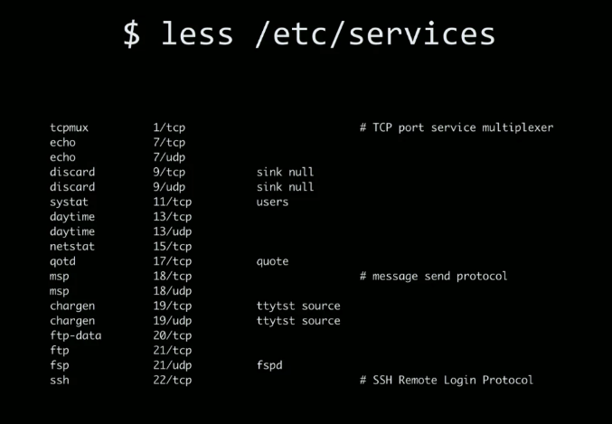
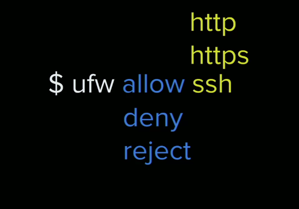

- Controlling access
- securing applications 
- Firewalls 
- Permissions
- Upgrade NodeJS 

## Why Security

### What could someone do if they gained access to your server?
- redirect your site to something nefarious, or you can even better if you werent using https, they can forward everything to the actual site and just intercept traffic in between, **man in the middle attack**, and site-owners wouldn't know its happening.
- lock you out of our own server
- scrape your database, all your credentials/cc info.
- If you store passwords in plaintext or MD5, simple hashes, and simple encryption. 
- Can install backdoor, delete logs, and turn server into silent botnet, to DDOS someone else, then wipe your server.
- Cryptojacking or ransomware
- If they get root access its like game over, which is why we disable it first thing.

## Read Auth.log

- **Read auto.log**: `sudo cat /var/log/auth.log`
    - Can take a disconnecte/failed IP and put it into Max Mind to find where attacks coming from.

## Security Checklist 
>- SSH
- Firewalls
- Updates
- Two factor authentication 
- VPN 

**Zero-day**: an unpatched vulnerability one that the company itself has not found or documented yet.

## Unattended Upgrades 
Preventing zero-days can be done by keeping software up to date.

- **install unattended upgrades**: `sudo apt install unattended-upgrades` (usually already installed)
    - what this does is automatically upgrades software for security or minor fixes
    - instead of writig a chron job to install latest, this takes care of it for us, and runs in the background.
- **view conf file**: `cat /etc/apt/apt.conf.d/50unattended-upgrades`

This doesn't mean you have to be on the latest version of something, just that youre on the latest patches and fixes.

## Security Ethics
- What is the responsibilty of companies to address/patch vulnerabilities, what if they don't? Things get morally dubious quicklly.

## Firewalls
- a perimeter of security that allows in or out requests depending on origin/port, parameters, etc. 
- Firewall, the phrase comes from the actual physical device called a firewall in your car, between the engine and where you sit in your car thats what's known as a firewall, so if the engine gets on fire, the fire won't spread into the cabin as quickly.

> - [**Firewall**](): "A network security device that monitors incoming and outgoing network traffic and decides whether to allow or block specific traffic based on a defined set of security rules."

### nmap
nmap just scans for open ports on your server.
> [**Nmap**]() (“Network Mapper”) is an open source tool for network exploration and security auditing. It was
       designed to rapidly scan large networks, although it works fine against single hosts.


- **install nmap**: `sudo apt install nmap`
- `man nmap`
- **run nmap**:`nmap YOUR_SERVER_IP_ADDRESS`
- **run nmap with more service/version info**: `nmap -sV YOUR_SERVER_IP_ADDRESS` 

These are the results of -sV
```
Not shown: 997 closed ports
PORT     STATE SERVICE VERSION
22/tcp   open  ssh     OpenSSH 7.6p1 Ubuntu 4ubuntu0.3 (Ubuntu Linux; protocol 2.0)
80/tcp   open  http    nginx 1.14.0 (Ubuntu)
3000/tcp open  http    Node.js (Express middleware)
```
- info regarding what you are running is easily discoverable 

## Ports
- **port**: communication endpoint that maps to a specific process or network service.
- Allows you to be very specific for where you want to go, much more efficient than having more IP addresses, with ports we can just hit one IP address and have different ports.
- the dangerous thing about ports is that any port open to the internet is a potential for exploitation, which is why its good to run the minimal amount of ports. 
> - Best practice: keep ports closed and only open the explicity ones that you need



## Uncomplicated Firewall
iptables are ways of blocking lists of ips... `iptables -p tcp --dport 80 -j REJECT` somewhat unfriendly syntax, which is why nice people on open software foundation and people of the internet created something more lightweight...

- **ufw**: uncomplicated firewall.

Again, firewalls just controll ports of who can get in/out of your computer/server.



The difference between deny and reject, is: deny will blackhole requests, it will just hang. Reject will explicitly reject and say port is closed. Typically you want to always black hole requests unless you have a specific case of telling users the port or parameters are invalid. 

- **Check firewall status**: `sudo ufw status`
- **Enable ssh**: `sudo ufw allow ssh`
- **Enable firewall**: `sudo ufw enable`

If we run `sudo ufw start` if it's inactive, it will prompt us saying this may interupt current ssh connection, just say yes.

So, if we closed port 22, which is our SSH port, we would now have no way of getting to the server, so be careful. ufw is pretty okay, but if you start rejecting SSH requests or black holeing them.

We can allow other things like http..

- **ufw allow http**: `sudo ufw allow http`

This is a much much friendlier syntax that iptables. 

### How would you create a ufw rule to block all http connections?
- `sudo ufw deny http`

## Permissions
Based on this idea that someone might eventually get in your server (hopefully not), but its thinking on those lines. It means locking down what you can do with a file. Read/write/execute. Permission are all about controlling those 3 operations.

For instance we run everythign with `sudo` because we don't have permission so we are using the super user power to do that. If someone came in and didn't know our super user password, they are limmited in what they can do, they can still cause a lot of trouble, but they're limited in their blast radius.


- `chmod 777` is the lazy permissionk since it gives open permissions, not advised to do everything with 777. 
- **list file permissions**: `ls -la` 

> - Rule of thumb, you should typically have the least amout of trust for your files, the least permissions as possible.

## Upgrade Node.js 
- The default is Node8. But let's upgrade because the sytnax is a bit cleaner wit the newer version of node.

- **download setup script from nodesource**: `curl -sL https://deb.nodesource.com/setup_10.x -o nodesource_setup.sh`
- **Run script**: `sudo bash nodesource_setup.sh`
- **Install nodejs**: `sudo apt install nodejs`
- 
- [**curl**](): is short for client url, its a very common command for reading and writing external sources.
- nodesource is the debian repo that manages packages.
- The `-L` means we will output to a file. 

> https://explainshell.com/.com, helpful resource for explaining anything done in the shell.

- In general you want to be careful downloading scripts from the internet. 
- This script isn't actually downloading node, what its doing is setting the pointer to nodejs to a different source, so now we can say sudo apt install nodejs to download that redirected version.

This will get use Node10 which is the LTS version.

### Upate outdated packages
- **update outdated packages**: `sudo npm update -g`


## Links 
- [🏠 MAIN](/fsfe-intro)
- [PREV ← | Nginx Config Basics](/fsfe-nginx-config)
- [NEXT → | HTTP ](/fsfe-http)