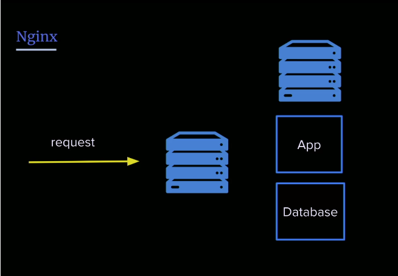
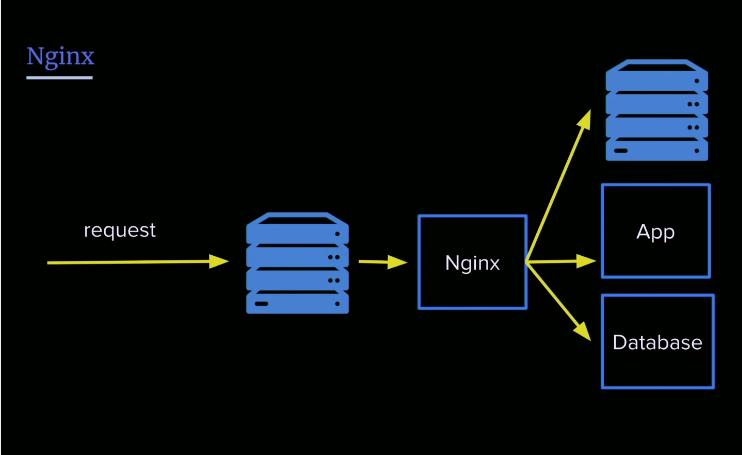
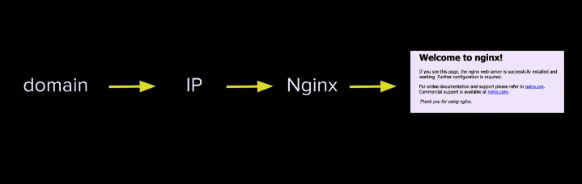
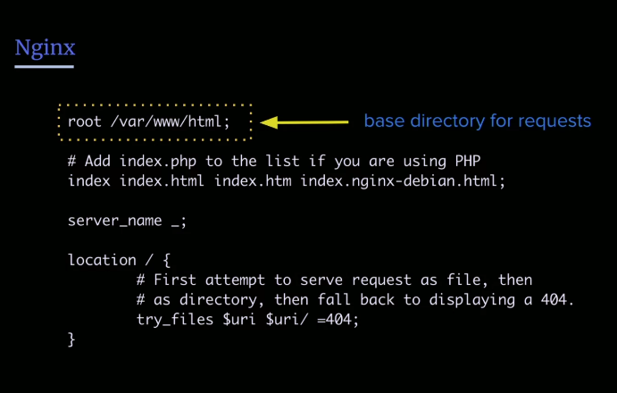
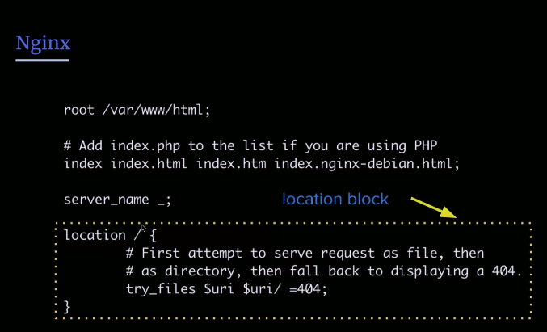
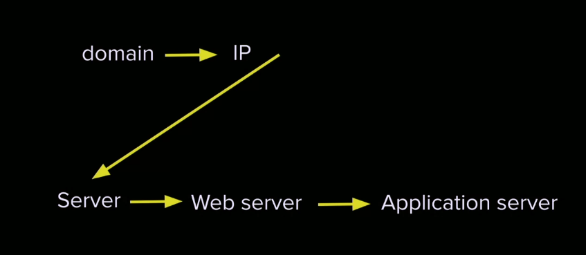

## Buying a Domain Name
So now that we have a server, we can do anything we want really.

We're still in our server as the root user, `whoami` is going to tell use who we are logged in as.

We will use namecheap for this. 

Early we talked about how domains get resolved, via the **name servers**. But thats because the name servers kewep records and they're called **DNS records**.

## Domain Setup

### DNS Records
There are different types of DNS records depending on what you want to do....

- [**A record**](): Maps name to IP address
    - e.g: jemyoung.com --> 23.23.185.61    
- [**CNAME**](): Maps name to name
    - e.g.: blogjemyoung.com  --> 23.23.185.61
    - maps the sub domain to an IP address
    - it actually maps to jemyoung.com and then maps it to 23.23

We can check the records that a given domain has by using the `dig` command: `dig blog.jemyoung.com`

Adds 2 *A Records* with your IP addres:

- @
- www

- Use digital ocean to add domain
- Update nameservewr on namecheap 

We want to use the @ which is the root domain, e.g. 'jemisthebest' is the root domain which is different from 'www.jemisthebest' we could use any of our DNS provider to do this... we will use Digital Ocean to do this...

The first thing we want to do is modify our name servers from digital ocean, go to our server, Manage > Networking.
- Add Domains, then create new records for this.

### Hooking it all Up 
- So we have these A records, but we still have these name servers, the address books, but right now, we aren't going to redirect if we went to our website, that's because our server really isn't up and running, it is, but its not accepting connections. 

The second reason is that the nameserver is wrong, what we need to do is change the name server to the hosting provider, so we're essentially saying, 'hey i want digital ocean to handle the name servers', not your name serers of the DNS provider.

So we have to go over to namecheap, and on our Domain and in the custom DNS, paste in the name server we grabbed/copied,from Digital Ocean, usually going to be ns1.digitalocean.com and ns2, etc.

So what this did is moved the cannonical record ownership from Namecheap to Digital Ocean. They will manage routing/ownership. May take 20-30 minutes to update.

## Server Setup
1. Update software
2. Create a new user
3. Make that user a super user
4. Enable login for new user
5. Disable root login 


### Update software
- Update software: `#apt update`
- Upgrade software: `# apt upgrade`
- Add new user: `# adduser $USERNAME`

- We are using `apt`, APT is a wrapper around app get. Think of it in terms of like npm, its a software package manager for how to download software.

- Great idea to always keep your software up to date. Most vulnerabilities originate from some dependent software being compromised.

- When a menu appears we select, use the package maintainer's version, that way, we will be in sync with whatever they recommend based on the box.

## User Setup
So now this new user that we created doesn't have super user access. 
- Sudo stands for super user do. 

- Add user to "sudo" group: `# usermod -aG sudo $USERNAME`
- Switch user: `# su $USERNAME`
- Check sudo access: `$ sudo cat /var/log/auth.log`

If you ran a command and forgot to prefix with sudo, you can just rerun the last command with !!, so `sudo !!` runs the last command with sudo privledges.

To escape a cat/less use `q` to exit.

### auth log
Your auth log is just a log of people loggin/trying to log into your server. 
- `head` will give you what a file starts with
- `tail` will give you what a file finishes with..
- `sudo tail /var/log/auth.log`, if you run with `-f` flag, it will follow and update with outputs the latest things.

> `tail -f` and tailing a log file and connected to a server at a different terminal or shell and understanding what's happening is one of the most powerful debugging tools we have. It's the equivalent of JS console.log. 

## Setting User Permissions
What we want to do now is we want to make an ssh directory, because our ssh keys are by default in the .ssh dir, we want to be able to login as this user, since we will be disabling root login. The `-p` is just makes a dir if it doesn't already exist.

- Change to home directory: `$ cd ~`
- Create a new directory if it doesn't exist: `$ mkdir -p ~/.ssh`
- Create authorized_keys file and paste PUBLIC key: `$ vi ~/.ssh/authorized_key`

Anything with a dot in front of it, its considered a hidden directory. `ls -a` will show us all directories hidden or otherwise. 

Let's create a new file for authorized keys. When we do this we want to paste in our public key into our authorized key file. 

Again, exactly how we did it with Digital Ocean, (which does this automatically for us when you create a root directory), but now we are doing this for our new user so we can SSH in.

So now, we are going to exit and then we are going to exit.
- Exiting one time puts us back into root, *all we did when we switched users is open a new shell*, so we are going to `exit` twice, then we are going to try to ssh in with our new username: `ssh kel@IPADDRESS`

## Disabling the Root User

- Change file permissions: `$chmod 644 ~/.ssh/authorized_keys`  
    - makes it so we can only read/write by by myself, certain system daemons, like SSH dameon.
- Disable root login: `$ sudo vi /etc/ssh/sshd_config`

Now we are in the SSH Daemon config. The [**daemon**]() is a program that's always running in the background. This one allows us to SSH in, we don't need to do anythign to stop it, its just constatly running and listening.

You can do a lot in SSH daemon, change number of retries, but remember we are doing so as `sudo`, messing around with this file too much can lock us out of our own server, not the end of the world. We can easily restart, only a problem when we are running a production server.

- **Security above security** a kind of concept where you think you're most secure by doing things like changing the ssh port number to something else, but can just be confusing too you and it doesn't make it really that much more secure.

Next we want to restart the dameon...

- Restart ssh daemon: `sudo service sshd restart`
- Disable root login: `sudo vi /etc/ssh/sshd_config`

Again we have root if we need it with `sudo` prefix, but we don't really need it to often.

## Nginx Overview
Nginx is one of the most popular web servers out there 
- **Nginx**(engine-x):
    - reverse proxy
    - web server
    - proxy server 

Apache is another popular web server, its a little bit different, if we were using PHP, apache would be the go to since they pair really nicely. LAMP stack.

- Nginx is very fast. 

What is a webserver? When a request comes in, where does it go?



Nginx figures out where the request should go, should it go to the app, the db, to a different server entirely?



> - Nginx helps route those requests to the right thing 
- This is why its called a [**reverse proxy**]() sometimes, because it takes the one request and it proxies it somewhere else versus a regular proxy which takes a bunch of requests and proxies them to one place
- You'll hear it called a reverse proxy but its still just a web server
- Tuning nginx is arguably more important than the app we are building today

### Installing nginx 

- Install nginx: `$ sudo apt install nginx`
- Start nginx: `$ sudo service nginx start`

Fun fact: there is a command called `yes` that all it does it type `y`, if you wanted to install a bunch of software without having to type yes. 

Once installed if you navigate to your domain, and you should see "Welcome to Nginx"

it's automatically opens the firewall port to port 80, so we don't have to set that.

How the internet works for our server...


## Nginx Configuration
So where did this "Welcome to Nginx" page come from? Let's look at the config

- Show nginx configuration: `sudo less /etc/nginx/sites-available/default
- nginx docs aren't that pretty/readable, they are thorough, but may be easier to google it.

All default requests go here..


Every request that comes into the server, what should we do? That's what the location block is trying to solve.



The `try_file` line is called a [**directive**](), which is just a macro for doing something.

We have a **server block** that describes the port and where things are setup.

### Create and edit our index page 

- Create and edit index.html: `$ sudo vi /var/www/html/index.html`
- now instead of looking at the default nginx page its looking at our index.html page

## Node.js Configuration
At some point we want a more complex application to be served so we are going to create an **application server**, this is different from a web server. A **web server** is just receiving a bunch of traffic and doing something with it, whereas the application is actually doing things.

So what is Node.js?
- It's a JS runtime to be able to run server-side code 
- its a runtime built on-top of V8 that gives us bindings to libuv and lower-level features of the machine
- its a single threaded JS engine that executes JS and handle requests.
- uses the event loop for asychronous request handling  

We might take that async request handling for granted, other langs do this synchronously and in a blocking manner.

### Installing Node
- install nodejs and npm : `sudo apt install nodejs npm`
- install git: `sudo apt install git` (usually already installed)

## Application Architecture
- application server
- process manager 
- git 

Jem's opinion on the difference between junior and senior devs is architecture. It's not about your code, its about how you arrange your files and your code, its' the thing that's going to get you in the long term (maintainability).

You want to make sure your set up your project well.

But in terms of basic appliation architecture, this is pretty basic and simple enough:
```title=app-architecture
- UI  
    - css 
    - js
    - html
```
This doesn't seem like a big deal, but in the long run, if you're making a brand new application, your architecture will catch up to you.

The thing about fullstack is that you have to make decisions about the stack that you're going to use, and think about if other people can use it or are you just using it because other people think it's cool?

## Application Setup
> The first thing we want to do is change the ownership of the /var/www directory so we don't have to sudo whenever we want to make or modify a file.
- **change ownership of the www directory to the current user:** `sudo chown -R $USER:$USER /var/www`
    - ch-own, which is change ownership
    - The `-R` means its recursive, so thats going to change the var/www dir and every child of that dir 
    - Once we do that, we now have permissions on this file, so we dont have to sudo 
- **Create application directory**: `mkdir /var/www/app`
- **Move into app directory and initialize empty git repo**: `cd /var/www/app && git init`

- && for chaining is helpful: e.g. `git pull && yarn install`, we are pulling updates from remote, and then installing /updating and new dependencies. 

### Making directories
- **Create directories**: `mkdir -p ui/js ui/html ui/css`
- **Create empty app file**: `touch app.js`
- **Initialize project**: `npm init`

### Installing express
- **install express**: `npm i express --save`
- **edit app**: `vi app.js`

We are now using npm instead of apt for our project within our server,

A common mistake Jem makes, is forgetting to do `--save` when installing node packages, they are installed one time whenever we pull this repo to another computer, nothing's there, because it wasn't saved.

Aside:  npm install takes 3 exclusive, optional flags which save or update the package version in your main package.json:

`-S`, `--save`: Package will appear in your dependencies.  
`-D`, --save-dev: Package will appear in your devDependencies.  
`-O`, --save-optional: Package will appear in your optionalDependencies.  

And now we'll create a bare-bones express server. We could have used the HTTP module built into node but because we're using express so the sytnax is a bit different, express is going to help us down the line a little bit later.

### Our Express code
```js 
const express = require('express');
const app = express();
const port = 3000;

app.get('/', (req, res) => {
    res.send('Hello World!');
});

app.listen(port, () => console.log(`Example app listening on port ${port}!`));

```
### Running our app
- **run application**: `node app.js`

- If we navigate to our site, know that our app is being server on port 3000. 
- So we don't want people to have to specify port 3000, to do this we are going to tune nginx to point to the correct port.

## Proxy Passing traffic

### `proxy_pass`
To do this we are going to use directives. Specifically we are going to use the proxy_pass directives. This means we are going to proxy all the traffic from that's going to / (the root domain) to the actual node server on a different port

- **edit nginx config**: `sudo vi /etc/nginx/sites-available/default`
```
location / {
    proxy_pass http://127.0.0.1:L3000/;
}
```
- This proxy pass directive is just telling whatever comes to / or any route to just let the app handle it on a different port, port 3000
- The benefit of this is you can run 6 different apps all running on different ports. 

> Once we've done this we need to restart our server: `sudo service nginx reload`
- `service` is a high level command for any high level service daemon running in the background, not everything runs on service, we'll see later, `systemctl`which is managing services at a different layer.

Now we have our domain connected to our express application running on port 80. 

## Process Manager 
What if we kill our node app.js? or the server restarts? We need some sort of manager so we're going to use a process manager.

- A [**process manager**]():
    - keeps your application running 
    - handles errors and restarts 
    - can handle logging and clustering 

Let's say you hjave a place in your code that throws a non-handled exception, what does that do in node? It kills your application, so we'll need a way to handle errors and restarts gracefully.

### pm2
We are going to use pm2, there is another program called forever which is good, but pm2 is a bit more full-featured...

- **Install PM2**: `sudo npm i -g pm2`
- **Start PM2**: `pm2 start app.js`
- **Setup auto restart**: `pm2 startup` (may not need to do this)

You generally don't want to install things globally, here we are doing it because we're using it as a process manager for our server. We can have other apps running pm2 as well.

Now what's cool is that its running in the background and we can keep doing things on our server.

But to make sure it restarts when the server restarts we can modify the pm2 startup file...

Turning your server off in DO won't stop you from getting billed but its a good way to check if pm2 handles restarts. 
`pm2 save` is a commandthat saves the current process list.

## Version Control with git 
- Our server is up and running we have it mapped to process and port. Now let's cover VC.
- Now we can make changes and push them to github or wherever so that we can pull things down to our computer to be worked on. 

### Version Control
- Record changes to a file system to preserve the history
    - git 
    - subversion
    - mercurial

### Setting up git on server with github
1. Create git repository 
2. Create SSH key
3. Add SSH key to Github 
4. Add remote repo
5. Push local repository to Github 

Once we do that, we just do all our work locally. When we're ready login to server, pull code down to be deployed. 

You're normally never writing code directly on the server, in fact it should be avoided if possible.
- ⭐ You can specify .gitignore for node on github when making a new repo.

Then just create a new ssh key on your server,...

- `cd ~/.ssh/`
- `ssh-keygen`

We actually don't need line (3) and add it to authorized keys directory only for sshing into a machine/server.

But because we created id_rsa its the default key, when we use github to ssh and push/pull our files its automatically going to look at the default so we don't have to add it to the keychain or anything like that.
 
### Adding SSH to Github
helpful link: https://help.github.com/en/github/authenticating-to-github/adding-a-new-ssh-key-to-your-github-account

### Adding the remote to our new repo
We need to be cloning this down with ssh, so make sure thats how we are cloning...

So back over in our server, we can make sure we are in our /var/www/app dir and run `git status`
Then we want to say : `git remote add origin git@github.com:kelenam/fsfe-v2.git` and paste in the git config file that we created from our new repo.

- Veriying github remote: `git remote -v`

If we ran `git commit -am` , it might give you an issue telling you about credentials for this user, you can make it whatever, might be helpful to know this is server rather than homecomputer so you can make it whatever.

- `-am` is just adding everything that is being tracked and that's been modified. 

To push, we can say, `git push origin master`.

### Cloning our project repo
Now we can just clone or repo from github down into local to be worked on. When we are ready we can pull down from github on our server with the updated code.

## Server Setup Recap 
What we learned:  

1. How the internet works
2. How to connect an IP to a domain to a server to a web server to an application server and serve out data
3. we learned how to configure nginx 
4. we learned how to configure git 

Not magic between the frontend and the backend. Essentially we learned in the process how the internet works...



- Command line basics
- How the internet works
- how to create and manage a web server 
- create a node application 

### Further explanation
- Install fail2ban: https://www.techrepublic.com/article/how-to-install-fail2ban-on-ubuntu-server-18-04/
    - If you're thinking about production, definitely download this and set it up, same with express performance tips.
- ExpressJS performance tips: http://expressjs.com/en/advanced/best-practice-performance.html

## Links 
- [🏠 MAIN](/fsfe-intro)
- [PREV ← | Servers ](/fsfe-servers)
- [NEXT → | Bash Basics ](/fsfe-bash-basics)
