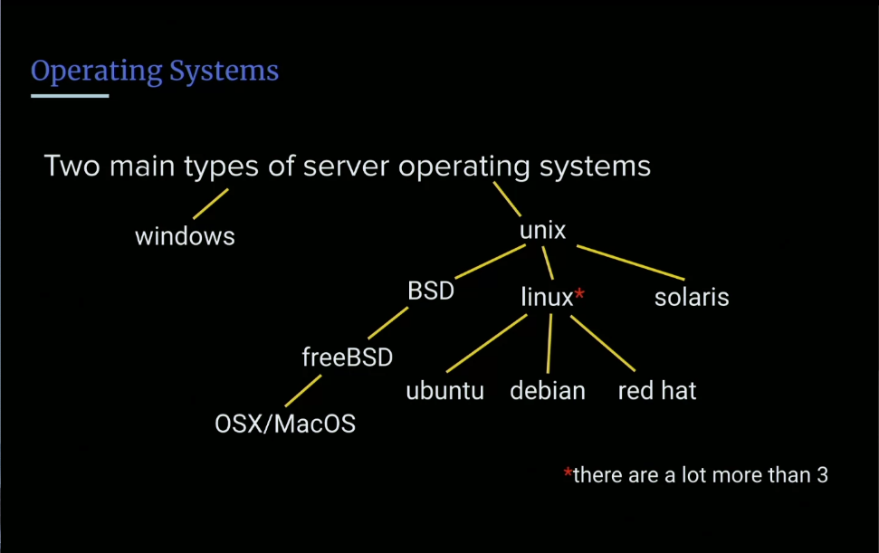
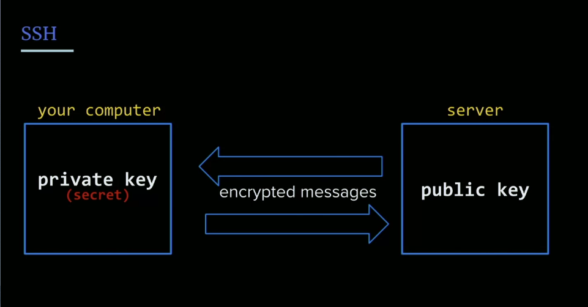
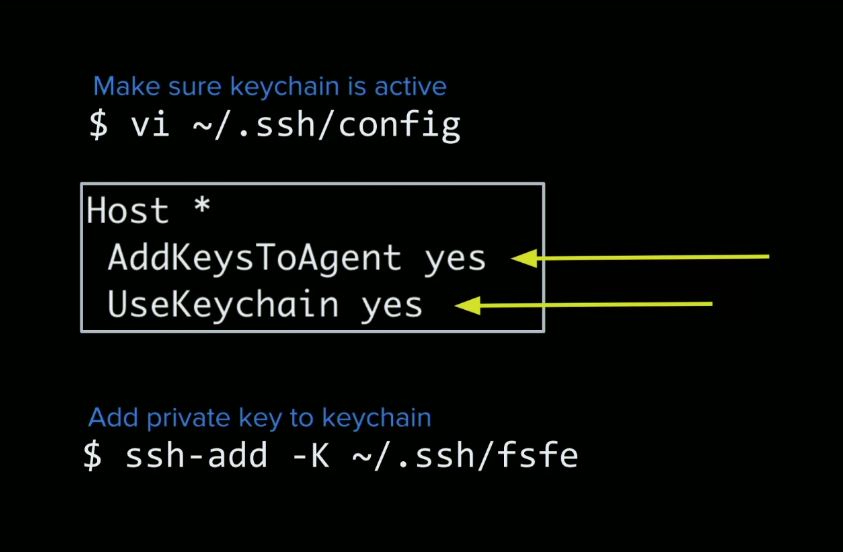

## VIM Overview & Modes
### VIM 
- **VIM:** stands for Vi Improved
    - its one of those meta definitions
- it's a text editor on any servers

- **insert mode**: text editing, `i`
- **command mode**: Primary mode, `esc` 
- **last line mode**: searching, saving, exiting, `:`

How to quit VIM:
`ESC :q!`

VIM Cheatsheet: https://linuxmoz.com/vi-commands-cheat-sheet/

## Server Exercise

### What does a server do?
- it serves content
- it responds to request
- just a computer
- when you are doing local dev, your own computer is a server
- anything that can essentially respond to requests/ server content is a server

## Server Solution
```js 
const http = require('http');

http.createServer(function (req, res) {
        res.write('Hello, World!');
        res.end();
}).listen(3000);

console.log('Server started! Listening on port 3000');
```
- The basics of every single node server you're ever going to use is this callback with request/response. It maybe you might be using promises, you must use `asyn`/`await`, but they are always going to be request/response, and a third paramter is usually next, which is used for creating middleware.

- So again, basic pattern of node servers: resquest, response

- Generally ports below 1000 are reserved
- The internet runs over port 80
- On HTTP the Internet runs over port 443.
 
## Data Centers & the Cloud
- Typically servers are parts of stacks, and they are built in particular ways that consumer grade stuff is not, they are optimized for serving. Optimized for multithreading, forking, and high CPU/RAM stuff.
- Servers typically live in data centers, lots of fans, super clean environment, high security.
- Consume a ton of power.
- **Data centers** are often shared between companies, can rent a fraction of their services, or own the entire center if you're a big enough company.

### The Cloud
Used to be companies ran their own servers, they were in charge of their own hardwaare/software.
- Center could be anywhere in the world now, further away from server the more hops needed to get data.
- least amount of hopes == less places/things to go wrong, and its faster

The great thing about the cloud is : elastic computing.
[**elastic computing**](), Scaling as needed, elastic. You provision for only things youre using/needing. Don't have to buy more and more hardware. Costs can adjust with allocation. Can scale up based on times of years. On demand capacity.

We, as smaller cos/devs, likeyl only need a fraction of a fraction of a server. Today we'll just provision one core.

**Process isolation** Is the idea that the slices of a server can't talk with one another, you wouldn't want knowledge/access to anyone elses slice of the server.

## Virtual Private Server Setup

**VPS:**: Virtual Private Server (chunk of a box of a piece of server)
- When you have a VPS it looks like you have the whole thing to yourself when youre manipulating it, but its just a chunk of a box of a piece of a server.
- This is only possible because of threading and process isolation, and OS being better at managing multiple processes. 

### Buying a VPS
We will be using DigitalOcean for its simplified UI and better UX over AWS. More beginner friendly.

- An **image** is a copy of a base OS a baseline operating system and a baseline CPU stack. 
- You don't have to create a project, can just create a **droplet** the equivalent of an EC2 instance, just a simple VPS. 

## Operating Systems
Why do we choose Ubuntu?
It's linux, its based on the Unix system. 

Two main types of OS, windows and unix based...



Windows has DOS as the underlying shell, whereas Unix, is the baseline system for Ubuntu. Unix is somewhat hard to use, its what the nerds use, we use a flavor called linux which is much friendlier

- Ubuntu is arguably the most popular flavor of linux. There are a ton of different distros. Great thing about linux is its open source.

### Linux 
Linux works on the princple of two things
- **Kernel**: the layer that actually talks to the actual machine hardware
  - CPU, threading, scheduling
- **Utilities**: Tiny little applications that just do one thing. They are utilities and ways of interacting with the kernel and other utilities.

Beauty of linux is that you have utilities that are baked into the kernel, and because utilities are just tiny little appliations they can be updated and not break the kernel. Versus Windows, where everything is baked into the kernel so an utilities updates have to update the kernel/the whole OS.

- Choose standard and data center region closest to you. 

### Long Term Support
- **LTS**: Long term support, if you're building things for production, things that are going to live a long time, you want to choose the LTS version, more stable.

## SSH
It's tempting to use a password, but we want to use an SSH key.

Basically two ways of getting into a server, two ways of authentication: (1)username/password (2)SSH keys

- **SSH**: Secure Socket shell

Much more secure way of logging into your server. It's made up of two parts: public key and private key. SSH keys are also known as **ssh key pairs**.



The connection made between your computer and the server is referred to as a [**pipe or tunnel**](). Everything in your tunnel is encrypted and secure.

- Great one way encryption. Private key never leaves our computer/never leaves the network, even if MiM intercepts traffic, its gibberish without the keys to decrypt. 

## SSH Key Practice
Move into .ssh dir:  
`cs ~/.ssh`
List files:  
`ls`
To generate ssh key:  
`ssh-keygen`

The following command is just going to list things, the | is going to pipe the output using the pipe operator, and grep, a regular expression to find matched file names...  
`ls | grep fsfev2`
```
fsfe <--- private key
fsfe.pub <--- public key
```

Now you add your public key to DO. 

Naming servers is hard, just keep it random, doesn't really matter. Things could change, so random names are just as good. 

### Backups
Good idea to have backups, you want to backup your data, there are fires, hackers, whatver, for this we will be okay. 

## Connecting to the Sever
So once we've generated our servewr, we are given an IP address

Now we want to ssh into our server, by default the user is root the root user.

`ssh root@165.22.140.239`

It will say, hey, Ive never met this server before are you sure you want to connect? Its useful a warning if the SHA signature changed, something might have happened.

Well if we try this, and say yes we will still be denied, that's because the default key pair is id_ssh, it won't match so instead we need to say something that specifies the key using the `-i` flag...  
`ssh -i fsfev2 root@ipaddress` 

You can exit your server by typing `exit`

### Keychain 

Make sure keychain is active
`$vim ~/.ssh/config` 


Then you can manually run the command in the image above to add key to keychain.

Note: for Windows, I need to look up how the keychain config works for windows, otherwise for now just use the full command, `ssh -i fsfev2 root@ipaddress`  to login.

Notice that this `#` in your servers terminal tells us that we are on as the root user. It's pretty dangerous. It will let you do anything without warnings.

## Links 
- [🏠 MAIN](/fsfe-intro)
- [PREV ← | Understanding the Internet](/fsfe-understanding-the-internet)
- [NEXT → | Server Setup ](/fsfe-server-setup)
