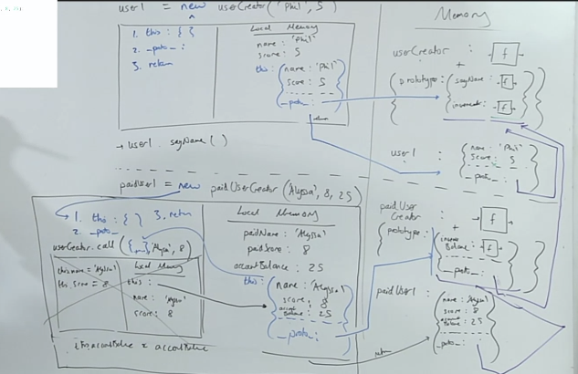

---
title: Subclassing with new and call | Object Oriented JavaScript
date: 2020-03-15
slug: hardparts-OOPJS-subclassing-new-and-call
tags: 
  - FEM
  - Will Sentence
  - OOP
  - Hard Parts
  - classes
  - subclassing
--- 

## Creating an Object with `new`

 

```js:title=subclassing-new-and-call
function userCreator(name, score) { 
  this.name = name;
  this.score = score;
}

userCreator.prototype = function() {
  console.log("I'm " + this.name);
}
userCreator.prototype = function() {
  this.score++;
}

const user1 = new userCreator("Phil", 5);
const user1 = new userCreator("Tim", 4);

user1.sayName();


function paidUserCreator (paidName, paidScore, accountBalance) {
  userCreator.call(this, paidName, paidScore);
  // userCreator.apply(this, [paidName, paidScore]);
  this.accountBalance = accountBalance;
}

paidUserCreator.prototype = Object.create(userCreator.prototype);

paidUserCreator.prototype.increaseBalance = function() {
  this.accountBalance++;
}

const paidUser1 = new paidUserCreator("Alyssa", 9, 25);

paidUser1.increaseBalance();

paidUser1.sayName(); // "I'm Alyssa"
```
We are going to be using `call` to allow us to take control of our `this` assignment inside of `userCreator` for the fact that we are going to use that `userCreator` code again (we don't want to have to write code to reassign `name` and `score`). We want to use this creator function to add those properties but its going to be bit messy because that `userCreator` function required a `new` kewyword which created an object but we're using the `new` keyword over here, in `paidUserCreator` that is creating a different object. How are these going to work together?

Well, what we are going to do is, we're not even going to use `userCreator` with the `new` keyword.

Instead, we are going to use `userCreator`, independent of it, well then what the hell does the `this` refer to? Well, don't panic, we are going to use it with the `.call` that is going to the `this` inside `userCreator` to be the `this` that was auto created object in `paidUserCreator`.
  - They aren't going to be different objects since we are going to use the child's object (`paidUserCreator`) as the object to add to within, `userCreator` by passing in an explict `this` context of the child by calling it with `call`.

Let's quickly just jump into what is going on in our `paidUserCreator` declaration.
- When this function is created, it also creates its object bit as well. That object bit has a property on it called `prototype` which itself holds another object. This `.prototype` object will be available to all future instances of of this object via their respective `__proto__` properties.
- We will need access to those `userCreator` functions as well since we are extending that class.
  - Within that internal `prototype` object there exists the semi-hidden property: `__proto__`
  - The approach Will uses, is: `paidUserCreator.prototype = Object.create(userCreator.prototype);` to completely overwrite the existing object at `paidUserCreator.prototype` by creating a new empty object with `Object.create` and setting the `__proto__` of that object to point to `userCreator.prototype`.
    - Note: you could also say: `Object.setPrototypeOf(pbj, prototype)`, However MDN actually recommends using `Object.create()` since due to how things are optimized in the JS lang, setting `[[Prototype]]` is actually a very slow operation.
- Next we want to make sure we want the sub-class gets its new functionality so we assign it to the `paidUserCreator.prototype`.

- We are using our parent class not in the context of 

## Using a `call` Method in a Constructor
So let's address the hardest bit to kind of walk through which is this little bit using `call`

```js
const paidUser1 = new paidUserCreator("Alyssa", 9, 25);
//... 
function paidUserCreator (paidName, paidScore, accountBalance) {
  userCreator.call(this, paidName, paidScore);
  // userCreator.apply(this, [paidName, paidScore]);
  this.accountBalance = accountBalance;
}
```
When we are in the execution context of our paidUserCreator, and we hit the line where we are invoking a function with `call`, 
- This is one of the more puzzling bits since we are calling the `userCreator` function but not direclty with parens, we're not calling it with the `new` keyword. It should have a `new` keyword, right, because that's what the `this` is going to refer to in the auto created object, but instead we are going to say, "nah, we don't want it to refer to a different auto created object. We want it to refer to the auto-created object of the child, created by `paidUserCreator`, so we can add properties to it to extend it as a subclass.
  - we want to be able to then be able to use the `new` keyword with `paidUserCreator` so we automatically get that object created with the properties that `userCreator` would produce in addition to the ones we add to `paidUserCreator`
- the `this` that gets passed to `userCreator` as the first argument when we invoke it with `call` is simply a pointer to the outer `this` context. 
- It's helpful to renmember that the two `this`s refer to different things, the `this` inside of `userCreator` is a different this that is inside of `paidUserCreator`, they are both pointers but to different objects, since this is holding a reference it has to go and look up.

## Assigning Properties to instance
- I think it is important to note that this is a side-effect, from within the userCreator, because we're not returning anything out, because we are changing stuff on a reference to an outer object (`this` context of `paidUserCreator`). 
- We didn't need a return, emphasizes how its already kind of like side-effecting or mutating the outer object by adding to it the properties of `userCreator`.
  - this is going to let `super` know what it needs to go run, and that is the `userCreator` function to create itself.
  - If you overwrite `__proto__` in this `paidUserCreator` function, it's going to freak out, like if you set it to `null`, `super` isn't going to do anything.

## Prototype Tracing

- The diagram above documents flow up until we call `paidUser1.increaseBalance()`;


## Links 
**Related:**
- [`this`, classes, `new`, objects, factory functions, proto/prototype](/hardparts-js-v2-classes-and-prototypes)
-----------
**Nav:**  
- [MAIN | Intro](/hardparts-OOJS-main)
- [PREV ← | Subclassing with Factory Functions ](/hardparts-OOPJS-subclassing-with-factory-functions)
- [NEXT → | Subclsasing with class, extends, and super](/hardparts-OOPJS-subclassing-with-class-extends-super)