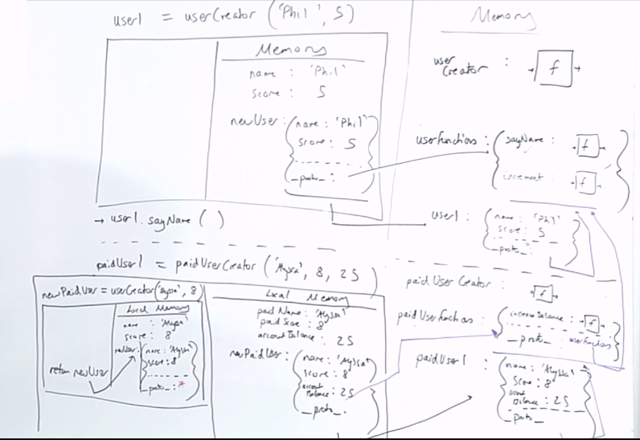

## Summary Questions
1. What is the gist of subclassing?
2. How do we use `Object.setProtoTypeOf()`? When would we use it and what purpose does it serve?
3. Walk through how we would implement subclassing with factory functions without the `new` keyword...
4. `this` in a method always refers to what? Unless we use what to call the function? What is the purpose for doing so?
5. What is the difference between `.call` and `.apply`? And how are they both used?

## Intro to Subclassing and Inheritance


Note: Error on the slide; The `bonusScore` under paid user should be `accountBalance`

This proto/prototype lookup ability is what JS does to enable extensibility of its own functions and objects. What this means is that we can leverage that same principle/dynamic ("prototypal inheritance") and in an OOP style, "subclassing", to pass knowledge or work that's been previously written, down to a child of that class.

>- **subclassing**: creating a sub-version, a slightly more specific notion of a class, of an existing class. It's extending the functionality of that parent class for a more specific use-case.[^1]

The semnatic beef with the word "inheritance" is that it implies that all those "traits"/functionality also live on the object itself. That's not the case, they only have links to other objects.

## Create object with Factory Functions


- This is a factory function of us doing everything manually, fine-grained control, no `new` keyword.

## Create a Sub-Factory Functions
```js:title=sub-factory-functions
function userCreator(name, score) {
    const newUser = Object.create(userFunctions);
    newUser.name = name;
    newUser.score = score;
    return newUser;
}

userFunction = {
    sayName: function() {
        console.log(`I'm this ${this.name}`);
    },
    increment: function() {
        this.score++;
    }
}

const user1 = userCreator("Phil", 5);
user1.sayName(); // "I'm Phil"

function paidUserCreator(paidName, paidScore, accountBalance) {
    const newPaidUser = userCreator(paidName, paidScore);
    Object.setProtoTypeOf(newPaidUser, paidUserFunctions);
    newPaidUser.accountBalance = accountBalance;
    return newPaidUser;
}

const paidUserFunctions = {
    increaseBalance: function() {
        this.accountBalance++;
    }
};

Object.setProtoTypeOf(paidUserFunctions, userFunctions)
const paidUser1 = paidUserCreator("Alyssa", 8, 25);

paidUser1.increaseBalance();

paidUser1.sayName(); // "I'm Alyssa"
```
- Here's our dream: that we can create an object, `paidUser1` that can use all of the properties of a user plus the  
bonus property, while a regular user wouldn't have access to a bonus property.
- So wouldn't it be nice if the `__proto__` (the place JS goes to look for functionality) of `paidUserFunctions` had a link up to `userFunctions` so it still have a link up to the same set of shared functions.

`Object.setProtoTypeOf` takes in as it's first argument, an object, and then as it's second argument, whatever you want to set `__proto__` to of that first argument, in our case in the above it would be: `Object.setProtoTypeOf(paidUserFunctions, userFunctions)`
    - It's called `setProtoTypeOf` because technically, they call anything that's referenced from `proto` the "prototype" of this object, but it's referenced through something called `__proto__` this can be confusing since it's actually setting the `__proto__` property. It's explicitly not setting a property called prototype, its explicitly setting a property called proto. (This is because in the spec proto is actually called [[prototype]] which isn't very helpful )

## Creating an object with a Sub-Factory Functions
So on line 34 in the above, we are creating a new `paidUser1` which we don't yet know the value of because we need to call that `paidUserCreator` function first.   
- add to call stack, new execution context
- args set to param names
- then first line we are declaring a const `newPaidUser` which will be the result of a function called of `userCreator`, with the args pulled from the outer function.
    - So here is where it's interesting, when we are creating this `newPaidUser`, from `userCreator` (since we already have a class for that), it's internally setting the `__proto__` of this `newPaidUser` to the default pointer to `userFunctions` because of the `Object.create(userFunctions)` from Line 2. Well this is a paid user, and we don't want that so we may need to switch out the `__proto__` for the right set of functions.
    - so after this object is returned...
- We need to override the `__proto__` assignment of the newly created `newPaidUser` object to correctly point to the `paidUserFunctions` store first so we say.... `Object.setProtoTypeOf(newPaidUser, paidUserFunctions);`

>* **We use the `Object.setProtoTypeOf()` (more accurately its setting the `__proto__` property of), to adjust where the prototype chain should look up first for its functionality. We use it by passing it two arguments: the first is the object whose `__proto__` property we want to "set", and the second is the place to look for functionality first.**[^2]



## Prototype Lookup
Can `paidUser1.sayName()` still access the `userFunctions` functionality? Yes, via it's prototype chain, where its not immediately found in `paidUserFunctions`, so it looks for it in `userFunctions`.

This is THE way of how subclassing works at its most fine-grained level, everything else, like new and classes are abstractions on top of this as we will later see with the `extends` and `super` keyword.

## Subclass Review
>- So even though we aren't yet using the `class` keyword, we would still consider this "**subclassing**" even though it's making use of factory functions and no `new` keyword. We are still creating an object from another object without rewriting all of its functionality from scratch or duplicating it and then extending it, we are instead, calling it (the parent class) within a factory function of the exteder/child/sub-class and adding more specific data/functionality to that object.
- In the example above, we are creating two factory functions and two function stores
- We made explicit to set the proto of our second function store to "inherit" from the first.
- We call one factory function within another to extend its functionality and then make sure to override that produced object's `__proto__` property to the correct first stop: its own function store.[^3]

### Interlude - We have another way of running a function that allow us to control the assignment of this
```js
const obj = {
 num: 3,
 increment: function(){this.num++;}
};
const otherObj = {
 num: 10
};
obj.increment(); // obj.num now 4
obj.increment.call(otherObj); // otherObj.num now 11
// obj.increment.apply(otherObj);
```
> `this` always refers to the object to the left of the dot on which the function (method) is being called - unless we override that by running the function using `.call()` or `.apply()` which lets us set the value of this inside of the `increment` function. 

> - We need to know that we can control how we call functions using other techniques besides just grabbing the function's identifier and throwing parentheses on the end of it to call it. Well, we can actually use a few built in controls to do this...`call` and `apply`.[^4]

What we want to accomplish is being able to take control, inside of the functions *execution context*, of the `this` assignment. Now we sort of saw this with the arrow function, but we weren't really taking control, we were just saying, don't have the `this` be defined by where the function is being called but have it instead be defined by where the function was first stored and saved. 

`call` and `apply` will give us the ability to manually control what the `this` will refer to.

## Call and Apply
```js
const obj = {
 num: 3,
 increment: function(){this.num++;}
};
const otherObj = {
 num: 10
};
obj.increment(); // obj.num now 4
obj.increment.call(otherObj); // otherObj.num now 11
// obj.increment.apply(otherObj);
```
- We still have that *implicit parameter* of `this` when we are in the execution context of `obj.increment()` 
    - that `this` is set to whatever is to the lefthand side of the `.` , in this case `obj`

Well what if we want to call `.increment` on our other obj? What can we do?

- Well it turns out there is a way of running a function other than putting parens at the end of it's name, if we use `call`.
    - We pass in as the first argument, to be whatever we want the `this` inside of that function to refer to.
    - No more, automatically referring to the left of the dot or the lexical with arrow functions. Instead, we are going to take control of what the `this` assignment is going to be, by manually using `call`.
    - Note: any arguments we might want to pass in, are just passed in as further arguments. The first one is the most important, as its our `this` assignment. 

So when we go to `obj.increment.call(otherObj)`:

1. We look for `obj` in global memory where it is found as is the `increment` method directly on that `obj`. 
    - It then looks for `.call` on that `increment` function/object combo where it isn't found, but checks the `__proto__` property of that function/object combo, where it looks up to `Function.prototype` where it finds `call`.
2. We find that `call` on `Function.prototype` and execute it adding it to the call stack, and starting a brand new execution context:
    - our `this` keyword when we run a functoin using the `call` approach is the argument we pass into `call`, which is `otherObj`. So we now run the body of increment, 
        - so the `this.num++` is going to be otherObj and  we increment it .

We manually took control of our functions, exeuction context, `this` assignment, no more assignemnt we manually took control of it.


>* `apply` behaves very similarly, we could similarly swap out `call` for `apply` and this is identitcal.
- The only difference between `call` and `apply`, is that if our function (`increment` in this case) is expecting inputs, with `call` we would just say `.call(otherObj, arg1, arg2, arg3)` whereas with `apply` we put all those arguments in as an array... `.apply(otherObj, [arg1, arg2, arg3])`[^5]

## Links 
**Related:**
- [`this`, classes, `new`, objects, factory functions, proto/prototype](/hardparts-js-v2-classes-and-prototypes)
-----------
**Nav:**  
- [MAIN | Intro](/hardparts-OOJS-main)
- [PREV ← | Default Prototype Chain ](/hardparts-OOPJS-default-prototype-chain)
- [NEXT → | Subclassing with new and call](/hardparts-OOPJS-subclassing-new-and-call)