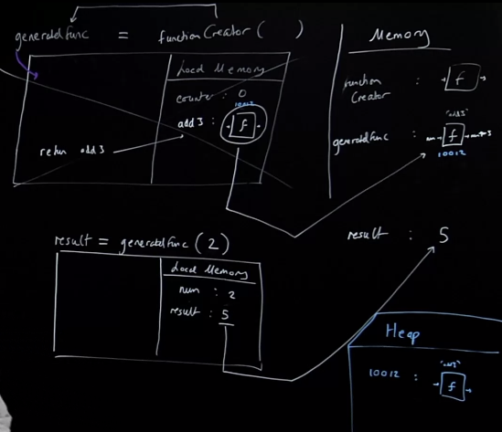
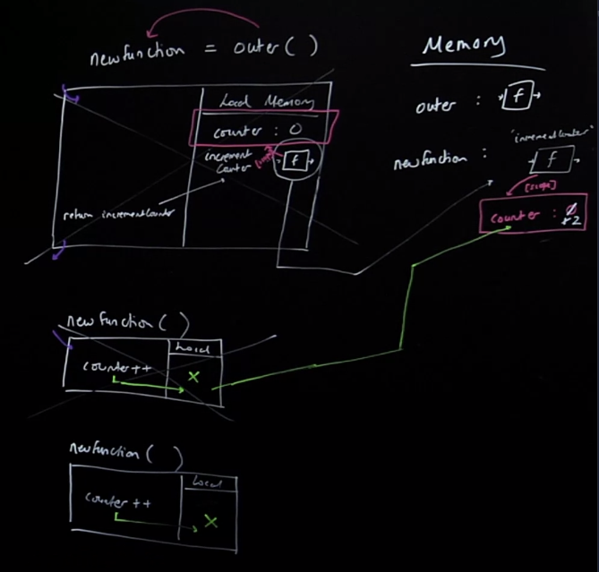

## Closure

```js
const multiplyBy2 = x => x*2
const add3 = x => x+3
const divideBy5 = x => x/5
const subtract4 = x => x-4

const reduce = (array, howToCombine, buildingUp) => {
    for (let i = 0; i < array.length; i++){
        buildingUp = howToCombine(buildingUp, array[i])
    }
    return buildingUp
};

const runFunctionOnInput = (input,fn) => { return fn(input) };
const output = reduce([
        multiplyBy2,
        add3,
        divideBy5,
        subtract4
    ],
    runFunctionOnInput, 11
);
``` 
Again, our dream is to be able to list off our lines of code, by name and say go now, run them, one by one and take the input 11 for the first one and have its ouput of that first line only be affecting, only locked into, only affect the very nature of `reduce`, only be affected in the next line out by `add3`, etc.

And btw, given its only effect is the next line there's no need for me to state arguments, we're going to auto run that function under the hoode through the help of `reduce`. 

[^ **What is a problem we encounter if have `reduce` running our functions for us in point free style?**]The problem is therefore, we're not gonna have control over the inputs that we pass the function, like what if add3 required two arguments? This wouldn't work.

### Closure
- Most esoteric concept in JavaScript
- Functions are our units to build with but they’re limited - they forget everything each time they finish running - with no global state
- Imagine if we could give our functions memories

### Reminding ourselves of how functions actually work
```js 
const multiplyBy2 = inputNumber => inputNumber*2;
const output = multiplyBy2(7);
const newOutput = multiplyBy2(3);
```
No memory of the previous execution - imagine if we could give our functions permanent memories. 

**It begins with returning a function from a function**

## Closure Under the Hood

### Let's call (run) our generated function with the input 3
```js 
const functionCreator = () => {
    let counter = 0
    const add3 = (num) => {
        const result = num+3
        return result
    }
    return add3
}

const generatedFunc = functionCreator()
const result = generatedFunc(2) //5
``` 
- Remember, this is a one time running of `functionCreator`, whose output is going to give us a function that we can use that use closure over it's creation environment, or "closed over variable environment", so that its preserves the surrounding context, for thing like `counter`. 
- when we are returning `add3`, remember, return just looks for that function label in local memory and returns the function definition to be returned and stored in a new label, we don't care about the `add3` label at all anymore.
- Remember we the entire function body is sored in `generatedFunc`, but for us as developers, our eyes, go back up to read `add3` to remember what it was doing, JS is definitely not doing that, everything it needs was returned to it and stored in `generatedFunc` (including its closure over that local environment, however in our example we don't interact with counter, so I believe it gets GC'd and not added to the [[scope]] property, I could be wrong, but either way we can't interact with it).

## Closure Clarifications
Bonus: In JS, functions, objects, and arrays, anything thats not a primitive, they aren't stored directly in our tightly controlled direct global memory, instead they're stored in: the **Heap**. This is going to be a very simplified coverage of this topic because we don't interface with the Heap directly.

The **heap** is a very flexible, messy, kind of put-anything-in-there memory called the heap. 

> [^ **What is the Heap?**][**Heap**](): a much larger part of the memory that stores everything allocated dynamically, that allows a faster code execution, and protects if from corruption and makes the execution faster. 

> And it's in the Heap, where we store, something like `add3` which isn't stored directly in that local memory of `functionCreator`, instead its stored down in the Heap. It's not the global memory its a different store of memory. So when we are using it in `functionCreator`, we actually are just storing an address to a position in the computers memory (in the heap) where the funcion is actually stored. 

When we eventually return "add3" we are just returning the address in memory for that function, it's label add3 only exists within that local memory of `functionCreator`'s execution context. 



## Inner Function 
Calling a function inside the function call in which it was defined
```js
const outer = () => {
    let counter = 0;
    const incrementCounter = () => {
    counter ++;
}
    incrementCounter();
}
outer();
```
What determines what data your function have access to when you call the function? Where we call it? Is it the fact that we look to the outer scope? Well, what if we simply returned `incrementCounter`?

## Outer Function

### There is a way to run a function outside where it was defined
Without an error - we return the inner function and assign it to a new global label
```js
const outer = () => {
    let counter = 0;
    const incrementCounter = () => {
        counter ++;
    }
    return incrementCounter
}
const newFunction = outer();
newFunction()
newFunction()
```
Now we can call the function that was originally saved as incrementCounter by its new global label `newFunction`
- We get persistent data attached to the function that is returned, stored in a "backpack"



When a function is defined, it gets a bond to the surrounding Local Memory (“Variable Environment”) in which it has been defined 

### The ‘Backpack’
1. When `incrementCounter` is defined, it gets a bond to the surrounding Local. Memory of live data in outer in which it has been defined
2. We then return `incrementCounter` out of outer into global and store it in `myNewFunction`
3. BUT we maintain the bond to the surrounding live local memory from inside of outer - this live memory gets ‘returned out’ attached to the `incrementCounter` function definition and is therefore now stored attached to `myNewFunction` - even though outer’s execution context is long gone
4. When we run `myNewFunction` in the global execution context, it will first look in its own local memory for any data it needs (as we’d expect), but then in its ‘backpack’ before it looks in global memory

What’s the official name for the ‘backpack’?

## Closure Clarification & Review

### The Closed over Variable Environment (COVE) or ‘Closure’

This ‘backpack’ of live data that gets returned out with incrementCounter is known as the ‘closure’

The ‘backpack’ (or ‘closure’) of live data is attached incrementCounter (then to myNewFunction) through a hidden property known as [[scope]] which persists when the inner function is returned out

Will prefers the names...
- **PLSRD: Persistent Lexical Scope Refereced Data** for the backpack that contains the "remembered"/attached state.
- **COVE: Closed Over Variable Environment**, for the state that gets "closed over" and returned as the backpack or the PLSRD.

But both things are considered **closure**, more colloquially.

**Lexical scoping** is the feature of JS that lets us keep attached data to the function of where it was saved. It enables closure to exist.

### Closure in functional JavaScript
- Easier to add features - Our functions can now have persistent permanent memories attached to them - it’s going to let us build dramatically more powerful functions
- Easier to debug - Definitely need to know how it’s working under the hood!

In functional programming, we want every function call to be independent, meaning if we are running a function and then runnning it again and its get a protected memory inside the function execution context, we're still basically making our functions have side effects, because we can't look at that function on that line and known exactly what they're doing.

There's two things to say about this: in the strict implementation of closure in functional programming, we actually fix this data that it can't be changed, and thereforew all we really have is a permenant, persistent store of data here, we're never interacting with again and changing, meaning our functions are still pure.

Second, functional programming is not strictly implemented in JS end to end, meaning even if we don't perfectly conform to every single piece of it even this move, that makes our functions more useful, still leaves them contained/not affecting global memory, this is still moving us in the direction of functional programming.

## Links

- [HP v2: Closure](/hardparts-js-v2-closure)
---- 
**Nav**:
- [🏠 MAIN](/hardparts-functional-main)
- [PREV ← | Purity & Immutability ](/hardparts-functional-purity-immutability)
- [NEXT → | Function Decoration & Partial Application](/hardparts-functional-decoration-partial-application)

## Summary Questions