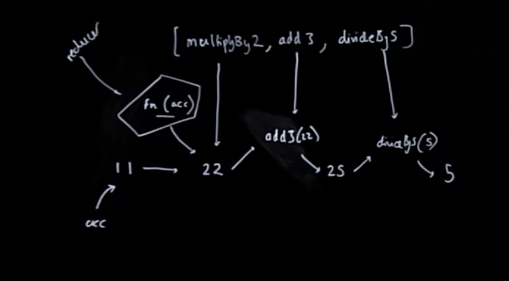
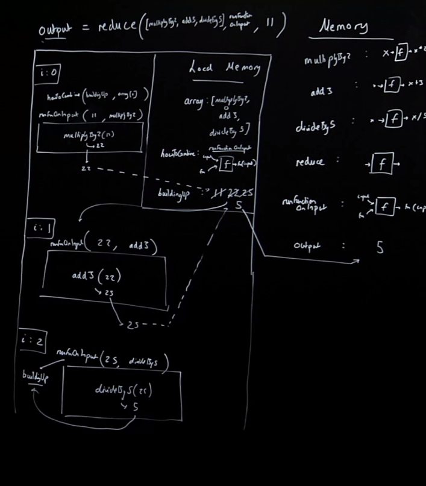

## Function Composition

### Function Composition
> [^ **What does method chaining with dots rely upon to function?**]Chaining with dots relies on JavaScript's prototype feature -- functions return arrays which have access to all the HOFs (`map`,`filter`,`reduce`)
- I'm passing my ouput into the next function automatically
- [^ **⭐ What is the short-coming of chaining?**]⭐ What if I want to chain functions that just return a regular output?
    - e.g. `multiplyBy2`, `add3`, `divideBy5`
    - We can't say something like `2.multiplyBy2()` to get `4`.  

>[^ **What might be two solutions we could try if we wanted to "chain" or incrementally run-functionality-on a continuous result of regular outputs? Why do these solutions fall short?**]
1. You could try storing results into global variables that you do end up passing into ensuing functions.  
2. Or we could, use the fact that JS evaluated every function call before it moves on, by wrapping success outputs of functions into other functions...e.g. `divideBy5(add3(multiplyBy2(11)))`  
- The first solution is untenable because its polluting the global memory and things can easily be written over, it's also not that readable. The second solution is also not very readable and can get out of hand quickly.

### We could keep track with global variables...
```js
const multiplyBy2 = x => x*2;            
const add3 = x => x + 3;
const divideBy5 = x => x / 5;

const initialResult = multiplyBy2(11);
const nextStep = add3(initialResult);
const finalStep = divideBy5(nextStep);

console.log("finalStep", finalStep)
```

But that’s risky, people can overwrite.

Our `multiplyBy2(11)` call is [**referentially transparent**](), meaning I could essentially pass in 22 and the evaluated result of this function and they will be the same thing.

### Or we can use the fact the JavaScript evaluates every function call before it moves on...
```js
const multiplyBy2 = x => x*2
const add3 = x => x+3
const divideBy5 = x => x/5
const result = divideBy5(add3(multiplyBy2(11)))
```
Now this is pretty unreadable though!
> [^ **What does *referentially transparent* mean and what does it allow us to do?**](Btw This relies on our functions being [**referentially transparent**]() - we can replace the call to the function with its return value with no consequences on our app). 

So what are we doing here ultimately? We are combining a number (the result of `multiplyBy2(11)`) or 22, with add3, which becomes 25, then we are combining 25 with divideBy5 to get 5. Again, we are combining two things to make one incrementally...

**We’re combining a function with a value to get a result then combining that result with another function to get another result and so on... What's this remind you of?**

### Reduce as the most versatile function in programming
```js
const multiplyBy2 = x => x*2
const add3 = x => x+3
const divideBy5 = x => x/5
const reduce = (array, howToCombine, buildingUp) => {
    for (let i = 0; i < array.length; i++){
        buildingUp = howToCombine(buildingUp, array[i])
    }
    return buildingUp
};
const runFunctionOnInput = (input,fn) => {
    return fn(input)
}
const output = reduce([multiplyBy2, add3, divideBy5], runFunctionOnInput, 11)
```
- Just doing the same thing, combining two things to make one thing, but the rule for combining them is going to be somewhat sophisticated, we're going to pass in `runFunctionOnInput` but it's going to combine by taking in, our `buildingUp` which was our intial inputs for the first function... let's build this out... 

## Function Composition with Reduce

Fun fact: Redux and how redux uses reducers, is essentially this under the hood...
```js
const multiplyBy2 = x => x * 2
const add3 = x => x + 3
const divideBy5 = x => x/5
const reduce = (array, howToCombine, buildingUp) => {
    for (let i = 0; i < array.length; i++){
        buildingUp = howToCombine(buildingUp, array[i])
    }
    return buildingUp
};
const runFunctionOnInput = (input,fn) => {
    return fn(input)
}
const output = reduce([multiplyBy2, add3, divideBy5], runFunctionOnInput, 11)
```
[^ **So what is the better, cleaner, more readable way of creating these kind of linked/chained progressive building of values?**]So instead of *chaining* and passing the result through chaining, we're going to instead call it **compose**. We are [**composing**]() or joining them up. Function composition is going to help us organize our functions into buildable little blocks, where we can write a rule for how those functions interact with an accumulated value/object.

We are taking our initial value, `11`, and combining it with `multiplyBy2`, which gives us `22`. 

Who ever thought of the notion of combining, reducing from two to one that actually a function defintion is a thing, a number is a thing or an input is a thing, combining them to produce one thing; when two becomes one. 

Anyways, what is the rule here, it's our first function, our **reducer** and its running `multiplyBy2` on our **accumulator** and taking the output of that and that's our combined value. We are taking that value and combining it with another function `add3`.


*Correction in the diagram: the `divideBy5(5)` should be `divideBy5(25)` to output 5.*

> Notice how flexible `reduce` is. It doesn't mind if instead of taking in an array full of numbers and another number and combinining it with another number, but instead we simply have a function combined with a number and returning a number. It just depends on whatever the rule we define as our reducer.

> [^ ⭐ **Why must we remember when writing our reducer/function "rule"?**]⭐ Our rule for reducing, our reducer, which is a function has to be **super generic**, right, even though in our case we are running a function on a value inside of our reducer rule, we wouldn't always be doing so, we need the "wrapper" function of the reducer to dictate how the two things should be combined, because we might not always want to have our rule be: combine a function with a number, it could be combine a number with another number or some other kind of operation that we leave open ended to make our other future functions more composable.

Reduce is truly the most versatile function. The simple process of data reduction, two things to one is so incredibly powerful, that it underpines most of the functionality in the rambda lib.

1. Declare all our functions in global memory
2. declare const output, which doesn't yet have a value bc we need to first run reduce.
    - reduce gets passed an array of functions as its first arg, its second arg is our reducer rule, `runFunctionOnInput`, then then the third arg is the thing in which we are going to combine our reducer with, our accumulator which is 11.
    - brand new execution context
    - local memory: parameter labels assigned their values from arguments
3. for loop: let i = 0, , first loop, we get runFunctionOnInput(11, multiplyBy2) whcich returns multiplyBy2(11) which is going to be our output for `buildingUp`, we update `buildingUp` to 22.
    >[^ ⭐ **Talk about the difference between _equality_ and _assignment_ when it comes to the `'='` in programming.**] ⭐ remember, when you say something like `num = num + 2`, everything in math says this is wrong, but in programming the equals does not mean **equality**, it means **assignment**, it means do the right-hand side and assign the result to the left hand side.
4. for loop: let i = 1,  we are combining 22, and add3, we are combining it using the rule `runFunctionOnInput`, inside that function we return out 25 and return out to `buildingUp`
5. for loop: let i = 2, we are combining 25 and `divideBy5`, with the rule `runFunctionOnInput`, whose result is stored on `buildingUp`. We go into it, get the result 5 which returns out to ultimately ouput.



## Function Composition Review
Q: Why were input an fn ordered this way? Where the fn is the second paramter?
A: Well because the way reduce works is the first thing you pass to the reducer function, the function that combines from two to one, from two to one, the first thing you pass is *always the accumulator* and the second thing, and you want reducer to be able to work on any scenario, but it does lead you have to kind of flip these, but its because we are also staying in line with our `howToCombine` function. We are just staying consistent with how the default JS reduce works, so that's why we are having input precede fn in our `runFunctionOnInput`.

> [^ **How do we deal with things like *multiple arity*?**]Q: What if our functions have [**multiple arity?**](), meaning what if one of our functions here expect more than one input, the way this is set up is, we're prescribed how these functoins are going to be run. Reduce is just going to take them with our `howToCombine` rule, on ONE input, not going to be multiple, if something needed multiple, this would break entirely...

> This is where, in the end, functional programming techniques: monads, partial application, currying. All of them really come down to trying to solve the problem where if you're listing out functions, little blocks of code to auto run one after another, and you're not calling them yourself, you're relying on constructurs like reduce to call them. You need to make sure that they behave in a vewry predictable manner. 

That's really what everything else in functional programming is about, to ensure the consistency of our expectations where we can list off line of code line of code with predtictable inputs/outputs.

#### Listing out our ‘lines of code’ (functions) by name with each one’s consequence limited to only affect the next ‘line’ (function call/invocation)
```js 
const multiplyBy2 = x => x*2
const add3 = x => x+3
const divideBy5 = x => x/5
const subtract4 = x => x-4
const reduce = (array, howToCombine, buildingUp) => {
    for (let i = 0; i < array.length; i++){
        buildingUp = howToCombine(buildingUp, array[i])
    }
    return buildingUp
};

const runFunctionOnInput = (input,fn) => { return fn(input) };
const output = reduce([
        multiplyBy2,
        add3,
        divideBy5,
        subtract4
    ],
    runFunctionOnInput, 11
);
``` 
- In the above, we added another function and gave things more white space so you can really feel how functional programmer might write this. Which is each line is an isolated independent task, whose only output is passed via inside `reduce` passed to the next function.

It may look a little strange at first, but once you get used to this structure, being able to list out our tasks, but their human readable name, and our starting value, and then just knowing we are going to go one after another after another, this makes our code profoundly more readable.

> [^ **What is the most significant functional programming tool: `compose`/`pipe`, doing under the hood?**]Now, we don't use the `reduce` function directly to do this, we use a function called `compose` or `pipe` both of which pass through functions one by one by one. What are they doing under-the-hood? They are running our good friend `reduce`.

Even `compose`, the most significant programming tool in functional programming tool, this (reduce) is what's going on behind the scenes.

### Function composition
>[^ **What are the benefits of this function composition style?**]Some of the benefits are... 
- **Easier to add features** - This is the essential aspect of functional javascript - being able to list of our units of code by name and have them run one by one as independent, self-contained pieces
- **More readable** - reduce here is often wrapped in compose to say ‘combine up’ the functions to run our data through them one by one. The style is ‘point free’
- **Easier to debug** - I know exactly the line of code my bug is in - it’s got a label!

## Key Insights

- The main short coming of chaining is that we can't really chain things whose operations return regular values like ints.
    - We can't say something like `2.multiplyBy2()` to get `4`.  

- I think before this course, I was primarily thinking of functional programming as these kinds of HOFs, on arrays, and I've always wondered how you might be able to leverage the power of these functions on operations outside of just arrays.

- On the equality versus assignment of the equals sign. Will explainined this in a way that solidified this for me, I guess I never realized that I saw it somewhat ambiguously until I 

- Really hammering home the elegant simplicity of the "two become one" idea and the concept of combining two things to become one thing isn't limited by what "type" (fn, int, string, etc...) the two values can be because we can simply write the rule as a function for how those two things can be combined.


## Links

- [HP: functions and callbacks](/hardparts-js-v2-functions-and-callbacks)
---- 
**Nav**:
- [🏠 MAIN](/hardparts-functional-main)
- [PREV ← | Map & Reduce](/hardparts-functional-map-and-reduce)
- [NEXT → | Purity & Immutability ](/hardparts-functional-purity-immutability)

## Summary Questions