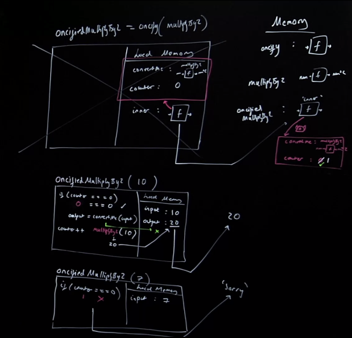
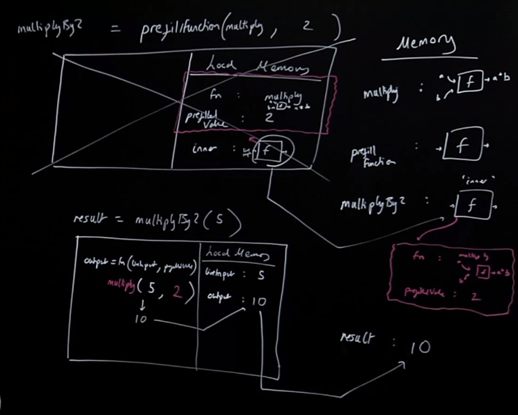

## Function Decoration Introduction

### Functional Decoration
- Now we can convert functions more easily to make them suit our task
- Without writing a new function from scratch
- We can run code on other bits of code to appear to change them

> [^ **In our previous example, using Higher-Order Functions, how did we kind of leave room for functionality to be determined later?**]Remember in our HOF we had to leave little placeholders for that functionality, like in map, we specify how I want to hit each element of the array. But sometimes we want to edit functions where we haven't left placeholders, instead we we want to retroactively give them new functionality.

The problem with this though is, can we edit a function's body after we've saved it? No. Once a function's been saved we can't go back in there and interact with it, it's set.

> [^ **What's a rough definition of *function decoration?* What are its benefits?**] So instead, we are going to use **function decoration**,it's going to appear to edit functions, but its actually instead going to create new functions, where the function we want to edit is somehow inserted in such that when we run the new function its going to appear to be running our function and with slightly different behavior. It's benefits again, are code reusability, the ability to seemingly modify functions after they've been written and change their behavior to better fit our use case.

#### To add a permanent memory to an existing function we have to create a new function that will run the existing function inside of itself
```js 
const oncify = (convertMe) => {
    let counter = 0
    const inner = (input) => {
        if (counter === 0){
            const output = convertMe(input)
            counter++
        return output
        }
        return "Sorry"
    }
    return inner
}
const multiplyBy2 = num => num*2;
const oncifiedMultiplyBy2 = oncify(multiplyBy2);

oncifiedMultiplyBy2(10) // 20
oncifiedMultiplyBy2(7) // Sorry
``` 
- Can we give a function a backpack after we've saved it? Absolutely not. The only way is if we've saved it inside of another function and returned it out. So if we didn't do that, how could we give it a permenant memory?
- For instance, memoization, limiting a function to run it one time.
- We are passing in an existing function to another function that will wrap it with a brand new function with that backpack. It's still going to behave like `multiplyBy2`, but in reality we've extended/modified it to have some memoization-like feature.
- remember in order for a function to know its already been run, it needs the backpack/closure.
> [^ **What is going to be the super powerful feature of JS that allows us to decorate our functions?**]Closures are going to be the super powerful feature that allows us to "decorate" our functions.

## Decorating a Function
```js 
const oncify = (convertMe) => {
    let counter = 0
    const inner = (input) => {
        if (counter === 0){
            const output = convertMe(input)
            counter++
            return output
        }
        return "Sorry"
    }
    return inner
}
const multiplyBy2 = num => num*2;
const oncifiedMultiplyBy2 = oncify(multiplyBy2);

oncifiedMultiplyBy2(10) // 20
oncifiedMultiplyBy2(7) // Sorry
``` 
`const oncifiedMultiplyBy2 = oncify(multiplyBy2);` You might be inclined to think this is "mutating" `multiplyBy2`, but remember we can't edit functions, what's really happening is that we are essentially wrapping this function with more functionality.

- `inner`'s only job is to determine by looking in its backpack (by its new name `oncifiedMultiplyBy2`), is to see if its allowed to run from `multiplyBy2` function based on the conditions of the `if`.
> [^ **When we are decorating a function what are, at minimum the two things that we want in the closure surrounding the function to be decorated?**]So in that backpack is the function we want to "convert" and its the counter that is going to allow use to keep track of whether multiplyBy2 has been run before. Backpack contains: fn to "extend"/modify and some value/data to assist in the extension of the modifying function. 

## Invoking a Decorated Function
```js 
const oncify = (convertMe) => {
    let counter = 0
    const inner = (input) => {
        if (counter === 0){
            const output = convertMe(input)
            counter++
            return output
        }
        return "Sorry"
    }
    return inner
}
const multiplyBy2 = num => num*2;
const oncifiedMultiplyBy2 = oncify(multiplyBy2);

oncifiedMultiplyBy2(10) // 20
oncifiedMultiplyBy2(7) // Sorry
``` 
When we are invoking it, `oncifiedMultiplyBy2(10)`, the function we are really running is actually the function formally known as `inner`, thank goodness we are because `inner` has it the backpack to keep track of how many times its run.

We are "editing" our function to make it more reusable in new situations.

> [^ **Write/talk-through writing your own oncify function that "decorates" another function to only allow it to run if it hasn't been run before**]What are we going to pass into `convertMe`, which is `multiplyBy2`? `10`, which comes from `oncifiedMultiplyBy2` direct exeuction context.  
- We're going to grab it straight from there, so, the functionality that we're going to run that's to be oncified came from the backpack
- The condition under which we were gonna confirm we're allowed to run it came from the backpack
- And then, the thing we're goign to run `multiplyBy2` came dynamically live in as the input to our pretend `oncifiedMultiplyBy2` function.
- If you think its just `multiplyBy2` being run, nope, it's being passed through a layer into a running of `multiplyBy2` inside of `oncifiedMultiplyBy2`. 
    - This is known as decorating the function, which we got from the backpack/closure
- When we run it again, and do a new execution context, this time we hit the "failing" condition, which fails.



## Function Decoration Review

### Function decoration
- **Easier to add features** - We can ’pseudo’ edit our functions that we’ve already made - into functions that behave similar but with bonus features!
- **Easier to debug** - Definitely need to know how it’s working under the hood!

Because we are all about composing tiny little functions. This let's us reuse functions where possible to use in new situations. 

## Partial Application Introduction
Going back to our much earlier reduce function where we are using point free style and having our functions listed. The whole combining two to become one example. If `add3` is actually, add two numbers together then that insertion of 3 is going to break our composition. They currently only take one input, so are we limited to only one argument that seems super limiting.

Do we have to rewrite functions? No. What if we were able to use the fact that we have a function whose backpack has a little baby function, that maybe, took two arguments and stored one of the arguments right there in the backpack, meaning when we run the function itself, it could appear to be running a function with only one input

We are going to use a closure to store the second argument and "convert" it into a new function that appears to take one input, function decoration used to "partially apply" the functions to an existing function wrapped in the 
backpack in a closure.

>[^ **What is a simple definition of *arity*?**]This let's us run functions with a higher arity than one, [**arity**]() meaning of course the number of inputs/params a function is expecting. So now we can have an arity of two or more and convert the arity of our functions from two+ to one.

>[^ **What is *arity mismatch*? Why is this releveant for writining functional code? How do we addresss *arity mismatch*?**] We have an [**arity mismatch**]() if we have a function which takes two inputs, and a list of functions we are trying to reduce/compose who are expecting just one input. Arity mismatch is when a function gets a different number of inputs then it expects to receive. 

### Function composition is powerful but every function needs to behave the same way
- Taking in one input and returning out one output
- What if I have a function I want to use that expects two inputs
- This is ‘arity mismatch’
- We need to ‘decorate’ our function to prefill one of its inputs

> This means creating a new function that calls our multiargument function - with he argument and the multi-argument function stored conveniently in the backpack

## Partial Application Example
### It’s known as **Partial application**
```js
const multiply = (a, b) => a * b;

function prefillFunction (fn, prefilledValue){
    const inner = (liveInput) => {
    const output = fn(liveInput, prefilledValue)
        return output
    }
    return inner
}

const multiplyBy2 = prefillFunction(multiply, 2)
const result = multiplyBy2(5)
``` 
- We are going to be convertying our `multiply` function's arity of two to one.

- Let's remember our dream with functional programming, we want to be able to list off our lines of code not as obscure hard to understand, telling of the computer what it needs to do imperative instructions, and that line could effect anything else anywhere else in our app. Our dream is to have each single line be nicely labeled and know that its only consequence is in that line and then that's passed to the next line and then the only consequence with that line is in that line passed to the next. 

> If thats the dream than certainly we can adjust our functions that have two inputs to only have one so that we can enable the easy passing of singular inputs to ensuing functions who will produce singular outputs and so on.

So let's walk through it...

1. Declaring a function in global memory called `multiply`, it's got an arity of two.
2. Declaring a function called `prefillFunction`
3. Declaring a label `multiplyBy2`, that is going to store the output of calling `prefillFunction`
4. So we execute prefillFunction, and start a new execution context for it. It's just a setup really to get a functoin we can return out that has a backpack with our two important things in it, that we can then use.
    - first thing in local memory is `multiply` with label `fn`, prefilledValue with value 2
    - then label called output storing a function called `inner` with the surrounding variable environment/local memory.
    - Then we want `inner` to kind of masquerade as `multiplyBy2` so we return it out into that global label `multiplyBy2` with that backpack containing the fn code (`multiply`), and the `prefilledValue`, 2 is everything we need.
5. global lavel `result`, which is going to store the output of running `multiplyBy2`, not just going to multiply by two its instead going to go through a layer of thing first.
    - brand new exeuction context. parameter: liveInput value of 2, and a label output that will be result of calling fn with liveInput and prefilledValue, 
        - New execution context, for this, just muliplying 5,2, and returning out 10 to the output const
    - result updated with the output return of 10.



## Partial Application Clarifications
Remember, we can't auto run a list of functions, each of each returns one ouput and hopefully inserts into the next function, if that next function needs two inputs, so need a way to reduce it to one input, that's what the above solves. 

> [^ **What is *partial application*? What problem does it help us solve? How is closure leveraged when using partial application?**] That backback of function + data is the thing that lets us extend our functions, saving a value to be prefilled that we store in the backpack is called **partial application**, because we are partially applying data to a function. This is closure in functional programming style, because notice, we aren't changing the prefilled value, when we use closure, we often use it in impure ways if we are altering the contents of the backpack.

How we use it above is very legitiamte functional programming, because here, we are taking a function editing it by running it with our value prefilled and every time we run `multiplyBy2`, there is nothing changing in our backpack. 

The line of `multiplyBy2(5)` can be run knowing there is no other consequences, and the next time it gets run, the stuff in the backpack is still the same.

## Paritial Application Review

### Partial application and currying
- In practice we may have to prefill one, two... multiple arguments at different times if the arity is greater than one or two. 
- We have a technique to adjust any function that takes in many inputs into not a function that takes many inputs but a series of function calls each taking in and input one by one...
>- [^ **What is *currying*?**]We can convert (‘decorate’) any function to a function that will accept arguments one by one and only run the function in full once it has all the arguments, this is known as [**currying**]()
- **currying** is a more general version of partial application

## Partial application & currying
>- **Easier to add features** - Mismatched arity - no problem! We write a function multiply *once* and then reuse it for different situations by ‘editing’ its arguments
- **More readable** - We can use our composition/reduce to list out functions to run one-by-one on our data, even if the functions excepted more than 1 input! Can break our application into individual units even if those individual untis need multiple inputs, now no problem, thanks to partial application and the help of closure.
- **Easier to debug** - Individual units of functionality possible even with 1+ input expected

## Wrapping Up 
### Functional programming
- Every line of code is named (or if not, its so short we can see exactly what it does), is an independent unit that has all of its consequences in that single line.
- We can then couple up (compose) these single units of code/instructions (functions) up into complex tasks
- But with every component of the task independent, recognizable, reusable, versatile and easily debuggable!

### We have to do some feats to wrestle our tiny units of code (functions)
Combining up functions with multiple inputs from libraries

We’ve seen many of them (higher order functions, reduction/composition, closure, function decoration, partial application and currying). And there are even more - monads, applicators et al!

### Readable, debuggable and easy to add features
But if we can grasp the foundations of functional programming, what we get are applications that look like a todo list of tasks... 
```js
pipe(
    getPlayerName,
    getFirstName,
    properCase,
    addUserLabel,
    createUserTemplate
)([{name: 'will sentance', score: 3}]);
```
- Note in the above, we might have had to partially apply one of these functions, e.g. what if our user tempate depends on some other piece of data, we might have had to prefill that other piece of data to create this `createUserTemplate` ready to run. That is going to rely on partial application which relies on closure.

But our code is now a set of independent, self contained steps we can wield to solve any problem and become true composers of our code.

## Links
**Nav**:
- [🏠 MAIN](/hardparts-functional-main)
- [PREV ← | Closure ](/hardparts-functional-closure)  

## Summary Questions