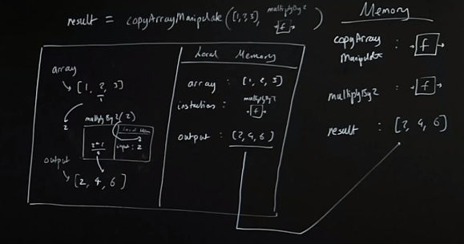

## The Problem: Repetitive Functions

We're breaking DRY.

We can't simply pass in a snippet of code like (*2) or something as an argument, so how might we be able to pass around functionality? Well with functions.

### We could generalize our function so that we pass in our specific instruction only when we run the copyArrayAndManipulate function!
```js
const copyArrayAndManipulate = (array, instructions) => {
 const output = [];
 for (let i = 0; i < array.length; i++) {
 output.push(instructions(array[i]));
 }
 return output;
}
const multiplyBy2 = (input) => {
 return input * 2;
}
const result = copyArrayAndManipulate([1, 2, 3], multiplyBy2); 
```

## Generalizing Functions


### How was this possible?
*Functions in javascript = first class objects*
They can co-exist with and can be treated like any other javascript object

1. assigned to variables and properties of other objects
2. passed as arguments into functions
3. returned as values from functions

## Higher-Order Functions Review

### Callback vs. Higher-order function
```js
const copyArrayAndManipulate = (array, instructions) => {
 const output = [];
 for (let i = 0; i < array.length; i++) {
 output.push(instructions(array[i]));
 }
 return output;
}
const multiplyBy2 (input) => {
 return input * 2;
}
const result = copyArrayAndManipulate([1, 2, 3], multiplyBy2);
```
Which is our callback function? Which is our higher order function?
- Higher order is the function that takes the callback, the callback is the function passed into the HOF.

### Callback vs. Higher-order function
```js 
const copyArrayAndManipulate = (array, instructions) => {
 const output = [];
 for (let i = 0; i < array.length; i++) {
 output.push(instructions(array[i]));
 }
 return output;
}
const multiplyBy2 (input) => {
 return input * 2;
}
const result = copyArrayAndManipulate([1, 2, 3], multiplyBy2);
```
The function we pass in is a callback function. The outer function that takes in the function (our callback) is a higher-order function. 

### Higher-order functions
> [^ **What makes a function a higher-order function?**]Takes in a function or passes out a function

> [^ **What is a Higher-order function?**] [**Higher-order function**]() is just a term to describe these functions - any function that does it we call that - but there's nothing different about them inherently

#### Higher order functions
— **Easier to add features** - we don’t need to build a brand new `copyArrayAndAdd3` function - just use `copyArrayManipulate` with the input of `add3`. Higher order functions keep our code DRY
— **More readable** - `copyArrayManipulate(multiplyBy2)` - I know what this is doing more readily than the for loop style
— **Easier to debug** - As long as we understand what’s happening under-the-hood

## Higher-Order Functions Pair programming
Challenges: http://csbin.io/functional
Solutions: https://github.com/CodesmithLLC/cs-bin-solutions/blob/master/functional.js

## Arrow & Anonymous Functions

### Arrow functions in ES2015
```js
const multiplyBy2 = (input) => { return input*2 }
```
So where the function is a single expression to evaluate and then return, ES2015 lets us remove the `{}` and `return` keyword
```js
const multiplyBy2 = (input) => input*2
const output = multiplyBy2(3) //6
```
We can even remove the parenthesis if there’s only 1 parameter (expected input)
```js
const multiplyBy2 = input => input*2
const output = multiplyBy2(3) //6
```

### Arrow functions fit our our functional programming goals
Every line is an independent, labelled piece of code where we know exactly what data it uses and affects. Therefore a lot of our functions are going to be just...

1. Take Input
2. Use the input in some way
3. Return that as the output in the same line.

Arrow functions let us condense our functions to show this

### We can even insert our callback function `multiplyBy2` directly (‘anonymously’)
```js 
const copyArrayAndManipulate = (array, instructions) => {
 const output = [];
 for (let i = 0; i < array.length; i++) {
 output.push(instructions(array[i]));
 }
 return output;
}
const result = copyArrayAndManipulate([1, 2, 3], input => input*2);
//No multiplyBy2 function independently declared/saved
```

## Links

- [HP: functions and callbacks](/hardparts-js-v2-functions-and-callbacks)
---- 
**Nav**:
- [MAIN](/hardparts-functional-main)
- [PREV ← | JavaScript Principles Review](/hardparts-functional-js-principles)
- [NEXT → | Map & Reduce ](/hardparts-functional-map-and-reduce)

## Summary Questions