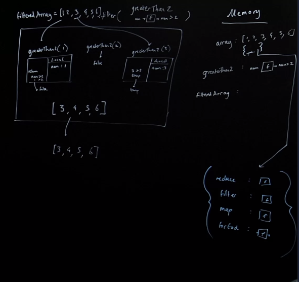
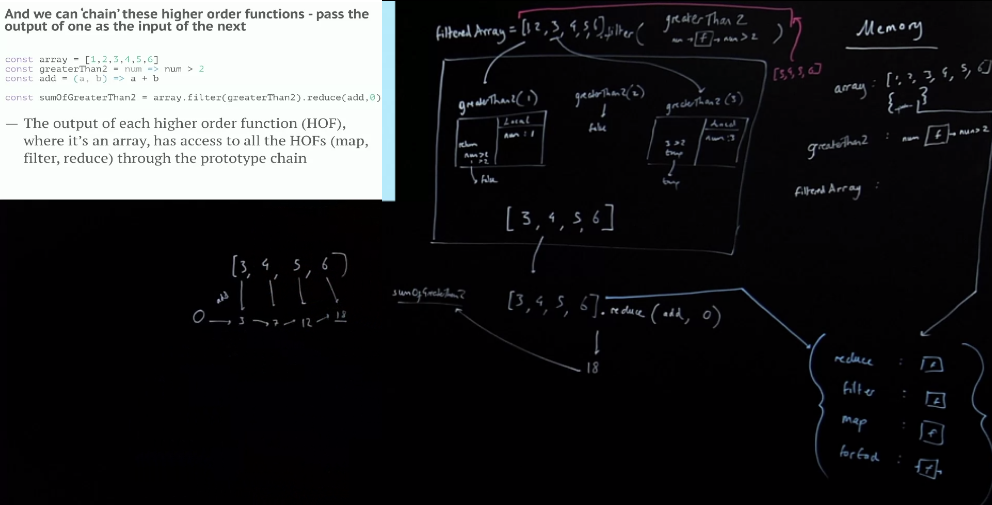

## Map
### Let’s review our use of `copyArrayAndManipulate`
```js
const copyArrayAndManipulate = (array, instructions) => {
 const output = [];
 for (let i = 0; i < array.length; i++) {
 output.push(instructions(array[i]));
 }
 return output;
}
const multiplyBy2 = (input) => {
 return input*2
}
const result = copyArrayAndManipulate([1, 2, 3], multiplyBy2);
```
The more common name for this function is `map`, because you are mapping data transformed from one state to another.

### Developers tend to call `copyArrayAndManipulate`, `map`
```js
const map = (array, instructions) => {
 const output = [];
 for (let i = 0; i < array.length; i++) {
 output.push(instructions(array[i]));
 }
 return output;
}
const multiplyBy2 = input => input*2
const result = map([1, 2, 3], multiplyBy2);
```

Let’s diagram it in a different way and talk about the purpose of diagramming

## Reduce Introduction
Will considers `reduce` the most important function in all of functional programming. For usefulness, `fetch` is probably Will's favorite function, but for versatility, it's `reduce`

### reduce and reducers
- *The most versatile* higher order function of all
- Takes a mental shift to look at problems through the reduce lens
- Can even enable function composition (to come

### We have already seen ‘reduction’ in action
```js
const map = (array, instructions) => {
 const output = [];
 for (let i = 0; i < array.length; i++) {
 output.push(instructions(array[i]));
 }
 return output;
}
const multiplyBy2 = input => input*2
const result = map([1, 2, 3], multiplyBy2);
```
What is map actually doing? (accumulator, push etc)

```
[1,2,3]
 | | |
 |  \ \____v
[2][2,4][2,4,6]
```

> [^ ⭐ **What's a better mental model of thinking about what map is doing that will help us better understand reduce?**]⭐Let's shift our mental model of mapping for a second...all we are really doing with map, is taking two things, incrementally, and combining them to one things, moving to the next element, and taking two things and combining them down into one.

What we are really doing with our mapping, taking each element, multiplying by 2 and combining it with an empty array, but how do we fuse a number and an array? By pushing. 
So by pusing it into an array, what we are really doing in a more general sense is taking the first element, doubling it then combining it by pushing it into an empty array, reducing it from two things, my first element, and my array, reducing them from two things to one, then taking that reduction and continuing to reduce it down to one thing.

> [^ **What is an accumulator? What is a reducer?**] That first empty array is often referred to as an [**accumulator**](), we are combining it down into the accumulator, reducing it to one thing.

What if instead changed the **accumulator** to be a number, like 0 instead, we could reduce number via addition into a sum. 

The important thing here is to note that our reduction here is from two things to one thing, repeatedly through each element.

> The rule by which we combine two things to one thing (like `[] + 2`, or `0 + 2`), that rule is called the [**reducer**]().

### We combined/reduced by:
- Taking the array [] and combine with array[0] by pushing, take that combined value and combine with array[1] by pushing and so forth. How else could we combine and use, combine and use?

### How else could we ‘combine and use, combine and use’?
- Take the number 0 and combine with array[0] by adding, take that combined value and combine with array[1] by adding and so forth...  
- Take the empty string “ ” and combine with array[0] by appending, take that combined value and combine with array[1] by appending and so forth... We’d want to write our function so that it could handle:
- Any ‘accumulator’ (array, string, number)
- Any combining logic/code/functionality (the ‘reducer’)

## Reduce Example
### This function is known as reduce - it can handle a remarkable range of tasks
```js
const reduce = (array, howToCombine, buildingUp) => {
    for (let i = 0; i < array.length; i++){
    buildingUp = howToCombine(buildingUp, array[i])
    }
    return buildingUp
}
const add = (a, b) => a + b
const summed = reduce([1,2,3], add, 0)
``` 
> [^ **What might a more clear/explicit name for what reduce is actually doing?**] ⭐ Should be called ‘reduce from 2 things to 1 repeatedly, inside’


> [^ **Right now our reducer is reducing data with more data, what might be the next "evolution" we could take this reducer to, in order to really make it powerful?**]⭐Right now we are reducing data with more data. Imagine if we could reduce something, element by element, repeatedly inside of reduce, image we could reduce something that was not just data but instead something else, not a list of data, but a list of something else. That would change everything about how we write code.

## Built-In Array Methods
### Interlude - arrays, objects and functions have access to ‘methods’
- ‘methods’ are functions that they can use on themselves 
```js
const array = [1,2,3]
array.push(10) // Where’s this push method come from?
```
- The ‘methods’ that arrays get are stored in an object that every array has access to when you refer to the array, followed by a ‘dot’ and the method name (See OOP JS Hard Parts)
- The link to this object full of shared methods is on the __proto__ property

### JavaScript has a built-in version of reduce available to all arrays
Reminder of our version of reduce...
```js
const add = (a, b) => a + b
const summed = reduce([1,2,3], add, 0) // summed is 6
```
With the built-in version , the array is inserted into the reduce function automatically as the first input/argument. But they produce the same result..
```js
const add = (a, b) => a + b
const summed = [1,2,3].reduce(add, 0) // summed is 6
```

### In fact we get a number of built-in higher order functions in JavaScript
— `map`, `forEach`, `filter`, `flatMap`, `reduce`, `reduceRight`
— All ‘iterate’ through each element of the array and run a function on each
— But behave differently - MDN guides us
```js
const array = [1,2,3,4,5,6]
const greaterThan2 = num => num > 2
const filteredArray = array.filter(greaterThan2) // [3,4,5,6]
```

## Filter 


- ``filteredArray` evaluates to the returned value of `[3,4,5,6]`. That array has access to a shared collection of functions... meaning, we may not even have to store the returned value in a variable in order to run some kind of operation on it...

## Chaining Array Methods 
### And we can ‘chain’ these higher order functions - pass the output of one as the input of the next
```js 
const array = [1,2,3,4,5,6]
const greaterThan2 = num => num > 2
const add = (a, b) => a + b
const sumOfGreaterThan2 = array.filter(greaterThan2).reduce(add,0)
```
>[^ **⭐ What is special about outputs of HOFs that are arrays?**]⭐ The output of each higher order function (HOF), where it’s an array, has access to all the HOFs (`map`, `filter`, `reduce`) through the prototype chain. Meaning we can chain them since their output can be operated on by an ensuing HOF.

> [^ **Speak a little to array method chaining and what problems it solves and its limitations.**]Chaining isn't the most functional programming style of writing code, but we're going to see it as a lot of people do do it in JavaScript this way, but then after that we will do the more clean, compartmentalized functional style.
- Chaining is useful only if you are doing consistent operations on things that evaluate to a value that can be chained. It's not as readable as it could be with a more functional approach.
- Because of **referrential transparency** (a functions evaluated value is treated identically to the value itself, e.g. `add2(2)` === `4`), you don't have to create a new variable to hold the result of a function in memory before running a subsequent operation on it.




## Links

- [HP: functions and callbacks](/hardparts-js-v2-functions-and-callbacks)
---- 
**Nav**:
- [MAIN](/hardparts-functional-main)
- [PREV ← | Higher Order Functions](/hardparts-functional-higher-order-functions)
- [NEXT → | Composition ](/hardparts-functional-composition)

## Summary Questions