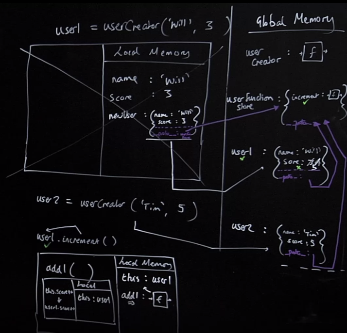
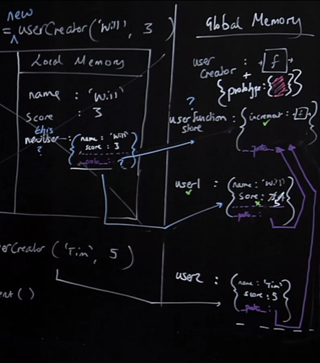
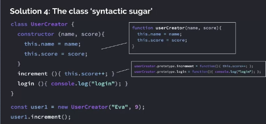

## Summary Questions
1. Refresher: what two things are essential to any software development and running code?
2. Why is software development hard?
3. What goals does the Object-oriented paradigm aim to address?
4. Speak to the role of objects and the concept of *encapsulation*.
5. If we had to epitomize the primary goal of OOP, what would it be?
6. What are two of the easiest ways to create and add properties to objects?
7. What's a third, but just as simple way of creating an object(empty), that gets us on the path of something more reusable?
8. So we're creating objects with their functionality bundled together, we have this amazing paradigm, that's a great way to look at our programs (less so now than functional approach), But where still going wrong? 
9. What are factory functions? How might they help us solve our dilema? Where in our example then do we still fall short?
10. What problem is use of a prototype chain solving for us? Speak to how we might go about creating one and the elements required to do so successfull.
11. What is an **implicit parameter**? What are the two key rules of the `this` keyword.
12. What is `Object.prototype`, how is it useful? What are we enabling with regards to `__proto__`, when we use `Object.create()`? Does the `Object.prototype`
13. How does `this` behave with regards to an arrow function?
14. Where are situations where you might want to use an arrow function? Where would you not want to use an arrow function? 
15. Functions are both ________ and ________. Because of this they have a property called? This property has a value of what? What can we do with this property and what problem does it help us solve?
16. What are the three things that the `new` keyword automates for us?
17. What is a little coding convention for factory functions and classes? Why do we need to specify this?
18. What are some of the things that `class` make nice for us? What are some of the syntax quarks of classes?

## Class & OOP Introduction

### Classes, Prototypes -- Object Oriented JavaScript
- An enourmously popular paradigm for structuring complex code
- **Prototype chain** - the feature behind-the-scenes that enables emulation of OOP but is a compelling tool in itself
- Understanding the different between `__proto__` and prototype 
- The `new` and `class` keywords as tools to automate our object & method creation

Going to start off by reminding ourselves...

### Core of development (and running code) 
> **1. Save data (e.g. in a quiz game the scores of user1 and user2)**  
> **2. Run code (functions) using that data (e.g. increase user 2's score)**[^1]

Easy! So why is development hard?

In a quiz game I need to save lots of users, but also admins, quiz questions, quiz outcomes, league tables--all have data and associated functionality.

In 100,000 lines of code...  
- Where is the functionality when I need it?
- How do I make sure the functionality is only used on the right data!

>* **That's what makes coding complex, is that there is so much data and so much functionality it only applies to certains bits, and finding that functionality and making sure its applied to the right bits, we need some kind of organizing structure.**[^2]

### That is, I want my code to be:
> **1. Easy to reason about**  
> **2. Easy to add features to (new functionality)**  
> **3. Nevertheless efficient and performant**[^3]

The Object-oriented paradigm aim is to let us achieve these three goals.

## Object Dot Notation

### So if I'm storing each user in my app with their respective data (let's simplify)
| user1 | user2 |
|:-----:|:-----:|
| name:'Tim' | name: 'Stephanie' |
| score: 3 | score: 5 |

And the functionality I need to have for each user (again simplifying!)
- Increment functionality (there'd be a ton of functions in practice)

How could I store my data and functionality together in one place?

**Two things**:  
1. We don't want to have to try and look over all our files of code to hunt down our increment function. In our ideal world, we would want our increment functionality, right there adjacent to somewhere it will be applied, like the users score.  
2. We also want that functionality to be "private" to the thing its modifying and not used elsewhere in appropriately

### Objects - store functionality with their associated data!
This is the principle of [**encapsulation**](), while not fully, strictyl implemented in JavaScript, essentially says: protect and bundle up in one place, functionality, and the data to which it applies--and it's going to transform how we can 'reason about' our code.[^4]
```js
const user1 = {
    name: "Will",
    score: 3,
    increment: function() { user1.score++; }
};

user1.increment(); //user1.score --> 4
```

Let's keep creating our objects. What alternative techniques do we have for creating objects?

>* **That's the big goal of OOP: *Can I achieve running functionality on the pertinent data?**[^5]

So in the above code we are creating an *object literal*, the fully populated object with the related funtionality it intends to use. What other way can we add properties to it afterwards? By using *dot notation*.

### Creating user2 user dot notation
Declare an empty object and add properties with dot notation
```js
const user2 = {}; //create an empty object

// assign properties to that object
user.name = "Tim";
user.score = 6; 
user2.increment = function() {
    user2.score++;
}
```
1. Creating a const called `user2` in global memory and assigned 
2. The next line, assigns a property to that object called `name` and assigns the value `"Tim"` to that property.
3. Next one is score, and 6.
4. And then we create a property label, `increment` which has a value of a function, functions stored in an object are referred to more commonly as *methods*. We store that entire function body into `increment` property.

>* **Let's review at least two simple ways of creating new objects: The first is with *object literal* syntax, where we fully define our object within itself. Then a second approach would be using *dot notation* after the object/empty or otherwise, to add properties to that object. This would be referred to as using.**[^6]

## Factory Functions
What's another way, what's a built in function of JavaScript, whose output will be an empty object forevermore? `Object.create`...

### Creating user3 using `Object.create`
`Object.create` is going to give us fine-grained control over our object later on. For now, just know it returns out an empty object.
```js
const user3 = Object.create(null);

user3.name = "Eva";
user3.score = 9;
user3.increment = function() {
    user3.score++;
};
```
Our code is getting repetitive, we're breaking our DRY principle. And suppose we have millions of users! What could we do?  

1. Declaring a constant `user3` in global memory, right hand side is going to immediately return out an empty object `{}`.
    - Even if we were to pass into those parens on `.create()` an object full of properties, it's still going to return out an empty object. Now that empty object might have some hidden properties on it depending on what we pass in, but it is always an empty object, no "direct" properties on it.
2. We then assign `user3` the name property which has the value "Eva"
3. We then assign `user3` the score property which has the value 3
4. And then we create a property label, `increment` which has a value of a function. We store that entire function body into the `increment` property/method.

>* **`Object.create(null)` can be used to create a new empty object. Using `Object.create(null)` in this way, isn't doing anything special (when we pass in null), we still get returned to us an empty object.**[^7]

So for general purposes, we've got data and functions/methods that work together and don't work with other stuff (technically we could still access that increment function in other areas, so its not strictly "protected"), we're good to go, except we're not staying very dry, we are doing this all manually for each user.

Whenver we have code that is being done multiple times like adding properties, or methods, what do we tend to do with code that we find ourselves writing again again and again? Put it in a function.

> * Let's drill in one more time, its a dream come true when we have 100,000 lines of code, to leave no mystery as to what/where  our functionality is with relationship to the data its being applied to.    
    - Once you start thinking in terms of this paradigm of putting your data and the functionality together in one place, you start doing it a lot. You start thinking of everything in your application as: What's the data and the functionality connected to that particular feature?  
    - It's a really nice paradigm, But this paradigm of OOP is increasingly not as popular as the functional programming style, but it remains a really intuitive way of thinking about structuring an application.[^8]

### Solution 1: Create and return objects using functions
```js
function userCreator(name, score) {
    const newUser = {};
    newUser.name = name;
    newUser.score = score;
    newUser.increment = function() {
        newUser.score++;
    };
    return newUser;
};

const user1 = userCreator("Will", 3);
const user2 = userCreator("Tim", 5);
user1.increment();
```
This Solution #1 is going to turn out to be untenable, but it gets us a long way there. Everything else we do today is about making this much much more effecient.

## Factory Functions Example
### Solution 1: Create and return objects using functions
```js
function userCreator(name, score) {
    const newUser = {};
    newUser.name = name;
    newUser.score = score;
    newUser.increment = function() {
        newUser.score++;
    };
    return newUser;
};

const user1 = userCreator("Will", 3);
const user2 = userCreator("Tim", 5);
user1.increment();
```
1. Defining the constant `userCreator` in global memory and assigning it the function definition on the right hand side.
2. next line, we define a constant `user1`. Do we know what is going to go into user1? We have no idea because we first have to go off call `userCreator`, so it remains uninitialized.
    1. We are calling `userCreator`, so we add it to the call stack and create a brand new *execution context*.
        - In local memory, the first thing we do is handle our arguments, first one is `name` and assigned the value "Will"
        - Don't anybody think that these are properties, (we're still on the paramaters/arguments line), these are just data variable, you know, labels, they're just ones we got to leave placeholders for earlier on and prefill when we run the function.
    2. Now we get to the body of the function, we are created a constant `newUser` and assigning it an empty object.
    3. We go and look for newUser, and look for a `name` property, if there isn't one create it now within the object. This is not a variable/identifier, this is an actual property on the object `newUser` and assign to it, the right hand side of the equals, look for that in memory, which is the variable `name` in local memory, which holds the value "Will" and then store that in the `name` property.
    4. For score we do the same thing as we did for name.
    5. Creating a property/method on `newUser` called `increment` which holds the function body on the right hand side.
    6. We hit return and return out that newUser object, which concludes the right hande side evaluation, so the returned value is stored as the output on `user1`.

3. We repeat the proces for user2 with its corresponding arguments.
4. `user1.increment()`, looks for it global memory, we find it, is it method on `user1`, yes. So we grab it. Think about what `increment`'s code says, it says... `newUser.score++`, but we are pretty sure there isn't a `newUser` in the global, and we already finished this execution context, so... where it? Well remember our backpack, which holds a link to the old name for the object we created. Because the object returned out a method on it, that function was linked to (via its closure) all the surrounding memory including `newUser` which was a label for that very object, which will now refer to `user2`.
    - We aren't going to use this style, we don't need to dwell on it.
    - Closures are everywhere.
    - Easy to reason about, you bet, the functions are all directly available on the object itself
    - And yet, this approach is completely unusable because remember there are two other goals in our paradigm:
        1. easy to add new features to (new functionality)
        2. efficient and performant
    - We are storing the same function twice, its identical. We'd have to write it again for every user. 
    - We also have to add any functionality manually to each and every user object.

### Solution 1: Generate objects using a function
**Problems**: Each time we create a newuser we make space in our computer's memory for all of our data and functions. But our functions are just copies.

Is there a better way?

**Benefits**: It's simple and easy to reason about.

> - Because we found ourselves repeating ourselves for each user, writing a lot of the same code, we did what we always do in situations like that, we wrapped everything in a function, where the things that change between users were made as parameters so they can adapt with different inputs. 
- Remember, the goal is still the same here, we still want to encapsulate our data by producing an object. We are doing so now, internally in a function, creating that empty object, and giving it a name by which we can refer to it in order to sets its properties, and then returning that object out.
- We've created here what can be referred to as a [**factory function**](). We are using a function as a sort of factory to produce other objects that might need multiple instances, e.g. users in an app. This particular version of the factory function above, is still untenable because of its method's redundant replication across users, but fundamentally this gets us about 90% of the way there. The last remaining bit is setting up its "prototypal inheritance/prototype chain", but this is it, once we do that, we're essentially doing the work of what classes are still doing under-the-hood in ES2015.[^9]

## Prototype Chain
So intuitively, what might the solution be? We still want our function to be bundled with its data, maybe we can just add the one function in an object somehow have JS know that when it doesn't find the `increment` function on the user object, to not give up, and have us look elsewhere.

Perhaps, some other object that can store this functionality so when we don't find it in our objects to go and somehow look it up?


### Solution 2: Using the prototype chain
Store the `increment` function in just one object and have the interpreter, if it doesn't find the one function on `user1`, look up to that object to check it it's there.

Link `user1` and functionStore so the interpreter, on not finding `.increment`, makes sure to check up in `functionStore` where it would find it.

Make the link with `Object.create()` technique.
```js
function userCreator(name, score) {
    const newUser = Object.create(userFunctionStore);
    newUser.name = name;
    newUser.score = score;
    return newUser;
};

const userFunctionStore = {
    increment: function() {this.score++;},
    login: function(){console.log("Logged in");}
};

const user1 = userCreator("Will", 3);
const user2 = userCreator("Tim", 5);
user1.increment();
```
- By the way, this approach here, is going to fundamentally achieve all the things we want to achieve besides the fact that its going to involve a little bit of writing of code, there might be some shorter-hand ways of doing this.
- Solution 3 and 4 are going to just be shortened ways of doing the above.

## Prototype Chain Example: Prototypal Link
So let's walk through it all...
```js
function userCreator(name, score) {
    const newUser = Object.create(userFunctionStore);
    newUser.name = name;
    newUser.score = score;
    return newUser;
};

const userFunctionStore = {
    increment: function() {this.score++;},
    login: function(){console.log("Logged in");}
};

const user1 = userCreator("Will", 3);
const user2 = userCreator("Tim", 5);
user1.increment();
```
1. Declaring a function `userCreator` in global memory.
2. Going to declare a global constant called `userFunctionStore` and its going to store an object
    - and its going to store two properties in it which both store functoins
3. declaring the constant `user1` and we don't know what it will store, until we `userCreator`
    - added to the callstack and a new execution context
    - we create a label for the parameter `name` and assign it Will
    - we create a label for the parameter `score` and assign it 3
    - We then create a constant, `newUser` and immediately assign to it an empty object. (we come back later to what is happening with the argument `userFunctionStore`)
    - We are then assigning the properties in that empty object, creating a property label called name and assigned it the value contained in local memory, `name`, which is "Will"
    - Does the same for score.
    - We return this object out to the global label `user1`
4. We roughly repeat the same thing for user2 doing the steps of #3 above.
5. Finally, when we get to `user1.increment()`, it first looks for user1 in global memory and it finds it, then looking for `increment` on that object. It doesn't find it, but it does have an indelible link up to `fuctionStore` where it finds and grabs its code.
    - let's understand how this link is stored, it's made using `Object.create`, whatever we pass into as an argument creates that link for us, in this case its' `userFunctionStore`. 
    - `Object.create()` still, creates an empty object, however, there is something that happens when we pass it an arg, it's happening under the hood (although we can still directly access it). It creates a hidden property on the on the empty objecct we are creating and that hidden property is called `__proto__`, under underscore proto, sometimes some call it  dunder proto., this `__proto__` is where we store that link up to the thing passed in, `userFunctionStore`.
    - this proto link, this chain connection from `user1` up to `userFunctionStore` is the mechanism by which we check elsewhere when something isn't found immediately on an object.
    - So when we are calling `.increment()` on our `user1`, `user1` is found in global, but when we try and run increment on user1 it isn't there. JS doesn't panic though. It uses its prototypal architecture and instead it goes straight to `__proto__` property not be confused with Prototype. So it goes straight to the `proto` property and checks its reference link up to `userFunctionStore` where it is found, grabbed and then run.
    - It's just baked into JavaScript's prototype nature that when we look on objects for methods/data and can't find it, that it looks first at that objects `__proto__` property and head up to that object. It's just a feature of the language, like lexical scope is a feature.


>- All we are doing is simply creating a shared store, an object, that is going to save a lot of our reused functionality as properties within that object. By using `Object.create()` we can then tell, the empty object that its creating where to look for that functionality that is no longer being store in each instance of itself, but instead in one shared place that can be referenced. The shared link that is established when we `Object.create(storeName)` and pass it an argument. Under the hood, JS is setting the hidden(ish) `__proto__` property of that object to be a "pointer" or a reference to the label/object of the item passed in as an argument to `Object.create()`. This "function" store, as we see above can simply just be a plain old object, out in global.[^10]

## Prototype Chain Example: Implicit Parameters
The argument we pass `Object.create()` is always stored in the `__proto__`. It's a property not hidden like our [[scope]] property or our [[onFufilled]], `__proto__` is a hidden property but we can see it.

Side note from MDN:   
The `Object.getPrototypeOf()` method returns the prototype (i.e. the value of the internal [[Prototype]] property) of the specified object.

So let's now, actually execute the `user1.increment()` method...  

1. So we have our new execution context and we've added it to the callstack, but the first line we encounter `this.score++`
- Here's the problem, does this `increment` function need to work on user1? on user2? user403? So this `increment` method needs to be working on their respective user objects scores, not the score of some other user.
    - Don't panic. We have an amazing thing, called an [**implicit parameter**](), one that we don't even specify, one that is automatically there and filled in for us. This implicit paramter is called `this`.
    - In our `user1.increment()` local memory we get the implicit parameter `this`, and the value of `this` is `user1`. Whatever is on the left-hand side of `.`, that object, that is what `this` is. (So in local memory something like `this: user1` exists).
    - Here is our one key rule of `this`. It always attachs itself to the left hand side of the dot on which that function is being run. So it "evaluates" to `user1.score++`, we find `user1` in global memory, we find that `score` and we increment it. 
    - This is one of our key uses of `this`, run a function that is shared through many different objects through the protolink to access the object on which that method is being executed.

>* **An implicit parameter is one that is simply a parameter that comes with a function without us having to ask for it. Every function has an implicit parameter called `this`. `this` has two key rules: (1) The value of `this` is going to be what is on the left-hand side of the `.` from the method that calls it. If there is nothing to the left hand side of that method, `this` defaults to the global/window object. (2) The other key rule is that if we use a `new` keyword, the automatically created object inside of that execution context is gonna label it: `this`.**[^11]

Q: It seems like we are accessing `score` up in globally memory of the `user1` object, you're cautious about it from like a side-effects, potentially globally kind of consequences, kind of perspective, we have to accept that if we are taking this model there are tradeoffs.


## `hasOwnProperty` Method

### What if we want to confirm our `user1` has the property `score`
```js
function userCreator(name, score) {
    const newUser = Object.create(userFunctionStore);
    newUser.name = name;
    newUser.score = score;
    return newUser;
};

const userFunctionStore = {
    increment: function() {this.score++;},
    login: function(){console.log("Logged in");}
};

const user1 = userCreator("Will", 3);
const user2 = userCreator("Tim", 5);
user1.hasOwnProperty('score');
```
There is no property on `.hasOwnProperty` on user1, or  `userFunctionStore`, where is this function going to come from?

>* `Object.prototype` which has a bunch of useful functions on it and it is available to all of our objects. But how? Well, all objects in JS have a default  `__proto__` which defaults to linking to `Object.prototype`.
What we are kind of doing with `Object.create()` is kind of taking control of what we put in that `__proto__`, because by default it defaults to `Object.prototype`. `Object.prototype` also has a `__proto__` property but its value is `null` signifiying its the "end of the chain".[^12]

### What if we want to confirm our `user1` has the property score
We can use the `hasOwnProperty` method - but where is it? is it on `user1`?

All objects have a `__proto__` property by default which defaults to linking to a big object - `Object.prototype` full of (somewhat) useful functions

We get access to it via `userFunctionStore`'s `__proto__` property -- the chain goes up. 

## `this` Keyword

### Declaring & calling a new function *inside* our 'method' increment
Let's start by simplifying (just increment method -- written over 3 lines now)
```js
function userCreator(name, score) {
    const newUser = Object.create(userFunctionStore);
    newUser.name = name;
    newUser.score = score;
    return newUser;
};

const userFunctionStore = {
    increment: function() {
        this.score++;
    }
};

const user1 = userCreator("Will", 3);
const user2 = userCreator("Tim", 5);
user1.increment();
```

### Create and invoke a new function (`add1`) inside *increment*
What does `this` get auto-assigned to?
```js
function userCreator(name, score) {
    const newUser = Object.create(userFunctionStore);
    newUser.name = name;
    newUser.score = score;
    return newUser;
};

const userFunctionStore = {
    increment: function() {
        function add1(){ this.score++; }
        add1();
    }
};

const user1 = userCreator("Will", 3);
const user2 = userCreator("Tim", 5);
user1.increment();
```
So let's just jump into `user1.increment()`
1. First thing our implicit paramter, `this`, gets set to `user1`
2. Next thing we declare a function `add1`, then invoke the function
3. New call stack and exection context, the line of code inside is `this.score++`, but is our value of `this`? What would make sense is that while you are in the method, the peritent object, the object that we care about diong stuff to with the data is throughout going to be the object we are going to run the method on, even if we declare other functions inside. Their `this` should remain the object, but NO. `this` in local memory here, defaults, to the global window object. Not very useful, try to increment a global `.score` property on window.
    - In the old days, they would say `that = this` in the outer, so that the inner functions can have reference to `that` which would still point to the `user1` object. Gross.
    - You could also manually use `call/apply`, it would work like `add1.call(this)` in line 10 instead and it works again.

## Arrow Function Scope & `this`
>* Let's take a look at the more standardly used way of doing things that uses *arrow functions*. That *arrow function* style of saving/declaring functions, automatically has it's `this` assignment *lexically scoped*, that is to say when we save the function when we execute it, what the `this` is determined by **where the function was saved**. Which means that if it was saved inside of increment, where `this` is `user1` then it too should have a `this` of `user1`...[^13]

### Arrow functions override the normal `this` rules 
```js
function userCreator(name, score) {
    const newUser = Object.create(userFunctionStore);
    newUser.name = name;
    newUser.score = score;
    return newUser;
};

const userFunctionStore = {
    increment: function() {
        const add1 = () => { this.score++; }
        add1();
    }
};

const user1 = userCreator("Will", 3);
const user2 = userCreator("Tim", 5);
user1.increment();
```
Let's just start at the execution of `user1.increment()`...

1. In the execution context of this invokation the first thing is the implicit label `this` gets assigned the value `user1`
2. We declare `add1` in the arrow function style, and immediately call it, which creates a brand new execution context
    - it's `this` assignment inside the local memory, remember the default is to look to the left of the dot assignment, and if there is no dot it defaults to the window/global. However, if it was created with an arrow function the `this` is going to be set to `this` assignment around the declaration of that function. The `this` of `add1` is *lexically scoped*, statically scoped, `this` assignment, that is to say: **it is from the moment of definition that we set our `this` to `user1`. Therefore, `this.score++` is going to evaluate to `user1.score++`, we have to go 4 levels out, but there's where it will find it to increment it.

>* We don't want to use arrow functions on our methods on objects, because that would set their `this` to that global/window. However the functions inside of them, we will want to.[^14]



## Prototype Chain Review
### Solution 2: Using the prototype chain
**Problems**: No problems! It's beautiful! Maybe a little long-winded

Write this every time - but it's 6 words!
```js
const newUser = Object.create(userFunctionStore);
//...
return newUser;
```
**Benefits**: Super sophisticated but not standard

The standard way, solution 3 and 4, behind the scenes is jsut doing all this behind the scenes.

## `new` Keyword
Our prototype approach involved a bit of writing of code... we had to create the object manually using `Object.create` storing a newUser (a name that is only used in the object creator).

Wouldn't it be a bit nice to automate some of this object building?

Enter the `new` keyword, which automatically does for us:
- creates a new object for us (we dont have to declare one)
- it's also going to return that object out for us automatically
- it's also going to make the link to some object full of functions out here (global), going to set the `__proto__` property for us as well.
    - To where though? Because previously we did this all manually. Where we going to put our shared store of functions?
    - And also, how were we previously adding properties to our empty object? Well, `newUser`, if that object is being automatically created for us, do we get to assign it a label, well no?
    - So our questions are: what are we going to auto link to on the proto and what label is this automatically generated object going to be given?

### Solution 3 - Introducing the keyword that automated the hard work: `new`
When we call the function that returns an object with `new` in front of it we automate 2 things:  
1. Create a new user object
2. Return the new user object

But now we need to adjust how we write the body of `userCreator` -- how can we:
- Refer to the auto-created object?
- Know where to put our single copies of functions?

Let's have a guess at what we call this object that is auto-generated... well it's `this`. Profoundly confusing, because `this` will be very different from when we run a function from that generated object.
 
This is the other key rule to how `this` works...The first rule again is....
1. It's always whatever the object is to the left of the dot when we run a method (e.g. `user1.increment()`, `this` would refer to `user1`). The other rule is...
2. If we use a `new` keyword, the automatically created object inside of that execution context is gonna label it, `this`.  

### The `new` keyword automates a lot of our manual work
```js
function userCreator(name, score) {
    /* const newUser = Object.create(userFunctionStore); */
    /* newUser.name = name;*/ this.name = name;
    /* newUser.score = score;*/this.score = score;
    /* return newUser;*/
};

/* functionStore */ userCreator.prototype // {};
/* fuctionStore */ userCreator.prototype.increment = function() {
    this.score++;
}

const user1 = new userCreator("Will", 3); /* this new keyword automates the hard work */
```
- But our connection to `fuctionStore` that's done and gone now. We are going to need a big old object, with the help of the `new` keyword, can be sure to link off to some object, we need to know where that is going to be. To find out where it's going to be, let's take a little interlude....

### Interlude - functions are both objects and functions 
```js
function multiplyBy2(num) {
    return num*2;
}
multiplyBy2.stored = 5;
multiplyBy2(3) //--> 6

multiplyBy2.stored // --> 5
multiplyBy2.prototype // {}
```
We could use the fact that all functions have a default property `prototype` on their object version, (itself an object) -- to replace our `functionStore` object

1. Line 1 we declare a function `multiplyBy2`
2. Line 2, we are creating a property `stored` on `multiplyBy2`, it's a function, but, it turns out, that as soon as JavaScript sees that keyword function knows a function is coming, we get a function plus an object attached. If we use `.` on the function name we get access to the object bit, if we use `()` we get access to the function bit.
3. stored proeprty with a value of 5.
4. We can still use the function bit and the object bit.

All functions also have a property, just a property, called `prototype`. All functions in their object format automatically have a property on them called `prototype`. The default value inside of `.prototype` is a big empty object.

That means, the function we're gonna use `new` on when it creates an object automatically, that desperately needs a place to link to, an big old empty object in which to store functions, remember, that function (`userCreator`) isn't just a function, it's also an object, which has a `prototype` property in it which contains a big old empty object.

>* - Functions are both functions and objects. You can think of them as function/object combos, but there is a function bit and an object bit. If we use `.` on the function name we get access to the object bit, if we use `()` we get access to the function bit.
- All functions in their object bit automatically have a property on them called `prototype`. The default value inside of `.prototype` is a big empty object.
- `new` will assign it's proto link to the `.prototype` property of the function that creates it. Our methods are going to be stored in the prototype property of the function that creates the new objects using the `new` keyword.
- So now JS knows where to look for our functionality, but we still have to manually add those methods now that we know the location they will be searched for
    - We do so by adding them to the .prototype object of our factory/constructor function, e.g. `userCreator.prototype.increment = function() { this.score++; }`[^15]



## `new` Keyword Example

```js
function userCreator(name, score) {
    this.name = name;
    this.score = score;
};

userCreator.prototype.increment = function() { this.score++ };
userCreator.prototype.login = function(){ console.log("login"); };

const user1 = new userCreator("Eva", 9); 
user1.increment()
```
Notice, we're not creating an object inside of our `userCreator`, no making a bond to some shared store of functions, no returning an object out, because we're going to run that function with the help of the `new` keyword. You can think of the `new` keyword as a **modifier** it alters the behavior of the userCreator execution context, it's gonna insert stuff in there automatically for us when we run it.

Hold, on, we need a shared store of functions, one saved version of those functions, how are we going to make sure we have a bond to them? Well it turns out that `userCreator` function is also an object. The object bit of the function has a property called `prototype` into which we are going to store an `increment` and `login` method...

1. Line 1, we are declaring a label called `userCreator` in global memory that will store a function definition (but as we know, it also has with it an object portion). This object has a `prototype` property, that has a value of a big of old empty object. This is what we are doing each time with any function definition, we just don't talk about the object bit that often, but it's there, every time. Function + object combo, and that object bit has a property called `prototype` which itself is a big old object stored on it. 
    - How do we reference that big internal empty object, we say `userCreator.prototype`
2. Next line, Because we are going to use this object like we had `fuctionStore` was for a single saved version of each function that we want any objects that get returned from running `userCreator` to have access to, any stored function there.
We look up `userCreator` in global memory, we find it, we encoutner the `.` notation to signal we are accessing the object bit of this function, and we are specifying that we are looking for the `prototype` of that object/function, and then we again using dot notation to look up a property on that internal object called `increment` which it doesn't find, so in absence of finding that property/label, creates it as it encounters the right hand side assignment. That `increment` property gets assigned the function body of an anonymous function.
3. Does the same thing as #2 with `login`.
4. Next line, declare a constant `user1`, we have no idea what its going to store. Do not ever look at that `new` keyword and think somehow `userCreator` is different from a function. We are still calling `userCreator` function with parens `()`, with a special three letter word in front, that is going to do a ton of stuff inside `userCreator`'s execution context.
5. So `userCreator` gets added to the call stack and creates a brand new execution context.
    - In local memory we create the label name, and assign it the value "Eva", we do the same for score and 9.
6. The whole point of creating this function is to produce an object, do we want to manually have create one each time? No, so what is the `new` keyword's first thing to do? Declare and save in memory an empty object, we want to be able to get access so we can stick stuff in that empty object, so the `new` keyword gives it the label: `this`.
    - Therefore, the hidden `__proto__` property of our new `this`/empty object is going to automatically link to the object part of our `userCreator` function, specifically the `prototype` property of that object which is where all our methods we stored in there are. This is all automated by `new` by the way, the auto linking of the `this.__proto__` to whatever the function creator's `prototype` property is.
7. Within `this`/empty object we create a property called name and we assign it the value held at the local memory version of `name` which is "Eva", we then do the same for score with 9.
8. Well now we need this newly created object returned out some how. What is the last thing that the `new` keyword does for us? It returns `this`/now-filled object. This whole thing finishes its evaluation, and the returned value gets stored into the global label `user1`.
9. Finally, `user1.increment()`. Looks for `user1` in global memory, it finds it. Looks for `.increment()` not there, so JS automatically looks at the `__proto__` property and follow that up the chain to `userCreator.prototype` where it finds `increment` and runs it.


The `new` keyword, does what 3 things automatically for us? 
1. It automatically creates an object for us that is given the label: `this` so we have a way to refer to it internally.
2. It automatically sets the `__proto__` property on its auto-generated/`this` object, to be that of `.prototype` property of the constructor function that creates it.
3. It returns `this` which is the object that was auto-created.[^16]

### Solution 3 - Introducting the keyword that automates the hard work: `new`
**Benefits**: Faster to write. Often used in practice in professional code.

**Problems**: 
- 95% of developers have no idea how it works and therefore fail interviews
- We have to upper case first letter of the function so we know it requires `new` to work!
    - if we ran `userCreator` without the `new` keyword, the `this` will be assigned to the global! So maybe not idea, so there is a best pratice to capitalize the first letter of any function that is used as a constructor. This little problematic bit, the lack of clarity on needing to use the `new` keyword for special constructor functions, likely contributed to the introduction of classes (as well as a few other things).[^17]

## `class` keyword

### Solution 4: Thew class 'syntactic sugar'
We're writing our shared methods separately from our object `constructor` itself (off in the `userCreator.prototype.object`)

Other languages let us do this all in one place. ES2015 lets us do so too. The format that allows us to kind of declare everything all at once, the instances methods and the object constructor, is called a class.
 
### Solution 4: The class 'syntactic sugar'
```js
class UserCreator { 
 constructor (name, score) {
     this.name = name;
     this.score = score;
 }
 increment (){ this.score++; }
 loin (){ console.log("login");}
}

const user1 = new UserCreator("Eva", 9);
user1.increment();
```

Nothing changes under the hood, we just get to do these two separate declarations/assignments in one construct, we call it a class. We take the label of the fuction and make it the label of the class. As soon as we declare a class, we get a function+object combo just like before.
We give the `userCreator` function bit from before a "sub-title" we call it `constructor` 
- no longer do we need to manually have to assign those methods, we just list them out, even without commas between
- nothing has changed under-the-hood, we are still doing the same thing assigning the methods to the prototype property of the object portion of the creator function. So when we run it with the `new` keyword, the function that gets run is the constructor.[^18]

It looks like other languages in a way, but its under-the-hood implementation surely isn't the same. It's just as, we've seen it previously just these kind of factory functions.

### Solution 4: The class 'syntactic sugar'
**Benefits**:
- Emerging as a new standard
- Feels more like style of other languages (e.g. Python)

**Problems**:
- 99% of developers have no idea how it works and therefore fail interviews/debug their classes.
- But you will not be one of them!

## Wrapping Up 
Some things, I kind of observed from playing around:
```js
const userCreator = function(name, score) {
    const user = Object.create(userCreator.prototype);
    user.name = name;
    user.score = score;
    return user;
}
userCreator.prototype.increment = function() { this.score++ };
user1 = userCreator('ash', 9)
user1.increment() // --> 10

// DON'T DO THIS ...
userCreator.prototype.decrement = () => this.score--;
user1.decrement() // --> NaN
```
- If you're not using the `new` keyword, the above still works as you would expect.  
- If you're trying to set the methods for your future objects like above, remember that arrow functions `this` binding is lexically scoped, that is to say, that it is assigned the `this` context of where it was born/created. And in the above the `this` context default to the global/window. What it's trying to do when you run it is essentially look for `window.score` and decrement that, which is `NaN`.

Last few thoughts on proto/prototype
- All objects have a `__proto__` property. By default it's set to the `.prototype` property of `Object`. Arrays and Functions are also objects, but their `__proto__` property has an intermediate link, that is their respective `Function` and `Array`

- Think of `__proto__` as the property that is like the address book of where to look for functionality 


JS is only ever going to be asking `__proto__`, "do you know where I can find x?" Because `__proto__` itself never has those things itself, it only holds a reference to where to look next. And JS is only asking `__proto__` because it first checks locally if it can find those x. 
`.prototype` on the other hand might have those things, and it's the store/repository (remember its an object), that `__proto__` checks. Which object's `.prototype` property is checked depends on what is specified in `__proto__`. 

Another interesting thing, if you take the code above and run this...
```js
const userCreator = function(name, score) {
    const user = Object.create(userCreator.prototype);
    user.name = name;
    user.score = score;
    
    /* DON'T DO THIS EITHER */
    userCreator.prototype.increment = function() { user.score++; };
    /************************/

    return user;
}

userCreator.prototype.constructor //--> function userCreator(name, score)
user1 = userCreator('ash', 9)
user1.increment() // --> 10
```
- Even without classes, a `constructor` property exists on our `.prototype` and it stores the function and label of the the things to the left of `.prototype`.
- You can also technically do the above, where we we move the assignment of `.increment` into the constructor function. We don't want to do this because we would then be declaring the same function each time we created a new user. It wouldn't be stored anywhere differently, but we are repeating an unnecessary evaluation with each instance.

Here is something fun, you can do...
```js
5.__proto__
// --> invalid

//However...
const five = new Number(5);
five.__proto__;
//--> Number ()
```
And from what we've gleaned from the `new` keyword is that it's creating a new empty object, set to `this`, it's setting the `__proto__` property of that object to the `.prototype` property of the function that creates it (`Number` in our case), and it's returning that object.

## Links
- [MAIN](/hardparts-js-v2-main)
----
- [PREV ← | Promises](/hardparts-js-v2-promises) 