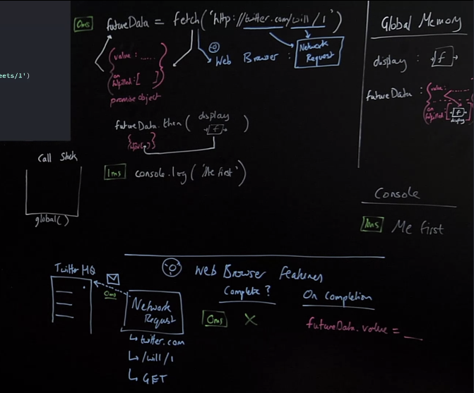
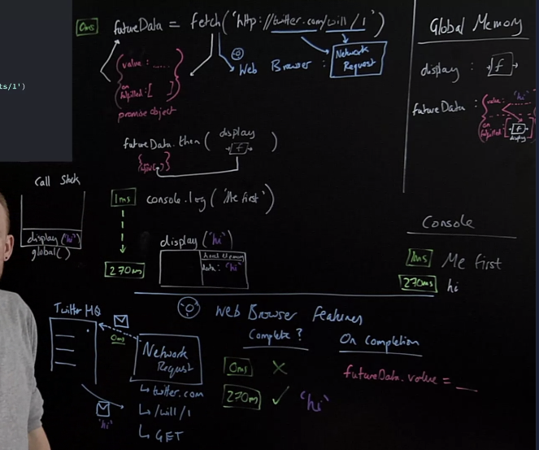

## Summary Questions
1. Speak a little about how things in that old-setTimeout, pre-ES2015 model of things were improved upon in ES6 with facade functions like `fetch`. 
2. As a refresher, why are we referring them as facade functions again? 
3. Provide a rundown of what a promise does both in the browser features and in JS. What is it? What properties does it have? How does it get it's values, etc. 

## Promises Introduction
So we are now going to move onto what changed in ES2015/ES6 world.

Until then, the model we showed previousl with `setTimeout`, was kind of just how things were; dealing with callback hell, that is until ES2015.

### ES6+ Solution (Promises)
- Using two-pronged 'facade' functions that both:  
1. Initiate background web browswer work and
2. Return a placeholder object (promise) immediately in JavaScript

Remember, setTimeout's consequences occured in the web-browser, but once that timer was started, keeping track of the fact that I've started it, or other background features, we didn't really get any way of tracking that back in JS right?

Right? Back in JS, we had no real way of visualizing all the stuff that was happening in the web-browser, that's a bit odd right? Half of what you are doing, is happening somewhere else like in the web-browser features, with us kind of getting no tracking of it, no maintaing of consistency between the state, the data I see up here in our JS application (in memory) and the stuff that is happening in the browswer.

There wasn't really a way of mapping whats happening down here in the web-browswer with what is happening up here in JS. Not ideal for us as developers to reason about.

Enter Promises. Promises, one of the most valuable pieces, that they offer in addition to their main purpose, is that they have this kind of effect of kind of saying:...

*when you trigger something in the background, don't just throw it out there, but have it have some sort of consequence in JavaScript memory as well*

This would let us have a consistency between things going on in the background (it's going to have some consequences back in JS at some point anyways). And I'm somehow keeping track of that within JavaScript memory as well.

Remember how we had our web features with their corresponding "facade functions"/labels in JS...

<table>
  <caption><b>Web Browswer</b></caption>
  <tr>
    <th>JS Core</th>
    <th>Web Browswer Features</th>
  </tr>
  <tr>
    <td>setTimeout</td>
    <td>Timer</td>
  </tr>
  <tr>
     <td>XHR/<b>fetch</b></td>
    <td>Networking</td>
  </tr>
</table>

One of those features introduced was `fetch`... (the old school label that working much in the same way as our setTimeout examle was called `XHR`)...

So with ES6, we introduced these kind of *two-pronged facade functions*, two-pronged in that:   
1. It does setup a network request in the web browswer features (in the lower half of our whiteboard example) 
2. But it also immediately has a consequence in JavaScript as well...

ES6 and `fetch` a sort of two-pronged "facade function" that kind of changed the landscape of asynchronous


This `fetch` label is gonna trigger speaking to the internet/networking in the browswer environment as XHR would, asking the data from twitter or whatever, AND, simultaneously its going to also, in JS-land  return out a special kind of object called a **promise** object. This promise object is going to sit in memory and when the background work is done in the browser, that data is going to fill in and update that object's(in JS-land) data with the data from the background.

Now, when we finish our background work, we are not surprised, that its going to have a result back in JS because we had this "two-pronged facade function" that had consequences both in the browswer and in JS.

## ES6+ Promises
```js
function display(data) {
  console.log(data);
}

const futureData = fetch('https://twitter.com/will/tweets/1');
futureData.then(display);

console.log("Me first!");
```
That little five letter command `fetch` is incredibly powerful, speak to the internet, not in JS, but in the browser. A bunch of technologies behind making `fetch` work, however it is simultaneously in JS providing us with a *promise*.

## Promises Example: `fetch`
```js
function display(data) {
  console.log(data);
}

const futureData = fetch('https://twitter.com/will/tweets/1');
futureData.then(display);

console.log("Me first!");
```
1. Declaring a function called `display` in global memory.
2. Declaring a constant `futureData`. It remains unitialized for now...
  - We can already tell that fetch call on the right hand side, it must also do something in JS, because the result of it, in JS is going to be stored on the left-hand side, from that two-pronged action.
  - So, `futureData` is going to be half of the consequence of fetch.
    - Remember, the output of the right hand side is stored on the left-hand side
    - this `fetch` is a facade function, its gonna do some JS work for us automatically, but it is also going to be doing work in the background/web-browswer.
    1. Let's do it's JS consequence first. It is immediately, in JS, going to give us a *promise*, automatically created for us by `fetch`. This promise has two properties:
        - `value` which will be undefined, and...
        - `onFufulled`: a hidden property that is going to be an empty array.
      - The output of the right hand side is stored on the left hand side, so the this promise will be stored in the `futureData` identifier. We have this little, in JS object, that reminds us of what we are running in the background.
    2. `fetch`'s other consequence occurs in the web-browser, sometimes called XHR (XML HTTP Request, essentially requesting stuff from the network).
      - The request needs to know where its going, and it gets that from the url we pass in.
      - That url is broken up to the domain name (twitter), and the path (/will/1) which will tell us the more specific location to look at on that domain.
      - So our request (`fetch` defaults to GET. If wanted to POST, we can actually pass in, to `fetch` an objbecct full of options where we can set the method to be POSTing, but it defaults to GET).
      - So at 0ms, is this request done? Nope, but it is being sent off.
      - So on completion, what is going to happen? Well remember we had that setTimeout with a function that would auto-run on the call stack on completion of the background task? Well in this case, do we see a function being passed into `fetch`?
      - That's because our two pronged facade functions take a different model, istead of a function they have this object that is keeping track that we set something up in the background, why not use it?
      - In fact, when that data does come back, it gives back a response object, that object goes (back in JS), back into the `value` property of that promise.
      - That `value` property within `futureData` that was `undefined` gets assigned the value of the returned response of the request.


>* So with ES6, we introduced these kind of *two-pronged facade functions*, two-pronged in that:   
1. It does setup a network request in the web browswer features (in the lower half of our whiteboard example) 
2. But it also immediately has a consequence in JavaScript as well by giving us a promise to contend with outcomes of the things happening in the background/browswer process.[^1]

>* We refer to things like `fetch` as *facade functions* because they aren't really fully JS. They are just kind of JS labels for functionality that typically takes place elsewhere. Since this is JavaScript, that elsewhere tends to be in the browser, but so too are there "facade functions" in Nodejs. In fact, most of the functions like `HTTP` and the like in Node are themselves these kind of "facade functions" where they have JS labels that allow us to interfact with them and interface with, but the bulk of the heavy lifting is being done by C++ code with the help of libuv and V8.[^2]


## Promises Example: `then`
So we didn't just get our data to not use it. We don't know when that data is going to come back, so we are going to need JS to somehow, when it does come back, to run some code autoamatically on it, to us it.

Well it turns out this hidden `onFufulled` property and its empty array is gonna have, or we can put in there, any number of unctions or code, that runs automatically with the help of JavaScript and be triggered to run when the value property gets filled in (in this case the data back from Twitter).

⭐ The best part, that data in the value property will be auto inserted as the input as the argument to fill in the parameter of ANY function that is stored in that `onFufulled` array.

So how do we get our function, how would we get our `display` function into that array? We can't just push that function onto that array, the reason is, it's a [[hidden]] property. Don't panic, though, JS gives us a method built in that allows us whatever we pass in as input will be grabbed and stuck in that array (which behind the scenes is essentially just doing an `futureData.onFufilled.push()`).

What can you then surmise about our code is that thing that does, this? The `.then` method. We will see later on where this method comes from, because, it's certainly not on our `futureData` object.

So.... `futureData.then(display)`. All it does is just grabs, that `display` function body and plops it right into our `onFufulled` array.

Then, finally we get to the last line, to run `console.log("Me first!");`



So say, after 270ms, we get the data back, just a little string: `'hi'`.
It actually comes back in an object form, but we can get the data back from that object. So, we've got this lovely response, but its stuck in the web browswer, how does it get back into JavaScript?

It gets back in by assigned the `futureData.value` property, which on setting triggers that `onFufulled` function, which is going to trigger our `display` function with the response object, stored in `futureData.value,` 'hi', as the argument.

So, after that 270ms, we are going to put on the callstack, `display()` which creates a new execution context...
- Note, we didn't execute the function, we didn't add these parens, these were auto stuck on for us by JS.
- In local memory we create a new label called `data` that gets assigned the value `'hi'`, which then `console.logs('hi');`

>* So our promise, setup in JS, has two properties: `value`, and `[[onFufilled]]` which is as kind of hidden property that holds an empty array. We use `.then` to essentially push functions onto the array held at `[[onFufilled]]` in order to be run. It's an array so we can add as many functions as we'd like to be processed as soon as the `value` of the promise is filled with a value. The value/response object held at `value` is automatically inserted as an argument to the parameter of every function then we added to `[[onFufilled]`. That fucnction execution isn't something we do manually, but instead something handled by JS to apply those `()` to have that function execute.[^3]




## Web APIs & Promises Example: `fetch`
So what are the rules for that deferred function being run? First let's review `then`...

### `then` method and functionality to call on completion
Any code we want to run on the retruend data must also be saved on the promise object.

Added using `.thn` method to the hidden property `[[onFufiillment]]`

Promise objects will automatically trigger the attached function to run (with its input being the returned data).

### But we need to know how our promise-deferred functionality gets back on to the call stack to be executed
[**Asynchronous**](), *as we use it essentially just means: doing code out of order from when you saw it.*


## Web APIs & Promises Example: `then`
## Web APIs & Promises Example: Microtask Queue
## Promises and Asynchronous Q&A 
## Promises Review

## Links
- [MAIN](/hardparts-js-v2-main)
----
- [PREV ← | Asynchronous JavaScript](/hardparts-js-v2-asynchronous-javascript)
- [NEXT → | ]()