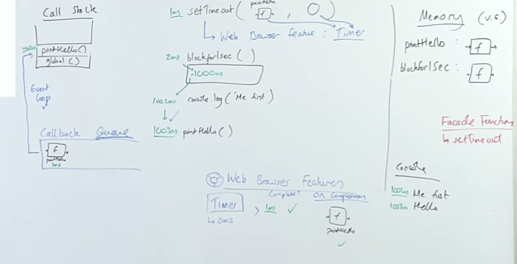

## Introducing Asynchronicity 

### Asynchronicity is the backbone of modern web development in JavaScript
JavaScript is a [**single threaded**]() (one command executing at a time) and has a [**synchronous**]() **execution model** (each line is executed in order the code appears).

So what if we need to *wait some time before we can execute certain bits of code?* Perhaps we need to wait on fresh data from an API/server request or for a timer to complete and then execute our code.

We have a conundrum - a tension between wanting to *delay some code execution* but *not wanting to blocking the thread* from ant further code running while we wait.

### Solution 1
```js 
function display(data) {
    console.log(data)
}

const dataFromAPI = fetchAndAwait('https://twitter.com/will/tweets/1');

// ... user can do NOTHING here
// ... could be 3000ms, could be half a second
// they're just clicking and getting nothing

display(dataFromAPI);

console.log('Me later!');
```
### Goals
>[^ **What are our three goals we want to accomplish with asynchronous code?**]Our three goals are... 
>
> 1. Be able to do tasks that take a long time to complete e.g. getting data from the server
2. Continue running our JavaScript code line by line without one long task blocking further JavaScript executing
3. When our slow task completes, we should be able to run functionality knowing that task is done and data is ready!

Conundrum!

**Problems**
- fundamentally untenable - blocks our single thread from running any further code while the task completes

**Benefits**
- It's easy to reason about

## Asynchronous Web Browser APIs 
> [^ **How do we solve for asynchronicity in JavaScript in the web?**]We solve it by... 
So to get around this we have to introduce a whole new world of features that happen oustide of the JS engine itself, these are the features of the web browser and their respective APIs.

The only way to solve the 3 goals listed above is to understand how these web browser features work.

## Solution 2 - Introducing Web Browswer APIs/Node background threads
```js
function printHello(){
    console.log.("Hello");
}

setTimeout(printHello, 1000);

console.log("Me first!");
```
- `setTimeout` is a web browswer feature that happens outside of JS (so therefore non-blocking), in the browswer, a feature called timer. Not really doing anything in JS except maintaining the facade function. Meaning we can continue working on other code, so we can log `"Me first!"`


## Calling the Outside World

### We're interacting with a world outside of JavaScript now - so we need rules
```js
function printHello() {
    console.log("Hello");
}

function blockFor1Sec() {
    // blocks in the JavaScript thread for 1 second
}

setTimeout(printHello,0);

blockFor1Sec();

console.log("Me first!");
```
- Remember, the *event loop* checks to make sure all synchronous code, the global and the call stack is clear before addressing any microtask or callback queues.

## Calling the Outside World Q&A 



Q: Anonymous functions are still stored in global memory they just don't have a label, but they still have a place in memory, when anything attached to or related to processing that function completes or it executes after being on the callback queue, it likely gets GC'd since we don't have a reference for it anymore.

## Wrapping up Web Browser APIs 

**Problems**  
- No problems!
- Our response data is only available in the callback function - Callback hell!
- Maybe it feels a little odd to think of passing a function *into* another function only for it to run much later
    - when you see `setTimeout(printHello, 0)`, intuitively, you might presume that we must be running `printHello` somehow inside of `setTimeout`
    - But we are absolutely not doing that. We are passing a function definition in, only for it to be invoked beyond our control, much later in the application.

**Benefits**
- Super explicit once you understand how it works under-the-hood

It may be a weird feeling to cede control to a function that operates elsewhere to return something at a later time. However if you understand under the hood, that the `setTimeout` is a pretend facade function (browser API), for functionality in the background, you know the callback is going to be passed into a queue, and allowed back into JS, yes, beyond our control, but thats the whole nature of asynchronous programming.

## Links 
**Related:**  
- [Traversy: callbacks, promises, `async`/`await`](traversy-async-js)
---
**Nav:**  
- [MAIN | Intro](/hardparts-new-main) 
- [PREV ← | Introduction](/hardparts-new-main)
- [NEXT → | Promises](/hardparts-new-promises)
 
## Summary Questions