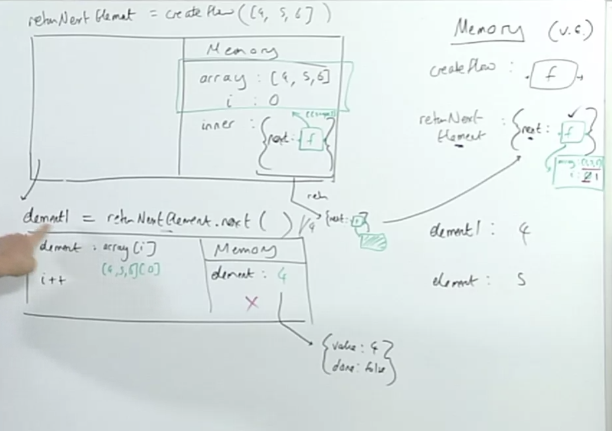
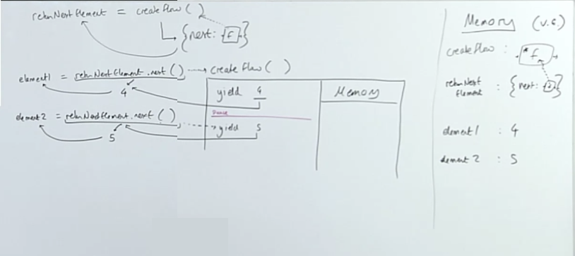
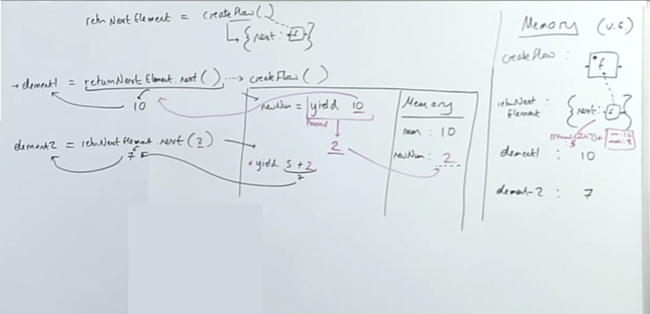
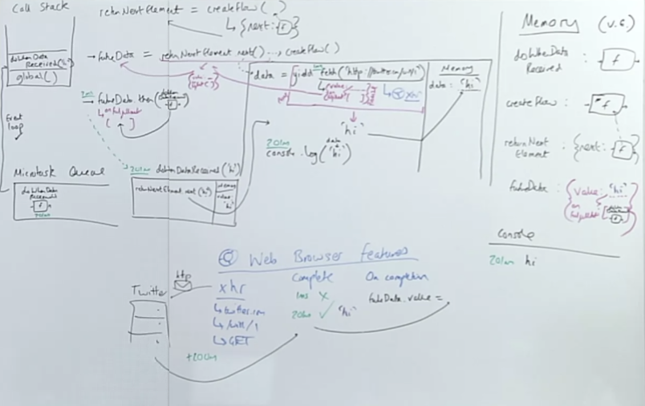

## Generators
### Once we start thinking of our data as flows...
... (where we can pick off an element one-by-one) we can rethink how we produce those flows - JavaScript now lets us produce the flows using a function 

```js
function *creatFlow() {
    yield 4
    yield 5
    yield 6
}
const returnNextElement = createFlow();
const element1 = returnNextElement.next();
const element2 = returnNextElement.next();
```
what do we hope `returnNextElement.next()` will return? But how?

But before we get to this, let's go back to something we must first understand.

### JavaScript's built in iterators are actually objects...
...objects with a `next` method that when called returns the next element from the 'stream'/flow - so let's restructure slightly...
```js
function createFlow(arr) {
    let i = 0;
    const inner = {
        next: function() {
            const element = array[i];
            i++;
            return element;
        }
    }
    return inner;
}

const returnNextElement = createFlow([4,5,6]);
const element1 = returnNextElement.next();
const element2 = returnNextElement.next();
```
And the built in iterators actually produce the `next` element in the format: `{ value:  4}`.

> [^ **How can we return out an object and still have closure over the local variable environment?**]Because remember, that a function even as a method on an object, has a "backpack" of its lexical/surrounding state even if it happens to be within an object.  We still need to define a function so it returns out the "backpack", the closure over the surrounding data. We aren't going to return out the function independently by itself, but instead as a method on an object. It's just wrapping our functions, it still gets that bond to the surrounding memory.

Objects don't get the backpack, only functions, because when that function gets called is the only way we can access that backpack of data, if its just an object with no function, there is no backpack.



What gets returned out however, is an object, with the method (that has the backpack) `.next` on it.

The way iterators are built into JS, are as objects with methods on them that are going to do the work, as opposed to just returning a function itself. JavaScript's iterators actually return out an object that looks like...
```js
{
    value: 4,
    done: false
}
```

> [^ **Why is it useful to have our iterators return out objects with a `value` property instead of just the value itself?**]Where `done` will evaluate to `true` when it is finished. Useful, because if we were checking by value, it's possible there could be a `undefined` in our collection.

Now, that we know this, we are going to start using, built in tools to give us these returnNextElement.next()  functions that when run will give us each of our elements one by one, and we are going to produce those flows of data not with an array, but by using a function.

> [^ **What do generators allow us to do that iterators do not? Why is it helpful to know how iterators are implemented to better understand generators? How are they similar and how are they different?**]With **generators**, we're actually going to define a function that has a kind of intermediate return (`yield`), they're statements that return out, our next element in our flow. Always this kind of fusion of data and functionality, now we're producing flows of data not from a collection of data but from a function. This is going to give us a behavior in JS that you would have never thought allowed. 

It uses a **star function**, known as a **generator function** to produce our flows of data. It's going to take us back in, to continue our execution of that `createFlow` function.

## Generator Functions with Dynamic Data
Let's walk through the code...
```js:title=generator-function
function *creatFlow() {
    yield 4
    yield 5
    yield 6
}
const returnNextElement = createFlow();
const element1 = returnNextElement.next();
const element2 = returnNextElement.next();
```
1. We declare in global memory a special, `*`/generator function.
2. You define a const `returnNextElement`, which is going to be the return of the output of calling `createFlow()`
3. You would think that we would be returning out an object with a method called `next`, that when we call that would us our first element.
    - `createFlow` does not go inside createFlow's execution context, instead it returns out a special generator object, with a `next` function on it, that when called, will do something fascinating.
    - so now `returnNextElement` has an object with a `next` method on it.
    - we've now finished this first call to `createFlow`
4. Our next line is declaring a const `element1` and we are now going to call this method stored in the `returnNextElement` object. So what's it going to do?
    - What this `next` does is going to open the execution context of `createFlow`, the function that get's returned on the value of `next` has an intimate bond to where it was born at `createFlow`, it's going to call the function from which it was born.
5. Inside of the execution context of `createFlow`, we encounter `yield` which is a super powerful keyword that is like `return` that exits out of the function, but its suspending the execution context, it's not ending it entirely (its not hanging out on the callstack though), it's a return statement essentially, we are going to grab that `4`, and we are going to yield it out as the output of our `returnNextElement.next();` call.
6. Same thing with `element2` except we resume where we left off, with `yield 5`.



So it's working as expected, we are getting as stream of data, only now we are producing our flows using a function, what that allows us to do is dynamically set what data flow out to us when we "turn on the tap" and give ourselves the next element. 

> We can even, set it from outside, we can sort of return back and get the execution context with new data to determien what the next result of our flow of data's going to be. We get complete control over what the next element in our flow is going to be.
In an array, `[4,5,6]`, thats set, we couldn't control that, we couldn't have logic determining what the later elements would be it was just, it was what it was. We can now control it, but it takes some really precise thinking and it may feel weird.

### This allows us to dynamically set what data flows to us (when we run `returnNextElement`'s function)
```js:title=generator-function
function* createFlow() {
    const num = 10
    const newNum = yield num
    yield 5 + newNum
    yield 6 
}
const returnNextElement = createFlow();
const element1 = returnNextElement.next();
const element2 = returnNextElement.next(2);
```
Will doesn't like saying that `createFlow()` is an innvocation, it still suggests that `returnNextElement` value is an invocation, it's not, it's the return value of an invocation that returns out the special generator object with the next keyword on it. Since its a generator functoin we also don't open any execution context for `createFlow()` on that initial call.

Then we get to `element1` which is the method call of `.next`. This though is the command to open the execution context of `createFlow`

The first thing we do is create num assign it to 10. 
The next line says, create a new const called `newNum` in memory, it's going to be the evalated result of the right hand side, however on the right hand side is a command, a super powerful command, `yield` num which is 10. It's a command that's going to throw us straight out of this execution context. So we don't get a chance to store something in `newNum`, it just returns `10 `out to `returnNextElement.next()` which evaluates to 10 and stored in `element1`

In this execution context, `newNum` never got assigned anything, execution has been "paused" just before this right hand side could evaluate to a value and be stored in `newNum` so `newNum`, isn't yet defined.

We are back out on line 9 for element2 we call returnNextElement.next(), which has us create a new execution context for `createFlow`, well, since we left off without assiging `newNum` a value, the value that we pass `.next()`, in this case `2`, is going to be the evaluated result ofhis last right-hand side work. Meaning whatever the thing evaluted to, `yield 10` was passed back out to `element1` but didn't get a chance to assign a value to `newNum`, what it does evaluate to is whatever we pass into the next `.next()` as an input.

That's the nature of these generators, is that we get to *insert data back into their local execution context as the evaluated result of the previous yield expression, the previous yield statement*.

`yield 10` isn't something we can store in `newNum`, but when we pass in the 2, which replaces or 'picks up' this piedce, is a thing we can store into `newNum`. That next yield then sees 5 + newNum, which is 2, evaluates to 7 and returns out and is stored in `element2`

If we were to run this again, we would get 6. Now we have flows of data that we have dynamic control over..

So, we are therefore storing on the `next` call, our function, our execution context before we return back into it, this isn't being kept on the call stack this whole time. We are storing two things, our backpack of data with num being 10 with newNum being 2, plus our position in the generator function, the line number and where it left off, which is stored in `[[generator location]]`

And that's all execution context really is is just line by line exeuction, if we save the line number we can resume execution at a specified moment we can return to.



## Generators Q&A 
iterators and generators are a fairly common paradigm, because traditional computer programming is very [**imperative style**](), *that is all about saying I'm going to show you exactly how I do every last thing I do*. And as time went on, we developed a more abstract *model where we talk more about let me do what I want to do*, [**declarative style**]().

## Introducing Async Generators
Functions that give us a kind of "flow of data", where we can turn on/off the "tap" so to speak, are all considered **iterators**. Anything that gives a flow element by element. 

But here, in **generators**, we are producing the flow by running through a function hitting a `yield` statement giving that as the next element in the flow, we're not running functionality to give, to generate the next element of our flow. That also means we get control manually ourselves, into a functions execution context, with the `next` method. We now have manual control of returning into a functions execution context, for the first time ever, we did so by simply keeping track of the position of where we left of using closure. We were used to storing data/state, now we're storing also the position in the execution context.

### And most importantly, for the first time we get to pause ('suspend') a function...
... being run and then return to it by calling `returnNextElement.next()`

In asynchronous javascript we want to...
1. Initiate a task that takes a long time (e.g. requesting data from the server)
2. Move on to more synchronous regular code in the meantime
3. Run more functionality once the requested data has come back

What if we were to `yield` out of the function at the moment of sending off the long-time task and return to the function only when the task is complete?

### We can use the ability to pause `createFlow`'s running and then restart it only when our data returns
```js
function doWhenDataReceived (value){
 returnNextElement.next(value)
}
function* createFlow(){
 const data = yield fetch('http://twitter.com/will/tweets/1')
 console.log(data)
}
const returnNextElement = createFlow()
const futureData = returnNextElement.next()
futureData.then(doWhenDataReceived)
```

We get to control when we return back to `createFlow` and continue executing--by setting up the trigger to do so (`returnNextElement.next()`) to be run by our function that was triggered by the promise resolution (when the value returned from twitter)

## Async Generators
This is going to be us using generators to build `async`/`await` from scratch essentially...
```js:title=async-generators
function doWhenDataReceived (value){
 returnNextElement.next(value)
}
function* createFlow(){
 const data = yield fetch('http://twitter.com/will/tweets/1')
 console.log(data)
}
const returnNextElement = createFlow()
const futureData = returnNextElement.next()
futureData.then(doWhenDataReceived)
```
This is going to bring back everything from our web-browswer features, everything from our new generator functions which themselves are an implementation of an iterator, our microtask queue, our event loop, and closures.

1. we create in memory function definition of `doWhenDataReceived`
2. we declreate a special generator function called `createFlow`
3. we hit `returnNextElement` which is declared in global memory and has returned to it, a **generator object** which has the `.next` method on it which is the thing we are interested in, that's the method when called should give us out our next value.
4. Declare a constant `futureData` which is the output of `returnNextElement.next()` which has us enter the `createFlow` execution context. The first thing we declare in our local memory is declaring a variable called `data` which is not yet defined as we encounter this super powerful right hand side statement, `yield` which kicks us out of `createFlow`'s execution context, before we ever get to store anything in `data`.
    - so `data` is going to be the evaluated result of `yield fetch('http...')` and rememember, `fetch` is a facade function that two pronged facade function. It's JS consequence, is that it is going to return out a **promise object** with two properties: `value`, `status` and the hidden `onFufilled` which is going to be an empty array of functions we want to trigger when `value` gets updated. And it's going to to be yielded out, those whole promise object is yielded out as the output of `returnNextElement.next()` which gets stored in `futureData`.
    - those functions in that hidden array, are triggered when `fetch`s background API work updates `value`.
    - Be very clear that we ARE NOT storing the promise object into `data` on line 5, remember, we don't get a chance to store anything there because `yield` is so strong a keyword, just imagine it like a `return` statement, won't ever store anything assigned to a return statement, e.g. `const whatever = return "blah"` Like this wouldn't work.
    - But we aren't finished with `fetch` as it does a wealth of stuff in the web-browser features.
        - XHR request, needs url, path, and type (defaults to `GET`), completes request setup and `futureData.value` gets updated when the request fufills.
4. `futureData.then` to which we are passing the entire function definition of `doWhenDataReceived`, to be added to that queue/hidden array property of `onFufilled`. 
5. We continue on, and our global execution context is done, so we've set up in js a promise object with a function ready  to be triggered when the value is received.
6. 200ms data comes back from request, `hi` it updates `futureData.value`, which is going to trigger the function we add to `onFufilled` with `.then` to be added on to the microtask queue to be processed, which in the event loop will see that its the only pending task, and then throw it on the call task. The value we pass to `doWhenDataReceived` is the data we got back as a response from the request, `hi`, 
7. We create an execute context of the `doWhenDataReceived` invocation, with label `value` set to `hi`.
    - Then `.next()` on the generator object is passed the string `hi`, this `.next()` takes us back into `createFlow`'s execution context at the position that it left out, where it exited with the `yield` statement. 
    - Remember whatever we pass into `next` is going to be where we left off, and where we left off was assigning `data` a value, so now `data` gets assigned the value `hi`. 
    - We then get to that `console.log('hi')`, remember because execution of the function, `createFlow` continues until it encounters a `yield` or `return`.




## Async Generators Q&A 
You can think of everything after the `yield` statement that threw out the tasks that threw out the promise object, think of everything like this as being like the functionality we want to run on the data coming back, almost think of it as being like the function that we pass in line 2, our functionality to run later, but now we get to go and write as though its synchronous code in a function. We just come back to it only when we trigger `doWhenDataReceived`.

It's still asynchronous right, we are still throwing out tasks to come back in at some point beyond our control. Then they come back in and run functionality on the return values beyond our control.

That's why solution 2, in the end is also true, it's not a wrong model, under the hood we're not doing profoundly more here, we are just increasing readability more and more, and in doing so, hiding the underlying engine more and more which is arguably a problem. If you do understand it you get the best of both worlds: increased readability and the ability to understand how its truly working.

## Links 
**Related:**  
- [Traversy: callbacks, promises, `async`/`await`](traversy-async-js)
- [HardParts v2, Closure](/hardparts-js-v2-closure)
---
**Nav:**  
- [MAIN | Intro](/hardparts-new-main) 
- [PREV ← | Iterators ](/hardparts-new-iterators)
- [NEXT → |  Async / Await ](/hardparts-new-async-await)

## Summary Questions