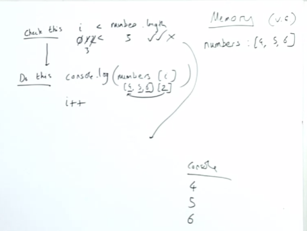

## Return Function Inside a Function
### Iterators
We regularly have lists or collections of data where we want to go through each item and do something to each element.

```js
const numbers = [4,5,6];

for (let i = 0; i < numbers.length; i++) {
    console.log(number[i]);
}
```
We're going to discover there's a new beautiful about using each element one-by-one.

Often the data we are getting back needs to be "iterated" over and maybe found from within in a collection. Wouldn't it be nice instead of just thinking about looping over each element, to instead start thinking about calling a function that would just return to us the next element from a stream of data? Instead of thinking of a collection as a static element we must manually go in and grab a piece from, but instead just thinking of data given to us one by one in a flow of data?

`for` loops demonstrate really how imperative this old way of doing things is...

> [^ **Talk through how a standard `for` loop processes things...What makes this imperative approach less than ideal?**] So let's walk through the for loop. Not quite an execution context but something a little different, let's break it up into two actions: `check this` and `do this`
- We "check this", to see if `i` which we set to `0` is less than `numbers.length` which is `3`. if it is we ...
- We "do this", we `console.log` numbers at i, then we increment i.
- So we get this `[4,5,6][0]`, where we are checking indicies that tell us what position to look at for the values in the array of that collection. We're spending cognitive effort thinking about how we're accessing the data instead of focusing on doing our operation on the data.



This highlights the problem with `for` loops in that we are so busy on focusing on how to access that we can't focus on what we want to do.

Rethinking our collection of data as instead, flows of elements we want to grab one by one will give us control over what those next elements will be.

### Programs store data and apply functionality to it...
>...[^ **What are the two parts of applying functions to a collection(s) of data?**]But there are two parts to applying functions to collections of data.
> 
>1. The process of accessing each element
>2. What we want to do to each element

> [^ **What do iterators automate for us? What would iterators have to keep track of?**]**Iterators** automate the accessing of each element--so we can focus on what to do to each element--and make it available to us in a smooth way

Imagine if we could create a function that stored `numbers` and each time we ran the function it would return out an ewlement (the next one) from `numbers`. ***NOTE***: It'd have to remember which element was next up somehow.

But this would let us think of our array/list as "stream"/flow of data with our function returning the next element from our "stream" - this makes our code more readable and more functional.

>[^ **What is the backbone, the core feature that lets iterators work?**]**But it starts with us returning a function from another function. And as that occurs in JavaScript, returning with that function, a closure around its original state**

### Functions can be returned from other functions in JavaScript
Do not get complacent about what the following code is doing. **Remember, that we never return to previous lines of code. We always finish our line of code, we're done with it, store whatever the result of it was in th right-hand side (of whiteboard) in memory and then we move on.**

```js
functoin createNewFunction() {
    function add(num) {
        return num+2;
    }
    return add2;
}

const newFunction = createNewFunction()
const result = newFunction(3);

```
If we didn't have parens on this `const newFunction = createNewFunction()`, it would just be created another label for the function body of `createNewFunction`. Instead, we are saying to call that function and return what comes back.

When we get to `add2`, we are storing the whole function defintion in the label `add2` but when we retun it, we aren't taking with it the label, just the function body which gets stored in `newFunction`

Remember, we as developers are going to loop back at the definition of add2 to understand what its going to do, but JavaScript is not going to do that, it already passed out that function definition into `newFunction`, and what it sees is the function body returned which previously had the label `add2`.

When we get to calling `newFunction(3)`, remember, do not think that JS when it sees it, is going, "huh, what is newFunction, I better check the line before." No. The line before will never be returned to, the line before, created an execution context, inside of which it created `add2` and returned out the function body. newFunction never ever cares about `createNewFunction` again, after that first invocation. 

## Return Next Element with a Function
When we return a function from another function we get a profound "bonus", **closure**. 

#### We want to create a function that holds both our array, the position we are currently at in our 'stream' of elements
```js
function createFunction(array) {
    let i = 0;
    function inner() {
        const element = array[i]
        i++;
        return element;
    }
    return inner;
}
const returnNextElement = createFunction([4,5,6]);
const element1 = returnNextElement();
const element2 = returnNextElement();
```
How can we access the first element of our list?

We need to have a function when when run, somehow remembers its previous running. How the hell can we do that given, a function gets deleted/GC'd after its (optionally) returned something and completed its execution?

As soon as we define our `inner` function, we got a bond to all the surrounding live memory, you can call it state, the enironment, the live memory, the data around the function definition, we got a bound to it, all the surrounding data. Out on the back of the life function definition, so too did we bring along the "state" in that function on a hidden property called `[[scope]]`.

When we can't find the definition of `array` or `i`, we don't go immediately to global, we instead go to our function definition and check to see if there is a "backpack" of data that was brought out with the function, and yes, there is.

We have a function now, that when born, got attached to its very definition, the underlying state/data from which it's going to extract and return to us, on its call, the individual elements from that underlying collection of data, and its keeping track of which one is next using this tracking value, all bundled up on that same function. It's very elegant, to have everthing all bundled up like that.

>[^ **⭐ What is a powerful "paradigm" to think of that closures give us?**]⭐ I think that instead of just simply thinking about closures in term of "retained memory of state", its nice to consider them as being vehicles for encapsulation, in that they carry with them, not only their functionality, but the data they might mutate along with them. And since you can't access the data within `[[scope]]` without calling the function itself, you can consider this as JavaScript's closest thing to true encapsulation (public/private methods notwithstanding).

## Iterator Function
### The bond
- When the function `inner` is defined, it gets a bond to the surrounding Local Memory in which it has been defined.
- When we return out `inner`, that surrounding live data is returned out too--attached on the "back" of the function definition itself (which we now give a new global label `returnNextElement`)
- When we call `returnNextElement` and don't find `array` or `i` in the immediate execution context, we look into the function definition's "backpack" of persistent live data
- The 'backpack' is officially known as '**closure**', but so to is the whole concept of functions persisting their lexical scope references/surrounding data, referred to as **closure**.
>- [^ **What would be more explicit names for a closure and the concept of closures itself?** ]An alternative name for the "backpack" could be [**Persistent Lexically Scoped Reference Data (PLSRD)**](). Again, lexically just means at place of birth.
>- You may also remember that the local memory is sometimes call the **Variable Environment**. So you can think of the bit that has been closed over the [**Closer Over Variable Environment (C.O.V.E)**]().
- Whatever you call it, closures, enable us to have our functions have "memories", not their local memory that gets deleted each time, but a persistent cache of data that gets attached to their very definition. 

[^ ⭐ **So, if we ever want a function itself to have bundled with it some kind of memory or retained state of itself and its history, what is the only way we can create it**]⭐ Also, the only way to get a backpack is to return the function from another function and bring with it the data that was defined in the outer function, that's how you get that persisent data.

### `returnNextElement` has everything we need all bundled up in it
1. Our underlying array itself
2. The position we are currently at in our 'stream' of elements
3. The ability to return the next element

This relies completely on the special property of functions in JavaScript that when they are born inside other functions and returned - they get a backpack (closure).

The "proper" name for `returnNextElement` is an **iterator** function.

### So iterators turn our data into "streams" of actual values we can access one after another
Now we have functions that hold our underlying array, the position we're currently at in the array, *and* return out the next item in the "stream" of elements from our aray when run.

> [^ **What is the main conceptual advantage of iterators?**]This lets us have `for` loops that show us the element itself in the body on each loop *and more deeply* allows us to rethink arrays as flows of elements themselves which we can interact with by calling a function that switches that flow on to give us our next element.

> We have truly "decoupled" the process of accessing each element from what we want to do to each element.

## Iterator Challenge Questions:
http://csbin.io/iterators

**Challenge 2**  
Create an iterator with a next method that returns each value of the array when .next is called.
```js
function nextIterator(arr) {
  let i = 0;
  const iterator = {
    next: function() {
      const val = arr[i];
      i++;
      return val;
    }
  }
  return iterator;
}
```
- You can return an object with a method that still retains access to the live data.

**Challenge 3**  
Write code to iterate through an entire array using your nextIterator and sum the values...
This brought up something interesting, I still found myself reaching for `for` loops to iterate over a set amount of times, the solution they provide is using a `while` loop so that, so long as the returned value isn't undefined, or so long as a value is returned it iterates.
```js
// CHALLENGE 3

function sumArray(arr) {
  // YOUR CODE HERE
  // use your nextIterator function
  let accumulator = 0;
  let iterator = nextIterator(arr);
  let next = iterator.next();
  while(next) {
    accumulator += next;
    next = iterator.next();
  }
	return accumulator
}

// Uncomment the lines below to test your work
const array4 = [1, 2, 3, 4];
console.log('Challenge 3', sumArray(array4)); // -> should log 10
```
I just reached for `reduce` which was pretty redundant as I wasn't really using `iterator.next()` in any meaningful way, so I just implemented it with `forEach` which still really wasn't using the iterator portion that meaningfully....
```js
function sumArray(arr) { 
  const iterator = nextIterator(arr); 

  let total = 0;

  arr.forEach(val => {
    total += iterator.next();
  });

  return total;
}
```

## Links 
**Related:**  
- [Traversy: callbacks, promises, `async`/`await`](traversy-async-js)
- [HardParts v2, Closure](/hardparts-js-v2-closure)
---
**Nav:**  
- [MAIN | Intro](/hardparts-new-main) 
- [PREV ← | Promises ](/hardparts-new-promises)
- [NEXT → | Generators ](/hardparts-new-generators)

## Summary Questions