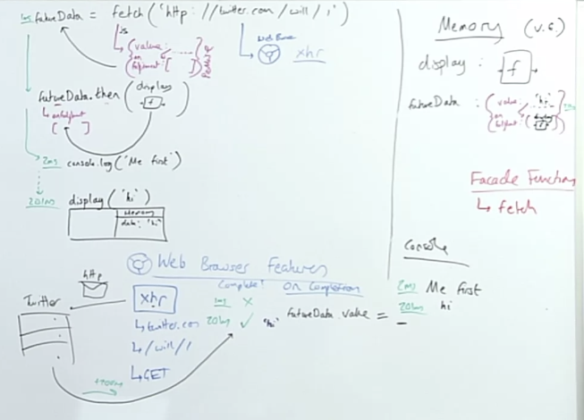
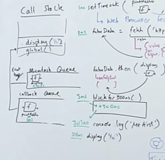

## Introducing Promises 

### Introducing the readability enhancer - Promises
- Special objects built into JS that get returned immediately when we make a call to a web browser API/feature (e.g. `fetch`) that's set up to return promises (not all are)
- **Promises** act as a placeholder for the data we hope to back from the web browswer feature's background work
- We also attach the functionality we want to defer running until that background work is done (using the built in `.then` method)
- Promise objects will automatically trigger that functionality to run   
    - The value returned from the web browswer feature's work (e.g. the returned data from the server using `fetch`) will be that function's input/argument 

## Promises

### Solution 3 - Using two-pronged "facade" functions that...
...both initiate background web browswer work *and* return a placeholder object (promise) immediately in JavaScript
```js 
function display(data) {
    console.log(data);
}

const futureData = fetch('https://twitter.com/will/tweets/1');

futureData.then(display); // Attaches display functionality

console.log("Me first!"); 
``` 
- `fetch` is giving us that JS consequence, a placeholder object, a **promise** that we will be able to reference elsewhere in our code with the expectation that value will be fufilled.

- So we might think we could say something like, go display futureData.value, but the problem is we have no idea when that value is going to be updated. So there is no way right now, no way in our synchronous processing of existing code to say something like, `display(futureData.value)` or something like that, because we have no idea when it's going to evaluate to a value.
    - The only place that is going to know when this value comes back is this `fetch` two-pronged facade function, so we are going to attach functions to that object, push them into an array that are going to be auto-triggered when the value gets updated.
    - By the way, we we triggering those functions with `value` (the requested data) passed into those functions.
    - So the thing that gets returned out from `fetch` on the JS side, is known as a *promise object*, that looks like ...
    ```
    { 
        value: //...,
        onFufilled: [ ...fns]
    }
    ```
    - That promise object gets stored in global memory with the label `futureData`  
    - `fetch` also has its browser consequence, making the XHR (XML HTTP Request), and it defaults to making a `GET` request.
    - That returned data is eventually going to be assigned to the `value` property on the promise object.
- When we hit `futureData.then`, Will dislikes the naming of then, because it makes people think that we're somehow going to return to that line and THEN call `display`.  
    - it is fundamentally not doing that, well, where do we put our funtcions to be auto-called when our `value` property of `futureData` gets assigned a value? In `futureData.onFufilled`. All `then` does is putting the whole function definition of `display` into the array of `futureData.onFufilled`, that's all that `.then` is doing. 
    - Will would instead name `then` to something like `store-function-we-want-to-auto-trigger-on-value-property-being-updated`.
    - That makes, that when our value gets updated we are gonna check that array stored in the `onFufilled` property of `futureData` *for functions to be auto-run WITH the data that is being returned from the request as the argument*.
    - We get that display function in there by passing it via the `then` method.

With promises we've still achieved our 3 goals:  

1. set of tasks that takes a long time in the browser
2. continue running through js code without blocking
3. when our data does come back then-auto trigger functionality at the moment with the returned data as an argument.



## Promises & Microtask Queue
### But we need to know how our promise-deferred funcionality gets back into JavaScript to be run
```js
function display(data) { console.log(data); }
function printHello() { console.log("hello"); }
function blockfor300ms() { /* blocks js thread for 300ms */}

setTimeout(printHello, 0);

const futureData = fetch('https://twitter.com/will/tweets/1');
futureData.then(display);

blockfor300ms()

// Which will run first?

console.log("Me First!");
```
We need a way of queuing up all this deferred functionality.

- JS has an additional queue called the *microtask que*, the spec calls it the [**job queue**](https://www.ecma-international.org/ecma-262/7.0/#sec-jobs-and-job-queues)
- Promises, get queued in the microtask queue which takes precedence over the callback queue, which is referred to as the **task queue** in the spec.

- *FYI, the spec is just guidance on how things should be implemented JS engine-makers may not always follow the spec 1-to-1 but they do for the most part, 99% of the time.*



You can think of the microtask queue as kind of like being a while loop that as long as it has stuff in it will keep processing it and never get to the callback queue.

[^ **Talk a bit about the 3 states/status of promises, how do we handle errors?**]Promises have 3 states: pending, resolved, rejected. Defaults to pending when it starts out. When that status property is updated, to resolved, that is actually what triggers on the `onFufilled` functionality but they happen at the same time. If the status comes back with rejected, that won't trigger the `onFufilled` functions, it will trigger the `onRejection` functions. 
    - We get functions into the `onRejection` array by using `.catch` to catch rejections there to be handled. We can also pass in a second argument to `.then` which would get passed to `onRejection`.
 
## Wrapping up Promises

**Problems:**   
- 99% of developers don't deeply understand how they're working under the hood, making debugging more difficult

**Benefits:**  
- Cleaner readable style with pseudo-synchronous style code
- Nice error handling process 

Promises, Web APIs, the Callback & Microtask Queues and Event loop allows us to defer our actions until the 'work' (an API request, timer etc) is completed and continue running our code line by line in the meantime.

Asynchronous JavaScript is the backbone of the modern web -- letting us bulid fast "non-blocking" applications.

## Links 
**Related:**  
- [Traversy: callbacks, promises, `async`/`await`](traversy-async-js)
---
- [MAIN | Intro](/hardparts-new-main) 
- [PREV ← | Asynchronous JavaScript ](/hardparts-new-asynchronous-javascript)
- [NEXT → | Iterators](/hardparts-new-main-iterators)

## Summary Questions