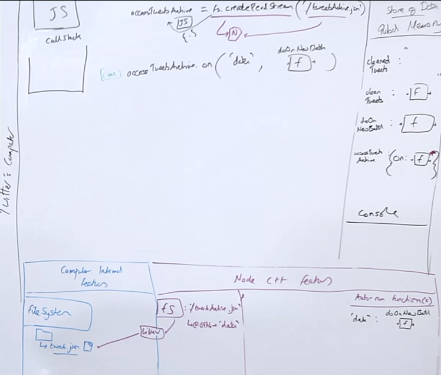

## Introducting Node Streams

### What if Node used the ‘event’ (messagebroadcasting) pattern to send out a message (‘event’) each time a sufficient batch of the json data had been loaded in
And at each point, take that data and start cleaning it - in batches
```js
let cleanedTweets = "";
function cleanTweets (tweetsToClean){
 // algorithm to remove bad tweets from `tweetsToClean`
}
function doOnNewBatch(data){
 cleanedTweets += cleanTweets(data);
}
const accessTweetsArchive = fs.createReadStream('./tweetsArchive.json')

accessTweetsArchive.on('data', doOnNewBatch);
```

Feel like there might be an issue though with this, b/c we have a feeling that the data is going to come in in chunks and what if the next chunk is coming in when the current chunk hasn't been fully process?

We're going to need some really strict rules that are established to handle the running of the next function in. That's going to lead us to ... **Introducing Event loop and Callback Queue**

## Node Streams Overview

The default batchsize is 64 kilobytes. They call it the **high watermark**. Any read or flow of data is regulated by size allowances. Chunks of 64 kilobytes.

What a stream is in Node and CS is chunks, less a stream more like buckets of water.

Streams sound so much more intimidating like a deluge. Buckets of 64kb are much easier to manage, so every time a bucket is filled Node is going to broadcast as message, `data` that we are going to have auto-run at that moment back in JS, again and again and again.

⭐ This is Node's pride and joy feature. This asynchronous handling of streams. This is the super efficient for handling large scale data and want to continue moving in a single threaded environment and not block any code from running. People love the design pattern of Node.

## Setting Up the Stream

```js
let cleanedTweets = "";
function cleanTweets (tweetsToClean){
 // algorithm to remove bad tweets from `tweetsToClean`
}
function doOnNewBatch(data){
 cleanedTweets += cleanTweets(data);
}
const accessTweetsArchive = fs.createReadStream('./tweetsArchive.json')

accessTweetsArchive.on('data', doOnNewBatch);
```
We are using the NodeC++ feature fs with the `createReadStream` and pass it this json file.
- Setting this up is going to tell libuv to get the file based on the string path we passed in.

Once this NodeC++ feature handler sets up, it returns immediately to JS an object with methods that will allow us to edit the NodeC++ context/environment/connection/open-stream instance, and it stores that Object that gives us "edit/interactive" access with the left-side reference we store its call to which we've named `accessTweetsArchive`

This returned object has a connection to this particular open stream of data or open access point of this particular file.

Again, Node is just trigger background feature, setup auto-run function, have it auto run when the background feature finishes its work, have auto inserted data from node. That's all this is again and again and again.

So now, we need an auto run function that we need to run on an event, which we do on the next line with `accessTweetsArchive.on('data', doOnNewBatch);`



## Processing Data in batches
- The stream only starts getting data once we set the on data event.
- 


## Links
- [PREV ← | File System](/hardparts-servers-and-nodejs-file-system)
- [NEXT → |]()
