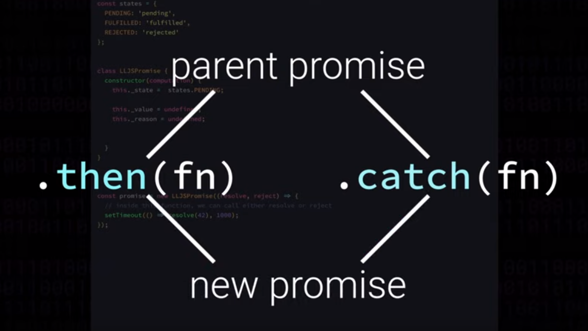

## The Past
Remember when all asynchronous code was written with callbacks and the dangers of **callback hell**? Promises saved us from that... 

## Promises
When promises came along they allowed for...

- flatter
- cleaner
- more readable

asynchronous code.

Promises are now built into every major part of the language.

### Terminology
Source: https://promisesaplus.com/

- [**“promise”**]() is an object or function with a then method whose behavior conforms to this specification.
- [**“thenable”**]() is an object or function that defines a then method.
- [**“value”**]() is any legal JavaScript value (including undefined, a thenable, or a promise).
- [**“exception”**]() is a value that is thrown using the throw statement.
- [**“reason”**]() is a value that indicates why a promise was rejected.

## Recreating a promise
### Addressing the `computation` function
We are going to write a class called `LLJSPromise`
- Just like any other promise, it's going to take in a `computation` function in the constructor as a parameter.
- the `computation` function is one that receives, as arguments, a `resolve` and a `reject` function
    ```js {1}
    const promise = new LLJSPromise((resolve, reject) => {
        // Inside this function, we can call either resolve or reject
        setTimeout(() => resolve(42), 1000);
    })
    ```
- The user of the function can call either one of these functions when they are done when they are done with the async stuff they need to do.
- As implementors of the promise class its going to be our responsiblity to write and inject those functions into the user's `computation` function.

## Properties of our Promise class
- We'll get that, but first, let's return to the constructor and add some private properties to the class that will keep track of and control the mechanics...

### The first of these is `_state`
- the state can be any of 3 states: `pending`, `fufilled`, or `rejected`
- if we we can say that a promise is either fufilled or rejected we can consider the promise **settled**
```js {3}
class LLJSPromise {
    constructor(computation) {
        this._state =  
    }
}
```
- let's put all these state into an object so we don't have to use strings everywhere
- A promise always starts out in the pending state, because the computation has not yet begun running.
```js {1-5,8}
const state = {
    PENDING: 'pending',
    FUFILLED: 'fufilled',
    REJECTED: 'rejected'
}
class LLJSPromise {
    constructor(computation) {
        this._state = states.PENDING 
    }
}
```
### Settled properties: `_value` and/or `_resaon`
A promise, when it settles will have either a final value or a reason that it rejected. so let's add those as well...
- we can set them now to `undefined` as we are in the pending state.
```js {10-11}
const state = {
    PENDING: 'pending',
    FUFILLED: 'fufilled',
    REJECTED: 'rejected'
}
class LLJSPromise {
    constructor(computation) {
        this._state = states.PENDING 

        this._value = undefined;
        this._reason = undefined;
    }
}
```

### The main ways we interact with a promise
>- ⭐ The main ways we interact with a promise is by calling `.then(fn)` and/or `.catch(fn)` methods.  
- Both of these end up creating new promises, which are dependent on the result of the parent promise



- mechanically speaking we will need a way to communicate with these promises which are created based on this, the parent, promise.
- the first step in doing this is tracking those promises in a queue which we will model as an array.
```js {13}
const state = {
    PENDING: 'pending',
    FUFILLED: 'fufilled',
    REJECTED: 'rejected'
}
class LLJSPromise {
    constructor(computation) {
        this._state = states.PENDING 

        this._value = undefined;
        this._reason = undefined;

        this._thenQueue = [];
    }
}
```

### `.finally`
- `.finally` will also create new promises so we need to keep track of those in another queue...
```js {14}
const state = {
    PENDING: 'pending',
    FUFILLED: 'fufilled',
    REJECTED: 'rejected'
}
class LLJSPromise {
    constructor(computation) {
        this._state = states.PENDING 

        this._value = undefined;
        this._reason = undefined;

        this._thenQueue = [];
        this._finallyQueue = [];
    }
}
```
### Running the `computation` function
The last thing we need to do in the constructor is actually running the `computation` function.

- first we will actually check that we got a function. and if we did, we then need to run it, injected two private methods: 
    - one called `onFufilled` and ...
    - another called `onRejected`
- Both of these methods will be bound with the current promise, so that when they are actually called, internally they will have the `this` value we would expect.
```js {16-23}
const state = {
    PENDING: 'pending',
    FUFILLED: 'fufilled',
    REJECTED: 'rejected'
}
class LLJSPromise {
    constructor(computation) {
        this._state = states.PENDING 

        this._value = undefined;
        this._reason = undefined;

        this._thenQueue = [];
        this._finallyQueue = [];

        if (typeof computation === 'function') {
            try {
                computation(
                    this._onFufilled.bind(this);
                    this._onRejected.bind(this);
                );
            } catch (ex) {}
        }
    }
}
```
- Now this `computation` function could also throw an error, we can safely catch that with a `try` `catch` block, we'll come back later to the `catch` block.
- we are pretty much done with our constructor now, except...

### Making sure synchronous code executes prior to `computation` callback
- Here is the tricky part: the spec says this...

> `onFulfilled` or `onRejected` must not be called until the **execution context** stack contains only platform code. [3.1].

- Essentially we just have to wait for all synchronous code to complete, and delay the running of the user's `computation` function, until the next cycle of the event loop. 
-[^ **In our homebrew Promise, how do we make sure the event loop processes the rest of the sychnronous code outside of this promise?**] to get around this we are giong to use a `setTimeout` with no time delay.
```js {17,24}
const state = {
    PENDING: 'pending',
    FUFILLED: 'fufilled',
    REJECTED: 'rejected'
}
class LLJSPromise {
    constructor(computation) {
        this._state = states.PENDING 

        this._value = undefined;
        this._reason = undefined;

        this._thenQueue = [];
        this._finallyQueue = [];

        if (typeof computation === 'function') {
            setTimeout(() => {
                try {
                    computation(
                        this._onFufilled.bind(this);
                        this._onRejected.bind(this);
                    );
                } catch (ex) {}
            });
        }
    }
}
```

## Defining our methods
So we already know of at least 5 methods we need to implement: `.then`, `.catch`, `.finally` and our two private methods: `_onFufilled`, and `_onRejected`
```js {28-32}
const state = {
    PENDING: 'pending',
    FUFILLED: 'fufilled',
    REJECTED: 'rejected'
}
class LLJSPromise {
    constructor(computation) {
        this._state = states.PENDING 

        this._value = undefined;
        this._reason = undefined;

        this._thenQueue = [];
        this._finallyQueue = [];

        if (typeof computation === 'function') {
            setTimeout(() => {
                try {
                    computation(
                        this._onFufilled.bind(this);
                        this._onRejected.bind(this);
                    );
                } catch (ex) {}
            });
        }
    }

    then() {}
    catch() {}
    finally() {}
    _onFufilled() {}
    _onRejected() {}
}
```

### Let's start with the `_onFufilled` method
Now before writing the logic, let's revist our promise example from earlier, where we said `resolve(42)`. This promise will resolve after 1000ms with the value 42. When it calls the `resolve` function, it's actually calling our internal `_onFufilled` method. 

So what do we actually want to do when this method is called?, well we should...

1. change the state to `FUFILLED` and 
2. record the last `value` we got.

And after that, any proimses that were created by calling `.then()`, `.catch`, or `.finally`. The ones in the `then` queue and then `finally` queue, those should be informed of this new value so they can begin using that value to compute their own new state.

The logic that deals with communicating with the queues is going to be placed within a method called, `propogateFufilled`, which we will write shortly...

But, we need to wrap all of this code in a check, because one of the rules of promises, is that once they have settled with a `value` or a `reason`, they have that `value` or `reason` forever. In other words, we should only do these actions if we are in a pending state.

Most of this is more or less mirrored in `_onRejected`, the only difference is that we are going to a rejected state and setting a `reason` instead of a `value`. And when we propagate this we need to call a different method we will call `_propagateRejected`
```js {31-46}
const state = {
    PENDING: 'pending',
    FUFILLED: 'fufilled',
    REJECTED: 'rejected'
}
class LLJSPromise {
    constructor(computation) {
        this._state = states.PENDING 

        this._value = undefined;
        this._reason = undefined;

        this._thenQueue = [];
        this._finallyQueue = [];

        if (typeof computation === 'function') {
            setTimeout(() => {
                try {
                    computation(
                        this._onFufilled.bind(this);
                        this._onRejected.bind(this);
                    );
                } catch (ex) {}
            });
        }
    }

    then() {}
    catch() {}
    finally() {}
    _propagateFufilled() {}
    _propagateRejected() {}
    _onFufilled(value) {
        if (this.state === states.PENDING) {
            this._state = states.FUFILLED;
            this._value = value;
            this._propagateFufilled();
        }
    }
    _onRejected(reason) {
        if (this.state === states.PENDING) {
            this._state = states.REJECTED;
            this._reason = reason;
            this._propagateRejected();
        }
    }
}
```

### Let's write out the most interacted with method, `.then`
- `then` actually takes two arguments, those its more often called with one. 
- The first is a function that transforms the value if the promise is fufilled
- the second is another function that transforms the reason if its happens to reject
- ⭐`then`, along with `catch` and `finally` will always return a new promise

#### Promises return new promises
This feels intuitive, if you have a piece of code that looks like this...
```js
const p = new Promsie((resolve, reject) => 
    resolve(42);
);
const promisePlusOne = p.then(x => x + 1 );
const promiseMinussOne = p.then(x => x - 1 );
```
- You would expect that `promisePlusOne` would have no effect on `promiseMinussOne`
> ⭐ So nothing we do to the originally promise can modify it's value once it's settled.

#### Creating that new promise
So we'll create a new promise but not pass in a `computation` function. That is going to give us a promise that is always in the pending state.

We name this promise `controlledPromise`, because we are in control of how it changes state rather than the user's `computation` function. 

So we can push an array into the `thenQueue` queue and that will contain:

1. The controlled promise: `controlledPromise`
2. its fufulled transforming function: `fufilledFn`
3. it's rejected transforming function: `catchFn`

In order to actually update the controlledPromise state, the parent promise we are writing must be settled, so at the time that the user calls `.then` it could be that by then we are already settled, so we can actually check for that right here in our `then` method...
    - if the state of the parent promise is fufilled, but the user called `.then` after it happened, we want to propagate that information to any and all the promises in the `thenQueue`, including the one being created from this very call....
    - We can do the same thing for `_propagateRejected`
    - and of course, if the parent promise is not not in the `fufilled` or `rejected` state then it must still be pending. Meaning the `controlledPromise` has to wait.

```js {28-39}
const state = {
    PENDING: 'pending',
    FUFILLED: 'fufilled',
    REJECTED: 'rejected'
}
class LLJSPromise {
    constructor(computation) {
        this._state = states.PENDING 

        this._value = undefined;
        this._reason = undefined;

        this._thenQueue = [];
        this._finallyQueue = [];

        if (typeof computation === 'function') {
            setTimeout(() => {
                try {
                    computation(
                        this._onFufilled.bind(this); //this should be commas?
                        this._onRejected.bind(this);  // no comma
                    );
                } catch (ex) {}
            });
        }
    }

    then(fufuilledFn, catchFn) {
        const controlledPromise = new LLJSPromise();
        this._thenQueue.push([controlledPromise, fufilledFn, catchFn]); 

        if (this._state === states.FUFUILLED) {
            this._propagateFufilled();
        } else if (this._state === states.REJECTED) {
            this._propagateRejected();
        }

        return controlledPromise;
    }
    catch() {}
    finally() {}
    _propagateFufilled() {}
    _propagateRejected() {}
    _onFufilled(value) {
        if (this.state === states.PENDING) {
            this._state = states.FUFILLED;
            this._value = value;
            this._propagateFufilled();
        }
    }
    _onRejected(reason) {
        if (this.state === states.PENDING) {
            this._state = states.REJECTED;
            this._reason = reason;
            this._propagateRejected();
        }
    }
}
```
### Writing `propogateFufilled`

Now that our promises are able to resolve properly, we can chain the promises together with `.then` and finally we can implement the `propogateFufilled` method.

The goal of the `propogateFufilled` method is to communicate with the promises what we have in the queues. The ones which are dependent on the value of this (the parent promise) resolving.

That means we can loop through the `_thenQueue`, destructuring the `controlledPromise` and its `fufuilledFn`, this `fufuilledFn` might not be defined so we have to check that it is indeed a function before we do anything else.

```js {42-48}
const state = {
    PENDING: 'pending',
    FUFILLED: 'fufilled',
    REJECTED: 'rejected'
}
class LLJSPromise {
    constructor(computation) {
        this._state = states.PENDING 

        this._value = undefined;
        this._reason = undefined;

        this._thenQueue = [];
        this._finallyQueue = [];

        if (typeof computation === 'function') {
            setTimeout(() => {
                try {
                    computation(
                        this._onFufilled.bind(this);
                        this._onRejected.bind(this);
                    );
                } catch (ex) {}
            });
        }
    }

    then(fufuilledFn, catchFn) {
        const controlledPromise = new LLJSPromise();
        this._thenQueue.push([controlledPromise, fufilledFn, catchFn]); 

        if (this._state === states.FUFUILLED) {
            this._propagateFufilled();
        } else if (this._state === states.REJECTED) {
            this._propagateRejected();
        }

        return controlledPromise;
    }
    catch() {}
    finally() {}
    _propagateFufilled() {
        this._thenQueue.forEach(([controlledPromise, fufilledFn]) => {
            if (typeof fufilledFn === 'function') {
                const valueOrPromise = fufuilledFn(this._value);
            }
        });
    }
    _propagateRejected() {}
    _onFufilled(value) {
        if (this.state === states.PENDING) {
            this._state = states.FUFILLED;
            this._value = value;
            this._propagateFufilled();
        }
    }
    _onRejected(reason) {
        if (this.state === states.PENDING) {
            this._state = states.REJECTED;
            this._reason = reason;
            this._propagateRejected();
        }
    }
}
```

- This `fufuilledFn` is used to calculate the `value` or the rejection `reason` of the `controlledPromise`.
    - It takes as the argument, the value of it's parent proimse
    - what this function returns might be a regular JS value, but it also might be another promise
    - when it returns a promise it **assimilates** it (a fancy way of saying: waits for it to settle) and then uses its value, in order to check that its a promise we could say something like `if (valueOrPromise instanceof LLJSPromise) {}`, but the spec states we should do this check in a much more relaxed way
        - essnetially we should only be checking if the value of promise has a `.then` method.  
            - if it does we should treat it like a promise
            - so let's write a quick utility function for this called `isThenable`.... 

### `isThenable`
We write a utility function to check if we are dealing with a promise or a normal value.
```js 
const isThenable = maybePromise => maybePromise && typeof maybePromise.then === 'function';
```
Now we can check if we are dealing with a promise or if we are dealing with a normal value. 

If it is a promise we need to wait for it to settle, taking on a value or a rejection reason and pass that result to the `controlledPromise`, thankfull that's as easy as 

Timestamp: at 12m15s. 

## Key Insights
- What are we trying to do with a proimse? 
- A proimse returns another promise. However nothing we do to the original promise can modify it's value once it's settled.


## Links
- [HP: Promises](/hardparts-js-vs-promises)

## Summary Questions 