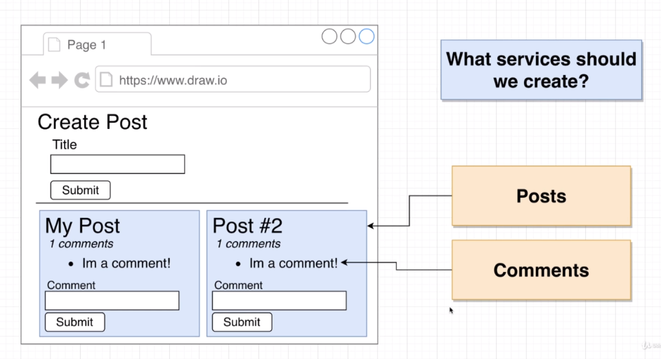
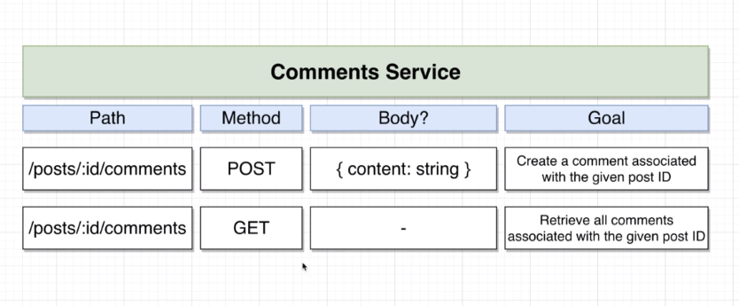
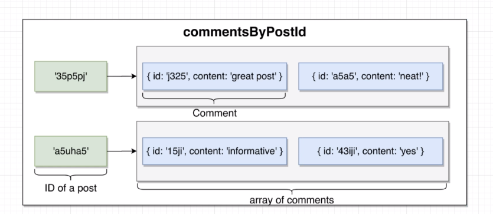
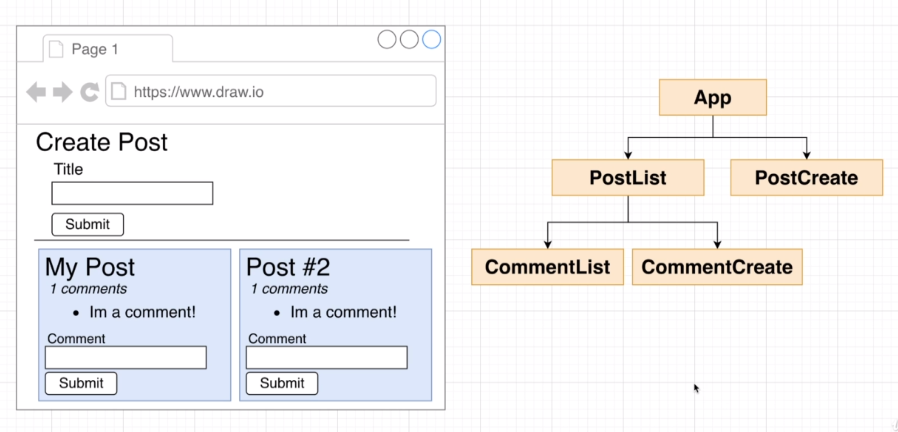

 
## App Overiew 
- Goal 1: get a taste of microservices architecture
- Goal 2: Build as much as possible from scratch 

Do not use this project as a template for future microservices stuff (we will build a better template later)

What services should we create?
- For now we will create one separate service for each *resource* in our app 
    - posts and comments 



> So when thinking about our services, the first thing we want to do is, **picture the goals and responsibilities of each service**.

For our posts we probably want to...**(a)** Create a post and **(b)** List all posts 

For our Comments **(a)** Create a comment and **(b)**List all comments 

However, this is more complex than at first glance because we are going to need to tie comments to posts, so we will need some async communication between the posts.

## Project Setup  

### Initial Setup 
- Generate a new React App using `create-react-app`
- Create an Express-based project for the **Posts** service 
- Create an Express-based project for the **Comments** Service.

Create a new dir called `blog`, in blog we will `npx create-react-app client`
In another term window, create a dir in blog called posts, and npm init, and npm i `express`, `cors`, `axios`, and `nodemon`.
Repeat the same process for comments.  

## Posts Service Creation 
Whenever you start designing a service or putting it together it really is worth the time to really think critically about exactly what you want our service to do.

Let's just spin up a small express app that will be our posts service...
```js 
const express = require('express');
const bodyParser = require('body-parser');
const { randomBytes } = require('crytpo');

const app = express();
app.use(bodyParser.json());

// object that will store all our posts (temporary storage)
const posts = {};

app.get('/posts', (req, res) => {
    res.send(posts);
});

app.post('/posts', (req, res) => {
    const id = randomBytes(4).toString('hex');
    const { title } = req.body;

    posts[id] = {
        id, title
    };

    res.status(201).send(posts[id]);
});

app.listen(4000, () => {sssssssss
    console.log('Listening on 4000...');
})
```
- `.get` handles sending back all posts whenever someone visits the posts route
- We use the `.post` handler, to create our posts.
    - We bring in randomBytes from the crypto library to generate a random id. 
    - We use `randomBytes` to generate a random id by specifying the number of randomBytes to make an id, we then convert it to a string in hexidecimal format. Will look like a random hex value. 
    - Next we will take a look at the req made by a user, 
    - We are going to make the assumption that the user when making a post request are going to be sending along a body property inside of it.
        - We grab the title the user just sent to with `const { title } = req.body` 
        - We create a new post on the posts object by specifying the random id: `posts[id]` and then we set that object up with the `id` and the `title.` 
- We then need to send something back to the user to let them know that their post was successful: `res.status(201).send(posts[id]);`
    - Reminder: a status code of **201** = **Created**: The request has been fulfilled and has resulted in one or more new resources being created.
- The last thing we need to do is make sure we need to add in a body parser. To make sure whenever a user sends us some data in the body of a request that it actually gets parsed, and shows up appropriately in our request handler...
`app.use(bodyParser.json());` after importing it.

The last thing we need to do to start testing is go inside package.json and add a script, `"start": "nodemon index.js"` to start our app. 

## Testing Posts Service 
We can use postman to test our application. Set the headers, to json/application and make a post request, then we can modify the body, add a title, and then make a GET request to see the thing we just posted.

## Implementing a Comments Service
It's again a good idea to have a very clear picture of what this service aims to do before we start coding...


- There is going to be a bit more complexity on this service required since we are going to be tying it to our posts.

However, it's mostly going to be the same: 
```js 
const express = require('express');
const bodyParser = require('body-parser');
const { randomBytes } = require('crypto');

const app = express();
app.use(bodyParser.json());

const commentsByPostId= {};

app.get('/posts/:id/comments', (req, res) => {
    res.send(commentsByPostId[req.params.id] || []);
});

app.post('/posts/:id/comments', (req, res) => {
    const commentId = randomBytes(4).toString('hex');
    const { content } = req.body;

    // Protect against undefined in the case the post doesn't exist
    const comments =  commentsByPostId[req.params.id] || [];

    comments.push({ id: commentId, content });

    // Set the comments to be updated with the newly pushed comment
    commentsByPostId[req.params.id] = comments;

    // Send back all comments 
    res.status(201).send(comments);
});

app.listen(4001, () => {
    console.log("Listening on 4001");
})
```
- We want the first route handler to deal with a get request to posts/:id/comments, make sure you have the colon right before id. 
- Just like our posts we are going to be storing all our comments in an in-memory data structure
- The reason we call it, `commentsByPostId` is because we want to look up comments associated with a given post. So this is going to be a slightly more complex structure than just a plain object...
- the `:id` in the path is referenceable by saying `req.params.id` 



In the next section we will work on the React portion and we'll start to see a lot of deficiencies with our current architecture.
 
## React Project Setup 
The first thing you are going to want to do is come up with a component design for our React application. 



## Building Post Submission
## Handling CORS Errors 
## Fetching and Rewndering Posts 
## Creating Comments 
## Displaying Comments 
## Completed React App 
## Request Minimization Strategies 
## An Async Solution 

## Links 
- [🏠 MAIN](/microservices-node-fundamental-ideas)  
- [PREV ⬅ | Expressions](/microservices-node-fundamental-ideas)
- [NEXT ➡ | Running Services with Docker](/) 