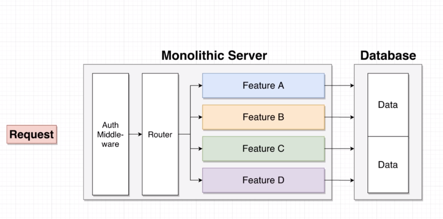
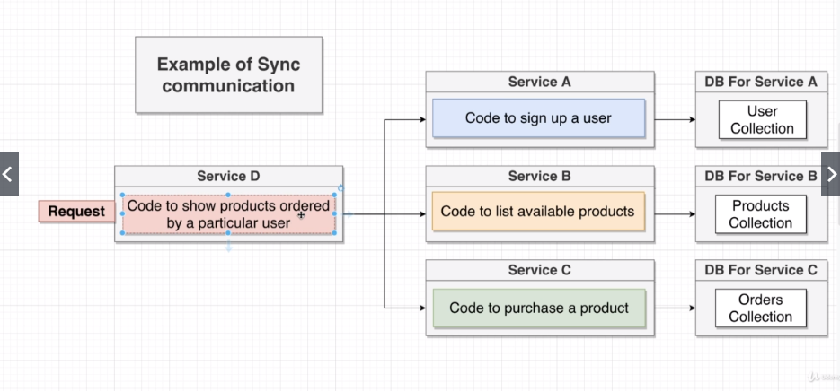
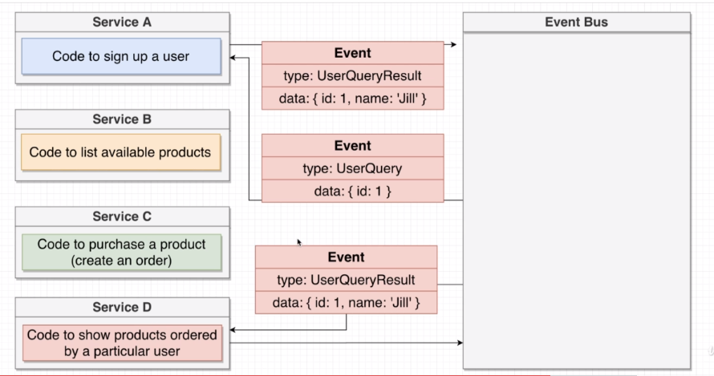
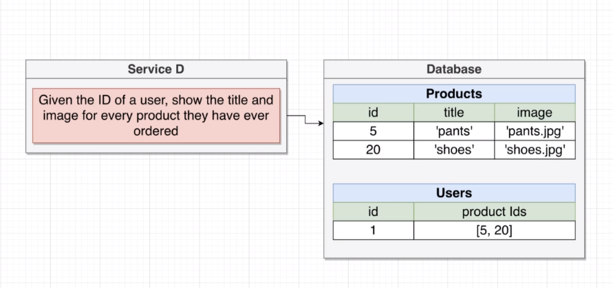
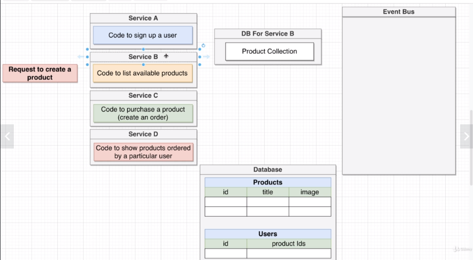

## Course Contents 
1. [Fundamental Ideas Around Microservices](/)
2. [A Mini-Micoservices App](/)
3. [Running Services with Docker](/)
4. [Orchestrating Collections of Services with Kubernetes](/)
5. [Architecture of Multi-Service Apps](/)
6. [Leveraging a Cloud Environment for Development](/)
7. [Response Normalization Strategies](/)
8. [Database Management and Modeling](/)
9. [Authentication Strategies and Options](/)
10. [Testing Isolated Microservices](/)
11. [Integrating a Server-Side-Rendered React App](/)
12. [Code Sharing and Reuse Between Services](/)
13. [Create-Read-Update-Destroy Server Setup](/)
14. [NATS Streaming Server - An Event Bus Implementatio](/)
15. [Connecting to NATS in a Node JS World](/)
16. [[Appendix A] - Basics of Docker](/)
17. [[Appendix B] - Basics of TypeScript](/)

## What is a Microservice? 

Your current server probably uses a monolithic type of archiecture:

We might have a request, some in through the user's browswer, that flows in to some preprocessing middleware, then maybe a router, then send it off to some specific feature, then might get data from a db, then send request back to the user.

### A monolith contains 
- Routing
- Middlewares
- Business Logic 
- Database Access

To implement **all features** of our app 

### A single microservice contains 
- Routing
- Middlewares
- Business Logic 
- Database Access

To implement **one feature** of our app

Each feature is stand alone and doesn't depend on any other feature. 

## Data in Microservices 
So what are the big challenged of microservices?

### Data management between services
> [^ **What is THE big challenge when dealing with microservices?**]Data management between services. This is the BIG problem of microservices, and what 90% of this course focuses on.

### Why this is a problem...
>- [^ **What the two challenges in dealing with data between microservices and what is the go-to approach for addressing these challenges?**]With microservices, we store and access data in a sort of **strange way**... Let's look at ...

1. How we store data 
2. How we access it 

Each service gets its own database (if it needs one). Services will never, ever reach into another services database. 
    - Okay, but why?...

### One Database-Per-Service 
> - We want each service to run independently of other services. 
    - Avoid interdependency between services
    - avoids scaling issues of one database 
- Database schema/structure mnight change unexpectedly
    - differing data structure/schema
- Some services might function more efficiently with different types of DB's (sql vs nosql)
    
## Big Problems with Data 
In a monolith, things all share the same database, and can freely access information stored in the same database no matter the feature making the request. In a microservice based architecture, if one feature depends on the data produced/stored by another feature (say a login in state or auth credentials), we might want to check if the user is logged in, that "state" might be stored in another db, so how might a microservice access that "state" information? Well there are two approaches...

## Sync Communication Between Services 
>1. **Sync** Services communicate with each other using direct requests 
2. **Async**: Services communicate with each other uding *events*.

> [^ **What do Sync/Async mean in the world of microservices, do they mean the same thing as they do in JS?**]**WARNING: These words don't mean what they mean in the JavaScript world!!**

## Sync 

So imagine we have our e-commerce application, our request might come into service D, the first thing that it might do is make a directy request to Service A, then B, then C. Never directly accessing the database of any other service.

### Notes on Sync Communication 
There are both upsides and downsides to this approach....

#### Pros 
- Conceptually easy to understand 
- Service D won't need a database! 

#### Cons
- Introduces a dependency between services 
- If any inter-service request fails, the overall request fails 
- The entire request is only as fast as the slowest request 
- Can easily introduce webs of requests  
    - We don't know what some other service is doing internally. 
    - What if Service A itself, under the hood actually needs to make its own request to 3 other services? Which themselves might need to make their own requests?

[^ **What is the synchronous communication approach for microservices? What are some of the cons of this approach?**]The synchronous communication approach would be to have a service make synchronous requests to each individual service to access the data that it needs from those services's databases. We aren't accessing the db of those services directly, however there are issues with this approach. We create dependencies between services, we are only as fast as our slowest response, if one request fails the whole thing fails, and we create a web of dependencies.  

## Event-Based Communication 
There are two different ways of using **async** communcation, the first way isn't going to be super great.

[^ **What is the general solution for managing both async communication approaches?**]The general idea behind async communication is that we are going to introduce something into our application that is accessible to all these different micoservices, called an **Event Bus**. The role of this event bus is to handle all these notifications and events needed from different services.

These **events** are like little objects/nodes of something that has happened or needs to happen inside of our app. Each service connects to the event bus, and can then both send and receive events from the event bus. 

You may notice that we now have a single point of failure introduced by using an event bus so we try to make sure this thing is pretty resilient.

### First async comm approach (the bad way)
The first way of doing async communication would look like this but it shares a lot of downsides as sync communication and more... 

#### Pros 
- Service D won't need a database

#### Cons 
- Not conceptually easy to understand
- Introduces a dependency between services 
- If any inter-service request fails, the overall request fails 
- The entire request is only as fast as the slowest request 
- Can easily introduce webs of requests 

[^ **What is bad way of doing asynchronous communication?**]Using the Event bus, to manage/delegate requests and responses to each individual service. While we should be aware that this approach is possible, it certainly isn't recommended. It takes the worst of synchronous communication and just introduces the event bus. 

## A Crazy way of storing Data 

Just like the database-per-service pattern, async communication is going to seem *bizarre* and inefficient. 

To do this, we need to *refine the exact goal of our service*. Being very explicit about inputs and outputs of this service. 

Let' redefine Service D: "Given the ID of a user, show the title and image for every product they ahve ever ordered"

With that's in mind, let's imagine a database. Only the fields/tables we would need.  

So this does fufill the needs of Service D to remain self-contained, so the question becomes how do we create service D's database and put its relevant info inside of there?

Any time a request comes to any of the services, we are going to have those relevant services emit an event simultaneously describing what just happened to them.

> -[^ **What is the recommended approach for asynchronous communication between microservices?**]Any time a request comes to any of the services, we are going to have those relevant services emit an event simultaneously describing what just happened to them. That is how we would populate data in Service D's database. It relies on the other services emitting events any time something interesting occurs. And then using the event bus to populate the databases of individual services when any other service produces an event that another event may need in its own database.

## Pros and Cons of Async Communication 

### Notes on Async Communication 
#### Pros 
- Service D has zero dependencies on other services! 
    - It has indirect dependencies for populating it db, but it has no direct dependencies or attachments to the uptime of other services 
- Service D will be extremely fast! 

#### Cons 
- Data duplication. Paying for extra storage + extra DB 
    - duplicating data
    - costs, are kind of a moot point b/c of current cost of storage is pretty cheap.
- Harder to understand 

## Links 
- [🏠 MAIN](/microservices-node-fundamental-ideas)  
- [NEXT ➡ | A Mini-Microservices App ](/micoservices-node-mini-app)

## Summary Questions