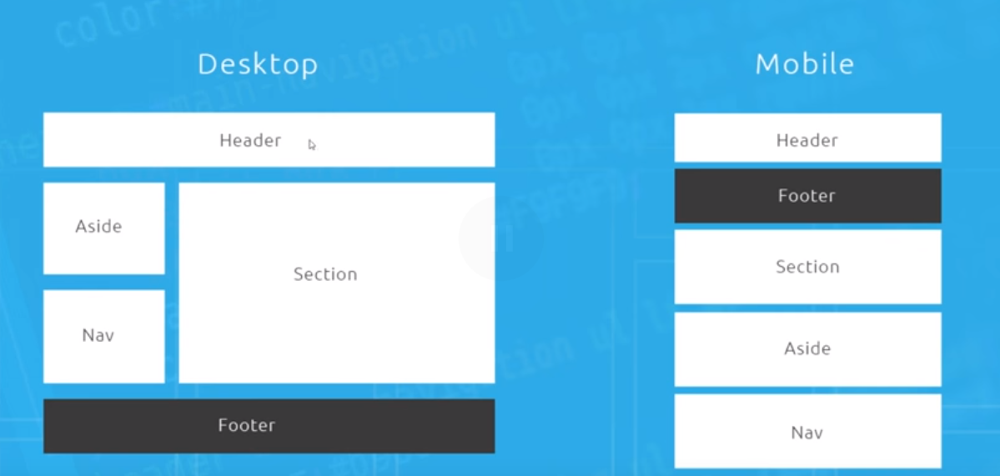

## Review Questions
1. Why is CSS grid an improvement over some parts of flexbox?
1. How do you make an element a grid item?
1. How do you specify how many columns you want in your grid? 
1. What units are most commonly used in grid columns?
----
1. What does the repeat function do, and what does it look like? What are the benefits of this function?
1. How do you specify the number of rows? How often are you going to be doing so?
1. What is the `minmax` function, what does it do? How do you use it?
1. How do you set a gap between columns? Between rows? Between both?
---- 
1. What are grid lines? How many grid lines will you have if you want a 3-column, 3-row container?
1. What is the long-hand syntax for specifying which column the grid item should start on? How about for where it should end?
1. What is the short-hand syntax for specifying a grid items column placement? What about grid rows?   
----


## Why Use CSS Grid?
We used to use hacky floats and empty div spaces.[^1]
Other thing[^2]

[^1]

# fn-1

To improve upon this was Flexbox, but now without its drawbacks. Flexbox is really only good in one direction, either row direction or column direction. You can't really use it in the same direction at once.
- We would also have to use extra markup if we wanted to nest these flex items.
- We can get around all of this by using *CSS Grid*

CSS Grid makes it easy to make responsive web pages, and it looks something like this:
```html 
<div id="content">

    <header>Header</header>

    <main>Main</main>

    <aside>Aside</aside>

    <nav>Nav</nav>

    <footer>Footer</footer>

</div>
```
Here is the html to accomplish the layout below. It's simple without the need of having any nested elements html elements.
 

- The `content` div acts as a wrapper, then we have whatever else we want displayed in there. We place the items we want to appear in the grid, in the grid wrapper.
- The order of the elements in the html doesn't really matter, since in our css we are going to be specifying how they should appear in this grid.

### Another Cool Thing about CSS Grid

- We can more easily style pages for mobile since we don't really care about the order of the markup so much.
- ⭐ CSS Grid just treats the webpage as a grid, a pattern of boxes/rows/columns
    - Within this grid wrapper we are just specifying how these elements should be arranged in that grid.
    - 
- Easy to create grid based systems and mosiac style layouts.

## Columns
- Grids have *rows* going across and *columns* going down.
- This video is going to focus on columns.
    - You don't have to use the same width for every single column, it can be mixed.

```html
<!DOCTYPE html>
<html lang="en">
<head>
    <meta charset="UTF-8">
    <meta name="viewport" content="width=device-width, initial-scale=1.0">
    <title>cssgrid columns</title>
</head>
    <style>
        body {
            color: #fff;
            font-family: -apple-system, BlinkMacSystemFont, 'Segoe UI'
            text-align: center;
        }
        #content {
            max-width: 960px;
            margin: 0 auto;
        }
        #content div {
            background: #3bbced;
            padding: 30px;
        }
        #content div:nth-child(even) {
            background-color: #888;
        }
    </style>
<body>
    <div id="content">
        <div>1</div>
        <div>2</div>
        <div>3</div>
        <div>4</div>
        <div>5</div>
        <div>6</div>
        <div>7</div>
        <div>8</div>
        <div>9</div>
    </div>
</body>
</html>
```
- Each div is going to take up 100% of the width as is the default for block level elements.
- Let's create a grid out of `#content`. 

### How to make a Grid
Like flexbox, it's as easy as setting the display property of our wrapper(`#content`):  
`display: grid`  
- If we save this you can see not much has changed and that's because we haven't really set our columns.
- Let's say we want to give these columns so that each row  has 3 columsn within it.
>- The way that we specify this is with the property: `grid-templates-columns`.

Our css would look like this:
```css {3}
#content {
    display: grid;
    grid-template-columns: 33.3% 33.3% 33.3%;
    max-width: 960px;
    margin: 0 auto;
}
```
So we specify 3 values for 3 columns with each value describing how much space that column should occupy.
- We can just as easily say something like: `30% 20% 50%`
- By default now, each column is going to take up its defined width.

### Fractional Units
So in CSS Grid the most commonly used units are `fr` or fractional units. The same example of 33.3% would instead look like...
`grid-template-columns: 1fr 1fr 1fr;`  
If we change the middle column to `2fr` it would be twice as big as the others.
```css {3}
#content { 
    display: grid;
    grid-template-columns: 1fr 1fr 1fr;
    max-width: 960px;
    margin: 0 auto;
}
``` 

### The `repeat()` function
- The `repeat()` function allows us to repeat something, the first arg it takes is the number of times to repeat, and the second argument it takes is the thing you want repeated. So the `1fr 1fr 1fr` example above would look like this...

```css {3}
#content {
    display: grid;
    grid-template-columns: repeat(3, 1fr);
    max-width: 960px;
    margin: 0 auto;
}
``` 
- The reason this is cool is because say we want 8 or 12 columns, this makes writing it out much easier.

## Rows
- So from our previous example, we have 3 rows in our grid, and the reason we have 3 rows is because we wanted 3 columns, and because we have 9 elements, what happens is that when ever we get to the next column it gets moved to the second row.
- Rows are created by the content if we have it, automatically.
- The height of these rows, is governed by the content and also because we gave it the padding. If we had no padding, it would just be the height of the content (the numbers).

- If we add a bunch of texts to say the 3rd div, that row height is now going to be goverened by the amount of content inside of this div. If we want to override this behavior, and set the height of each row, we can do with the property: `grid-auto-rows`.

>- We set the height of grid rows with the property `grid-auto-rows`, e.g. `grid-auto-rows: 200px` will make every row in this grid.

However, if we had content that exceeed that 200px it gets cut off, it just disregards the content inside and kind of just specifies everything will be 200px. This can be worked around with the `minmax()` function, which takes two parameters, the first parameter is the minimum, that second parameter is the maximum. 

>- `minmax(min, Max)` is a function that that sets the minimum and the maximum of a property. 

- `grid-auto-rows: minmax(200px, auto);`
You can think of it in our case as trying the default of 200px, if the content exceeds that 200px it applied the 'max' in this it would be set to the content inside of that row.

### Specifying # of Rows
Just like with columns, we can also explicitly set the number of rows we want with `grid-template-rows`.

Because we are specifying the number of rows, we won't really need the `grid-auto-rows` property because we will handle that when we are specifying our rows.
```css {3-5}
#content {
    display: grid;
    grid-template-columns: repeat(3, 1fr);
    grid-template-rows: repeat(3, minmax(200px, auto));
    /*grid-auto-rows: minmax(200px, auto);*/
    max-width: 960px;
    margin: 0 auto;
}
```
We can also specify the rows, we want but again, nothing will show up if we don't have the content to populate those rows or columns.

- A lot of the time, we just want our grid to be based on the content we actually have and not to create explicit numbers of rows for content that we don't.

### Adding gaps between rows/columns
You might be thinking you could just add a margin to each div and while you technically can, the margin goes all the way around the grid item, whereas we want it just between columns, not around the outside/sides.

Instead we can use a property on the grid itself called `grid-column-gap` and `grid-row-gap`. (or use the shorthand, `grid-gap`)
```css
#content {
    display: grid;
    grid-template-columns:repeat(3, 1fr);
    grid-column-gap: 10px;
    grid-row-gap: 10px;
    grid-template-rows: repeat(3, minmax(200px, auto));
    /*grid-auto-rows: minmax(200px, auto);*/
    max-width: 960px;
    margin: 0 auto;
}
```
- `grid-gap: 10px` would be the same as specifying both the column-gap and row-gap to 10px.

>- `grid-gap` is the property that puts a gap between both columns and rows.

## Grid Lines
- The default behavior is to assign the first element to the first row and first column, in *source order*. This is where grid lines come in...

>- [**Grid lines**]() help you define positions on a grid, which will help us place elements in whatever section of the grid we want regardless of their html order.

When it comes to grid lines they go both up/down (column direction), and across (row direction)...


We said there were 8 columns, but that means we are going to have 9 *column lines*. And just as we have 7 rows, we will have 7 row lines. *It's always going to be #ofRows(orCols) + 1 to get your number of grid lines.

We have our last column which adds an extra line. Same

We use these *grid lines* to help us place elements within our grid. 

In order to place items specifcally, we will have to override default placement of items. Let's hop into the html where we will define our grid.

```html
<!DOCTYPE html>
<html lang="en">
<head>
    <meta charset="UTF-8">
    <meta name="viewport" content="width=device-width, initial-scale=1.0">
    <title>cssgrid columns</title>
</head>
    <style>
        body {
            color: #fff;
            font-family: -apple-system, BlinkMacSystemFont, 'Segoe UI', Roboto, Oxygen, Ubuntu, Cantarell, 'Open Sans', 'Helvetica Neue', sans-serif;
            text-align: center;
        }
        #content {
            max-width: 960px;
            margin: 0 auto;
            display: grid;
            grid-template-columns repeat(6, 1fr);
            grid-gap: 10px;    
        }
        #content div {
            background: #3bbced;
            padding: 30px;
        }
        #content div:nth-child(even) {
            background-color: #888;
        }
    </style>
<body>
    <div id="content">
        <div clas="one">1</div>
        <div clas="two">2</div>
        <div clas="three">3</div>
        <div clas="four">4</div>
        <div clas="five">5</div>
        <div clas="six">6</div>
    </div>
</body>
</html>
```
We want each of our items to be in a column. At the minute we have 1 row but we want 4 rows. So do do that, we can say:  
`grid-template-rows: repeat(4, minmax(150px, auto));`
- So now we have 4 rows and 6 columns, but you can only see 1 row right now, however we can still place any of these elements anywhere in this grid.

### Positioning Elements in our Grid
So to do this we use the property: `grid-column-start` to specify where we want this specific grid item to start in regards to its column position....
```css 
.one {
    grid-column-start: 1;
    grid-column-end: 3;
}
```
We are going to be using another property called `grid-column-end` to specify where we want our grid item to end. We will say we want it to end on grid-line 3 which will make it roughly 2 columns wide.

### `grid-column` shorthand
We can combine these two properties into one shorthand:
```css 
.one {
   grid-column: 1/3;
}
```
- the first number this takes is the starting line, the *forward slash* then says I'm done with the start position now I need to move on to the end position. Here is the syntax: `grid-column: startPos / endPos;`

Let's do pretty much the same thing for the second element. Except this time, all the way to the end, remember we said we want 6 columns, so there are going to be a total of 7 grid lines.
```css 
.one {
   grid-column: 1/3;
}
.two {
   grid-column: 3/7
}
.three {
    grid-column: 1/4
    grid-row: 2/4;
}
.four {
    
}
```
For class `.three` we are going to do something a bit different, say we want it to take up 2 rows as well.
So our elements will be arranged accordingly:


So this is offers us a lot of flexibility.
```css 
.one {
   grid-column: 1/3;
}
.two {
   grid-column: 3/7
}
.three {
    grid-column: 1/4
    grid-row: 2/4;
}
.four {
    grid-column: 4/7;
    grid-row: 2/4;
}
.five {
    grid-column: 3/7;
}
.six {
    grid-row: 4;
    grid-column: 1/3;
}
```
- Remember, we don't have to start from the left, can do it somewhere in the middle like we do for object 5. `grid-column: 3/7`
- Notice on class `six` we can just specify that we want it on row 4 which is essentially the same as saying `4/5`. Remember, because the first number before the forward slash is the `grid-column-start` value.
 
- What is also pretty neat is that you can even overlap your grid items if you wanted by specifying overlapping start/end values of other elements.
- Specifying one value for `grid-column` will place that item starting at the place in the column, but that element takes up the 
only one fractional unit, but pushes everything else off that row. 

 <a href="## Nested Grids">## Nested Grids</a>
## Nested Grids
You can also nest another grid inside an item that itself is within a grid. It's very simple to do this, we just make the item itself a wrapper.
```html
<div id="content">
    <div>1</div>
    <div>2</div>
    <div>3</div>
    <div class="nested">
        <p>1</p>
        <p>2</p>
        <p>3</p>
        <p>4</p>
    </div>
```
We are just turning our 4th div into its own grid container. Given it's class, `nested` we can now style it accordingly.
```css
.nested {
    display: grid;
    grid-template-columns: 1fr 1fr;
}
```
### `span` value 
-`grid-column` and `grid-row` also take a `span` value that looks like this:   
`grid-column: span 3` 

The above would work the same as saying something like: `grid-column: 1/3`, it simply says we want to span this item a across 3 columns, so we aren't specifiying *grid lines* but instead we are specifying # of columns or rows to occupy.

## Aligning & Justifying Items

## Create a 12-Column Grid

## Mosaic Layout

## Grid Areas

## Reponsive Grid Example


## Review Answers   
1. It allows us to more easily control the placement of objects in a grid-like fashion. Flexbox is kind of limited to working well across either of its axis (main or cross).
1. By setting the parent element to have a `display` property of `grid`
1. By using the property: `grid-template-columns:` then specifying the number of columns you want with their corresponding width.
1. The most commonly used units in grid are `fr` or fractional units.
1. The repeat function, repeats things. It looks like this `repeat(#ofTimesToRepeat, theValueToRepeat)`. For example, if you wanted 12 columns to repeat and each column takes up 1fr, you would say: `repeat(12, 1fr);`. The benefit to this function is that it makes writing out your grid columns/rows more succinct and readable.


## Key Insights
- CSS Grid simply allows us to treat a webpages layout as a grid, controlling where we want our elements to fit in respect to that grid structure.
- Remember, we are primarily styling the grid container/wrapper, that means most of our properties are going to be found on that class/id.

## Links
 - [NN: Mobile First Design](/nn-mobile-first-responsive-design)
 - [NN: Flexbox](/nn-css-flexbox)

[#fn-1]: stuff  