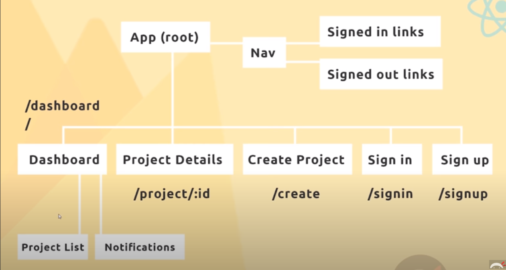
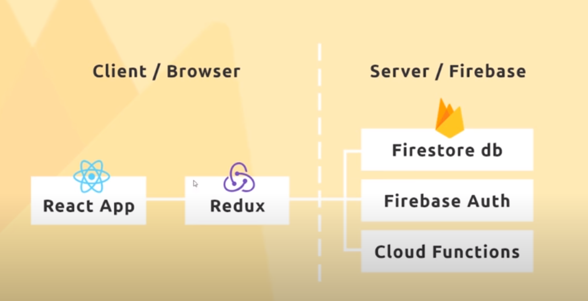

## What we are are going to be using 
- React & Redux 
- Thunk
- Firebase 
    - Firestore, authentication, cloud functions, hosting

## Planning the App
It's usually a good idea to plan out your application before-hand. 



### Client | Server 


## Setting Up 
- Going to use `npx create-react-app marioplan`
    - `npx` let's use just creat-react-app without installing it 

- Let's start removing some of the boilerplate. 

### Importing / ref Materialize
 ```html 
 <!--Import Google Icon Font-->
      <link href="https://fonts.googleapis.com/icon?family=Material+Icons"
      rel="stylesheet">
      <!--Import materialize.css-->
      <link type="text/css" rel="stylesheet" 
      href="css/materialize.min.css"  media="screen,projection"/>
```

### Structure 
Let's create our components and keep them organized in a components directory.

- /components 
  - /auth 
    - SignIn.js
    - SignUp.js
  - /dashboard
    - Dashboard.js 
    - Notifications.js 
  - /layout
    - Navbar.js 
    - SignedInLinks.js 
    - SignedOutLinks.js
  - /projects 
    - CreateProject.js 
    - ProjectDetails.js
    - ProjectList.js
    - ProjectSummary.js 

### Setting up React Router 
- cd into main directory: `npm install react-router-dom`,
- now import BrowserRouter from react-router-dom in our App.js file
  - then we can surround BrowserRouter aroudn our root App component.

## Navbar Component 

In Navbar.js ...
This component isn't going to have state so it can be functional instead of a class component.

First thing we are goign to do is import react 

Going to be using Material.css class names to help us style our components. 
```js 
import React from 'react';
import { Link } from 'react-router-dom';

const Navbar = () => {
  return (
      <nav className="nav-wrapper grey darken-3">
        <div className="container">
            <Link to='/' className="brand-logo">MarioPlan</Link>
        </div>
      </nav>
  )
}

export default NavBar;
```
- Now that we've created this we need to go over to App.js and nest that Navbar after importing it.
- We have these SignedInLinks and SignedOutLinks we ultimately only want to show one or the other.
- Let's just copy out Navbar code right into SignedInLinks and change names. 

```js 
import React from 'react';
import { NavLink } from 'react-router-dom';

const SignedInLinks = () => {
  return (
     <ul className 
  )
}

export default SignedInLinks;
```
- We'll use `NavLink` instead of `Link` so that we get access to that active Link when we are on that page.

## Dashboard Component 
## Project Summary Component 
## Project Details Component 
## Login & Signup Components 
## Create Project Form 
## Nav Links & CSS 
## Adding Redux & Reducers 
## Adding Dummy Data
## Async Code with Redux 
## Using Thunk 
## Creating a Firebase Project 
## Firestore Data & Collections 
## Connecting Redux to Firebase  
## Adding Data to Firestore 
## SYncing Data with Firestore 
## Project Details Data 
## Firebase Auth Intro 
## Firebase Auth with Redux 
## Logging Users Intro## Logging Users Out 
## Tracking Auth Status 
## Waiting for Auth Ready
## Route Guarding 
## User SIgn Up (Firebase Auth)
## User Profile Data 
## Adding Projects (revisited)
## Formatting Dates with Moment 
## Firestore Security Rules 
## Cloud Funcitons Intro & Setup 
## A Simple Cloud Function 
## Notification Component 
## Cloud Function Firestore 
## Cloud Function Auth Trigger 
## Showing Notifications 
## Orderingr Firestore Data 
## Deploying to Firebase Hosting 

## Links 