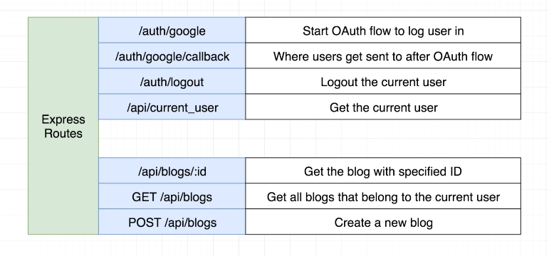
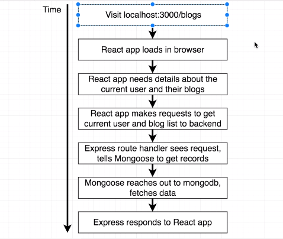
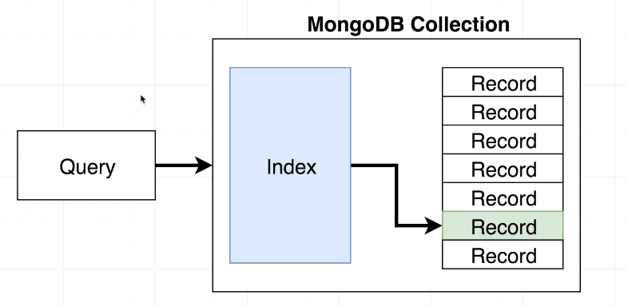
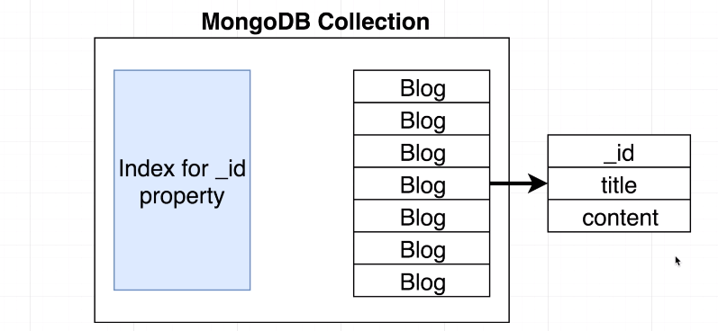
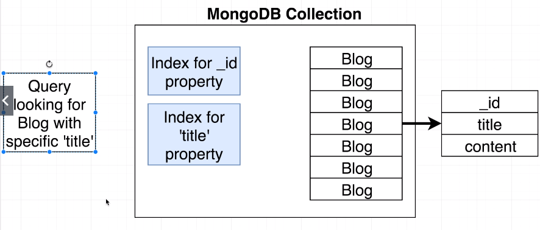
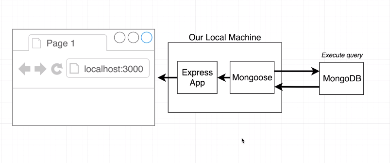
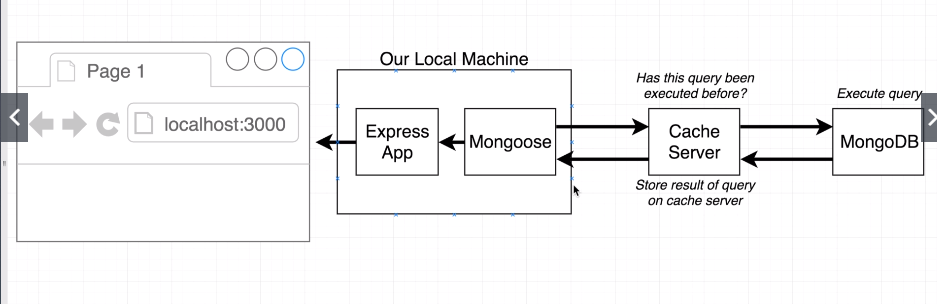

## Project Setup 

We are going to clone an existing repo with some basic auth/functionality. But we will be focusing more on things like:  
- Redis-backed caching
- Browswer bsed integration testing
- Sontinuous integration Setup
- Scalable File/Image Upload

### Project Walkthrough
Here is the repo: github.com/StephenGrider/AdvancedNodeStarter

Pretty typical express app.


- everything kicks off from the `index.js` file 
- we set up some requires for modules
- we setup models for mongoose
- setup passport for auth
- setup our mongoose isntance
- create our express app
- we setup middleware
- set up event handlers
- setup production file serving
- then listen on a port

This app also uses create-react-app because of this we also have to install dependencies for reach as well. So we have to cd in that `client` directory and run `npm install` here as well.

_Aside: npm i on this repo has a huge amount of vulnerabilities through npm, I think I'll wait to run audit in case it makes the project unusable._

## Key Customization

Once everything is installed, we can run `npm run dev` to start up both front-end(react application as well) and back-end (express server). 

Note this is the error I got...
```
Failed to compile

./src/components/blogs/BlogNew.js
  Line 8:  'state' is not defined  no-undef
 
Search for the keywords to learn more about each error.
This error occurred during the build time and cannot be dismissed.
```

Fixed by ...
Open up the client/src/components/blogs/BlogNew.js file.  On line 8 you'll see:
```js
state = { showFormReview: false }; 

// Then replace it with the following... 

constructor(props) {
  super(props);
 
  this.state = { showFormReview: false };
}
```
 
- If you try logging in right now, it will fail because of mongodb instance is in readonly. 
- Need to head over to `/config` , `dev.js` is where our keys are used for oauth flow, you want to add your own credentials.

## MongDB Atlas Setup and Configuration
Check out on Udemy for instructurions.

## Routes Walkthrough


- One thing to be aware of, is that there is no sharing of blog posts inside of this application between different users, the blog posts belong to one specific user, posts are only visible to the creator.

All the code for handling these routes are in the `/routes` directory, in there there are two files, `authRoutes.js` and `blogRoutes.js`.

## MongoDB Query Performance
The first big thing we are going to be adding to our application is going to be **caching**.

[^ **What is *caching* useful for?**]**Caching** greatly improves the read performance of an application that makes use of MongoDB. Caching can be used with any type of database, but we are specifically going to be focusing on caching with mongodb.

If your go to dev.tools > console  with the application runningm, and click on XHR you can see `blogs` and `current_user` to see these request being made.



The first steps are:  

- Things start off when browser hits localhost:3000/blogs
- React app loads in browser
- React app makes a request to the backend to figure out who the current user is and also retrieve a list of blogs that belong to them.
- The request is received by our express API, express takes that incoming request one for the currrent user and list of blogs and sends each of those off to their respective route handlers in our app
- those route handlers see those incoming requests and then they make use of our mongo lib to reach out to mongodb and retrieve some amount of information
- mongoose fetches from db, and retursn that to our express app
- express then takes that data and sends it back to react app
- the react app then renders that data on the screen.

```js:title=/routes/blogRoutes.js {3}
//...
  app.get('/api/blogs', requireLogin, async (req, res) => {
    const blogs = await Blog.find({ _user: req.user.id });

    res.send(blogs);
  });
//...
```
- Every single time someone refreshes the blog inside of our application, we are always issuing two separate requests to our mongo database. Not too big a deal right now, but you can see how re-making this request, each refresh can become problematic. Let's look at what happens each time we are making a query to mongo...



Whenever we execute a mongoose query (the highlighted line in code above), that sends a query to our mongoDB database.

[^ **In the context of MongoDB, what is an *index*? What is a *collection*? In our coding example what would be an instance of a collection?**]MongoDB has something internally called an [**index**](), an index is matched up with an individual collection, and you will recall that a [**collection**]() is a collection of individual records. 
 
- Inside of our app right now we have one collection of blogs and one collection of users.
[^ **What makes MongoDB so fast?**]- When we query it comes in, sent to the index, indicies are efficient because we don't have to check each record to find what we are looking for, the index is instant lookup to the matching record. This is what makes mongoDB really quick.

Whenever an index is created for a mongo collection, an index targets an individual property on these records. (to be clear indicies have a lot of flexibility about them, and we can tailor them to look at multiple fields together or to consider different properties) but in general for the sake of discussion, let's just assume, every collection we have only has an index for the the `_id` property of a record.



[^ **What is a full collection scan? What is the default behavior of Mongo if it is looking for a blog by title when it's indexed by a blog's `_id` property?**]So if we look for a blog by `_id`, no problem, but what if we asked for a title? Well then we won't enjoy the fast lookup, and Mongo will default to its default behavior of looking at each item in what is called a [**full collection scan**](); looking at every single record inside of a given collection, a relatively expensive operation. 

If we didn't write our queries correctly, we would run into performance issues where we make MongoDB do a *full collection scan*.

### Two ways to solve possible property lookup performance issue
There are two ways to solve this potential performance slowdown, here is the first...



1. By creating multiple indicies
    - 1 for the index for `_id` property
    - 1 for the index for `title` property as well
    - ⚠️ Not without downside: whenever we add indicies to a collection, it has an impact on our ability to write on that collection performantly, for each additional index we add to a collection, it takes longer to write records into that collection. It also takes up more disk space and more memory as well.
        - finally, we might be making queries ahead of time where we can't figure out what indicies we need for it.
    - Because of the downsides, this approach isn't really tenable.

## Query Caching Layer
- last section we talked about some performance concerns we might have with MongoDB.
- One possible solution to this is setting up something called a **cache server**.

### What is a caching layer?
This is our app right now:

- This is how our app is currently structured, a pretty common pattern.

The [**cache server**]() is going to see if queries have been made before, if not it make the request to mongodb, that query is cached. If its made again, it doesn't send the query to mongdb and instead sends it back to mongoose.



This would a more detailed version...


We are looking for a query with an id of 123, it won't be found in the cache server, so it goes to mongodb, it goes immediately to mongoose, immediately after that, it will take that query that was made and then store the value associated with that query.

Just a simple key-value look-up.

The cache server is not used for any write actions, only for reading data.
Any time we write to the db, we clear the cache of any related data to the updated query in the cache server.

## Redis Introduction
Our caching server is going to be an instance of **Redis**. [**Redis**]()  is *an in-memory data store*, a tiny databse that runs in the memory of your machine and allows you to read and write data really quickly.

Redis is a data store that operates only in memory, so that once it gets turned off the memory within it gets deleted and wiped, in practice we only use Redis for data that we feel we are okay with it disappearing.

Redis is very fast.

To interact with Redis, we are going to use a library called `node-redis`, in fact the library is only called `redis`, this is the node implementation of the library so we will refer to it as node-redis, so you know its the node library for redis.
- **node-redis**: a js library that lets us interact with the redis server
- The server itself is called Redis.

The node-redis library or npm package has really bad documentation.

## Installing Redis on MacOS


## Redis on Windows
## Getting and Setting Basic Values

## Links