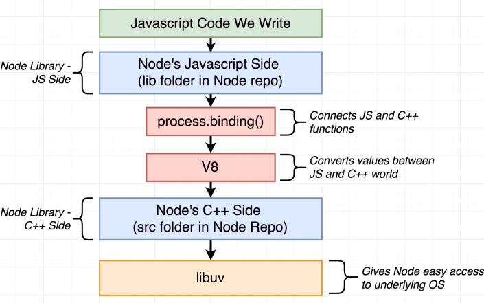

## Summary Queestions
1. Briefly talk about the relationship between these 4 things: JavaScript, Node.js, V8, and libuv.
2. So why do we even need Node if V8 and libuv are the things actually responsible for JS execution and filesystem/concurrency access?

We are starting with a very simple diagram

Over time we will be adding a lot more detail to it, to show how Node is internally structured.

- JavaScript Code We write is the stuff in our js files

When we run `node` at the command line, we are invoking a Node.js project, now node, just like any other JS project out there, Node internally has a collection of dependencies that it uses to actually execute your code.

Two of the most important dependencies, are the *V8* project and the *libuv* project.

- **V8**: Open source JavaScript engine created by Google. The purpose of this project is to be able to execute JS code outside of the browswer. (That's what we are doing when we run our JS code in the terminal).
- **libuv**: Is a C++ open source that gives Node access to the operatings systems underlying file system, it gives us access to networking and it also handles some aspects of concurrency as well.

>* **JS is going to be like the JS code we write, anything within a JS file. Node, like when we use `node` in the command line and specify a JS file, has a collection of internal depedencies: V8 and libuv that actually help process some of the lower-level functionalities from the abstractions/translations we are accessing in our JS via Node.**[^1]

#### So we have these two dependenices, doing all they do, so then the question is, what then is the purpose of Node.js?
Why couldn't we just rely on those depdencies directly?
Well for one...   
- V8 is like 70% C++ and only 30% JS
- libuv is 100% C++
- Node is like 50/50% JS and C++

>* **And our code that sits on top is 100% JS. That is one of the purposes of Node.js. It gives us a nice interface to use to relate our JavaScript side of the application to the actual C++ that is running on our computer to actually interpret and execute our JS code.**[^2]

### The Other thing
The other thing Node does is to provide a series of wrappers and a very unified and consistent API for us to use inside of our projects. Node provides these interface objects for things like, `http`, `crypto`, `fs` (standard library module), `path`. All these modules have very consistent APIs and they all ultimately refer to functionality that is mostly implemented inside of the libuv project.

So by using Node, you don't have to work with all the C++ code that exits inside of libuv itself.

## Module Implementations 
Let's look at how things are implement directly by just taking a look at the source code: https://github.com/nodejs/node
Two folders we are going to pay attention to : `lib` and `src`. 
- `lib`: contains all the JS definitions of functions and modules that you and I require into our projects, as being like JS world the JS side of Node.
- `src`: inside of source is where we will find the C++ implementation of all those functions.

In the require statement at the top the pbkdf2 file, we might notice something unfamiliar: `process.binding('crypto')` which is how nodejs joins up the C++ of the project to the JS side.

## Node Backed by C++
`process.binding('crypto')` is the bridge that binds to the C++ side of things. For now we are going to skip talking about V8 and look at the C++ side of the Node project, where the pbkdf2 function is actually implemented.
- In that `src` file, you can find the `node_crypto.cc` file that is going to have about 5k lines of C++ code that the JS crytpo module depends on.
- You can get the idea that whenever we run that JS function that it ultimately relys on upon some C++ code.

The other thing you might be curious about in here is, where does V8 and libuv come into play?

Well if we go back up to that node_crypto.cc file, around line 85 or so you're going to see a lot of `using` statements, e.g. `using v8::Array;` etc.

The purpose of the V8 project inside of all this source code is to act as the intermediary and allow values that are defined inside of JS to be translated into their C++ equivalents.

All the `using` statements are importing the C++ definition of JS concepts, like the C++ understanding of what JS `false` is with (`using V8::False;`).
The V8 project is used to translates the JS values that we are all familiar with and to translate them into their C++ equivalents.

Now, libuv, is also present in this file as well, but harder to detect.

We can find things if we search `uv` in this file. In this value `uv` is used for a lot of concurrency and processing contructs on the C++ side.

On the C++ side, there is a lot of inter-operatability with the V8 project and libuv as well.

## The Basic of Threads

We will be diving into the **event loop**, the **event loop** is used in Node to handle asynchronous code we might write inside of our applications. But before we do, we will talk a bit about threads...

### Threads
Whenever anyone runs a program on our computer we start up something called a [**process**](). 
- A [**process**]() is an instance of a computer program that is being executed. 
- Within a single process we can have multiple things called **threads**. You can think of [**threads**]() as being some little to-do list that has as set of instructions that need to be executed by the CPU of your computer. This thread is given to your CPU