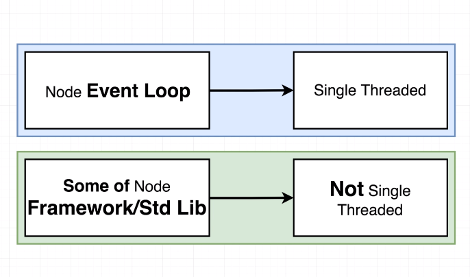
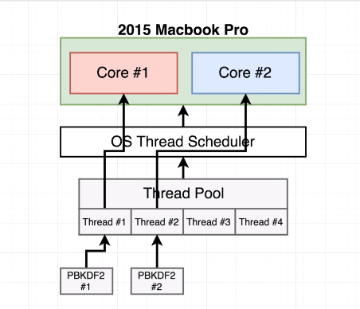
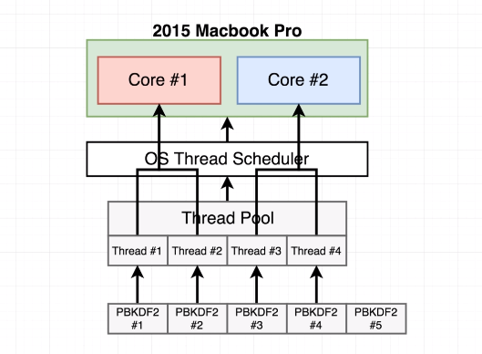
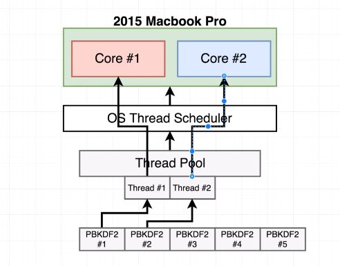
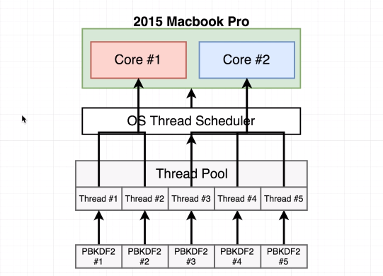

## Summary Questions
1. Briefly talk about the relationship between these 4 things: JavaScript, Node.js, V8, and libuv.
2. So why do we even need Node if V8 and libuv are the things actually responsible for JS execution and filesystem/concurrency access?

We are starting with a very simple diagram


Over time we will be adding a lot more detail to it, to show how Node is internally structured.

- JavaScript Code We write is the stuff in our js files

When we run `node` at the command line, we are invoking a Node.js project, now node, just like any other JS project out there, Node internally has a collection of dependencies that it uses to actually execute your code.

Two of the most important dependencies, are the *V8* project and the *libuv* project.

- **V8**: Open source JavaScript engine created by Google. The purpose of this project is to be able to execute JS code outside of the browswer. (That's what we are doing when we run our JS code in the terminal).
- **libuv**: Is a C++ open source that gives Node access to the operatings systems underlying file system, it gives us access to networking and it also handles some aspects of concurrency as well.

>* **JS is going to be like the JS code we write, anything within a JS file. Node, like when we use `node` in the command line and specify a JS file, has a collection of internal depedencies: V8 and libuv that actually help process some of the lower-level functionalities from the abstractions/translations we are accessing in our JS via Node.**[^1]

#### So we have these two dependenices, doing all they do, so then the question is, what then is the purpose of Node.js?
Why couldn't we just rely on those depdencies directly?
Well for one...   
- V8 is like 70% C++ and only 30% JS
- libuv is 100% C++
- Node is like 50/50% JS and C++

>* **And our code that sits on top is 100% JS. That is one of the purposes of Node.js. It gives us a nice interface to use to relate our JavaScript side of the application to the actual C++ that is running on our computer to actually interpret and execute our JS code.**[^2]

### The Other thing
The other thing Node does is to provide a series of wrappers and a very unified and consistent API for us to use inside of our projects. Node provides these interface objects for things like, `http`, `crypto`, `fs` (standard library module), `path`. All these modules have very consistent APIs and they all ultimately refer to functionality that is mostly implemented inside of the libuv project.

So by using Node, you don't have to work with all the C++ code that exits inside of libuv itself.


## Module Implementations 
Let's look at how things are implement directly by just taking a look at the source code: https://github.com/nodejs/node
Two folders we are going to pay attention to : `lib` and `src`. 
- `lib`: contains all the JS definitions of functions and modules that you and I require into our projects, as being like JS world the JS side of Node.
- `src`: inside of source is where we will find the C++ implementation of all those functions.

In the require statement at the top the pbkdf2 file, we might notice something unfamiliar: `process.binding('crypto')` which is how nodejs joins up the C++ of the project to the JS side.


## Node Backed by C++
`process.binding('crypto')` is the bridge that binds to the C++ side of things. For now we are going to skip talking about V8 and look at the C++ side of the Node project, where the pbkdf2 function is actually implemented.
- In that `src` file, you can find the `node_crypto.cc` file that is going to have about 5k lines of C++ code that the JS crytpo module depends on.
- You can get the idea that whenever we run that JS function that it ultimately relys on upon some C++ code.

The other thing you might be curious about in here is, where does V8 and libuv come into play?

Well if we go back up to that node_crypto.cc file, around line 85 or so you're going to see a lot of `using` statements, e.g. `using v8::Array;` etc.

The purpose of the V8 project inside of all this source code is to act as the intermediary and allow values that are defined inside of JS to be translated into their C++ equivalents.

All the `using` statements are importing the C++ definition of JS concepts, like the C++ understanding of what JS `false` is with (`using V8::False;`).
The V8 project is used to translates the JS values that we are all familiar with and to translate them into their C++ equivalents.

Now, libuv, is also present in this file as well, but harder to detect.

We can find things if we search `uv` in this file. In this value `uv` is used for a lot of concurrency and processing contructs on the C++ side.

On the C++ side, there is a lot of inter-operatability with the V8 project and libuv as well.

## The Basic of Threads

We will be diving into the **event loop**, the **event loop** is used in Node to handle asynchronous code we might write inside of our applications. But before we do, we will talk a bit about threads...

### Threads
Whenever anyone runs a program on our computer we start up something called a [**process**](). 
- A [**process**]() is an instance of a computer program that is being executed. 
- Within a single process we can have multiple things called **threads**. You can think of [**threads**]() as being some little to-do list that has as set of instructions that need to be executed by the CPU of your computer. This thread is given to your CPU


If you open up activity monitor you can see your active thread count and process count.

A process can have many/mutltiple active threads.

One of the most interesting and important areas of study around threads is understanding something around [**scheduling**]() which refers to your operating systems (specifically OS Scheduler) ability to decide which thread to process and any given instance in time.

You only have a finite amount of threads/processes restricted by memory/ram.

Your OS scheduler has to figure out what tasks to manage, and how to not spend too much time processing urgent threads to be excuted, things like input responses.

#### Two strategies to improve the rate at which threads can be processed...
While there are more then two, we will focus on two specifically that may help with our work as Node devs....

1. Add additional cores, more CPU cores, means more threads processed concurrently, (fyi a single core can already handle multiple threads via multithreading or hyperthreading)
2. The other thing we can do, is more closely examine the work that is being done by each thread. This is where things get really relevant for us in the JS world.


Image we have two processes both computing for CPU attention. Keep in mind, any time our computer tries to read data off of some medium like a harddrive, we refer to that as [**input/output operaations**]() and it always takes some non-zero amount of time.

So during this I/O phase, our CPU is waiting on the harddrive to read some file and during this time, this thread #1 has abosolutely nothing else to do, your OS scheduler has the abiliity to detect this downtime, this kind of pause between instructions and it can decide to put thread number one on pause, address thread #2 then go back to thread #1.

### Summary
- Threads are units of instruction waiting to be run by the CPU.
- Deciding which order to execute these threads in is referred to as *scheduling*.
- *Scheduling* is controlled by your OS
- Two ways of improving the rate at which we process threads is:
    1. Add more CPU cores to our machine
    2. OR, allow our OS scheduler to detect big pauses in processing time due to expensive input and output (I/O) operations.

## The Node Event loop
- Whenever we start up a node program on our computers. Node autoamtically creates, one thread and executes all of our code inside of that one single thread.


- Inside of this one single thread (blue box) we have something called the **event loop**.
- You can think of the **event loop** as being a control structure that defines what our one thread should be doing at any given point in time.
- This event loop is the absolute core of every Node program that you and I run and, every program that we run will only have exactly one event loop.

- Understanding how the event loop works is super important because that is where we will find a lot of our performance implications.

We are going to write pseudo-code to essentially walkthrough how the event loop works...

```js:title=pseudocode-of-node-event-loop
// node myFile.js
myFile.runContents();

function shouldContinue() {
}

// entire body executes in one 'tick'
while(shouldContinue()) {
}

// exit back to terminal
```
- When we first start up a program, our event loop doesn't immediately get executed. Instead, it takes the content of the file we loaded and executes them.
- We have a `while` loop representing our event loop, every iteration of that while loop is rewferred to a *tick*. Every single time the event loop runs inside of our Node application we refer to that as one tick.
- So just like a `while` loop we will need some condition to know when to stop. If it determines we shouldn't run the event loop, we exit to terminal.
- Whether to determine if while should continue we write a fake function called shouldContinue.

So inside of the shouldContinue function , Node does 3 separate checks to decide whether or not the event loop should continue for another iteration...  

1. It checks to see if there are any setTimeout, setInterval, setImmediate
2. Check any pending OS tasks? (Like server listening to port?)
3. Check if any long running operation, like fs call. Sounds similar to second check, but it really is truly a separate check.

So you can kind of imagine that there might be like an internal array-like object in Node program that keeps track of any of these pending tasks that might get created? Maybe like 3 arrays to represent bookkeeping stuff...

```js:title=pseudocode-of-node-event-loop
const pendingTimers = [];
const pendingOSTasks = [];
const pendingOperations = [];

// node myFile.js
// New Timers, tasks, operations are recorded from myFile running
myFile.runContents();

function shouldContinue() {
    // Check one: Any pending setTimeout, setInternval, setImmediate?
    // Check two: Any pending OS tasks (like server listening to port)
    // Check-three: Any pending long running applications (like fs module)

    return pendingTimers.length || pendingOSTasks.length || pendingOperations.length;
}

// entire body executes in one 'tick'
while() {
}

// exit back to terminal
```
So now, if any things has length, our function will return true and event loop keeps going.

- Internally Node is going to auto detect when our JS code  we write sets up something like a setTimeout call, these automatic detections occur even in the initial run of `myFile`. Imagine that those records, those arrays get made, and when we are running our file, those arrays get updated.

## Event Loop Ticks
We are now going to move onto the body of our event/while loop. 

```js:title=pseudocode-of-node-event-loop
const pendingTimers = [];
const pendingOSTasks = [];
const pendingOperations = [];

// node myFile.js
// New Timers, tasks, operations are recorded from myFile running
myFile.runContents();

function shouldContinue() {
    // Check one: Any pending setTimeout, setInternval, setImmediate?
    // Check two: Any pending OS tasks (like server listening to port)
    // Check-three: Any pending long running applications (like fs module)

    return pendingTimers.length || pendingOSTasks.length || pendingOperations.length;
}

// entire body executes in one 'tick'
while(shouldContinue()) {
    // 1) Node loosk at pendingTimers and sees if any functions 
    // are ready to be called
    
    // 2) Node looks at pendingOSTasks and pendingOperations 
    // and calls relevant callbacks

    // 3) Pause Execution. Continue when...
    // -- a new pending OSTask is done
    // -- a new pendingOperation is done
    // -- a timer is about to complete

    // 4) Look at pendingTimers. Call any setImmediate
    
    // 5) Handle any 'close' events 
}

// exit back to terminal
```
The first step that happens in the event loop is Node looks at pending timers, and sees if any functions are ready to be called.

Step 3 is the interesting one, it kind of just pauses, and wait for stuff to happen, if see something about to occur we continue with the last 2 step of the event loop.

Step 5. A close event, like if we had something like this....
```js
readStream.on('close' () => {
    console.log("Clean up code");
})
```
- essentially on close we can run some cleanup code, terminate any servers, close any open files we have 

- This last step in the event loop is essentially just clean-up to make sure we don't have dangling looseends inside of our programm.
- This is the body of our event loop and occurs ever tick.

- The most critical part of the event loop body is the pause that occurs in step 3, pausing instead of running through everything as fast as it can.

## Is Node Single Threaded?
Let's clarify a very common misconception that Node is single threaded.
We even showed a diagram above that showed just one thread, however, its not the whole story though.



Node's event loop truly is single threaded, when we start up a program with node a single instance of the event loop is created and placed into one thread, that's commonly seen as a bad thing, since it means that our program can only run one core of our CPU.

HOWEVER.

Some of the functions that are included in the standard library of Node are not actually single threaded, that is, some of the functions that we run in node run outside of our event loop and outside of that single thread.

So simply declaring that Node is single-threaded, is not absolutely true. The event loop uses a single thread, but a lot of the code you and I actually write does not actually execute inside of that thread entirely.

### Thread.js
Create a new file called `thread.js`
```js:title=thread.js
const crypto = require('crypto');

const start = Date.now();
crypto.pbkdf2('a', 'b', 100000, 512, "sha512", () => {
    console.log("1:", Date.now() - start);
});

crypto.pbkdf2('a', 'b', 100000, 512, "sha512", () => {
    console.log("2:", Date.now() - start);
});
```
Inside we are going to require the standard lib crypto included with node.
- We are just using this function to do some expensive work in this program and benchmark it

If we run this, both end up taking the same amount of time, but they both start at the same time.


They would take about a total of 2 seconds instead of just taking a respective one concurrent, second each 


This isn't what happened, what happend was more like the started at the same time. So why are we seeing this?

## The libuv Thread Pool


So, remember we dove into the source code of this pbkdf2 function a bit ago. And as we saw, there is a JS implementation, but it actually delegated all the work done to the C++ side.

That's where the actual hashing process took place. We also saw, briefly, in that library references to the libuv library, which gives node better access to the underlying OS.

Well, the libuv also has another module that is responsible for some other functions in the node standard library. So for SOME, standard library function calls, Node's C++ Side, and libuv, do expensive calculations outside of the **event loop entirely**.

Instead, they make use of something called a [**thread pool**](), it's a series of 4 threads that can be used for running computationally expensive tasks.

libuv designates 4 threads to this pool, so in addition to the event loop there are 4 other threads that can be used to offload expensive calculations that need to occur within our application.

Many of the functions included in the Node standard library will already make use of this thread pool, the `pbkdf2` function is one of them.

So when people say Node is single threaded its technically not true. If we ran `pbkdf2` in our event loop it could do nothing else and would be blocking, but its not what happens.

## Threadpools with Multithreading
Let's go back over to our two function calls... let's run 5 in total
```js:title=thread.js
const crypto = require('crypto');

const start = Date.now();
crypto.pbkdf2('a', 'b', 100000, 512, "sha512", () => {
    console.log("1:", Date.now() - start);
});

crypto.pbkdf2('a', 'b', 100000, 512, "sha512", () => {
    console.log("2:", Date.now() - start);
});

crypto.pbkdf2('a', 'b', 100000, 512, "sha512", () => {
    console.log("3:", Date.now() - start);
});

crypto.pbkdf2('a', 'b', 100000, 512, "sha512", () => {
    console.log("4:", Date.now() - start);
});

crypto.pbkdf2('a', 'b', 100000, 512, "sha512", () => {
    console.log("5:", Date.now() - start);
});
```
So, super intersting, if we run this again, you can kind of see the following results....


- You can see the first 4 take about around 2s, where the last one takes one additional second.

Two interesting things to notes here:  

1. Notice that the first group took the same amount of time, and it took double what it had taken previously (1s)
2. The fifth call took only one additional second, so intersting behavior...



Stephen has a 2015 MBP with 2 cores...so we can image the above happened with the first 2 calls.

The second example might look more like this...


Remember we said we could keep some degree of concurrency with multi or hyperthreading to be able to process more than one thread at once. Well, that's what we are seeing right now with this four seperate calls, the first 4 calls get assigned to their own thread, then thread #1 and #2 might get assigned to the first core.

So Core #1 is looking at managing two threads, which is twice the amount of work at the same time, which is why we are seeing it take roughly twice as long for those first 4 values, because even though we have multithreading enabled, at the end of the day, that just allows our CPU to be able to process more threads at once, it doesn't actually speed up the processing. It just allows for some amount of concurrency in the work we are doing.

Once those first four tasks were done, then node was finally able to move on to the fifth function call, and because there is only processing one thread, it only takes 1 second.

## Changing Threadpool Size
So as we saw, the first four calls were allocated to their own thread, and then threads were assigned in twos to a core.

Now remember, threads can technically run at the same time, they still have to do the same amount of work previously. So if we have 4 hashes that each take a second, but each core is taking twice as long to do that work, its going to take 2 seconds total.

Let's see how we might be able to customize our thread pool...

Let's go back inside our threads app.
```js:title=thread.js
process.env.UV_THREADPOOL_SIZE = 2; 
const crypto = require('crypto');

const start = Date.now();
crypto.pbkdf2('a', 'b', 100000, 512, "sha512", () => {
    console.log("1:", Date.now() - start);
});

crypto.pbkdf2('a', 'b', 100000, 512, "sha512", () => {
    console.log("2:", Date.now() - start);
});

crypto.pbkdf2('a', 'b', 100000, 512, "sha512", () => {
    console.log("3:", Date.now() - start);
});

crypto.pbkdf2('a', 'b', 100000, 512, "sha512", () => {
    console.log("4:", Date.now() - start);
});

crypto.pbkdf2('a', 'b', 100000, 512, "sha512", () => {
    console.log("5:", Date.now() - start);
});
```
The first thing we do is update an *environment variable `process.env`, and we are going to update the constant, of `UV_THREADPOOL_SIZE` to 2.

This essentially tells libuv, that when it creates its thread pool that it should only create 2 threads inside there.

So if we run this, things are completeted in groups of two... it works as predicted, and now each core is processing one thread (non multithreading) at a time...



Interesting. Well, what would happen if we went the other way and increased our threadpool count to five: `process.env.UV_THREADPOOL_SIZE = 5`...

And if we run this you might notice they all finish at once...



You might think that oh, there are only two cores you might think that one core might take slightly longer because it needed the third thread., but in reality, our CPU can use all the cores inside of it to juggle work between multiple threads.

So its not entirely accurate to say that thread#1 is working completely on core#1, our **OS Scheduler** helps us juggle all the work in total behind all the cores that are available, so at the end of the day all five threads get roughly equal amounts of CPU time at the same time.

## Common Threadpool Questions
Q: Can we use the threadpool for javascript code or can only nodeJS functions use it?
A: We CAN write  custom JS that uses the thread pool.

Q: What functions in node std library use the threadpool?
A: All `fs` module functions. Some crypto stuff. Depends on OS (windows vs unix based).

Q: How does this threadpool stuff fit into the event loop?
A: Tasks running in the threadpool are the `pendingOperations` in our code example.

Remember when we defined our pendingOperations array in our pseudocode?

```js:title=pseudocode-of-node-event-loop {3,14,22}
const pendingTimers = [];
const pendingOSTasks = [];
const pendingOperations = [];

// node myFile.js
// New Timers, tasks, operations are recorded from myFile running
myFile.runContents();

function shouldContinue() {
    // Check one: Any pending setTimeout, setInternval, setImmediate?
    // Check two: Any pending OS tasks (like server listening to port)
    // Check-three: Any pending long running applications (like fs module)

    return pendingTimers.length || pendingOSTasks.length || pendingOperations.length;
}

// entire body executes in one 'tick'
while(shouldContinue()) {
    // 1) Node loosk at pendingTimers and sees if any functions 
    // are ready to be called
    
    // 2) Node looks at pendingOSTasks and pendingOperations 
    // and calls relevant callbacks

    // 3) Pause Execution. Continue when...
    // -- a new pending OSTask is done
    // -- a new pendingOperation is done
    // -- a timer is about to complete

    // 4) Look at pendingTimers. Call any setImmediate
    
    // 5) Handle any 'close' events 
}

// exit back to terminal
```
- when we check to see if there are any `pendingOperations`, its referring to the upper array/queue, that holds things that are essentially any tasks within the threadpool, so so long as that threadpool has tasks to run, our program is going to continue running the *event loop*.

Then down at step two we said Node looks at the `pendingOperations` array and calls any relevant callbacks, so after we finish calculating one of our hash values, the callback (that console.logs the time) that we registered with the pbkdf2 function is then executed when we go through step #2 in our `while` loop.

## Explaining OS operations
In the last video we touched upon the threadpool automatically spun up by libuv, which explained the existence of our `pendingOperations` array back over in our event loop.

In this section, we will be looking more closely at this `pendingOSTasks` array.

Let's write a little program that will fetch the google homepage and calculate how long that takes...
```js:title=async.js
const https = require('https');

const start = Date.now();

https.request('https://www.google.com', res => {
    res.on('data', () =>);
    res.on('end', () => {
        console.log(Date.now() - start);
    });
}).end();
```

## Libuv OS Delegation

