## Summary Questions
1. What are the two primary mechanisms by which we can improve performance in our Node applications?
2. Without clustering what is something we may be at risk of doing if our app has some computational expensive functions it must carry out?
3. What is clustering about? What is the cluster manager responsible for?
4. Describe the control flow of an app/file that leverages clustering.
5. Explain the basics of writing your own clustering solution. 
6. If you're running your managing your own clustering, what's the of thumb for the number of children instances you should run?
7. What is the recommended path for leveraging clustering in your Node application? What is the `-i` flag used for when running/starting your app with pm2? 
8. What is the gist of web workers? How are they defined within your Node app?

## Enhancing Performance
- Last section we spoke a lot about performance, when we are doing a lot of work inside of our event loop. Sometimes, its unavoidable, and you just have to do a lot of work inside of your event loop and there is no getting around it.

We are going to look at at least two different ways to mitigate the performance impact of running a lot of code in our event loop.

### Two ways of Improving Node Performance
>* 1. Use Node in 'Cluster' Mode
    - used to startup multiple copies of node that are all running your server inside of them
    - We can't trick Node into runnning more than its single thread, but we can however, start multiple copies of our application to get multiple instances of our event loop. In a way in works very vaguely to making Node multi-threaded in a way.
* 2. Use Worker Threads
    - Worker threads are going to use the threadpool setup by libuv whenever we setup our application[^1]

* Starting up Node in cluster mode to handle a lot of heavy duty performance relevant calculations or whatever, is the recommend approach here. Very well battle-tested procedure, and will confidently enhance performance within your application. Using worker threads, is way more *experimental*. Your "go to" should be to reach for clusters first, then workers, unless you're really versed in your need/use-case.

## Express Setup
```js:title=index.js
const express = require('express');
const app = express();

app.get('/', (req, res) => {
    res.send('Hi There');
});

app.listen(3000);
```
- Since we are requiring express, we need to install it via npm:
`npm install --save express`
- after of course we've initialized the project with either npm or yarn.

- Run `node index.js` and navigate to a browswer and localhost:3000 and there it's working.
- Normally, since we will be making frequent changes to this file, we might use an automatic code reloader like nodemon, however, nodemon does not work well by default, out of the box with *clustering*. I know it's a pain, but dont use nodemon.

## Blocking the Event Loop 

So the first thing to keep in mind here is that, whenever some event/request comes into our server, it gets processed inside of one single thread that contains our event loop, request in --> processed --> response out

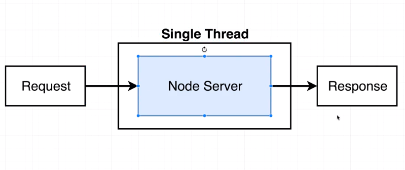

>* This pattern works for the most part, it only starts to breakdown when we have a lot of JS (we've written) in our app is taking a long time to process. This interfers with our Node server being ability to quickly handle/process requests in and responses out.[^2]

Let's go back over to our server...
```js:title=index.js
const express = require('express');
const app = express();

function doWork(duration) {
    const start = Date.now();
    while(Date.now() - start < duration) {}
}

app.get('/', (req, res) => {
    doWork()
    res.send('Hi There');
});

app.listen(3000);
```
We use the function `doWork` to simulate a lot of computation, in it we kind of replicate work being done with our while loop.
We pass in the duration we want the work to take, 5000 in our example.

The thing to keep in mind is that our `app.get` is working in our event loop, not in some other threadpool or something like that, it's code processed in our event loop and for these 5 seconds, our event loop can do nothing else.

That means it can't handle anything else, no other requests, db queries, write files, it can't do anything else while that `while` loop is running.

## Clustering in Theory

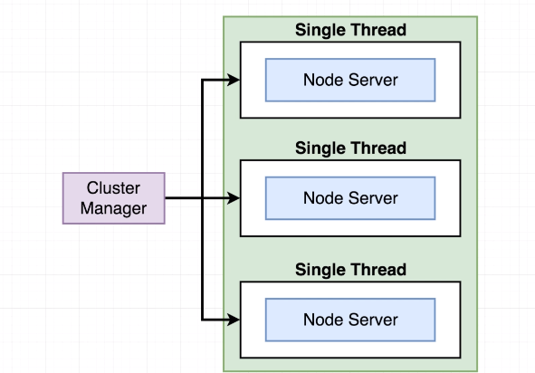
So here is kind of what clustering looks like behind the scenes.
- When we add clustering to our app, we are going to be starting up multiple node processes
- There will always be one parent process called the **Cluster Manager**.
- the [**cluster manager**]() is reponsible for monitoring the health of individual instances of our application that we are going to launch at the same time on our computer.
- In the above, these are all instances of our application running on our singular computer.
- The cluster manager itself doesn't excute any code itself, no requests in, no handling of anything
    - its responsible for monitoring the health of the instances
    - it can start and stop instances, it can restart them, send them data, and do other administrative tasks
    - the instances themselves are what process and take in requests and do the actual work

>* Clustering is essentially just pseudo-multithreading our Node process into other instances of itself, with one parent, **cluster manager** delegating to the slave/child instances the work it should be doing.[^3]

### Super simple, normal Node App

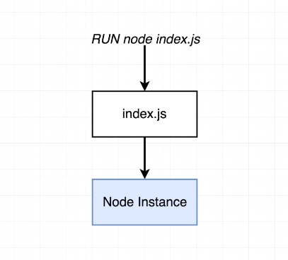
- starts node, reads file, starts event loop, and we get a single node instance
- very linear process

### Super simple cluster
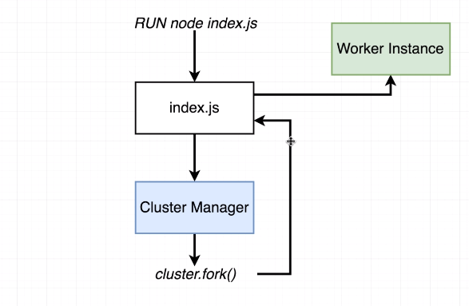
 - We still run something like `node index.js` at command line 
- we still read file and launch node instance
- But here is where things get different: The first instances that gets launched when we run that command, is what we refer to as the *cluster manager*. The cluster manager is then responsible for setting up worker instances. Those [**worker instances**]() are actually what is reponsible for processing incoming requests.
- To create worker instances the cluster manager is going to require in the `cluster` module from the node std lib. `cluster` module just like `fs` has to be brought in.
- one particular method on that module called `.fork` and whenever we call that fork function from within the cluster manager, something intersting happens: Node goes back to our internal js file and it executes it a second time, but it executes it that second time in a slightly different mode. This is also what starts up our worker instance.

>* You can basically just imagine that our `index.js` file is going to be executed multiple times by Node. The first time it produced the cluster manager and then every time after that would be for a worker instance.[^4]

## Forking Children
```js:title=index.js {1,4-8,24}
const cluster = require('cluster');

// is the file being executewd in master mode?
if (cluster.isMaster) {
    // Cause index.js to be executed again
    // in slave/child mode
    cluster.fork();
} else {
    // I'm a child, I'm going to act like a server
    // and do nothing else
    const express = require('express');
    const app = express();
    
    function doWork(duration) {
        const start = Date.now();
        while(Date.now() - start < duration) {}
    }
    
    app.get('/', (req, res) => {
        res.send('Hi There');
    });
    
    app.listen(3000);
}
```
> - require in our `cluster` module, remember it's already in the Node std library. 
- The `cluster` module has several indespensible properties on it that we need to set up our cluster.
- `.isMaster`: returns a boolean to tell you whether or this instance is the cluster manager "instance". This will be false for every other instance.
- we use this single property: `cluster.isMaster` to determine what `index.js` file should do whenver it gets executed.
    - remember b/c when we run that `.fork` index.js is going to run another time.[^5]
    
## Clustering in Action
When we have only one child, that's really not doing anything, like we are running in normal mode, only one event loop instance.
- We can call new instances by calling `cluster.fork()` additional times.
```js:title=index.js {1}
const cluster = require('cluster');

// is the file being executewd in master mode?
if (cluster.isMaster) {
    // Cause index.js to be executed again
    // in slave/child mode
    cluster.fork();
    cluster.fork();
    cluster.fork();
    cluster.fork();
} else {
    // I'm a child, I'm going to act like a server
    // and do nothing else
    const express = require('express');
    const app = express();
    
    function doWork(duration) {
        const start = Date.now();
        while(Date.now() - start < duration) {}
    }
    
    app.get('/', (req, res) => {
        res.send('Hi There');
    });

    app.get('/fast', (req, res) => {
        res.send('That was fast!');
    })
    
    app.listen(3000);
}
```
- If we navigate to localhost:3000 and localhost:3000/fast you can see the difference.
- We saw loading two separate requests at the same time, and one loaded really quickly because we had two separate servers handling a request.
- real world example where clustering can be really powerful: if you have routes in your app that take a while to process, but you have other routes that are really quick, you can use clustering to startup multiple instances of your server that more evenly address requests coming into your application, to get more predictable response times. 

## Benchmarking Server Performance
Clustering is not a magic bullet, there are some things to still consider...
- Can't just call `cluster.fork()` and expect magic. Diminishing returns and can actually be a bad thing if too many.

Open second terminal, inside project directory. This little benchmarking tool only availble on macs/linux:
apache benchmark or `ab` is the command.
- ab to make requests to a server and give benchmarks, 
- `ab -c 50 -n 500 localhost:3000/fast`
- You can read this as -n is number so make 500 requests, -c is use a concurrency of 50, means try to make 50 requests at the same time (trying to make sure there are always 50 requests running at any given time), localhost is the target.

## Benchmark Refactor
Let's refactor our app and see where we get benchmark changes.

`doWork` is good at being blocking for a set duration, but not great for mimicking real computation on our server.
```js:title=index.js {1}
process.env.UV_THREADPOOL_SIZE = 1;
const cluster = require('cluster');

if (cluster.isMaster) {
    // Cause index.js to be executed again
    // in slave/child mode 
    cluster.fork();
} else {
    // I'm a child, I'm going to act like a server
    // and do nothing else
    const express = require('express');
    const crypto = require('crypto');
    const app = express();

    app.get('/', (req, res) => {
        crypto.pbkdf2('a', 'b', 100000, 512, "sha512", () => {
            res.send('Hi There');
        });
    });
    
    app.get('/fast', (req, res) => {
        res.send('That was fast!');
    })
    
    app.listen(3000);
}
```
- we use the crypto function and put the callback inside of that completing.
- we change the threadpool size to 1, that means there is only one thread in the threadpool. *To be clear, whenever we create a cluster, every single child has their own separate threadpool, that means with libuv, each child we would create means we would have 4 threads that they can use for computation.*
    - We are setting this to 1 so you can see the benchmark results better
    - Changing this to 1 doesn't change the total number of threads in our entire cluster, it means that every child in a cluster only has one thread available.

## Need More Children!

### Running Cluster with one Child
So, in our code, we've forked only once with `clutser.fork()`

`ab -c 1 -n 1 localhost:3000/`
- let's change this a little...
`ab -c 2 -n 2 localhost:3000/`

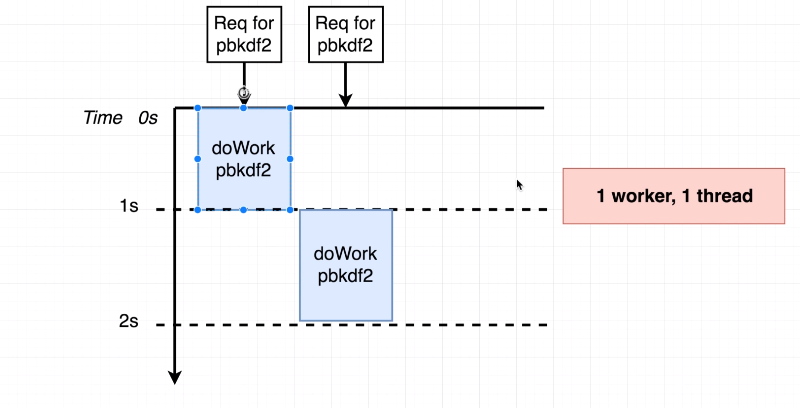

So this diagram is of that command we just ran a second ago. This is what is happening, we have...
- two requests to run our pbkdf2 function, now the instant that the first request comes in (remember they are being issue at the same time,  but one is going to be picked up by the server first).
- that first request is going to be picked up by the threadpool and our server starts to process it. As soon as that first pbkdf2 is complete, our server responds at about the 1s mark (that explains the minimum response time we see)


Now, at th same exact time, that second request comes in as well, but it doesn't get processed in the threadpool until the first is complete., and that explains the 50% - 2150 benchmark above.
- Remember, they came in at the same time, but our server only has the ability to process one at a time (since we set our threadpool to 1)

### Running Clustering with Two Children
So, in our code, let's `clutser.fork()` twice.
And then run our benchmark again with the exact same parameters:
`ab -c 2 -n 2 localhost:3000/`

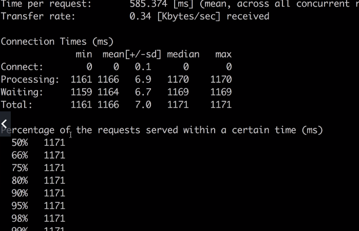

So now, it appears that both of our requests have been procesed in parallel.

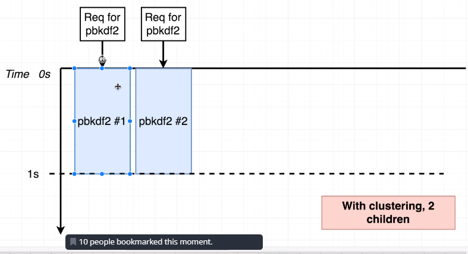

You might be thinking, oh wow! This is great, why don't we just fork this process a whole bunch!

Let's take it out to 6 forks....
```js
if (cluster.isMaster) {
    // Cause index.js to be executed again
    // in slave/child mode 
    cluster.fork();
    cluster.fork();
    cluster.fork();
    cluster.fork();
    cluster.fork();
    cluster.fork();
//...
```
If we save this and save our file you might think this is going to be great!
We have to increase the number of requests being made 
`ab -c 6 -n 6 localhost:3000/`

This is going to get us some interesting results.

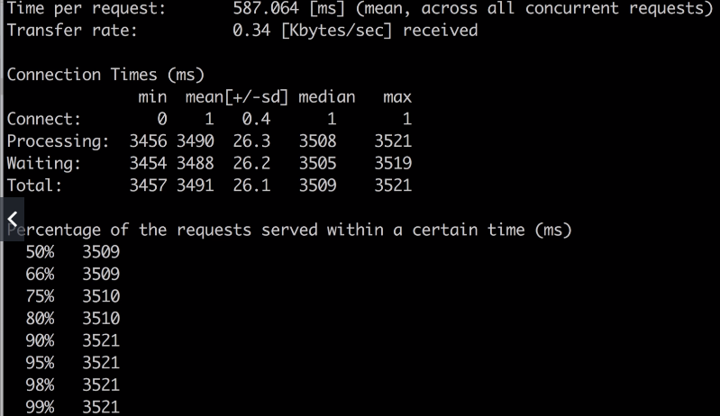

Look at theses results. It looks like everthing across the board took 3.5 seconds, so not only are the requests taking longer, but they are all generating their response at the same time.

Our representation now looks like this:
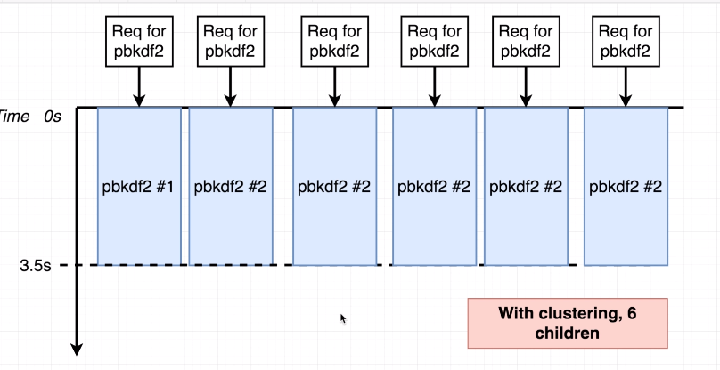

Remember, each computer only has a finite amount of cores/processing power it can use to process things at any given time.
When we are setting up 6 separate threads, that are running our 6 separate children, we are bouncing between every hash function call at the exact same time and our CPU is trying to do a little bit of work on each one.

If you refer back to [Changing Threadpool Size](/nodejs-grider-node-internals), in the previous post, you'll remember...

*"You might think that oh, there are only two cores you might think that one core might take slightly longer because it needed the third thread., but in reality, our CPU can use all the cores inside of it to juggle work between multiple threads."*

In our case, though we are have our threadpool size set to 1, but we are creating 6 separate children/forks that each has a limit of 1 thread, one for each request concurrent request.

Ultimately, the result is that we didn't get our code executed 6x faster or anything like that, in fact its arguably performing worse, since they all respond at 3.5s. So although we were able to address all the requests concurrently, the net result was that our overall performance suffered.

This is a very clear case of us kind of over-allocating our instances. It's nice that we can address each request, however, its created this average bottleneck of mediocrity where we are trying to do much at once. 

Here is solution that works for the most part. Let's bring our `cluster.fork()`s  back to two but we will still run...  
`ab -c 6 -n 6 localhost:3000/`

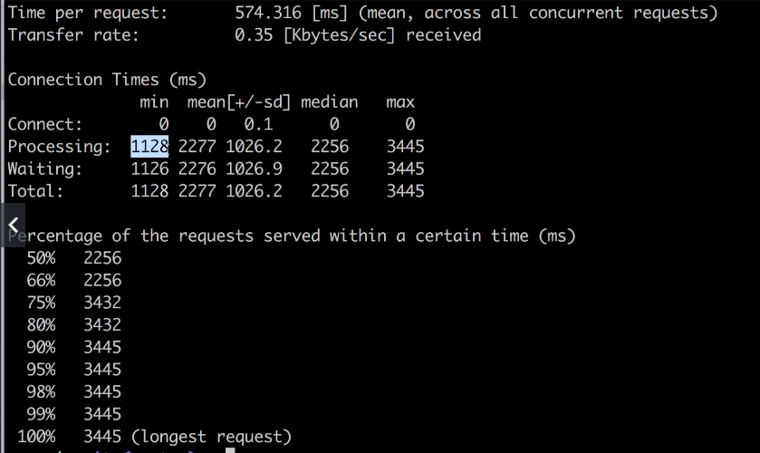

Now if you notice, the longest request was 3.4s with the fastest being 1.1!
If you break down what is happening, we still have a bit of an overload, but we are able to process batches of 2 and respond as soon as those are done to move on to processing the next two.


- Again, these requests all come in at the same time but they don't get processed until the previous 2 run.

So not only are we finishing faster that 3.5s, but the bulk of those hashes are finishing significantly faster.

**If you're addding children to your application beyond the number of cores you have in your computer to actually process them, you're going to have a net-negative effect of the performance on your system**.

>* **Here is the general sentiment**:
>
> 1. clustering is great, don't go overboard.
2. In general, you want to match your number of children in your cluster to either:
    - The number of physical cores or
    - The number of logical cores that you have[^6]

**Logical cores** are just if your computer is counting its multithreaded coring abilities as cores (they are referred to as logical cores).

Stephen uses physical core count, but some of the docs around this use logical cores instead. Stephen finds its better to just match cpu cores to the number of children.

## PM2 Installation

So right now our clustering setup is pretty straight-forward and simplistic. You could build out your own clustering solution where you master monitors the health of your children and so forth, but why re-invent the wheel, already really great open source cluster management out there: PM2. 

https://github.com/Unitech/PM2

Their site at PM2.io also has a ton of guides
Install: `npm install -g pm2`

## PM2 Configuration
[**PM2**]() is a cluster management solution and it has everything to do with spawning multiple instances of your application and mangaging the health of every single one of them.

- This will help you, if say an instance crashes it will auto-restart it for you.
- PM2 is widely-production used

Let's clean up our previous code, forst copy/rename the file, and then get rid of our little clustering stuff...
```js:title=pm2.js {}
const express = require('express');
const crypto = require('crypto');
const app = express();

app.get('/', (req, res) => {
    crypto.pbkdf2('a', 'b', 100000, 512, "sha512", () => {
        res.send('Hi There');
    });
});

app.get('/fast', (req, res) => {
    res.send('That was fast!');
})

app.listen(3000);
 
```
- make sure youre still in your project directory
- and that your server isn't currently running (you will see an error if you do)

`pm2 start pm2.js -i`

>* We are passing in the `-i` flag to designate the number of instances, its very common to use 0. `0` says, hey PM2, I don't know what to do here, PM2 will figure it out for you. What PM2 does behind the scenes is it sets the instance count to the number of CPU cores on your computer.

Logical cores = # of physical cores * number of threads those cores can process, MBP might be 2 multithreads per core, and 2 physical cores is common, so you would have a total of 4 logical cores.

So let's run it:
`pm2 start pm2.js -i 0`

If we run `pm2 list`  
We will get a little summary of whats going on with your current cluster.

If we run `pm2 show [applictionName]`  
where `applicationName` is the name of our file being run, we will get details of all the children processes of that file.

If we run `pm2 monit`  
We will get a cool terminal GUI to look through logs.

To kill any active pm2 process:  `pm2 delete [applicationName]`

> PM2 sounds like a great out of the box solution for cluster management, and looks like the de-facto standard in having all of this managed for you. Usually you run pm2 on production envs, less so in dev environments. Follow the steps above to get yourself setup with PM2 for clustering.[^7] 

## Webworker Threads 
We are going to talk very briefly about worker threads....
Usually, Stephen wouldn't use both of these: Cluster Mode and Worker Threads together in a project unless he knew he really had to. 

Worker threads make use of that libuv threadpool.

Let's look for the `webworker-threads` on npm. Navigate to your project dir and run...
`npm install --save webworker-threads`

## Worker Threads in Action

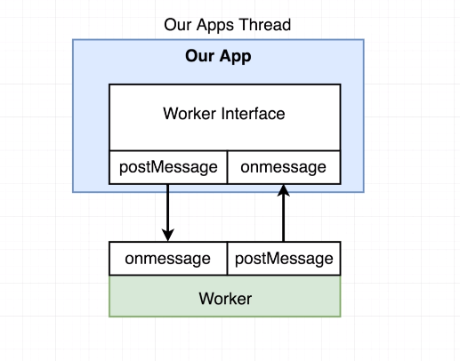

This is the general idea. We have our thread/event loop at the top in blue and below it in green is a thread that will be created by this new worker object created by this threads library, this is separate thread also running on our computer.

Because it's running on its own thread that means it can do a lot of heavy calculations without blocking our main event loop.

One thing to remember, a lot of the code in the Node std library already makes use of the libuv threadpool. So you are likely already going to be writing some code that executes in a separate thread anyways. Only want to be using webworkers if you are doing some really heavy business logic that you want handled off the main thread.

Now to communicate with this separate thread, we don't have very direct means of conversation per se. We cannot freely reference variables for instance, we instead have to use a more explicit postMessage and onMessage system.

The **Worker Interface** is the thing we will create, and the Worker will be the thing doing the work defined in the interface of our app.

- [**`onmessage`**](): is a property that we are going to assign a function to. That function will be invoked any time we call `postMessage` on the opposing side. That is, if we call `postMessage` on our server, it's going to invoke the `onmessage` function assigned on the **Worker** side and the opposite is true is well.

Let's reuse our previous pm2.js file...
```js:title=webworkers.js {4,7}
const cluster = require('cluster'); 
const express = require('express');
const app = express();
const Worker = require('webworker-threads').Worker;
 
app.get('/', (req, res) => {
    const worker = new Worker(function() {
    });
});

app.listen(3000);
```
We want to require the module and want one specific property on that module called `Worker`...  
One thing that is very important here is that when we pass in the function to our `Worker`, we can't freely reference variables outside of it... We don't get to freely access variables in the closure scope between the two...

```js:title=DOESNT-WORK-LIKE-THIS 
app.get('/', (req, res) => {
    let a = 1;
    const worker = new Worker((function() {
        // would be stringified and returned to somewhere else
        // on our machine, as well as not being able to 
        // see any updates to the value of a.
        console.log(a);
    }))
});
```
So back to it...

### Defining our Worker Interface

```js:title=webworkers.js {4,7-9,11-13,15}
const cluster = require('cluster'); 
const express = require('express');
const app = express();
const Worker = require('webworker-threads').Worker;
 
app.get('/', (req, res) => {
    const worker = new Worker(function() {

    });

    worker.onmessage = function() {}

    worker.postMessage();
});

app.listen(3000);
```
- To review, we've created the interface with `new Worker`
- on this worker we assign the `onmessage` and assign it a function. Now, whenever our worker, sends our message back to our application, this function will be called.
    - This isn't a typo: it's `onmessage`, not `onMessage`!
    
- And we've also called `postMessage` inside of our application
- We've said what should happen inside of our application/application side interface, whenver that thread posts a message back to us.

### Defining our Worker 
```js:title=webworkers.js {7-11}
const cluster = require('cluster'); 
const express = require('express');
const app = express();
const Worker = require('webworker-threads').Worker;
 
app.get('/', (req, res) => {
    const worker = new Worker(function() {
        this.onMessage = function() {   

            postMessage();
        }
    });

    worker.onmessage = function() {}

    worker.postMessage();
});

app.listen(3000);
```
- Take special note: we are using keyword `function`s, not using arrow functions, because we need a non-lexical binding of `this`, we want reference to the object itself.   
- after defining our `onmessage`, we call `postMessage`, INSIDE of our `onmessage` function for the worker.

So now. When we call `worker.postMesage()` on line 16, the body of the `this.onmessage` inside of our `Worker` is what's going to be run. It is here, in line 8 where we do the computationally expensive work. Once that work is done, we can communicate that result back, by calling `postMessage()`.

### Mimicking work for the Worker
```js:title=webworkers.js {8-13,17-19}
const cluster = require('cluster'); 
const express = require('express');
const app = express();
const Worker = require('webworker-threads').Worker;
 
app.get('/', (req, res) => {
    const worker = new Worker(function() {
        this.onMessage = function() {   
            let counter = 0;
            while (counter < 1e9 ) {
                counter++;
            }
            postMessage(counter);
        }
    });

    worker.onmessage = function(myCounter) {
        console.log(myCounter);
    }

    worker.postMessage();
});

app.listen(3000);
```
- `1e9` is just like 1 exponent 9, so essentially just making a really big counter to simulate work.
- once that work is done, we pass back the work done, into `postMessage(counter)` like so.
- this gets communciated by over to our `worker.onmessage` callback..

## Benchmarking Workers 
If we go over to localhost:3000, you don't see anything, but you will see in terminal the data we get back. We got the naming of our myCounter, wrong, we are actually getting a mesage, back and a data property on that message so let's change that.... 
```js:title=webworkers.js {19}
const cluster = require('cluster'); 
const express = require('express');
const app = express();
const Worker = require('webworker-threads').Worker;
 
app.get('/', (req, res) => {
    const worker = new Worker(function() {
        this.onMessage = function() {   
            let counter = 0;
            while (counter < 1e9 ) {
                counter++;
            }
            postMessage(counter);
        }
    });

    worker.onmessage = function(message) {
        console.log(message.data);
        res.send("" + message.data);
    }

    worker.postMessage();
});

app.listen(3000);
```
Now if we restart our server, and run this it should work. We have to add the string bits because `res.send` if it sees we are returning a number things its a status code.

Aside: I had issues downloading the npm module `webworker-threads`. Having issues with node-gyp. 

I'm going to try and download an LTS, version, as I'm actually slightly behind on both mac and windows and encountering similar errors for both machines.
- Moving to LTS, didn't correct. Just going to not be messing around with webworkers for a bit I guess :( 


### Webworker Summary
> - Makes use of the libuv threadpool; remember so too do a lot of node std lib functions.
- is still somewhat experiemental in nature
- you create a worker interface and define a new Worker within that interface. Internal to the worker you define its onmessage and postMessage properties, as well as outside within the worker interface itself.[^8]  


## Links
- [PREV ← | The Internals of Node](/nodejs-grider-node-internals)
- [NEXT ]