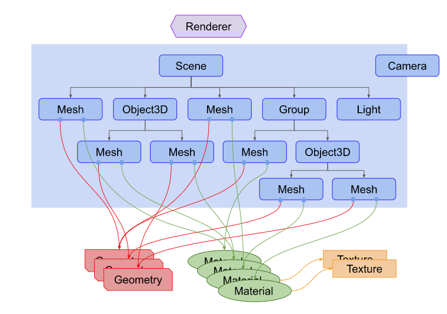

Three.js is often confused with WebGL since more often than not, but not always, three.js uses WebGL to draw 3D.  
- WebGL is a very low-level system that only draws points, lines, and triangles.
- Three.js makes it much easier to create 3d instances by handling scenes, lights, shadows, materials, textures, 3d math, etc, for you.

## Structure of a Three.js App

- Basic structure of a three.js app is that it requires you to **create a bunch of objects and connect them together.**
Things to notice about the diagram above:
- There is a **[Renderer](https://threejs.org/docs/#api/en/constants/Renderer)**. This is arguably the main object of three.js. 
- You pass a [**Scene**](https://threejs.org/docs/#api/en/scenes/Scene) and a [**Camera**](https://threejs.org/docs/#api/en/cameras/Camera) to a Renderer and it renders (draws) the portion of the 3d scene that is inside the *frustum*(conical view) of the camera as a 2D image to a canvas.

- There is a [***scenegraph***]() which is a tree like structure, consisting of various objects like a [**Scene**](https://threejs.org/docs/#api/en/scenes/Scene) object, multiple [**Mesh**](https://threejs.org/docs/#api/en/objects/Mesh) objects, [**Light**]() objects, [**Group**](), and [**Object3D**](), and [**Camera**]() objects. 

- A [**Scene**](https://threejs.org/docs/#api/en/scenes/Scene) object defines the root of the scenegraph and contains properties like the background color and fog.
  - These objects define a hierarchical parent/child tree like structure and represent where objects appear and how they are oriented.
  - Child are positioned and oriented relative to their parent. 
  - e.g. wheels on a car are children of the car. Orienting car object automatically moves the wheels.

- Note in the diagram `Camera` is half in and half out of the scenegraph, unlike other objects, a `Camera` doest not have to be in the scenegraph to function.

- [**Mesh**](https://threejs.org/docs/#api/en/objects/Mesh) objects represent drawing a specific [**Geometry**](https://threejs.org/docs/#api/en/core/Geometry)
- Both [**Material**](https://threejs.org/docs/#api/en/materials/Material) objects and [**Geometry**](https://threejs.org/docs/#api/en/core/Geometry) objects can be used by multiple [**Mesh**](https://threejs.org/docs/#api/en/objects/Mesh) objects.
- Think of Meshes as like instances of desired objects, 2 identitcal blue cubes would require 2 meshes (that would define position and orientation), but they would only need 1 Geometry (vertex data, or what gives the cube its shape), and 1 Material (details like color blue).

- [**Geometry**](https://threejs.org/docs/#api/en/core/Geometry) objects represent the vertex data of some piece of geormetry like a sphere, cube, plane, dog, etc.
- Three.js provides many kinds of built in [**geometry primitives**](https://threejsfundamentals.org/threejs/lessons/threejs-primitives.html)
  - you can create custom geometry
  - as well as load geometry from files

- [**Material**](https://threejs.org/docs/#api/en/materials/Material)  objects represent the surface properties used to draw geometry including things like the color to use and how shiny it is.
  - Materials can also reference one or more [**Texture objects**](https://threejs.org/docs/#api/en/textures/Texture), which can be used, for example, to wrap an image onto the surface of a geometry.

- [**Light**](https://threejs.org/docs/#api/en/lights/Light) objects represent different kinds of light.

### Making our "hello world" (aka cube)
Given all that, we are going to make the smallest "Hello Cube" setup that looks like:


#### First, you need to load three.js
```html
<script type="module">
/* 
Note, that we will be using the r113 provided from threejsfundamentals
and not the relative path way as if we had installed locally for the sake of this exercise
*/
//import * as THREE from './resources/threejs/r113/build/three.module.js'

import * as THREE from 'https://threejsfundamentals.org/threejs/resources/threejs/r113/build/three.module.js';

</script>
```
⭐ It's important to put the `type="module"` in the script tag bc that's what enables us to use the `import` keyword to load three.js.
  - There are other ways to load three.js, but as of r106, modules is the recommended way
  - Modules have the advantage that they can easily import other modules they need (saving us from manually loading extra scripts)

### Second, we need a `<canvas>` tag so...
```html
<body>
  <canvas id="c"></canvas>
</body>
```

### Third, ask three.js to draw into that canvas...
```html {4-7}
<script type="module">
import * as THREE from './resources/threejs/r113/build/three.module.js'

function main() {
  const canvas = document.querySelector('#c');
  const renderer = new THREE.WebGLRenderer({canvas});
}
</script>
```
- After we look up the canvas, we create a [**WebGLRenderer**](https://threejs.org/docs/#api/en/renderers/WebGLRenderer)
  - The Renderer is the thing that is actually responsible for taking all the data you provide and rendering it to the canvas.
  - This particular renderer uses WebGL to render 3d to the canvas.

- Note: If you don't pass a canvas into three.js it will create one for you but then you have to add it to your doc. Explictly passing a canvas to three.js feels a little bit more flexible.

### Fourth, we need a camera; we'll create a `PerspectiveCamera`
```html {4-8}
<script type="module">
import * as THREE from 'https://threejsfundamentals.org/threejs/resources/threejs/r113/build/three.module.js';

const fov = 75;
const aspect = 2;  // the canvas default
const near = 0.1;
const far = 5;
const camera = new THREE.PerspectiveCamera(fov, aspect, near, far);

function main() {
  const canvas = document.querySelector('#c');
  const renderer = new THREE.WebGLRenderer({canvas});
}
</script>
```
- `fov` is short for `field of view`. In this case, 75 degrees is the vertical dimension. 
  - ⭐that most angles in three.js are in radians but for some reason the perspective camera takes degrees.
- `aspect` is the display aspect of the canvas. By default a canvas is 300x150 pixels which makes the aspect 300/150 or 2.
- `near` and `far` represent the space in front of the camera that will be rendered. Anything before or after that range will be **clipped** (not drawn).

⭐ These 4 settings (`fov`, `aspect`, `near`, `far`) define a **frustum**. A **frustum** is the name of a 3d shape that is like a pyramid with the tip sliced off. Think of a 'frustum' as another 3d shape like a sphere, cube, etc.

- The height of the near and far planes are determined by the field of view.
- The width of both panes is determined by the field of view and the aspect.
- Anything inside frustum will be drawn, anything outside will not.
- **The camera defaults to looking down the -Z axis with +Y up**

We will have to move the camera a bit back since our cube is at the origin.
`camera.position.z = 2`;

## Thoughts
- Learning Blender at the same time is actually really helpful in better understanding how things are working from a different perspective. 


## Keywords
- **Scene**: Scenes allow you to set up what and where is to be rendered by three.js. This is where you place objects, lights and cameras. Use `Scene()` to create a new scene object.
- **Mesh**: Class representing triangular polygon mesh based objects. Also serves as a base for other classes such as SkinnedMesh.
- **Geometry**: Geometry is a user-friendly alternative to BufferGeometry. Geometries store attributes (vertex positions, faces, colors, etc.) using objects like Vector3 or Color that are easier to read and edit, but less efficient than typed arrays.
- **WebGLRenderer**: The WebGL renderer displays your beautifully crafted scenes using WebGL.


## Review Questsions

## Links
- [**JavaScript Prerequisites**](/threejs-js-prereq)
- [***Scenegraph***]()